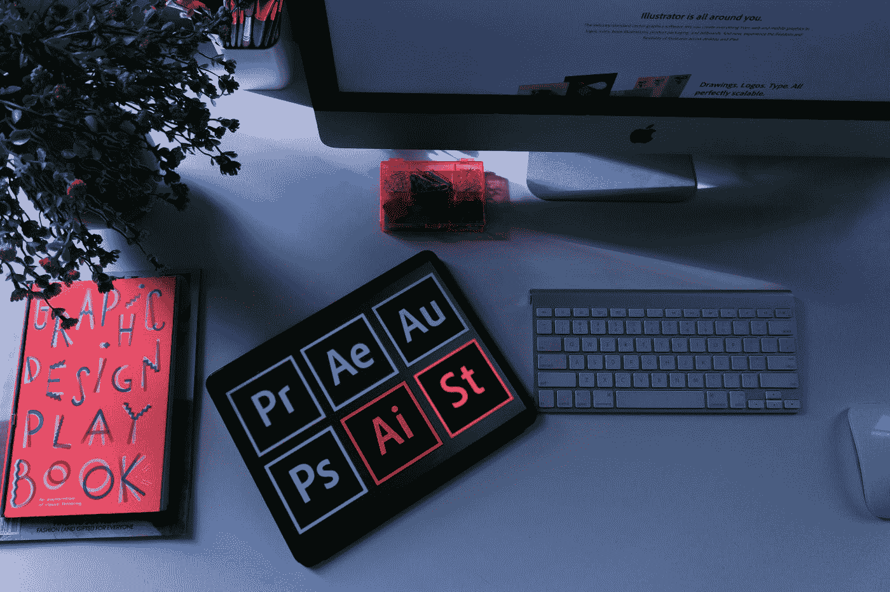

# UI/UX 设计师让你的想法成真！

> 原文：<https://medium.com/geekculture/ui-ux-designers-to-make-your-ideas-come-to-life-d17d7bafc9d4?source=collection_archive---------19----------------------->

## UI/UX

## 设计不仅仅是它的外观和感觉。设计就是它的工作方式！

Photo by [Emily Bernal](https://unsplash.com/@emilybernal?utm_source=medium&utm_medium=referral) on [Unsplash](https://unsplash.com?utm_source=medium&utm_medium=referral)

原型工具对于 UI/UX 设计师来说是必不可少的。它们允许你创建一个设计模型，并与用户一起测试。这有助于你获得关于你的想法的反馈，并在开始最终产品之前做出改变。有许多不同的原型制作工具可用，因此选择最适合您需求的工具至关重要。

# 选择正确的原型制作工具。

当选择正确的原型工具时，有许多因素需要考虑。最重要的是找到一个适合你的需求，最适合你的项目的工具。

> 选择原型制作工具时，请记住以下几点:

*   你通常做什么样的项目？有些工具更适合某些类型的项目，所以请确保您选择的工具与您正在处理的项目类型兼容。
*   你需要什么样的功能？每个工具都有自己的一套特性，所以要确保你选择的工具有你需要的所有特性。
*   你对使用这个工具有多熟悉？如果你不太熟悉某个特定的工具，可能需要一些时间来学习如何正确使用它。因此，在做出最终决定之前，最好先测试一下你正在考虑的工具。
*   你需要什么样的输出？一些原型工具允许您创建 HTML 或 PDF 文件，而其他工具只允许您创建图像。这里没有对错，但是如果你不确定，知道你需要什么样的输出可能是必要的。
*   该工具适合您的预算吗？在决定使用哪种工具时，您可能需要考虑工具的价格。您可能还想看看每个工具的功能数量以及它在网上的下载次数。
*   该工具的用户友好程度如何？当决定使用哪种原型工具时，您需要考虑它的易学性。一些工具有一个基本的用户界面，而另一些则非常复杂。当你决定哪一个最适合你的时候，你会想要考虑这一点。

# Adobe 体验设计

Adobe Experience Design (XD)是一个用户体验和界面设计软件应用程序。它于 2017 年 3 月发布，是 Adobe Creative Cloud 的一部分。XD 适用于 Windows 10 和 macOS。

XD 是一个基于矢量的绘图程序，功能类似于 Illustrator 和 Sketch。它还具有创建网站和移动应用原型的功能，允许用户模拟成品的外观和行为。XD 可用于设计静态和交互式元素，包括按钮、菜单、文本字段和滑块。

自发布以来，XD 因其易用性和功能集在 UI/UX 设计师中赢得了一批追随者。

# Axure

Axure RP 是一个桌面应用程序，用于创建网站和应用程序的线框和交互式原型。它是 UX 专业人士中最受欢迎的原型制作工具之一，因为它简单易学且具有许多特性。

使用 Axure，您可以创建站点地图、线框、流程图和原型。您还可以在原型中添加交互和动画。该应用程序包括一个内置部件库，您可以使用它来创建您的设计，或者您可以创建您的部件。

# 视觉

InVision 是一个基于网络的原型工具，UI/UX 设计者使用它来创建交互式原型，并与客户和团队成员共享。它提供了广泛的功能，如评论、反馈和团队协作。InVision 还集成了其他设计工具，如 Photoshop、Sketch 和 Adobe XD。

InVision 的主要优势在于它能够帮助团队在项目上进行协作。团队成员之间可以轻松共享评论和反馈，这有助于确保设计快速获得批准。InVision 与其他设计工具的集成使得从现有设计创建原型变得容易。

# 素描

草图是 UI/UX 设计师使用的矢量绘图和动画软件。它有一个简单的用户界面，易于初学者学习。Sketch 的优势在于其强大的矢量绘图功能，可以轻松创建复杂的形状。它还有一个动画特性，可以用来创建简单的动画。Sketch 的另一个优势是共享免费插件和资源的大型用户社区。Sketch 的弱点是没有内置的 3D 特征，所以必须在其他软件中创建 3D 对象并导入到 Sketch 中。

# 奇迹

漫威是 UI/UX 设计师中最流行的原型工具之一。它允许你使用简单的拖放动作为网络和移动应用创建原型。有了漫威，你可以在你的设计中添加热点来触发互动。您还可以与他人分享您的原型，以获得反馈和协作。

# 原始 io

有许多不同的原型工具可用，但 Proto.io 是最好的一个。它允许你不用写任何代码就能创建外观和感觉都像真东西的原型。要在 Proto.io 中创建原型，首先要创建屏幕，每个屏幕都可以包含文本、图像和按钮。然后，您可以将屏幕链接在一起，创建一个像真正的应用程序或网站一样流动的原型。

Proto.io 还包括一个内置组件库，可以很容易地将菜单和标签等常见元素添加到原型中。

# 组成者

框架器是一个强大的原型工具，可以帮助您为用户界面和用户体验设计创建交互式原型。它易于使用，并提供了广泛的功能，使其成为创建高质量原型的绝佳选择。

使用 Framer 是因为你可以创建看起来和感觉起来像真东西的原型。这允许你在设计中增加交互性，让用户更好地了解最终产品的工作方式。一个框架很容易学习和使用，即使你不熟悉编码。您可以在没有任何编码技能的情况下创建原型，或者如果您想让您的设计更具创造性，您可以使用代码。

# 结论

有很多很棒的原型工具可供 UI/UX 设计师使用。每种工具都有其优点和缺点，因此为工作选择正确的工具至关重要。在选择原型工具时，有许多因素需要考虑，比如项目的类型、平台和预算。选择正确的原型工具对于创建实用的原型至关重要。