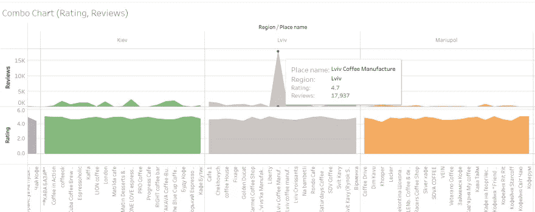

# 乌克兰咖啡店组合分析项目

> 原文：<https://medium.com/geekculture/ukrainian-coffee-shops-portfolio-analysis-project-56a6db02b3b8?source=collection_archive---------38----------------------->

经过分析，我们注意到以下几点:

*   最高数量的评论位于利沃夫，这是咖啡店需求最活跃的地方的结果(*基于样本大小和从谷歌地图*收集的数据)。
*   马里乌波尔的咖啡店顾客最少(*基于样本量和从谷歌地图*收集的数据)。

内容:[简介](#f45c)，[数据](#81d6)，[项目目标](#d152)，[使用的工具](#d782)，[数据准备](#72b8)，[代码](#7e3c)，[可视化](#510b)，[链接](#8551)，[结论](#e5cd)， [outro 和下一步步骤](#3956)。

# 介绍

一个个人投资组合项目，分析来自 10 个乌克兰城市的咖啡店。

# 数据

*   每个城市只包含 20 个数据点进行分析。
*   [样本量](https://www.scribbr.com/methodology/population-vs-sample/#:~:text=A%20population%20is%20the%20entire,t%20always%20refer%20to%20people.)的计算不是为了更好地代表总[人口](https://www.scribbr.com/methodology/population-vs-sample/#:~:text=A%20population%20is%20the%20entire,t%20always%20refer%20to%20people.)。
*   数据来自谷歌地图的本地搜索结果。

# 项目目标

*   数据提取和准备。
*   数据清理。
*   数据分析。
*   数据可视化。
*   数据分析生命周期。

# 使用的工具

*   来自 SerpApi 的 Google Maps Locals 结果 API 。
*   计算机编程语言
*   谷歌工作表
*   （舞台上由人扮的）静态画面

# 数据准备

有许多空行。为了避免不确定的结果，[删除空行](https://optakey.com/delete-empty-rows/) Google sheets add-on 被用来完成这项工作。

# 密码

以下代码块包括:地名、类型、评级、评论、价格、送货、就餐和外卖选项。

SerpApi 的 Google Maps Locals Results API 是一个付费 API，可以免费试用 5000 次搜索。

如果你正在使用 Python，你可以用`Selenium`浏览器自动化做同样的事情。

编写自己的代码和使用 API 之间的主要区别在于，您不必修补来寻找页面的某些元素，最终用户已经通过`JSON`输出完成了，或者与 Google 决斗来避免 CAPTCHA 或寻找代理(如果需要的话)，或者其他可能遇到的事情。

整个过程(每个城市 20 个位置(总共 10 个))花了大约 30 分钟收集所有需要的数据。

# 形象化

# 链接

1.  [画面可视化](https://public.tableau.com/app/profile/dimitry.zub/viz/UkraineCoffeePlaces/ComboChartRatingReviews)。
2.  来自 SerpApi 的谷歌地图本地结果 API 。
3.  [Kaggle 数据集](https://www.kaggle.com/dimitryzub/10-coffee-places-from-ukrainian-cities)。
4.  代码也可用作 [GitHub Gist](https://gist.github.com/dimitryzub/a52247dfbc79985199b6b6c3c42f0456) 。

# 结论

*   评论量最高的是利沃夫。
*   马里乌波尔的上座率最低。

# Outro 和下一步

谢谢你读到这里。接下来的步骤可能是找到:

*   该地点的工作时间与该地点获得的评论数量之间的相关性。
*   可用递送、堂食、外卖选项与从这些可用选项获得的评论或评级数量之间的相关性。
*   一些地方收视率最低/最高的原因。通过搜集人们的评论并结合 NLP 来分析这些地方，以识别在这样或那样的情况下重复出现的某些单词模式。

*最初发布于 2021 年 6 月 9 日*[*https://dev . to*](https://dev.to/dimitryzub/ukrainian-coffee-shops-portfolio-analysis-project-532j)*。*