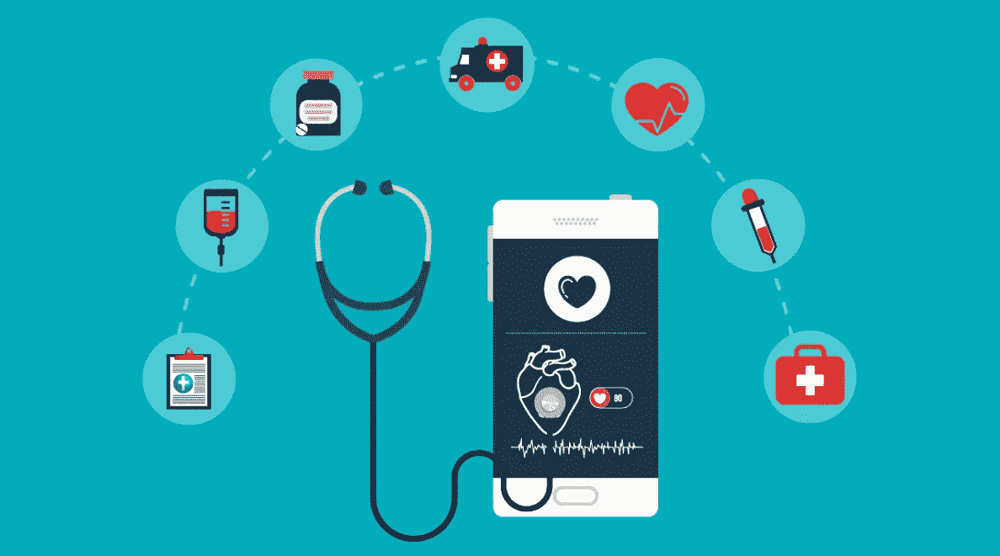

# 医疗保健应用开发终极指南

> 原文：<https://medium.com/geekculture/ultimate-guide-for-healthcare-app-development-8585b8108da4?source=collection_archive---------16----------------------->

[90%的医生已经在工作中使用智能手机](https://mobius.md/2019/03/20/11-mobile-health-statistics/)来访问电子健康记录、通信、参考信息和安排他们的预约。对方便、实惠的医疗保健的需求不断增长，这促使临床医生、医院和其他利益相关方不断采用[医疗保健软件解决方案](https://www.botreetechnologies.com/healthcare-app-development)。

数字健康让每个人的生活更轻松。最重要的是，它让人们觉得，使用医疗保健应用程序，他们可以更好地控制自己的健康。像跟踪心率这样简单的应用程序会驱使人们做出必要的调整来保持健康。

# 为什么要涉足医疗保健应用开发

因为世界正在走向移动——人们需要随时随地获得医疗保健。没有哪个临床医生能够承受失去与绝症患者的联系。除了保持联系，一个为患者设计的[医疗保健应用](https://www.botreetechnologies.com/blog/how-healthtech-helps-to-build-cutting-edge-solutions-for-patients/)也是他们在紧急情况下最有用的工具。

随着新冠肺炎滑向世界，医疗保健应用变得突出。但它们不仅仅是连接了病人和医生——它们带来了各种各样的优势，增加了对数字医疗行业的投资。

医疗保健应用的使用支持:-

*   在线健康信息收集
*   为偏远地区的病人提供及时的护理
*   降低医疗保健成本
*   患者和医生之间更好的沟通
*   更好地利用医院工作人员的时间

今天，[医疗保健应用项目](https://www.botreetechnologies.com/case-studies/online-health-insurance-system)应该是医院、医生和涉足电子医疗行业的公司的优先选择。医疗应用程序使人们能够订购药品，在紧急情况下与医生联系，并尽快获得常见问题的答案。

医疗保健移动应用程序的发展趋势也在逐步发展，并且惠及每个人。有健身应用程序、健康监测应用程序、睡眠跟踪应用程序等，让人们随时了解他们的基本健康信息。

因此，如果医疗保健软件解决方案有如此多的优势，该行业的增长迫在眉睫。到 2021 年，谷歌 Play 商店将有超过 53，000 个医疗保健应用程序可用，这个数字每天都在增加。

> ***阅读更多:*** [***为什么在医疗保健应用中使用 Python***](https://www.botreetechnologies.com/blog/python-in-healthcare-application/)

# 如何开发医疗保健应用程序

由于该行业增长如此之快，而且患者和医生之间的交流似乎因应用程序而变得更好，因此开发这样的[软件解决方案](https://www.botreetechnologies.com/blog/customized-software-what-is-it-types-and-examples/)是必要的。但是如何开发一个医疗保健应用程序呢？

以下几个步骤将有助于理解在开发医疗保健应用程序时从哪里开始-

**1)确定应用类型**

医疗保健应用有不同的[类型，包括远程医疗应用、预约预约应用、上传电子健康记录应用、临床援助聊天机器人、健康跟踪应用、医学教育应用、心理健康应用、健身应用以及无数其他应用。](https://www.botreetechnologies.com/case-studies/caregiver-app)

定义什么类型的应用程序是很重要的，因为它有助于决定应用程序的界面、功能和结果。在特定的医疗保健领域，可能需要一个未被服务的应用程序。

**2)确定特征**

定义医疗保健移动应用程序功能至关重要，因为它将是开发的基础。根据应用程序的类型，可能有仪表板、报告门户、支付门户、医生档案、日程安排日历和其他东西。

许多公司建议，每个应用程序都应该有一个基于医疗保健的机器人，可以回答常见的查询，[预约](https://www.botreetechnologies.com/case-studies/hotel-reservation-management-system)，并在整个过程中指导人们。它带来了更好的用户体验。

3)设计用户界面
下一步是设计应用程序的布局和用户界面。用户将会看到用户界面/UX——所以需要完全关注应用程序将会提供什么。用户界面/UX 的主要目的应该是帮助用户以更好的方式浏览应用程序。

许多应用程序没有做大，因为用户界面与预期不符。有必要进行适当的研究，以了解用户希望在应用程序中看到什么。

**4)应用程序开发** 在这里，需要雇佣一家[软件开发公司](https://www.botreetechnologies.com/)来提供构建应用程序的资源。获得医疗保健应用程序开发成本的估计是首选，以了解需要多少钱，是否会超出预算。该公司将提供医疗保健应用程序开发人员，他们是构建此类解决方案的专家。

有数百个[医疗保健应用开发博客](https://www.botreetechnologies.com/blog/category/industry/healthcare/)吹嘘提供这些服务的不同公司。确保雇佣最适合这个项目的人。

**5)启动和持续改进** 最后，一旦构建了功能，开发了 UI，就该启动了。构建一个原型并与一小组用户一起测试它总是一个好的实践。这样，它会给出一个什么可行，什么不可行的想法。任何医疗保健应用程序项目都是一个反复试验的实验，看看用户喜欢什么，不喜欢什么。

持续改进是保持行业相关性的关键。医疗保健正在快速发展，应用程序必须有用户想要的更新和新功能。

# 开发一个医疗保健应用程序的成本是多少？

开发医疗保健应用程序的成本取决于几个因素——功能、开发时间、工作量、资源等等。项目的复杂性将决定构建医疗保健应用程序的成本。

一般来说，数字医疗保健软件解决方案的平均成本应该在 5 万到 20 万美元左右。许多应用程序需要一些关键功能，这些功能需要更多的时间来构建和维护。因此，根据这些功能，成本会有所不同。

如果应用程序使用现代技术，如[机器学习](https://www.botreetechnologies.com/machine-learning-solutions)、AR & VR 等，成本可能会大幅上升。由于这些技术主要处理数据，因此它们会占用比正常情况下更多的资源。

> ***结账***[***AI 在医疗保健中的 5 个流行用例***](https://www.botreetechnologies.com/blog/popular-use-cases-of-ai-in-healthcare/)

# 结论

随着患者和临床医生希望获得更好的医疗保健效果，医疗保健应用程序开发正日益成为优先考虑的问题。不可否认的事实是，数字医疗正在接管整个行业，应用程序是在竞争格局中茁壮成长的必要条件。

一家优秀的[医疗保健应用开发公司](https://www.botreetechnologies.com/healthcare-app-development)协助创建医疗保健软件解决方案，从长远来看，这将为临床医生、医生和医院提供竞争优势。

*原载于 2021 年 10 月 1 日*[*【https://theomnibuzz.com】*](https://theomnibuzz.com/app-development-in-healthcare-the-ultimate-guide/)*。*