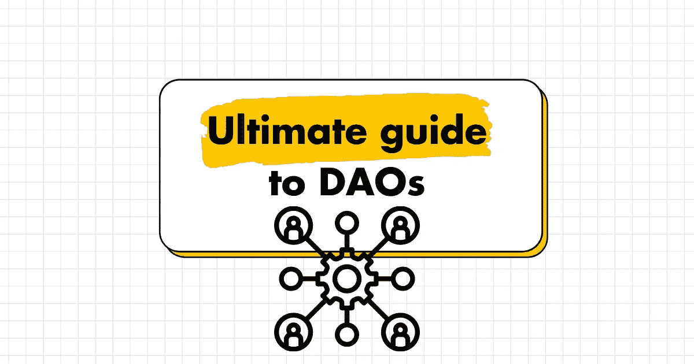
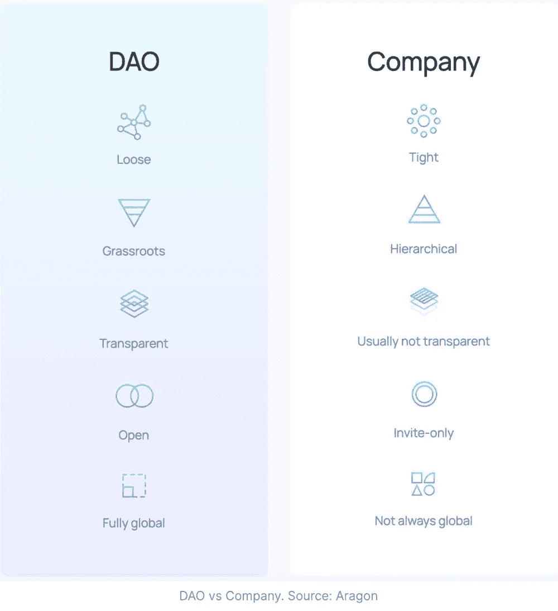
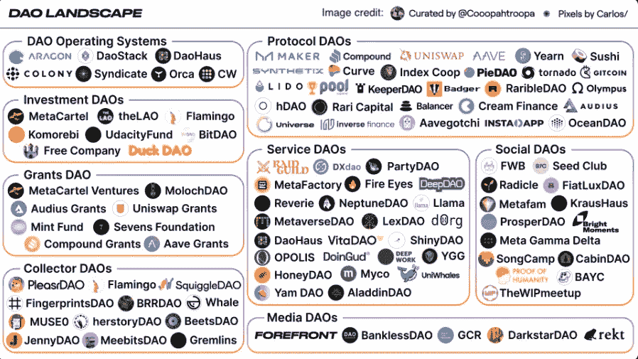
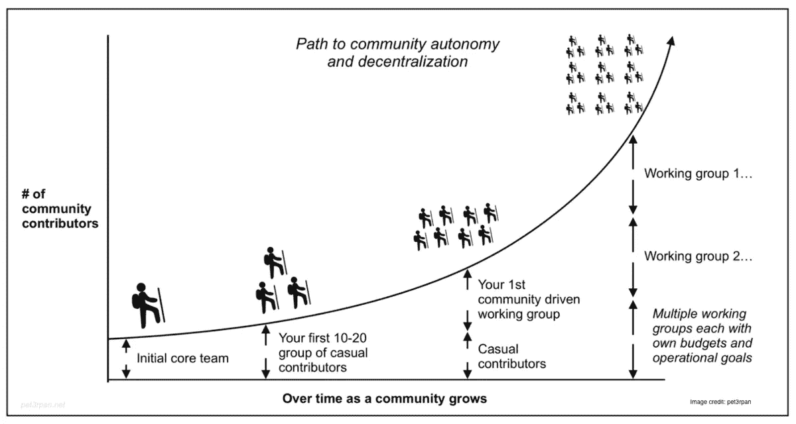
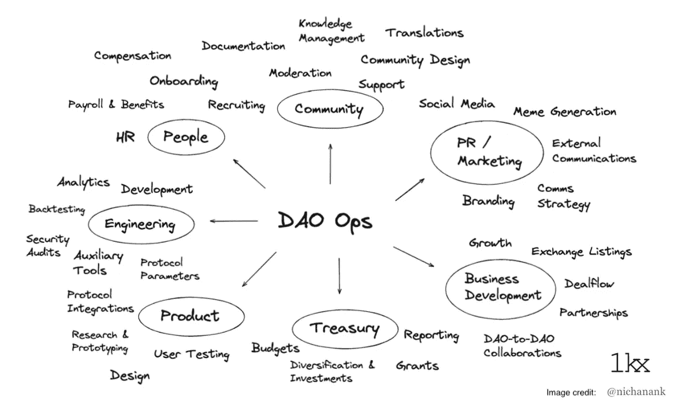
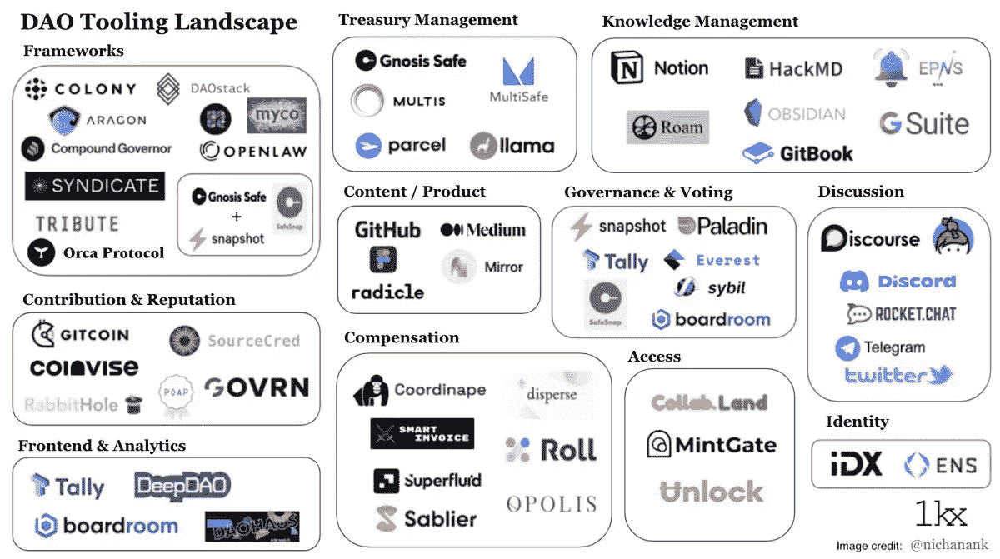

# DAOs 终极指南

> 原文：<https://medium.com/geekculture/ultimate-guide-to-daos-81d674dbb2c4?source=collection_archive---------1----------------------->

## 2022 年将是道年。

每个人都将开始或加入一个。

你需要知道的是:

# 1.什么是刀？

DAO 代表分散的自治组织。

> DAO，或称分散自治组织，是一组人，他们通过相互签订合同来实现一个协调的目标。它可以是任何事情，从收集稀有的 NFT，到预测股市走势。而且它的存在通常是为了特定的目的筹集资金。
> 
> 来自[财富](https://fortune.com/2022/02/15/what-is-a-dao-explaining-decentralized-autonomous-organizations/)

它是一个企业或组织的 web3 结构。

# 2.谁能开刀？

谁都可以开刀。

它没有自上而下的层次结构。它包容开放，人人参与。

From Aragon

# 3.它是如何工作的？

DAO 的规则都用智能契约和开源代码编写。

该组织的所作所为是完全透明的。决策是通过道成员的基层投票作出的。

# 4.Dao 的示例

理论上，任何组织都可以是道。

投资 DAO 和赠款 DAO 可以资助项目(如[-meta cartel Ventures DAO](https://medium.com/u/8393d2729aa5?source=post_page-----81d674dbb2c4--------------------------------))

收藏家道可以收集 NFT 数码艺术和其他收藏品(如鼠道)

社交道可以为其成员提供一定的社交圈(比如有利益道的朋友)

# 5.如何从零开始形成一把刀

有使命和愿景的核心成员。

吸引最初的几十个早期贡献者。更多的人加入并衍生出第一个社区驱动的工作组。

组织继续成长，专业团体不断产生。

# 6.“道”行动可能会是什么样子

更小的 Dao 将被创建来完成有很多经理的大团队的任务。

每个人都在贡献，都是决策者。

# 7.道基础设施

DAO 框架为创建 DAO 提供了技术工具。

一个 DAO 可以用像[殖民地](https://medium.com/u/d3a386f7b02e?source=post_page-----81d674dbb2c4--------------------------------)、辛迪加或者阿拉贡这样的交钥匙解决方案来创建。

或者从每个功能组件的单独解决方案中挑选并组合它们。

# 8.刀是如何开始的

A.最初的团队开始不和谐

B.向成员分发特定于 DAO 的令牌

C.使用圣骑士进行治理

D.来自赠款、代币销售或会员会费的资金可由 MultiSafe 管理

E.为道工作的成员通过分散获得报酬

# 9.挑战

A.入职。Dao 需要让非加密人员和非开发人员更容易访问。

B.投票治理是可以改进的。

C.衡量和补偿成员的贡献需要改进。

D.道组织的法律和监管地位仍有待澄清。

# 10.参与其中的最佳方式

了解 DAOs 最聪明的方法是加入一个。

在这一集由 [@ddwchen](https://twitter.com/ddwchen) 和嘉宾 [@chaserchapman](https://twitter.com/chaserchapman) 主持的《兔子洞上的 DAOn》中，了解一下如何做到这一点。

# 11.为道工作的现实

从 [@_kinjalbshah](https://twitter.com/_kinjalbshah) 投资道创始人 [@KomorebiFund](https://twitter.com/KomorebiFund) 处获取实地事实。

由 [@katherineykwu](https://twitter.com/katherineykwu) 和 [@jmart_199](https://twitter.com/jmart_199) 主持的街区播客

# 12.组织乐高积木:道工具的状态

在本文中深入了解 DAO 结构

 [## 组织乐高积木:道工具的状态

### DAO Operations 是一个仍未得到充分服务的新兴加密垂直市场。拥有超过 1，000 个快照空间，70 万个治理…

medium.com](/1kxnetwork/organization-legos-the-state-of-dao-tooling-866b6879e93e) 

# 13.构建和运行 DAO

为什么治理很重要

 [## 构建和运行 DAO:为什么治理很重要

### 随着 DeFi 和 NFT 社区规模的巨大增长，如何管理分散协议变得更加重要…

future.a16z.com](https://future.a16z.com/building-and-running-a-dao-why-governance-matters/) 

# 14.道斯，一个佳能

来自[安德森·霍洛维茨](https://medium.com/u/df45fd4a749d?source=post_page-----81d674dbb2c4--------------------------------)的白金资源

 [## 道斯，一个佳能

### 什么是(不是)道？为什么 Dao 很重要？Dao 如何适应 web3，加密，创造者经济，工作的未来…

future.a16z.com](https://future.a16z.com/dao-canon/) 

# 15.Dao 是工作和社区的未来

现在还为时尚早，但 DAOs 将成为我们工作、社交和联系的方式。

了解它们并不算太早。

# 👇评论 Dao 如何重塑当前行业。

> 👋**在[媒体](/@pooriaarab)—[LinkedIn](https://www.instagram.com/pooria.arab/)—[Twitter](https://twitter.com/pooria_arab)—[insta gram](https://www.instagram.com/pooria.arab/)—[抖音](https://www.tiktok.com/@pooria.arab)**
> 
> 更多关于 Web3，Crypto，NFTs，DeFi 等的好东西…
> 
> 点击获取 NFT 发布的终极策略