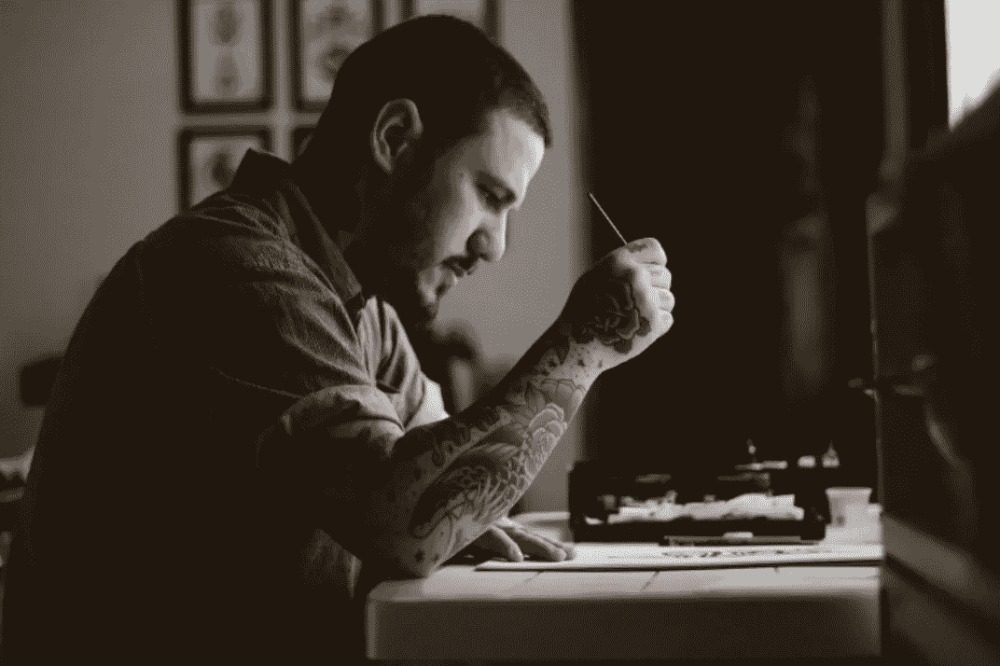
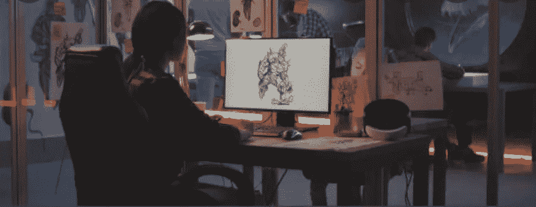

# 游戏开发入门终极指南

> 原文：<https://medium.com/geekculture/ultimate-guide-to-getting-started-in-game-development-bec180c62ac4?source=collection_archive---------16----------------------->

在这篇文章中，我们将:概述什么是游戏开发者(以及不同的专业和技能)，回顾你可以做些什么来开始。

# 什么是游戏开发者？

说到底，[游戏开发者](https://en.wikipedia.org/wiki/Video_game_developer)就是，**“解决如何制作游戏问题的人”。**

开发人员，无论他们是艺术、设计还是代码方面的专家，都有责任解决他们所从事的项目中的问题。要记住的最重要的事情是，他们必须创建一个游戏来解决“问题”(这里我们指的是设计、开发和分发项目)。

游戏开发商满足并建立对他们产品的需求。他们必须能够适应他们的市场和观众，才能让别人认可和重视他们的工作。

一般来说，最好是专门化，以确保你有你擅长的一件事，这样团队才会重视你参与他们的项目。但是，如果您打算创建和发布自己的项目，您必须愿意承担各种工作(行业术语:身兼数职)。

# 游戏开发者需要哪些技能？

这很大程度上取决于开发商寻找的就业类型。

如果你想为暴雪、艺电或育碧这样的大公司工作，你应该专注于一个特定的技能领域。如果你想在创业工作室工作，你应该专注于掌握一项才能，并在简历中增加一项次要技能。

老实说，如果你想开自己的公司，最好只学制作游戏(游戏不需要最好的美术或最令人兴奋的机械；更重要的是专注完成产品，有特色)。

# 游戏开发硬技能

# 艺术

[**游戏美工**](https://en.wikipedia.org/wiki/Video_game_artist) **是创造项目视觉元素的开发人员。**

他们生产其他开发者用来制造关卡和角色的资源。他们也可能负责设计用户界面或制作特定游戏元素的动画。

还有技术艺术家的职业，这是艺术和编程的交叉，需要视觉设计和软件开发经验才能为游戏制作图形程序(有抽象图形的游戏最有可能在他们的团队中有技术艺术家)。

学习制作游戏艺术可能意味着各种各样的事情。首先，您必须决定是创建 2D 艺术，如像素艺术或矢量精灵，还是 3D 艺术，如低多边形或照片级真实感图像。

当你在 2D 和 3D 之间做出决定后，你应该寻找一种你喜欢的艺术风格。浏览 Steam 或 itch.io 上众多的独立游戏，了解多样的艺术风格。一旦你发现了自己的风格，继续努力，直到你能做出自己和他人都认为“优秀”的东西到现在为止，你应该已经开始整理一个在线作品集，当他们要求你的作品样本时，你可以把它发给他们。你可以开始学习如何为一个以游戏为中心的项目制作艺术作品，通过使用这个作品集来开始制作或寻找游戏项目。

即使你想成为一名技术艺术家，我们也建议你从经典的 3D 艺术开始，然后逐步提升。

总结:

–在 2D 和 3D 之间选择
–找到一种艺术风格(通过参考游戏)
–练习、练习、练习
–建立作品集
–找到/创建一个游戏项目
–制作、制作、制作

> 额外提示:作为一名艺术家，保存一份你所有作品的作品集是至关重要的，这样你就可以随时向任何要求观看你最伟大作品的人展示这些作品。

# 设计

即使你选择了不同的专业，你几乎肯定会学到不同种类的设计，因为所有的专业都在某种程度上依赖于设计。

让团队跟上项目概念的开发人员被称为游戏设计师。

他们创建关卡，为游戏部件或机制制作文档，并确保游戏在任何时候都能流畅运行。

在学习创建视频游戏之前，开始开发它们是至关重要的。真的就这么简单。行动(而不是写下和抛弃你的想法)是最好的学习方法。你可以从理解如何创建游戏支柱文档(GDD)开始。在学习了基本文档并指定了游戏所需的材料后，尝试为自己的想法创建文档。

一旦你编制了一份资产清单，你就可以开始创建你想象的关卡，方法是下载一个游戏引擎并找到你需要的资产(我们建议使用 Unity 并从 Unity 资产商店获取资产)。通过设计关卡，你可以学习如何在游戏中创建一个完整的关卡(组织，灯光，资产放置/变化，等等)。你也可以利用这段时间学习一些基本的编程，这样你的关卡就可以有一些互动。

展示你的作品，并尝试通过展示你用原型元素创建的级别来招募其他人。从这里继续制作游戏，不要害怕扩展你的美术或编程知识(设计师应该尝试对开发的各个方面有一个基本的了解)。

**总结:**

–学习制作 GDD 和游戏支柱文档
–为您自己的游戏制作 GDD 或支柱文档
–列出您需要的资产(模型、UI、声音等)
–找到免费的原型资产(如在 Unity 资产商店中)
–在游戏引擎中构建关卡
–招募其他学科的开发者加入您的项目
–完成您的游戏
–构建更多游戏|不断学习

# 编程；编排

游戏程序员对于游戏功能的开发至关重要。

他们对系统进行编程，让系统启动并运行，同时帮助设计师更快地创作素材。游戏程序员通常在学习核心编程后专攻游戏性、人工智能或物理编程(也有更多的选择)。

取决于程序员是否打算为大工作室工作，他们可能永远不会正式专门化，而是学习他们需要知道的东西。

开始学习编程可能看起来很难，但是一旦你掌握了基本概念，你会发现它是多么简单。你可以从在 YouTube 上搜索游戏编程课程开始(我们建议专门为 GameMaker 或 Unity 学习编程，因为他们有更大、更活跃的社区，Unreal 也非常受欢迎)。专注于关键概念，如变量、循环、条件、数组/列表和特定于引擎的函数。

一旦你在你喜欢的引擎/编辑器中掌握了基本编程，你就可以开始克隆其他游戏了。除了与朋友和家人分享，我们不建议分发复制的游戏。

开发完 Pong、Breakout、Snake、Tetris 和 Space Invaders(或类似的简单游戏)后，制作自己的游戏。不要试图创造大的东西，保持你的范围有限，集中精力完成游戏。

一旦你完成了你自己的游戏，把它和你以前做过的其他项目一起上传到作品集网站(制作克隆的视频，关注你自己游戏的可玩版本)。现在你可以开始探索加入游戏项目，因为你有一个作品集可以指导别人(或制作自己的作品集)。为了获得经验，集中精力完成项目，记得宣传你的工作。

**总结:** –使用 Youtube 观看 [GameMaker](https://www.yoyogames.com/gamemaker) 、 [Unreal](https://www.unrealengine.com/en-US/what-is-unreal-engine-4) 或 [Unity](https://unity3d.com/) 教程
–学习核心概念(变量、循环、条件、数组/列表等)
–克隆简单游戏
–制作自己的简单游戏
–使用您完成的游戏和克隆游戏创建作品集
–加入项目或组建团队，从事自己的项目

# 营销

每个游戏创作者都应该能够推销他们的产品。知道如何推广你的游戏将有助于你谈论它，知道在推广它时要强调什么，并把它卖给更多的游戏玩家。因为 DVNC 团队在企业层面工作，对游戏营销没有太多专业知识；然而，较小的工作室总能从团队中有人知道如何推广游戏相关内容中受益。

学习如何推广需要花费大量的时间和精力。准备花大量时间阅读关于如何营销、推广什么类型的材料、社区管理和各种其他主题的文章。

首先，在一个主要的社交媒体平台(如 Twitter 或 Instagram)和一个游戏开发网站(如 gamedev.net 或 IndieDB)上创建一个个人账户。重点了解如何使用该应用程序，并在社交网站上获得尽可能多的受众(尝试不同的帖子类型，如链接、图片、视频等)。在游戏开发网站上，尝试围绕某个东西组建自己的社区，或者加入一个已经建立的社区。

一旦你明白了如何利用这两个网站，你可能会寻找一个游戏开发团队加入(这应该很简单，因为你已经是一个游戏开发网站的成员)。主动推销他们的材料并协助社区管理。如果他们看不到团队中有营销人员的价值，就试着去找另一个团队(网上有成千上万个团队)。在他们的游戏推出之前，坚持与同一个团队合作，并跟踪你采用的各种营销策略及其有效性。

在你的第一个团队的比赛结束后，你可以创建一个网站来开发一个作品集，并将第一个项目作为案例研究，或者你可以找到另一个团队，重复这个过程，同时尝试提高你的效率。如果你的投资组合中有项目，你会发现找到有报酬的工作更容易。

**总结:** ——在各大社交网站上做账号( [Twitter](https://twitter.com/) 、 [Instagram](https://www.instagram.com/?hl=en) 、[Reddit](https://www.reddit.com/))
——在游戏开发网站上做账号([gamedev.net](https://www.gamedev.net/)或[IndieDB](http://www.indiedb.com/))
——学会使用这两个网站建立粉丝(阅读文章！)
-找到一个游戏项目，并提出推广他们的游戏
-与他们合作，直到游戏发布
-建立一个作品集网站
-找到更多的项目

# 我如何开始？

我们希望在你开始游戏创作之旅之前发出警告。

你会有这样的时候，你觉得好像没有人相信你，你想放弃。这时候记住为什么要做游戏很关键。继续创造，微笑，相信自己，你最终会遇到欣赏你工作的人(加入论坛是保持动力的重要部分)。

## 详细说明

既然你已经知道了游戏开发中的各种技能，是时候选择你的专业了。这不应该是一个困难的决定，因为最终，你应该做你喜欢的事情。然而，选择正确的专业非常重要，这样你就可以专注于掌握某项技能，增加你对团队的价值。

就像在电子游戏中选择一个班级，或者在一个小组中完成一个特定的任务。如果你转换职业，你将不得不在 1 级重新开始(直到你 10-20 级对一个团队有用)，但是如果你坚持下去，你将在几个月内执行地下城，然后在几年内(甚至几个月)执行 20 人突袭。

## 学习

一旦你知道你想要/需要学什么，就像出去实践一样简单。如果你阅读了上面对技能的详细描述，你应该已经对如何学习相关技能有了一个大致的概念。

你可以花尽可能多的时间阅读文章和观看教程，但你最终必须学会自己创造。开始制作(艺术、编程、设计等)。)早期会帮你弄清楚需要掌握哪些技能(这听起来可能有点像《盗梦空间》，但学习游戏开发其实就是弄清楚有哪些你不知道的技能，这样你就可以学习了)。

## 推广和社交

总是使用社交媒体和你的网站来推广你的工作。如果你宣传你的工作，你将能够向更多的人展示你的能力。在网上展示可以帮助你加入团队，获得工作(但尽量减少你的个人信息(除非是工作邀请，否则只要有姓名、电子邮件和网站就足够了)。

除了为自己做广告，与其他游戏开发商建立关系网将为你提供就业机会和项目线索。参与游戏堵塞，发现开发论坛，在社交媒体上给其他开发者评论和赞美，这些都是让你出名并让自己成为一名了解 x 的游戏开发者的好方法。

## 创造

确保你不要太沉迷于推销你以前的作品。你应该不断努力提高你的工作质量，加速“优秀”工作的产生。确保你的才能不断提高的最好方法之一就是定期创作。通过完成项目，你将有很好的工作范例，并能够通过你的作品集网站和社交媒体页面展示你的进步。

保持动力和好奇心是困难的，但是你可以通过和其他创造者在一起来克服这一点。如果你厌倦了生产，考虑加入一个临时的开发团队或者参加一个社区挑战。如果有其他创造者鼓励和激励你，你自然会想要继续发展。

# **下面是一些帮助你学习的网站**

# 发动机

[合一](https://unity3d.com/) 虚幻
[游戏制作者](https://www.yoyogames.com/gamemaker)

# 建模

[Blender](https://www.blender.org/) [Maya LT](https://www.autodesk.com/products/maya-lt/overview) [资产伪造](https://assetforge.io/)

# 图像编辑(矢量和光栅)

[Photoshop](https://www.adobe.com/products/photoshop.html) [Illustrator](https://www.adobe.com/products/illustrator.html) [Canva](https://www.canva.com/)

# 资产

[Unity Asset Store](https://assetstore.unity.com/) [Kenney](https://kenney.nl/assets)  [打开游戏美术](https://opengameart.org/) [游戏美术 2D](https://www.gameart2d.com/freebies.html)

# 位置

[Gamedev.net](https://www.gamedev.net/) [IndieDB](http://www.indiedb.com/) [game dev 地下](http://gdu.io/)

# 教育

[团结学习](https://unity3d.com/learn) [Udemy](https://www.udemy.com/courses/development/game-development/) [团队树屋](https://teamtreehouse.com/library/topic:game-development)