# JavaScript 游戏开发终极指南

> 原文：<https://medium.com/geekculture/ultimate-guide-to-javascript-game-development-a4a958d69355?source=collection_archive---------6----------------------->

JavaScript 游戏很有趣，创建简单，是年轻人学习如何编码的好方法。JavaScript 是一种众所周知的计算机语言，几乎可以在互联网的每个页面上找到。当您将 JavaScript 添加到 web 应用程序中时，它可能会为动画和交互带来活力，使网上冲浪和玩游戏变得更加愉快。

JavasScript 创建可以在 web 上轻松玩的游戏的潜力是一个热门话题，吸引学生学习如何使用它编程。随着互联网连接和计算机硬件的进步，在过去的十年里，游戏创作者一直在使用 JavaScript 来创建新的内容，这并不奇怪。

# JavaScript 对游戏开发有好处吗？

现在你知道 JavaScript 可以用来创建游戏，你可能想知道它是否胜任这个任务。

是啊！根据你想制作的游戏类型，JavaScript 是一种很好的语言。对于基于网络和手机的游戏，JavaScript 是理想的选择。对于孩子来说，它也是一种很好的学习语言，因为它通常很容易掌握，并且有丰富的程序员在线资源。我们建议初中和高中学生将学习 JavaScript 作为他们编码课程的一部分。

JavaScript 游戏可以在浏览器或手机上玩，所以如果这是你的目标，它们是一个很好的选择。平台和技术可以帮助创建 2D 和 3D 内容。

另一方面，如果你想使用 JavaScript 来创建下一个大型 AAA 游戏，如使命召唤或国际足联，你可能会发现很难。尽管 JavaScript 功能多样，但它比 C++之类的语言慢得多，占用的内存也多得多。高级游戏需要密集的 GPU 计算，这是 JavaScript 无法处理的巨大负担。

# JavaScript 与 Java 在游戏开发中的对比

> 人们经常比较 JavaScript 和 Java，甚至错误地互换使用这两个术语。实际上，JavaScript 和 Java 是不相关的，它们唯一的共同点是它们都是名称中带有“Java”一词的编程语言。

Java 是一种编译语言，而 JavaScript 是一种解释脚本语言。代码不需要编译，因为它是一种解释型脚本语言。相反，用户的命令解释结果。这就是为什么它在建立网站时如此有效。在网站上，用户经常点击和滚动，提供 JavaScript 可以用来执行操作的数据。

另一方面，Java 要求在执行代码之前先编译代码。也就是说，代码被转换成计算机可以理解的机器语言。

现在它已经过时了，这些语言的游戏可能性是什么？同样，如果你想开发网页浏览器游戏，JavaScript 可能是最好的选择。然而，如果你想制作一个可以在 PC 或主机上运行的游戏，Java 将是一个更好的选择。基于 Java 的流行游戏《《我的世界》》是最受欢迎的游戏之一。

# 最好的 JavaScript 游戏引擎有哪些

JavaScript 代码都是文本，虽然它很强大，但它本身并不能做所有的事情。在用 JavaScript 设计游戏时，使用游戏引擎或渲染器库是相当典型的。学习将游戏引擎包含到他们的程序中的孩子将离实现他们的理想游戏更近一步。

游戏引擎是软件的一部分，可以让你给你的游戏添加额外的功能，包括声音、动画、视觉和物理。在为你的游戏选择游戏引擎或渲染库时，你有很多选择。这里有几个受欢迎的例子可供选择。

# PixiJS

PixiJS 是一个开源引擎，拥有快速且有吸引力的 API。2D 渲染器也是跨平台的，允许你为各种平台创建游戏。开源还允许一个庞大而热情的社区为引擎的持续发展做出贡献。

# BabylonJS

[BabylonJS](https://www.babylonjs.com/) 是一个渲染工具包，拥有丰富的功能，让你制作从简单的动画到成熟的 3D 游戏。BabylonJS 和 PixiJS 一样，是开源的，并受到广大开发者社区的支持。

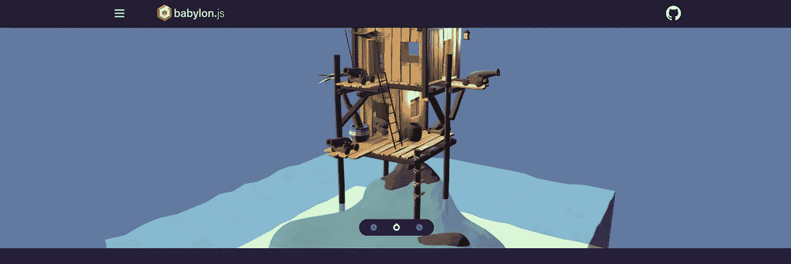

# 相位器

[Phaser](https://phaser.io/) 支持桌面和移动平台上的 HTML5 游戏。它的主要焦点是创造可以在各种平台上运行的 2D 游戏。根据需要使用额外插件的可能性是 Phaser 的优势之一。这允许你保持你的工具小，这样你就不会有太多的额外部件。

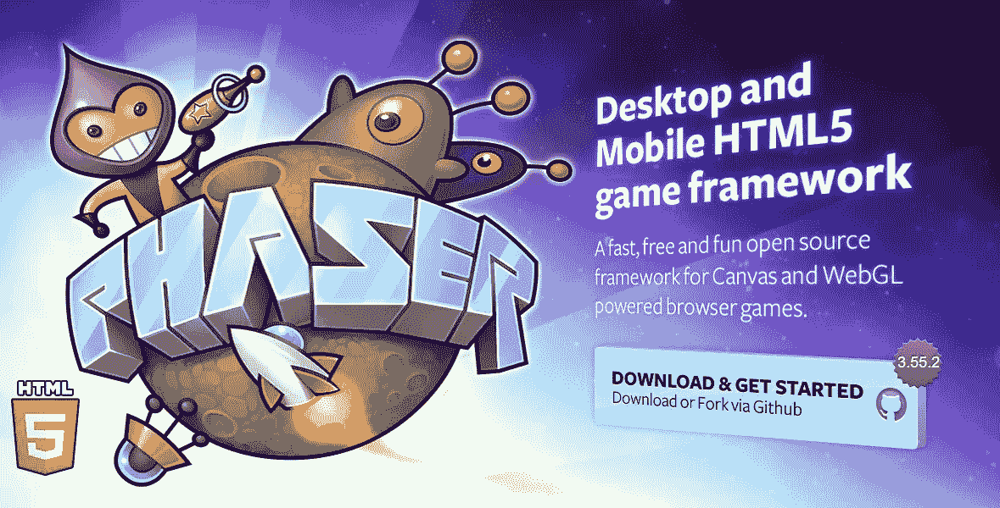

# 步骤 1 —选择代码编辑器

首先，去找一个你选择的编辑器。这里显示的例子将使用我们的 CodeWizardsHQ 编辑器。

# 第二步——制作游戏画布

我们编写的第一行代码将创建一个游戏画布。高度和宽度可以根据需要调整。有四个步骤来实现这一点。

在 style>/style >标记内，粘贴您的画布代码。
在您的脚本>/脚本>标签中，创建您的 startGame 函数，并建立您的变量和 getCanvas。
在 body > /body >标签中，调用 startGame onload。
如果需要，在 body > /body >元素中使用 h1 > /h1 >标签来提供标题。我们游戏的标题 Block Hopper 应该出现在一个浅蓝色的矩形中。我们游戏的背景是这样的。

> 注意:在这一步之后编写的所有代码都将放在 Script>/Script >标记中。

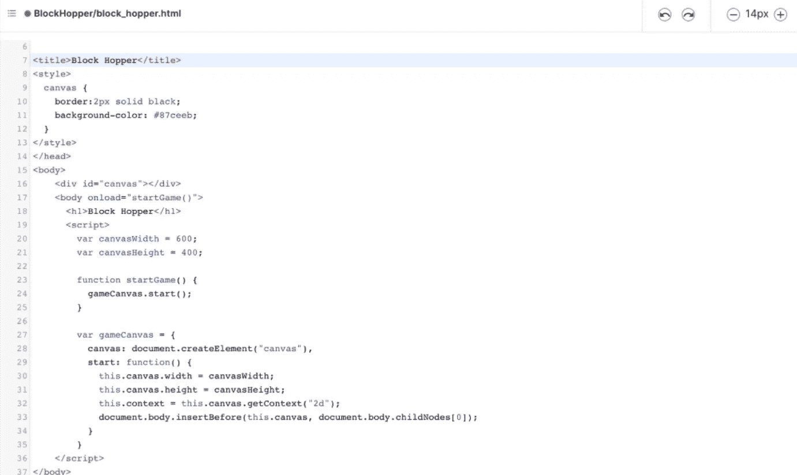

# 第三步——编写你的玩家——漏斗

让我们现在添加我们的球员。这将分四步完成。

1.  创建玩家变量。
2.  创建一个变量来存储玩家的 Y 位置。
3.  创建一个名为 createPlayer()的函数，带有宽度、高度和 x 位置参数。
4.  在 startGame()中，我们使用步骤 3 中的方法创建我们的玩家，并将其赋给我们在步骤 1 中定义的变量。

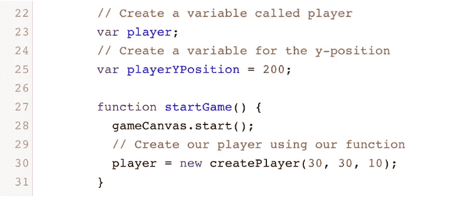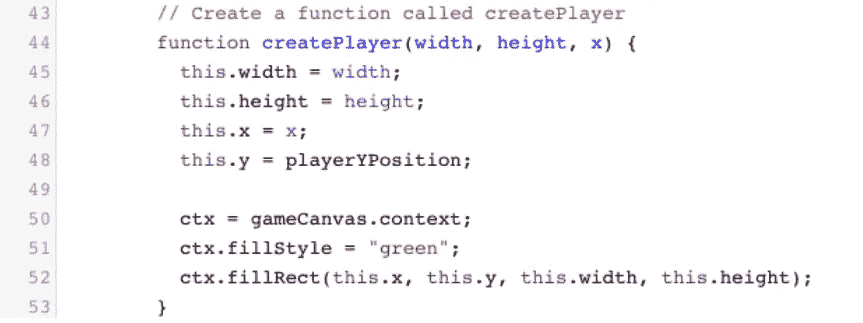

# 第四步——给你的玩家增加重力

让我们给玩家一种重力感。步骤如下。

1.  创建一个 fallSpeed 变量。
2.  创建一个新的间隔，并将其保存在一个变量中，该变量将用于调用 updateCanvas()函数。
3.  为我们的玩家创建两个函数:一个用于绘图，一个用于移动。
4.  创建一个名为 updateCanvas()的函数来清除画布并重新绘制播放器。

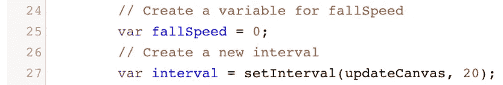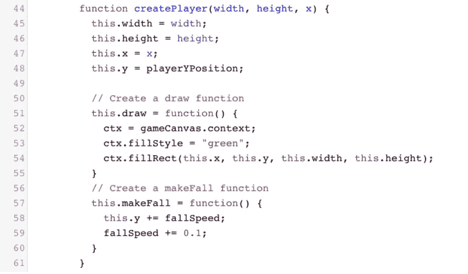

# 步骤 5-为您的播放器添加代码功能

我们的球员正在下落，但我们希望他一落地就停下来。在 createPlayer()函数中，添加 stopPlayer()函数。然后，在 movePlayer 结束时，调用函数()。

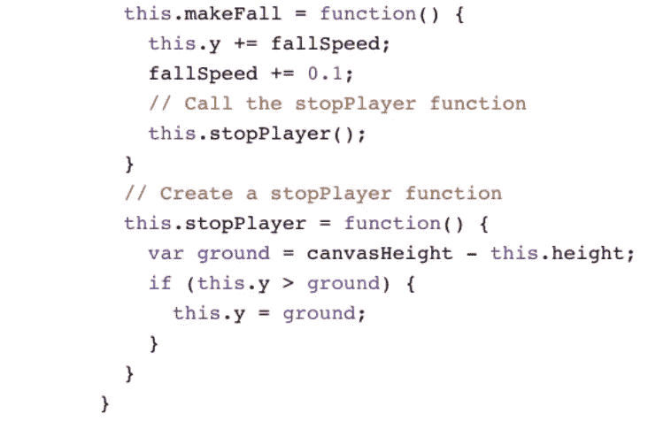

# 步骤 6-为你的播放器编写跳转逻辑

现在，当我们按下空格键，我们的玩家就会跳起来。

1.  创建 jumpSpeed 属性和 isJumping 布尔值。
2.  在 createPlayer()函数中，添加一个 jump()函数。
3.  对 makeFall()函数进行更改。
4.  在 updateCanvas 内部，调用我们的 jump()函数()。
5.  创建一个名为 resetJump()的方法。
6.  一旦我们按下空格键，切换 isJumping 布尔值并运行 resetJump()。

# 步骤 7 —构建攻击模块

是时候对你建立防御了。这将类似于构建播放器，但我们的块的特征将随机生成。

1.  创建一个新的块变量，并使用 createBlock()函数构造一个新的块。
2.  将 createBlock 中的值赋给块变量()
3.  在 startGame()中，调用函数并将其附加到变量中。
4.  制作一个名为 randomNumber()的方法。
5.  为 createBlock()函数分配宽度、高度和速度的随机数。然后构造两个函数:draw()和 attackPlayer()。
6.  调用 updateCanvas()中的块。Draw()和 block 是两个可以一起使用的函数. attack player()；

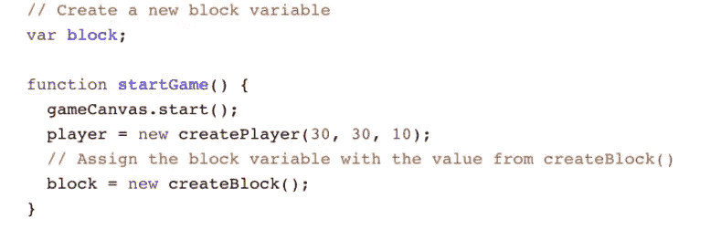

# 步骤 8-添加移动玩家的逻辑

太好了！我们的方块现在去攻击我们的玩家，但是一旦它到达屏幕的边缘，它就再也不会回来了。让我们把这件事弄清楚。

1.  在 createBlock()内创建一个名为 returnToAttackPostion()的函数
2.  重置块的宽度、高度、速度以及 x 和 y 值。
3.  在攻击结束时，调用新函数。
    玩家()

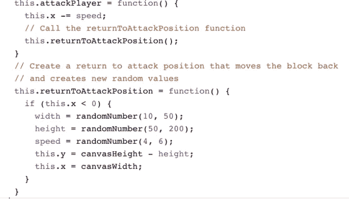

# 第 9 步—碰撞

当方块成功击中玩家时，我们必须完成游戏。是时候开发一个 detectCollision()函数了，如果有碰撞，它将使游戏停止。在 updateCanvas()函数中，调用 detectCollision()函数。

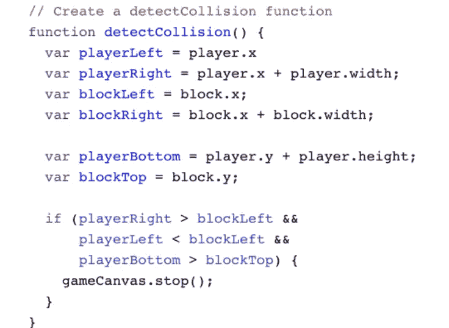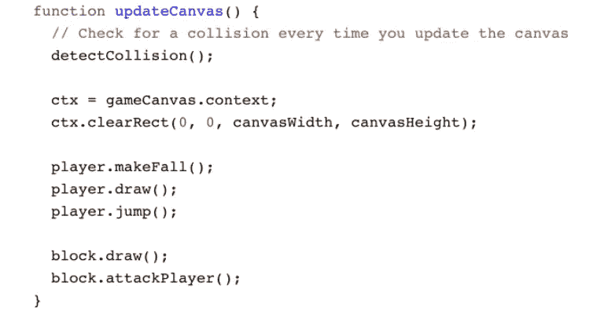

# 步骤 10 —添加分数

作为压轴戏，我们将为我们的游戏增加一个分数。这与创建形状的方式非常相似，除了我们将指定一个 **fillText** 属性和字体。

1.  创建一个等于 0 的**分数**变量开始。在那里，创建一个 **scoreLabel** 变量以备后用。
2.  用一个 **draw()** 函数创建一个 **createScoreLabel()** 函数。
3.  使用我们的 **createScoreLabel()** 函数为您的 scoreLabel 赋值
4.  在 **updateCanvas()** 中调用 **scoreLabel.draw()**
5.  一旦你的方块到达终点，增加你的分数

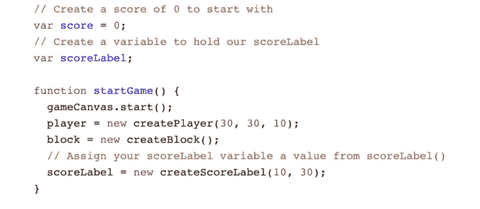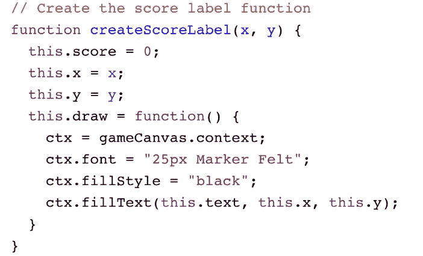

# 完成你的第一个 JavaScript 游戏！

至此，您已经完成了您的第一个 JavaScript 游戏。然而，提高编程技能的最好方法是编写自己的代码。这里有一些其他的障碍，你可以试着融入到你的游戏中。

1.  对于一个简单的挑战，改变一些变量，如**下降速度**或**上升速度**。玩一会儿，直到你找到你喜欢的设置。
2.  对于中等难度的挑战，在屏幕的另一边创建一个新的标签，上面写着你有多少条命。从三条命开始，每发生一次碰撞就失去一条命。一旦你失去生命，游戏就结束了！
3.  对于一个困难的挑战，在游戏中添加一个新的物体，如果你触摸它，它会给你加分。这将涉及到创建一个新的函数来创建对象和添加碰撞检测。让对象浮动可能也是个好主意！

> 注意:我将很快发布一个完整的初学者教程，这样人们可以学习如何编码。