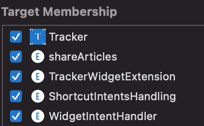
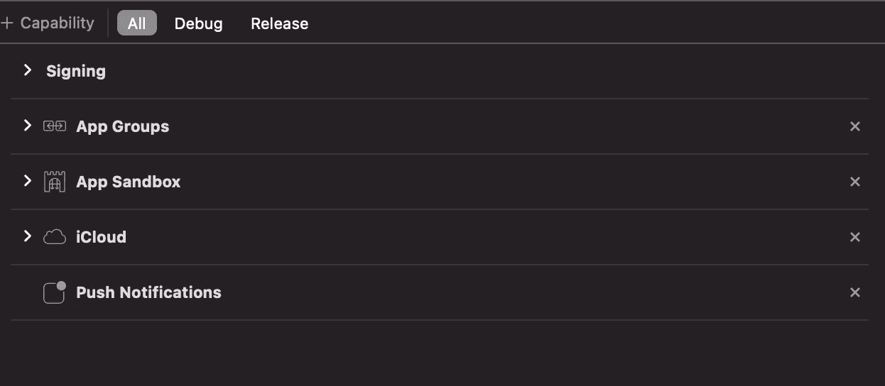
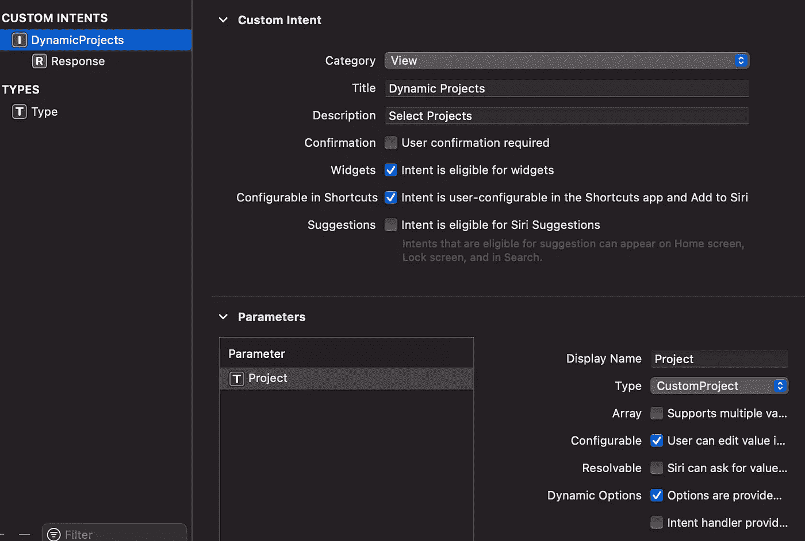
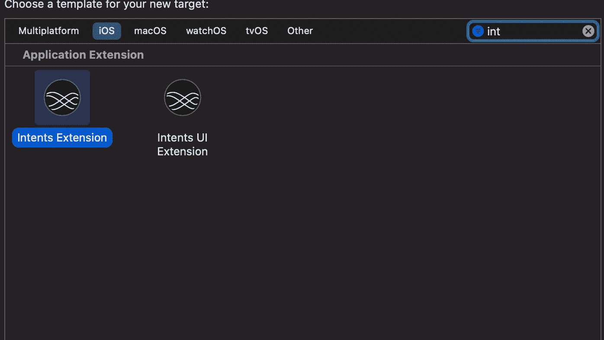
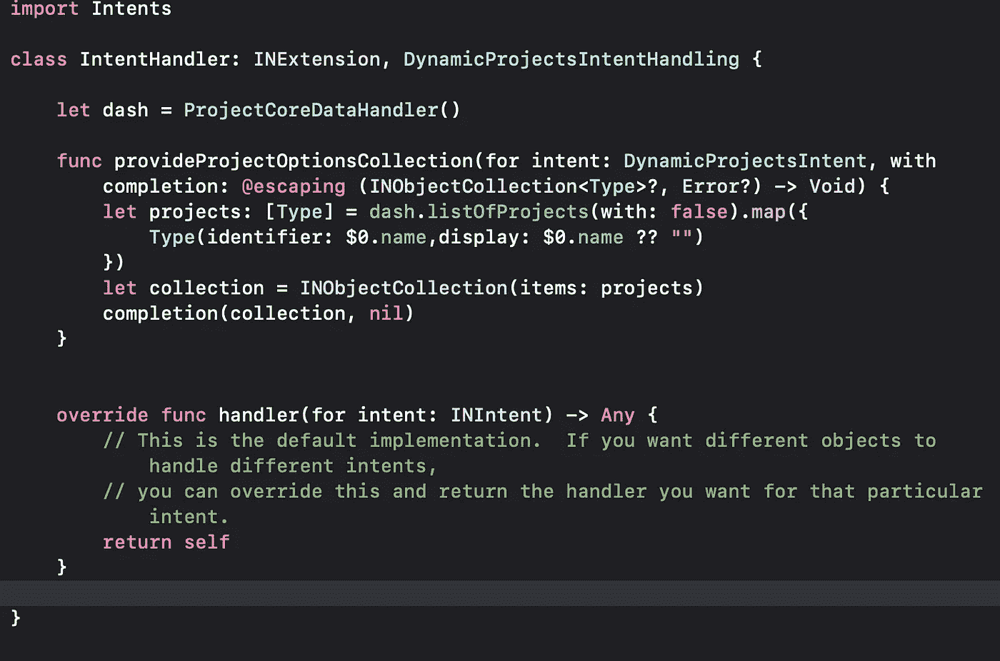
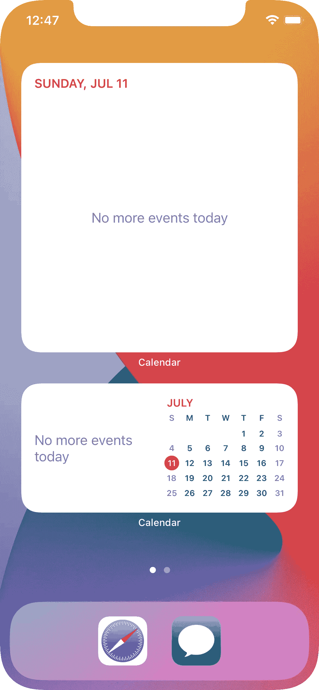
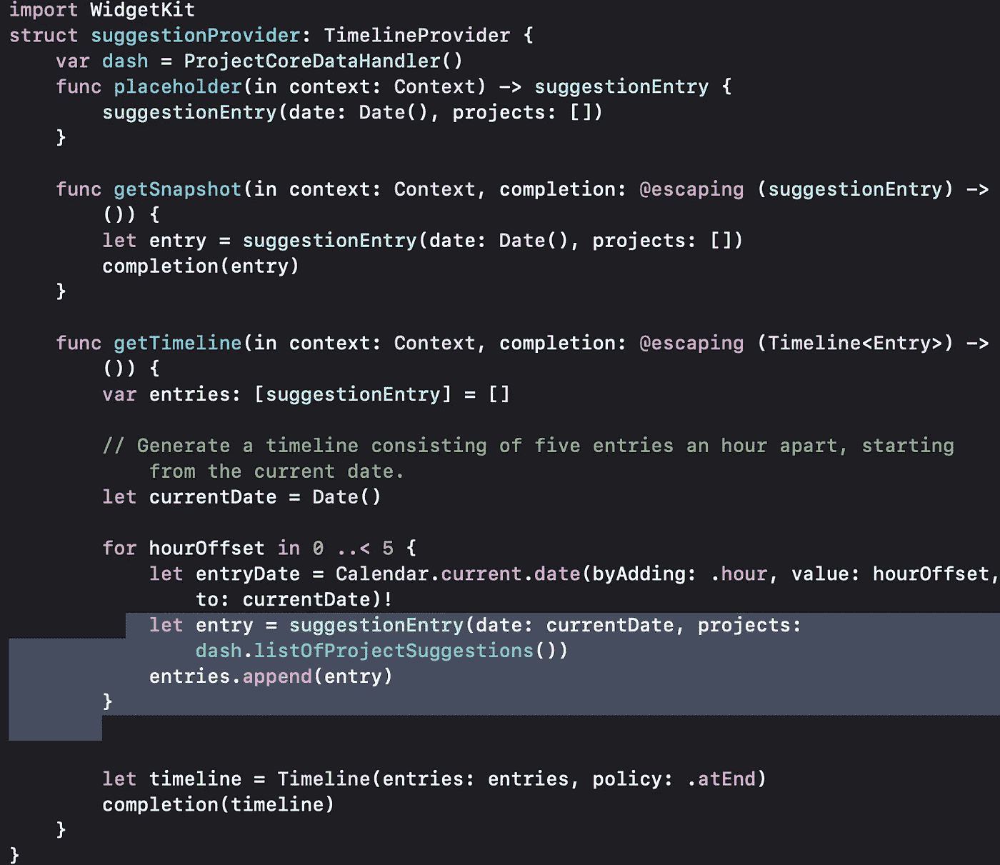

# iOS 开发中制作小工具的终极指南

> 原文：<https://medium.com/geekculture/ultimate-guide-to-make-widgets-in-ios-development-ff883a9d4c35?source=collection_archive---------2----------------------->

在本文中，我们将为 iOS 应用程序制作一个小部件。首先，我们需要回答自己几个问题:

1.  我们将在 Widget 中显示什么信息？
2.  我们需要多久更新一次小部件中的数据？
3.  用户可以配置我们的小部件吗？

一旦你准备好了答案，开始用下面的步骤做一个。即使你对以上问题不确定，也要马上开始。你可以在这篇文章结束前回答。

## 向项目中添加新目标


像任何其他扩展一样，Widget 也是我们应用程序的一个扩展。它从主应用程序获取数据的方式与其他扩展相同。

## 向目标添加文件和功能

共享数据的一些常见步骤是选择所需的文件并添加到小部件目标。



并添加必要的功能，如应用程序组、云工具包容器等..



## 代码的更改

对代码进行必要的更改，以便可以在扩展中使用数据。例如，如果您的应用程序使用核心数据，那么我们可以使用应用程序组来共享数据，如下所示:

```
class CustomPersistantContainer : NSPersistentContainer {
static let url =   FileManager.default.containerURL(forSecurityApplicationGroupIdentifier: "group.com.maheshsai.******")!let storeDescription = NSPersistentStoreDescription(url: url)override class func defaultDirectoryURL() -> URL { return url}}
```

然后我们可以使用 CustomPersistentContainer 来代替 NSPersistentContainer。

```
container = CustomPersistantContainer(name: "tracker")
```

现在我们可以使用 CoreData 框架存储的数据进行扩展。

注意:不要忘记将所有必需的文件添加到小部件目标中。

上述步骤对于任何使用主应用程序数据的扩展都是通用的。但是以下是特定于小部件的。

## SwiftUI 视图

小部件使用声明性框架 SwiftUI 向用户显示信息。下面是一个显示一些信息的小例子。

```
struct viewbox: View { var int: Int var colorForBackground: Color var name: String var extra: String var body: some View { VStack(alignment: .center) { HStack(alignment: .center, spacing: 12) { Image(systemName: name) .resizable() .frame(width: 20, height: 20) .foregroundColor(colorForBackground) Text("\(int)") .bold() .foregroundColor(.black) } Text(extra) .foregroundColor(.black) } }}
```

同样，我们需要构建一些显示数据的 SwiftUI 视图。

# 小部件的配置和一致性

添加配置是制作小部件的关键步骤。

配置可以是静态的或动态的。

## 静态配置

顾名思义，这个小部件显示一些没有用户可配置选项的信息。例如显示未决和关键任务总数的小部件。

```
struct trackerWidget: Widget { let kind: String = "com.maheshsai.trackerWidget" var body: some WidgetConfiguration { StaticConfiguration(kind: kind, provider: Provider()) { entry in trackerWidgetEntryView(entry: entry) } .supportedFamilies([.systemSmall]) .configurationDisplayName("Tracker Widget") .description("Track the count of pending and completed projects") }}
```

## 意图配置

与静态配置不同，意向配置为用户提供了选项。例如，显示特定项目中未完成任务总数的小部件。

```
struct taskWidget: Widget { private let kind: String = "com.maheshsai.TaskWidget" public var body: some WidgetConfiguration { IntentConfiguration(kind: kind, intent: DynamicProjectsIntent.self,  
 provider: taskProvider()) { entry in TaskWidgetView(entry: entry) } .configurationDisplayName("Task Widget") .description("See some of the tasks from selected project.") .supportedFamilies([.systemMedium]) }}
```

这些选项来自意图参数。

像 Siri 快捷方式意图一样，我们需要定义一个意图，在运行时向用户提供值。为此，请遵循以下步骤。

1.  在小部件目标内创建意图定义文件，并添加意图和响应。



2.使意图符合微件的条件。

3.添加参数并自定义它们。

4.添加意图扩展目标并确认该类为创建的意图。



Intents.sift inside IntentExtension

上述代码为用户提供了项目选项。当用户编辑小工具时，可以选择上面提供的选项。

除了名称，我们可以在创建类型时提供字幕和图像，如下所示

```
let imag = UIImage(systemName: $0.image ?? 
                   "")?.withTintColor(.label)return Type(identifier: $0.name, display: $0.name ?? "", subtitle: 
     nil, image: INImage(imageData: imag?.pngData() ?? Data()))
```

除了配置之外，小部件还接受种类和提供者参数。

kind 是小部件的唯一标识符。我们将在下一节看到条目和时间轴提供者。

主体也使用修饰符来提供显示名称和描述。受支持的家庭目前有 3 个选项，可以是小型、中型和大型。根据支持的系列选项，小工具会占用屏幕空间。



Medium and Large Calendar Widgets

# 时间轴提供程序和条目

时间轴提供程序取决于小部件的配置。如果小部件使用动态配置，则它采用 IntentTimeLine 提供程序，否则它采用 TimeLine 提供程序。

无论时间轴提供者的类型是什么，如果我们观察静态和动态配置的示例代码，两者都使用条目。

条目是符合时间线条目协议的结构。它包含 SwiftUI 视图使用的日期(何时显示内容)和其他信息。

```
struct SimpleEntry: TimelineEntry { let date: Date var completed: Int var noncompleted: Int}
```

该条目由 TimelineProvider 提供给 Configuration，然后 SwiftUI 视图使用它来显示内容。

让我们看看时间轴提供者是如何向配置提供条目的。

## 符合时间线提供者/意向时间线提供者

我们将首先创建一个向 TimeLineProvider 或 IntentTimeLineProvider 确认的结构。

对于协议的确认，该结构需要有 3 个功能，提供一个占位符，快照和时间轴。

占位符功能为用户提供没有内容的通用占位符视图的入口。

快照功能提供瞬时情况下的视图入口，如小部件图库中的小部件。

Timeline 函数为当前和未来时间提供了一个条目数组来更新一个小部件。



在上面的函数中，它提供了五个条目，每隔一小时显示一次。同样，您可以提供对应于当前日期和时间的单个条目。

如果我们观察最后一行，它包含一个更新时间表的策略。

```
let timeline = Timeline(entries: entries, policy: .atEnd)
```

我们的策略决定了您的小部件需要更新的频率。该策略可以在()之后使用，也可以从不使用。

顾名思义，atEnd 策略在现有时间线结束后刷新时间线，即在上述示例中完成五个条目后创建新的时间线。

之后(日期: )仅在指定的日期和时间之后刷新时间线。

除非明确重新加载时间线，否则不会刷新时间线。我们可以使用下面的函数从主应用程序中显式地重新加载特定窗口小部件或所有窗口小部件的时间线。

```
WidgetCenter.shared.reloadTimelines(ofKind: "com.maheshsai.TaskWidget")WidgetCenter.shared.reloadAllTimelines()
```

如前所述，种类唯一地标识每个部件。

只有当用户在应用程序中进行更改时，像 Notes 这样的应用程序的小部件才需要更改内容。因此，他们使用从不策略，并在应用程序内完成更改时重新加载。

注意:小部件的智能在于配置和时间线的设计。

## WidgetURL

如果你想在点击你的小工具时登陆应用程序的特定部分，而不是你的应用程序的登陆页面，那么你需要添加。SwiftUI 视图的 widgetURL(url)。

```
struct WidgetDisplayView: View {
  var body: some View {
     VStack {
     ...
     }.widgetURL(URL("page2"))
  }
}
```

然后进入主应用程序验证，并使用 onOpenURL 函数定义要做什么。

```
struct MainDisplayView: View { ... var body: some View { VStack { ... NavigationLink(destination:..,active: $isActive,label:...) }.onOpenURL { url in if url == URL("page2") { isActive = true } }}
```

# iOS15 中的新功能

从 iOS 15 开始，我们可以通过捐赠意图来扩展我们的小工具的智能，就像任何其他 siri 意图和快捷方式的捐赠一样。

```
// Donate INIntent from the app.onAppear {
    let intent = ViewRecentIntent()
    intent.project = Project(identifier: project.id.uuidString, displayString: project.name)let interaction = INInteraction(intent: intent, response: nil)
    interaction.donate { error in
        if let error = error {
            print(error.localizedDescription)
        }
    }
}
```

另一种方法是提供相关性

```
var relevantShortcuts: [INRelevantShortcut] = []if let shortcut = INShortcut(intent: intent) {
    let relevantShortcut = INRelevantShortcut(shortcut: shortcut)
    relevantShortcut.shortcutRole = .information
    relevantShortcut.widgetKind = “com.maheshsai.suggestionsWidget” let dateProvider = INDateRelevanceProvider(start: Date(), 
                                               end:  
 Date(timeIntervalSinceNow: 1800))
    relevantShortcut.relevanceProviders = [dateProvider] relevantShortcuts.append(relevantShortcut)
}INRelevantShortcutStore.default.setRelevantShortcuts(relevantShortcuts) { (error) in
    if let error = error {
        print("Failed to set relevant shortcuts. \(error))")
    } else {
        print("Relevant shortcuts set.")
    }
}
```

我们将提供从开始日期和时间到结束日期和时间的相关性。因此，如果这个小部件隐藏在一个堆栈中，那么关联系统会将它放在那个时间段的顶部。

就是这样！！

如果您仍有问题，请按照 [WWDC20](https://developer.apple.com/news/?id=yv6so7ie) 中的代码进行操作

感谢阅读:)