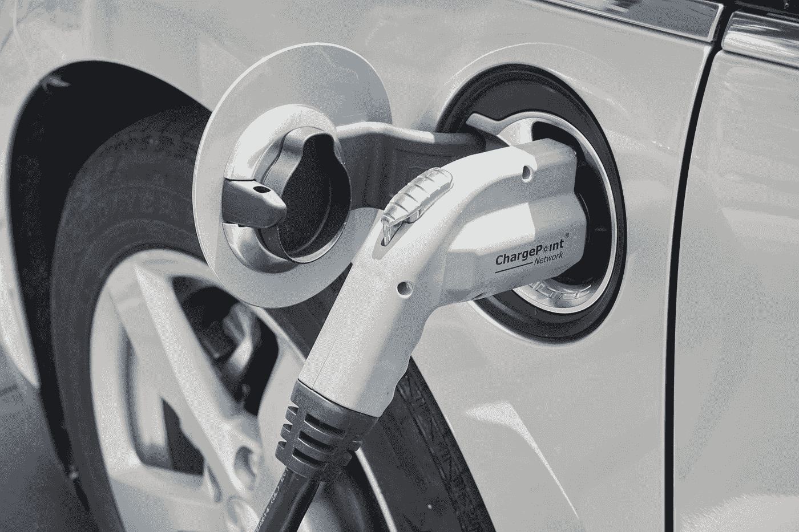

# 超快速充电储能解决方案

> 原文：<https://medium.com/geekculture/ultra-fast-charging-energy-storage-solution-f603b944ee00?source=collection_archive---------16----------------------->

## 蓄能

## 石墨烯超级电容器是储能的未来吗？

Photo by [Robert Linder](https://unsplash.com/@rwlinder?utm_source=medium&utm_medium=referral) on [Unsplash](https://unsplash.com?utm_source=medium&utm_medium=referral)

远离化石燃料意味着电动汽车将无处不在。然而，问题是这些[都有自己的问题](https://thedetechtor.com/electric-vehicles-what-is-really-stopping-them-from-becoming-mainstream/)，比如充电速度慢，有时续航里程短。这是因为电动汽车需要…