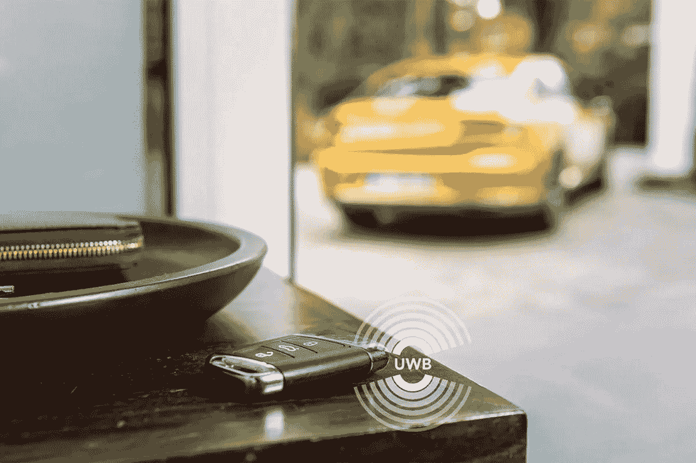

# 超宽带技术

> 原文：<https://medium.com/geekculture/ultra-wideband-uwb-technology-815aeaf3aad?source=collection_archive---------8----------------------->

# 介绍

超宽带(UWB)技术是一种无线电技术。与蓝牙和 Wi-Fi 类似，超宽带(UWB)是一种短距离无线通信协议，通过无线电波工作。它基于 IEEE 802.15.4a 和 802.15.4z 标准。这些标准允许对无线电信号的飞行时间(ToF)进行更精确的测量，这对厘米精度的距离或位置测量非常重要。

# 描述

超宽带(UWB)正迅速被用于基于微位置的物联网解决方案。它允许在室内和室外进行精确可靠的设备距离和位置测量，但功耗非常低。

# UWB 是如何工作的？

当支持 UWB 的设备(智能手机、智能手表、智能钥匙等)启动时，设备开始测距。)在另一个 UWB 设备附近。范围涉及计算设备之间的飞行时间(ToF)。[UWB 定位过程可实时快速跟踪设备的移动。通过这样做，支持 UWB 的设备可以知道运动和相对位置。例如，支持 UWB 的系统知道我们是否正在接近一扇锁着的门，并且可以控制我们是在门内还是门外。当我们到达一个准确的位置时，他们同样可以选择锁是否应该被绑起来。在实际情况下，UWB 可以在我们的车靠近时打开车库，并在我们靠近入口通道时打开家门。](https://www.technologiesinindustry4.com/)

# 特征

超宽带是一种以宽带(> 500 MHz)从一个角落到另一个角落传送信息的技术。
这允许大量信号能量的广播，而不会干扰相同频带中的传统窄带和载波传输。
不同国家的监控限制允许这种有组织的无线电带宽使用。
它支持高数据速率的个人区域网(PAN)无线连接。
这也使得更长距离的低数据速率应用、雷达和成像系统能够与当前的通信系统同步运行。

# 应用程序

## 实时定位

UWB 有利于实时定位系统。这对于它的精确能力非常有帮助，并且低功率使得它与射频敏感环境兼容，例如医院。UWB 对于点对点的精确测距同样有价值，这使得许多应用建立在两个实体之间的相对距离上。

## 移动电话

首先，苹果在 2019 年 9 月推出了三款具有超宽带功能的手机。苹果还在 2020 年 9 月推出了具有超宽带功能的 Apple Watch 系列 6。他们包含这项技术的航空标签于 2021 年 4 月 20 日公开。三星 Galaxy Note 20 Ultra 和 Galaxy S21 Ultra 和 S21+与三星 Galaxy SmartTag+一样支持 UWB。

## 工业应用(雷达)

超宽带技术在合成孔径雷达(SAR)技术中的应用越来越广泛。超宽带合成孔径雷达(UWB SAR)虽然使用较低的频率，但由于其高分辨率，其目标扩散能力得到了深入研究。

超宽带脉冲多普勒雷达还被用于监测人体的精神信号，例如，除了人体步伐分析和跌倒检测之外，还有心率和呼吸信号。它有助于作为连续波雷达系统的一种可能的替代方案，因为它包括更少的功耗和高分辨率的距离像。尽管如此，它的低信噪比使它对错误无能为力。这个应用程序的一个有利可图的实例是 RayBaby。这是一个婴儿监视器，它可以检测呼吸和心率来控制婴儿是睡着还是醒着。射线宝宝的探测范围是五米。它可以探测到小于一毫米的细微运动。

超宽带同样用于穿透墙壁的精确雷达成像技术。

## 数据传送

超宽带特性与短距离应用兼容，例如 PC 外设、无线显示器、摄像机、无线打印和向便携式媒体播放器传输文件。UWB 被提议用于个人区域网络，并出现在 IEEE 802.15.3a 草案 PAN 标准中。

# 物联网使用案例

这一技术标准将在不同领域创造新的物联网用例。例如，它将用于智能家居、安全的汽车无钥匙进入、受保护的支付处理和工业 4.0。UWB 非常适合物联网生态系统。它很安全，很完美，而且是电池驱动的。它可以用于物联网中的多种应用。[尽管如此，它将适用于迄今仍有待探索的许多应用。](https://www.technologiesinindustry4.com/) UWB 将首先指导免提进入控制、基于位置的服务和点对点应用的用例。到目前为止，它是新智能手机中的射频(RF)链之一。它支持智能卡访问、安全建筑访问和智能家居设备连接。无论大小，人们和企业都希望能够实时定位和珍藏几乎任何东西。

UWB 优势标签比以前用于物联网和智能家居应用的蓝牙或 Wi-Fi 更准确。通过蓝牙和 Wi-Fi，资产标签可以让我们到达一个间接的位置。使用 UWB，我们接收到一个严格的位置。例如，蓝牙标签会显示我们把钥匙落在房间或客厅的某个地方了。但是 UWB 会告诉我们，资产标签或我们的钥匙已经掉在我们沙发的垫子下面了。

UWB 也用符号打开了一个新的世界，这意味着语音命令可能偶尔是次要的，允许应用程序。例如，当我们进入一个房间时，灯通常会打开，或者当我们坐在桌前时，我们的电脑会打开。UWB 将这些类型的应用转移到现实中，产生了许多新的革命性的用例。为了验证通过使用 UWB 来维持互操作性，联盟 Fine Ranging (FiRa)现在正在改革来自半导体、移动、基础设施和消费者领域的 50 多家公司，以积极致力于协议的定义，从而保证互操作性。这将使开发者有可能在许多新的应用中使用 UWB，例如，增强现实、智能家居应用和移动支付。

更多详情请访问:[https://www . technologiesinindustry 4 . com/2021/06/ultra-wideban-UWB-technology . html](https://www.technologiesinindustry4.com/2021/06/ultra-wideban-uwb-technology.html)