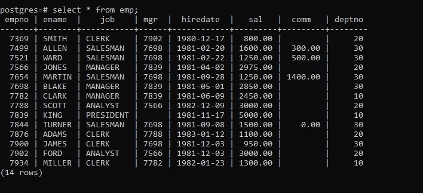
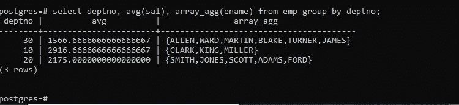
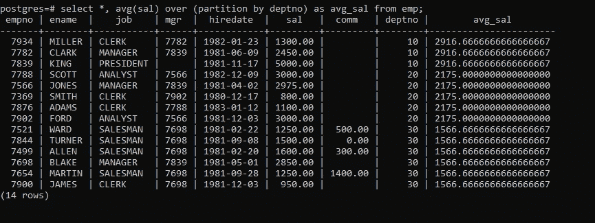
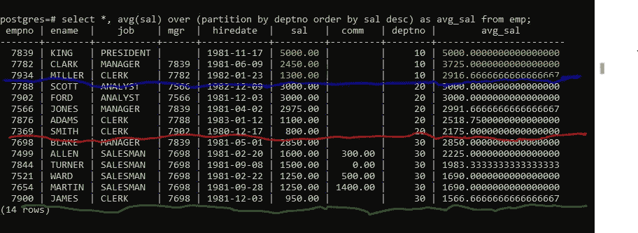
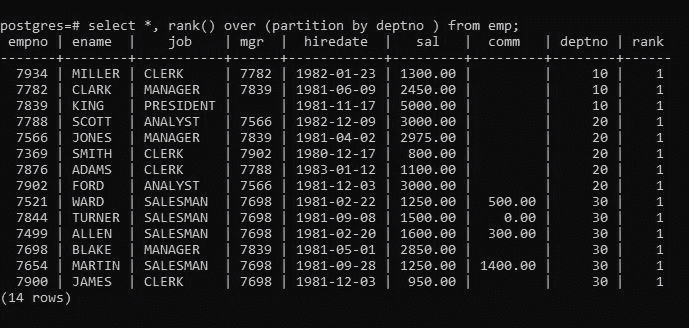
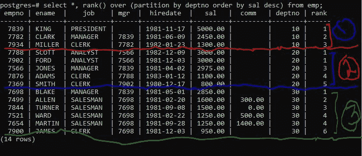
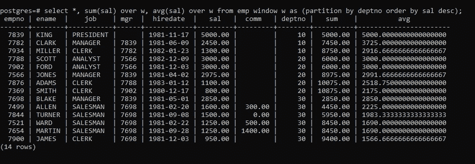
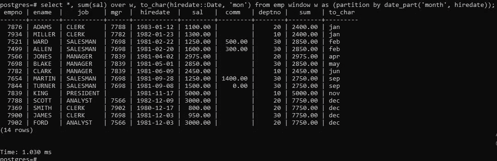

# 第 1 部分:关于 Postgresql 中的窗口函数您需要知道的事情

> 原文：<https://medium.com/geekculture/unbelievable-things-you-never-knew-about-window-function-in-postgresql-93f2197e0e0?source=collection_archive---------14----------------------->

你们一定都熟悉`select` 语句中的`group by`子句。Group by 子句将行的结果集分成组，然后给出该组的聚合值。如果你还没有读过 [group by article](https://python.plainenglish.io/most-important-things-to-know-about-group-by-clause-in-postgres-454be5a83d53) ，我真的建议你在跳到这篇文章之前先读一下，你也会知道 group by 和 window 函数的区别。在本文中，我们将主要讨论什么是窗口函数，以及它们如何与聚集函数一起使用，如 avg、sum、max 和 min 等。


[https://www.pexels.co](https://www.pexels.com/search/technology/)m

以下是其他关于 Postgres 的文章列表，你可能会觉得有趣和有启发性:


r .古普塔

## 让我们深入探索 Postgres

[View list](https://agupta97.medium.com/list/lets-explore-postgres-in-deep-e9d4985a1413?source=post_page-----93f2197e0e0--------------------------------)12 stories

与 group by 类似，window 函数将结果集划分为多个分区，您可以聚合分区中存在的行的值。

> 通过窗口函数对与当前行有某种联系的一组表格行进行分析。这类似于聚合函数可以执行的计算。但是，与非窗口聚合调用不同，窗口函数不会将行分组到单个输出行中。相反，这些行继续彼此不同。window 方法可以访问查询结果的更多行，而不仅仅是后台的当前行。

要使用窗口函数，必须在选择查询中使用`over`子句。Over 子句采用`partition by`和`order by`子句。在`partition by` 子句中，您定义了形成分区的标准。定义了`partition by`子句后，可以另外定义`order by`子句。在`order by`子句中，您为一个分区中的行定义排序标准。如果已经定义了 order by 子句，则可以得到滚动聚合。

让我们使用窗口函数执行一些查询，这样您就可以很容易地掌握这个概念。我真的坚持在您的系统上尝试这些查询，实践经验将给您更多的概念清晰度和解决相同查询问题的不同方法。

下面是创建一些记录并将其插入表中的代码:

```
CREATE TABLE EMP(
EMPNO INT NOT NULL,
ENAME varchar(10),
JOB varchar(9),
MGR INT,
HIREDATE DATE,
SAL DECIMAL(7, 2),
COMM DECIMAL(7, 2),
DEPTNO INT);INSERT INTO EMP VALUES(7369, 'SMITH',  'CLERK',     7902,'17-DEC-1980',  800, NULL, 20);
INSERT INTO EMP VALUES(7499, 'ALLEN',  'SALESMAN',  7698,'20-FEB-1981', 1600,  300, 30);
INSERT INTO EMP VALUES(7521, 'WARD',   'SALESMAN',  7698,'22-FEB-1981', 1250,  500, 30);
INSERT INTO EMP VALUES(7566, 'JONES',  'MANAGER',   7839,'2-APR-1981',  2975, NULL, 20);
INSERT INTO EMP VALUES(7654, 'MARTIN', 'SALESMAN',  7698,'28-SEP-1981', 1250, 1400, 30);
INSERT INTO EMP VALUES(7698, 'BLAKE',  'MANAGER',   7839,'1-MAY-1981',  2850, NULL, 30);
INSERT INTO EMP VALUES(7782, 'CLARK',  'MANAGER',   7839,'9-JUN-1981',  2450, NULL, 10);
INSERT INTO EMP VALUES(7788, 'SCOTT',  'ANALYST',   7566,'09-DEC-1982', 3000, NULL, 20);INSERT INTO EMP VALUES(7839, 'KING',   'PRESIDENT', NULL,'17-NOV-1981', 5000, NULL, 10);
INSERT INTO EMP VALUES(7844, 'TURNER', 'SALESMAN',  7698,'8-SEP-1981',  1500,    0, 30);
INSERT INTO EMP VALUES(7876, 'ADAMS',  'CLERK',     7788,'12-JAN-1983', 1100, NULL, 20);
INSERT INTO EMP VALUES(7900, 'JAMES',  'CLERK',     7698,'3-DEC-1981',   950, NULL, 30);
INSERT INTO EMP VALUES(7902, 'FORD',   'ANALYST',   7566,'3-DEC-1981',  3000, NULL, 20);
INSERT INTO EMP VALUES(7934, 'MILLER', 'CLERK',     7782,'23-JAN-1982', 1300, NULL, 10);
```

现在让我们看看 emp 表中的记录:

```
postgres=# select * from emp;
```



使用 group by 子句时，只能选择 group by 子句中的列，对于其余的列，必须对数值应用 avg、sum、max 或 min 等聚合函数，对文本值应用 string_agg()或 array_agg()。

```
postgres=# select deptno, avg(sal), array_agg(ename) from emp group by deptno;
```



但是窗口函数 over()提供了一种在每一行中插入聚合值的方法。例如，如果我想将雇员的工资与他们各自部门的平均工资进行比较，那么 group by 子句似乎并不那么有用，尽管它可以与 join 一起使用来检索所需的结果。

我们可以使用 over()函数，在这个函数中，我们定义了要在`deptno`的基础上形成的分区。

```
select *, avg(sal) over(partition by deptno) from emp;
```



**滚动聚合**:滚动聚合是指在分区中看到行时，计算聚合函数。为了计算滚动聚合函数，我们需要指定`order by`子句和`partition by`。例如，在这里我们将看到如何根据每个部门的薪资计算滚动平均值。计算第一行的平均值，与每个分区中的 `sal`相同。对于第二行，计算两行的平均值，即从当前行到该分区中的第一行。类似地，对于第三行，计算三行的平均值，即从当前第三行到 partition1 中的第一行。

```
select *, avg(sal) over (partition by deptno order by sal desc) as avg_sal from emp;
```



## **rank()函数:**

rank()函数与 over()一起使用时，按升序为每个分区中的行分配等级或编号。如果分区中的两行包含相同的分区依据字段值，则这两行在每个分区中被分配相同的等级。对于每个分区，等级从 1 开始。您可以在下面的查询结果中看到，分区是基于`deptno`形成的，因此一个分区中的每一行都具有相同的`deptno`值，因此分配给每个分区中所有行的等级都是 1。

```
select *, rank() over (partition by sal) from emp;
```



如果我们指定了`order by`，则根据**划分标准和 order by 标准**分配等级。

现在执行下面的查询，看看排名变化的不同之处:

```
select *, rank() over (partition by deptno order by sal desc) from emp;
```



现在，根据每个分区中存在的`sal`值来分配等级。您可以在分区 1 中看到`deptno 10`的所有行都有不同的 sal 值，因此按照 sal 的降序为每行分配了不同的等级。您还可以在分区 2 `deptno 20`中看到，这两行具有相同的 sal 值。因此，这两行被分配等级 1。现在，等级 3 被分配给该分区中的下一行。您应该注意到，秩 2 没有分配给该分区中的任何行。因为在应该分配秩 2 的地方，由于相同的值而给出秩 1，因此跳过下一个秩 2。对于分区 3 `deptno 30`可以看到类似的行为，其中等级 5 没有被分配给任何行，因为等级 4 被分配给两行。

如果您想在同一个窗口中计算多个聚合，那么您可以在 from 子句后定义 over()一次，并给它一个别名，然后在同一个查询中多次使用它。在下面的查询中，您可以看到我们已经定义了一个窗口作为别名 w，这个窗口 w 用于计算总和和平均值。注意:由于我们已经用 partition by 定义了`order by`，因此计算的是滚动和与滚动平均。

```
select *, **sum(sal) over w**, **avg(sal)** **over w** from emp **window w as (partition by deptno order by sal desc)**;
```



**Q1:编写一个查询来显示同月加入的雇员的工资总额。**

Sol:由于分区应该以月为基础形成，因此分区标准被定义为一个月，并且总和是在为同一个月形成的分区上计算的。

```
select *, sum(sal) over w, to_char(hiredate::Date, 'mon') from emp window w as (partition by date_part('month', hiredate));
```



注意:窗口功能只能在`select list` 和 `order by`子句中指定。你不能把它们定义成`where, group by`和`having`子句。当没有定义窗口函数时，整个结果集被视为一个分区。

理解窗口功能对于数据科学家和分析师来说至关重要。您可以通过掌握窗口功能的工作知识来解决各种问题。在接下来的文章中，我将发布基于产品的公司提出的 SQL 查询的解决方案。我将每周发布 2-3 个查询解决方案。

请继续关注其他故事。我希望阅读这篇文章对你来说是有趣的和有益的。

参考资料:

[](https://www.postgresql.org/docs/current/tutorial-window.html) [## 3.5.窗口功能

### 窗口函数对一组与当前行有某种关系的表行执行计算。这个…

www.postgresql.org](https://www.postgresql.org/docs/current/tutorial-window.html) [](https://www.postgresql.org/docs/current/sql-expressions.html#SYNTAX-WINDOW-FUNCTIONS) [## 4.2.值表达式

### 值表达式在各种上下文中使用，例如在 SELECT 命令的目标列表中，作为新列…

www.postgresql.org](https://www.postgresql.org/docs/current/sql-expressions.html#SYNTAX-WINDOW-FUNCTIONS)