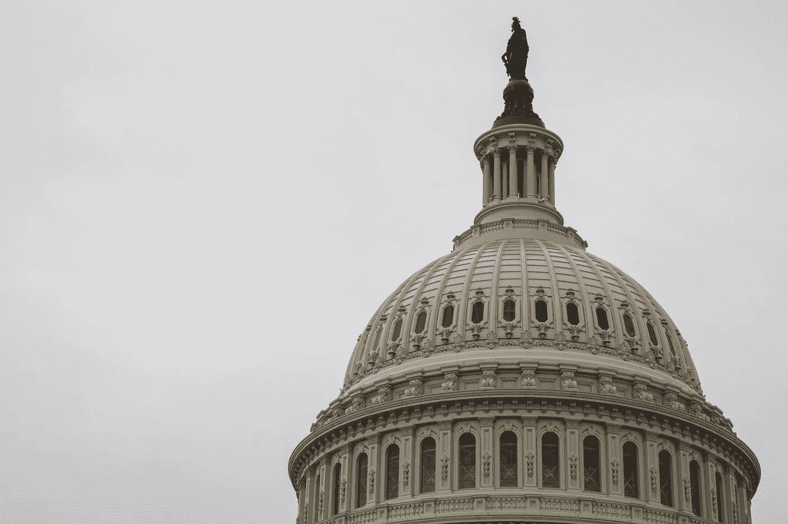

# 打开我们的互联网

> 原文：<https://medium.com/geekculture/uncapping-our-internet-948495014cf5?source=collection_archive---------16----------------------->

Sergey Zolkin

好了，关于英国的[谈得够多了](/geekculture/hand-in-the-cookie-jar-7c16350f9c6d)，让我们回到我们的海岸，今天，讨论一下美国互联网用户的一个激动人心的机会。2022 年 7 月，科里·布克和本·雷·卢汉推出了“[《美国反腐败公约》](https://www.lujan.senate.gov/wp-content/uploads/2022/07/MIR22654.pdf)”。如果该法案通过，它将有助于规范互联网提供商的数据上限，并至少消除一部分高速互联网接入带来的额外费用。让我们仔细看看。

# 行得通吗？

Joshua Sukoff

现在，该法案的新闻稿称，其目标是“停止这些昂贵的数据上限，并在我们不断增长的数字经济中增加竞争和创新。这项立法还授权 FCC 保护美国人对数据的访问，同时激励对我们国家宽带基础设施的额外投资。"

这一切都很好，无论你怎么看，消除数据上限，让所有美国人都能使用宽带互联网都是一个积极的结果。在我们这个永远在线的社会里，确保你不必为了玩游戏、看电视节目甚至工作而每月支付额外的钱是必要的。然而，尽管该法案本身是好的，但它遇到了一个大多数好倡议都会遇到的问题:企业并不愚蠢。

该法案建议取消纯粹为了赚钱而存在的不合理的数据上限，同时在“网络管理”需要的情况下允许上限。事实上，它还规定，联邦通信委员会(FCC)应“定义数据上限被认为是为合理的网络管理或管理网络拥塞而定制的条件”。可悲的是，游说和聪明的企业言论的结合很容易将我们带到一个禁止“掠夺性数据上限”的世界，但每个人的互联网仍然受到限制，因为康卡斯特最终总是出现网络拥塞。确保“网络管理”这个限定词不被滥用将需要 FCC 成员之间的大量谈判，以及阻止任何可能的游说的敏锐目光，以及对寻求智取法律的公司的相当持续的抵制。

另一个要点是布克和卢汉投资宽带基础设施的想法。再说一次，这听起来很棒，更多的钱把互联网带到每个农村地区是一件好事，对吗？除了简单地搜索“Comcast”和“宽带融资”这两个词会得到一连串的结果，在那里你可以看到我们的互联网服务提供商是如何一次又一次地获得融资，让所有美国人都连接起来的。将更多的钱投入到一个看似明显的管理不善的问题上，可能并不是我们所寻求的神奇解决方案。问责制将是一个更好的选择，对给予互联网服务提供商的资助实施严格的期限和支出跟踪。

# 那么…很糟糕吗？

不要误解我，该法案本身是一个很好的想法。如果我们想真正成为一个现代国家，消除数据上限和让每个家庭都拥有宽带是必要的。虽然欧盟也有自己的[地区存在问题](https://www.europeandatajournalism.eu/eng/News/Data-news/Europe-s-internet-speeds-are-faster-than-ever-but-not-for-everyone)，但看看芬兰或波兰无上限网速的数据会让你晕头转向。支持像这样的倡议很重要，即使它们并不完美，因为这些小步骤为我们所有人建设一个更美好的国家铺平了道路。事实上，支持实施这些计划的立法者是绝对重要的。请确保您当地的代表携带此类账单。