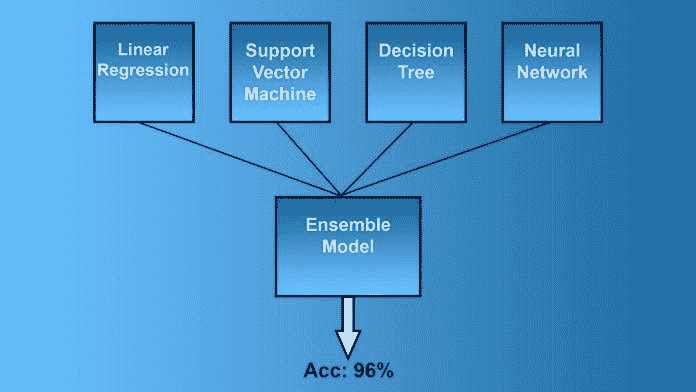

# 低估机器学习概念来提高模型性能

> 原文：<https://medium.com/geekculture/underrated-machine-learning-concepts-to-improve-your-model-performance-e30a01dc67f8?source=collection_archive---------8----------------------->

## 如果你正在进入人工智能领域，把这些加入到你的技能中

感谢互联网和开源社区，现在是开始构建利用人工智能和数据为各种组织创造有价值的见解的产品的最佳时机。在这篇文章中，我将分享一些惊人的技术，这些技术将使您的机器学习解决方案变得更好。这些技术已经在项目中取得了很多成功，但太多的 ML 从业者超越了这些，直接跳到昂贵的深度学习方法。这些技术将降低你的管道培训成本，帮助你建立更强大的机器学习模型，并让你的妈妈为你实现了没有得到应有尊重的技术而感到自豪。

How the internet feels these days

# 稀少

首先，我想向大家介绍稀疏性。对于训练神经网络来说，这是一个改变游戏规则的想法。传统的训练神经网络的方法到目前为止工作得非常好，但是它有一个巨大的缺陷- **增加更多的参数会成倍地增加训练成本。**这是一个遗憾，因为添加更多的参数也确实提高了您的模型的能力(看看最近出现的大型模型)。那么我们能做些什么呢？使用分块/不同批量大小([这可能非常有效](/geekculture/how-does-batch-size-impact-your-model-learning-2dd34d9fb1fa))/并行化等技术可以使它更快，但你不会真正解决底层成本。

Our minds also use Sparse Activation. You’re not using all your neurons to read this. Photo by [Robina Weermeijer](https://unsplash.com/@averey?utm_source=medium&utm_medium=referral) on [Unsplash](https://unsplash.com?utm_source=medium&utm_medium=referral)

这就是稀疏对你有很大帮助的地方。稀疏性涉及对某些输入只使用神经网络的某些部分。我们可以训练一个巨大的神经网络来处理多种任务，**，但在推理时，只有一小部分神经网络会被使用**。这使得你的运行成本比其他方式低得多。Google 在其开创性的 Pathways 架构中大量实现了稀疏性，他们用它来创建所有的 LLM(并到达 AGI)。

> *例如，* ***GShard 和 Switch Transformer 是我们有史以来创建的最大的两个机器学习模型*** *，但是因为两者都使用稀疏激活，所以它们* [***消耗的能量不到你所期望的类似大小的密集模型***](https://blog.google/technology/ai/minimizing-carbon-footprint/) *的 1/10——*，同时与密集模型*一样精确。*
> 
> [在这里阅读更多内容](/geekculture/google-ai-sparks-a-revolution-in-machine-learning-403f4dbf3e70)

稀疏性可以通过多种方式实现。下面是我在 [SWAT 上做的视频——稀疏重量激活训练](/geekculture/sparse-weight-activation-training-reduce-memory-and-training-time-in-machine-learning-8c0fad7d5def)。这是我最喜欢的方式。该算法能够**将训练成本降低 8 倍**，同时保持性能基本不变。要了解更多信息，请观看下面的视频。

随着机器学习继续朝着实现大型模型作为基础的方向发展，稀疏性是一种将帮助您降低成本的技术。掌握这一点会让你更上一层楼。

I have a lot more amazing content. All my links are the end of the article.

# 主动学习

另一个被大多数从业者忽视的惊人技术。虽然稀疏性给了你高效的模型，[主动学习](https://youtu.be/MGZFCC2pRQk)帮助你减少数据集的大小(以及你必须重新训练你的模型的次数)。

简而言之，主动学习包括只用有用的样本训练你的模型。任何熟悉深度学习的人都可以立即看出为什么这是一个巨大的优势。当用大多数大数据集进行训练时，会有大量的冗余样本。这些冗余样本增加了训练成本，但对模型性能没有任何贡献。Meta AI 最近发布了一篇精彩的论文，详细介绍了一种可能的主动学习方法，该方法实现了一种强大的自我监督协议，以智能地选择样本。他们的方法是明智的、直观的、成本有效的(我知道这令人震惊)。要了解更多信息，请阅读下面的文章。

 [## Meta 是关于大数据和深度学习的惊人见解

### 没有人，绝对没有活着的人能预测到这一点

medium.com](/geekculture/meta-ais-shocking-insight-about-big-data-and-deep-learning-857f9f2b9ac5) 

主动学习还可以用于检测数据漂移，并确定何时需要进行模型再训练。如果您的系统开始对输入的样本有很多不确定性，这意味着数据分布已经以某种方式发生了变化。再培训可能是合适的。

对于那些正在寻找实施主动学习方法的人，请继续阅读。下一个想法是我广泛使用的，非常适合主动学习(和几乎所有其他事情)。

# 合奏

集成学习是基础中的基础。人们学到的第一件事。不幸的是，人们在前进的过程中忘记了合奏。我曾与许多 ML 团队合作提高绩效。他们中有相当多的人从未使用过合奏。为了寻找“最佳模型”，他们避免使用许多好的模型。当他们这样做时，他们几乎总是受益。

[Image Source](https://bdtechtalks.com/2020/11/12/what-is-ensemble-learning/)- While this approach might seem simplistic, this works. [There is a reason why Tree Based models beat Deep Learning (and why Random Forests will always be my GOAT)](/geekculture/why-tree-based-models-beat-deep-learning-on-tabular-data-fcad692b1456).

为什么合奏如此神奇？简而言之，他们能够探索更多“不同的视角”(更大的搜索空间)。不同的模型有不同的偏向和不同的优势。将它们结合起来可以让你掩盖它们的弱点。这一点在下面的论文中有经验证明。

 [## 为什么深度学习集成优于贝叶斯神经网络

### 他们不做同样的事情吗？？

medium.com](/swlh/why-deep-learning-ensembles-outperform-bayesian-neural-networks-dba2cd34da24) 

现在，还记得我答应过你的主动学习系统吗？在这里。对于我们的网络，我们使用多样化的学习者组合。如果所有学习者做出的预测相差很大，那么你就知道你的整体模型对这个模型没有信心，你应该看看这个特殊的样本。这个样本将是“信息性的”。如果你的网络没有偏离它的预测，那么你知道这个样本对于添加到你的语料库来说不是非常有用。概率模型也适用于这种方法。

这个系统是我的自旋标签色散。我发现它对分类和回归问题都非常有效(而且不仅仅在计算机视觉领域有效)。测试一下。我相信你也会有很大的收获。

Label Dispersion is a better way to quantify network uncertainty. [Read more here](/mlearning-ai/evaluating-label-dispersion-is-it-the-best-metric-for-evaluating-model-uncertainty-e4a2b52c7fa1)

成本呢？使用更多的模型不会增加你的培训成本吗？

你这么想我真为你骄傲。你在正确的道路上，我的朋友。虽然添加更多的模型确实会增加成本，但是多添加一个模型只会线性增加您的运行时间。**然而，向你的模型添加更多的参数会成倍地增加你的运行时间(你的算法需要回溯更多的组合)**。小型学习者的多样化组合实际上比大型网络更便宜，同时也更健壮，性能更好，推广性更好。

如果你想进入 ML，t [他的文章给了你一个逐步发展机器学习能力的计划](/geekculture/how-to-learn-machine-learning-in-2022-9ef2ea904986)。它使用免费资源。为了获得最佳效果，请将这篇文章与我的时事通讯《技术变得简单》相结合。更多信息如下。

对于机器学习来说，软件工程、数学和计算机科学的基础至关重要。它将帮助你概念化，建立和优化你的 ML。我的每日时事通讯， [Technology Made Simple](https://codinginterviewsmadesimple.substack.com/) 涵盖了算法设计、数学、技术领域的最新事件、软件工程等主题，让你成为更好的开发人员。 [**我目前正在进行一整年的八折优惠，一定要去看看。**](https://codinginterviewsmadesimple.substack.com/subscribe?coupon=1e0532f2)

我创造了[技术，利用通过指导多人进入顶级科技公司而发现的新技术使](https://codinginterviewsmadesimple.substack.com/p/faqs-and-about-this-newsletter?r=4tnbw&s=w&utm_campaign=post&utm_medium=web)变得简单。时事通讯旨在帮助你成功，避免你在 Leetcode 上浪费时间。我有一个 100%满意的政策，所以你可以尝试一下，没有任何风险。[你可以在这里阅读常见问题并了解更多信息](https://codinginterviewsmadesimple.substack.com/p/faqs-and-about-this-newsletter?r=4tnbw&s=w&utm_campaign=post&utm_medium=web)

如果你也有任何有趣的工作/项目/想法给我，请随时联系我。总是很乐意听你说完。

# 向我伸出手

使用下面的链接查看我的其他内容，了解更多关于辅导的信息，或者只是打个招呼。另外，查看免费的罗宾汉推荐链接。我们都得到一个免费的股票(你不用放任何钱)，对你没有任何风险。**所以不使用它只是失去免费的钱。**

为了帮助我了解您[填写这份调查(匿名)](https://forms.gle/7MfQmKhEhyBTMDUD7)

查看我在 Medium 上的其他文章。:[https://rb.gy/zn1aiu](https://rb.gy/oaojch)

我的 YouTube:[https://rb.gy/88iwdd](https://rb.gy/88iwdd)

在 LinkedIn 上联系我。我们来连线:[https://rb.gy/m5ok2y](https://rb.gy/f7ltuj)

我的 insta gram:[https://rb.gy/gmvuy9](https://rb.gy/gmvuy9)

我的推特:[https://twitter.com/Machine01776819](https://twitter.com/Machine01776819)

如果你想在科技领域发展事业:[https://codinginterviewsmadesimple.substack.com/](https://codinginterviewsmadesimple.substack.com/)

获得罗宾汉的免费股票:[https://join.robinhood.com/fnud75](https://join.robinhood.com/fnud75/)