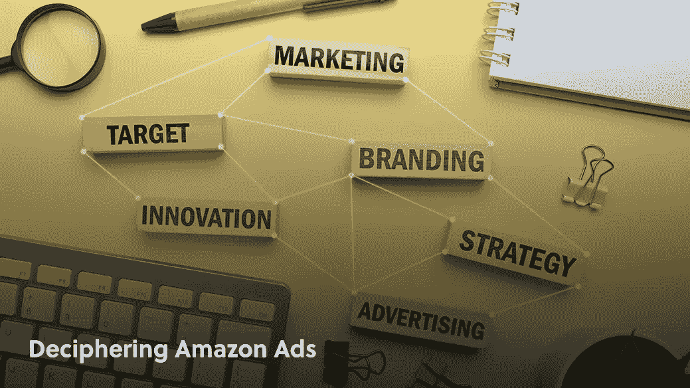
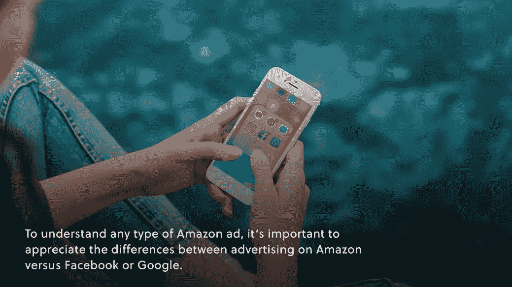
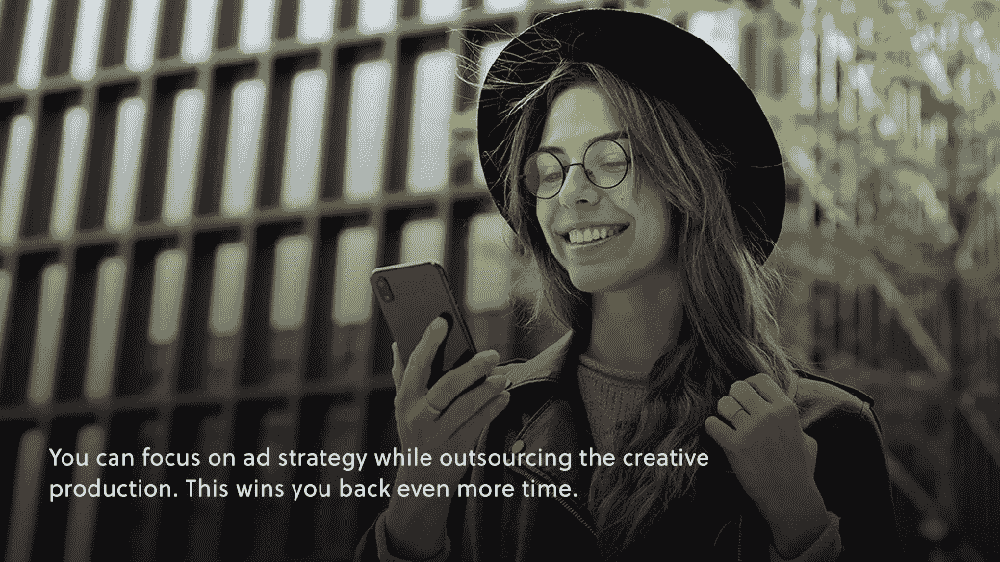

# 解读亚马逊广告

> 原文：<https://medium.com/geekculture/understand-amazon-ads-and-how-to-rock-them-in-2022-86fb00a69191?source=collection_archive---------15----------------------->

## 品牌的电子商务

## 了解亚马逊广告以及如何在 2022 年震撼它们

[Destaney Wishon](https://www.linkedin.com/in/destaney-wishon/) ，首席执行官， [BetterAMS](https://betterams.com/) 的联合创始人，带着咖啡参加了*电子商务展？！*来说说亚马逊的广告。听听这个采访，你会听到德斯坦尼对亚马逊上的新内容以及品牌如何为成功设置广告发表了一个说教式的观点。

**采访从快速回顾德斯塔尼如何创建亚马逊广告业务开始。亚马逊广告是在 2012 年推出的，这几乎不是很久以前的事了。那么，像德斯塔尼这样的人是如何发现自己开了一家亚马逊广告公司的呢？**

首先，德斯塔尼来自阿肯色州的罗杰斯，这里被称为沃尔玛的故乡。“我总是被小贩包围，”她描述道。罗杰斯的商业环境是独一无二的，德斯塔尼经常遇到不同寻常的人，并了解到同样不同寻常的机会。完整的故事请听播客。

如今，Destaney 在 BetterAMS 工作了四年，对亚马逊广告有了深入的了解，她的见解包括技术技巧以及对行业的更大了解，以及它是如何变化的(以及它如何再次变化)。她说，转变来得很快，就像本期*电子商务与咖啡的播客？！这有助于品牌保持领先地位。*

请继续阅读，看看德斯塔尼是怎么说的！

# 了解亚马逊广告

要理解任何类型的亚马逊广告，重要的是要理解亚马逊广告与脸书或谷歌广告的区别。

德斯塔尼说:“如果你没有一个转化清单(针对你的亚马逊广告)，你的广告就不会起作用。”

这似乎是不言而喻的，但与脸书和谷歌的广告相比，亚马逊的广告指向挤压页面(目的是在内容营销漏斗中启动某人)，而是针对热情的买家，意图达成交易。

如今，赞助广告是亚马逊广告的另一个兴趣点，Destaney 概述了品牌如何轻松开始使用这些有利于搜索引擎优化的列表助推器:

1.  把你想要排名的第一关键词输入亚马逊。
2.  看到第一个列表了吗？那是赞助广告。
3.  准备好你的产品列表和广告策略，因为你也可以竞标那个地方。

Destaney 还排除了最近向亚马逊视频广告的转移。“视频广告最好的一点是它们是付费的，”她指出。这意味着只有当用户点击广告时，你才需要付费。即使用户全程观看视频，但没有点击进入，也不会产生费用。

**是的，你没看错。那是免费的品牌推广！**

当然，亚马逊希望人们点击这些视频，这样他们就可以向你收费。这对你有利，因为亚马逊使用其所有用户数据，向那些点击(并希望购买你的产品)的人展示你的视频。

德斯坦尼解释说，亚马逊广告中使用的视频是针对特定产品的。更基本的视频往往比那些长的或过度制作的视频效果更好。请收听完整的一集，了解 Destaney 的成功视频示例以及如何掌控这个广告群的更多技巧。

# 2022 年亚马逊广告中的品牌挑战

Destaney 还在采访中谈到了品牌在 2022 年面临的独特挑战。亚马逊“广告世界”是一个竞争日益激烈的空间，无论是小品牌还是大品牌都在遭受损失:

*   小品牌正在努力跟上不断上涨的广告成本
*   大品牌依赖品牌认知度的时间太长了，现在较小的竞争正将它们挤出广告空间

还有一个永恒的带宽问题——也就是说，电子商务品牌和制造商有多少时间在这些波涛汹涌的水域中航行。“我看到一个品牌什么都做，但没有一件事做得特别好，”德斯坦尼哀叹道。每个领导者身兼数职，这是品牌快速扩张的现实。

德斯塔尼说，结果是，亚马逊广告是那些没有得到充分利用的机会之一，因为即使是做广告的品牌也没有时间做得更好。

每天都有更多的品牌战略被认为是在亚马逊上取胜的“一把钥匙”。“必须做”的策略越多，越多的品牌会争先恐后地去做，但最终却什么都不会。

例如，也许你已经关注了[重新定价](https://www.amberengine.com/blog-content/increase-your-margins-with-repricing?utm_source=blog&utm_medium=referral&utm_campaign=medium-blogs)，或者[回顾策略](https://www.amberengine.com/blog-content/customer-review-channels?utm_source=blog&utm_medium=referral&utm_campaign=medium-blogs)，或者新的 [AR-rich 产品体验](https://www.amberengine.com/blog-content/top-5-examples-of-ar-product-experiences?utm_source=blog&utm_medium=referral&utm_campaign=medium-blogs)。这些都是有效的策略，但是你应该一次只咬一个。

今天可能是亚马逊广告策略成为焦点的一天。

你可以在外包创意制作的同时专注于广告策略。这为你赢得了更多的时间。“在亚马逊，70%的广告宣传材料不需要创意控制，”德斯坦尼说。她接着指出，视频内容和其他创意广告宣传材料是品牌可以外包的东西，以便花更多自己的时间更深入地了解战略。

请收听 Destaney 的完整采访，了解更多关于广告成本趋势、亚马逊正在采取的措施以及如何将不同的亚马逊广告类型用于预期目的。

随着广告成本飙升和竞争加剧，深入亚马逊广告可能会令人生畏。然而，如今亚马逊上的用户越来越多——不仅仅是平台上的品牌越来越多。这意味着有一个品牌愿意抓住的成熟机会。

“任何一个人都不可能在这种环境中保持领先，”德斯塔尼建议道。接受她的建议——[看](https://youtu.be/B1UIHW2YQ0k)还是[听](https://anchor.fm/ecommercewithcoffee/episodes/28---Deciphering-Amazon-Ads-with-Destaney-Wishon--CEO-and-co-founder-of-BetterAMS-e1iar5m)本期*咖啡电商完整访谈？！并且依靠她来为你跟上广告世界的变化。*