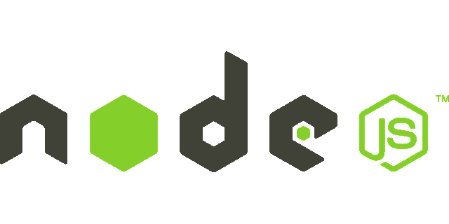
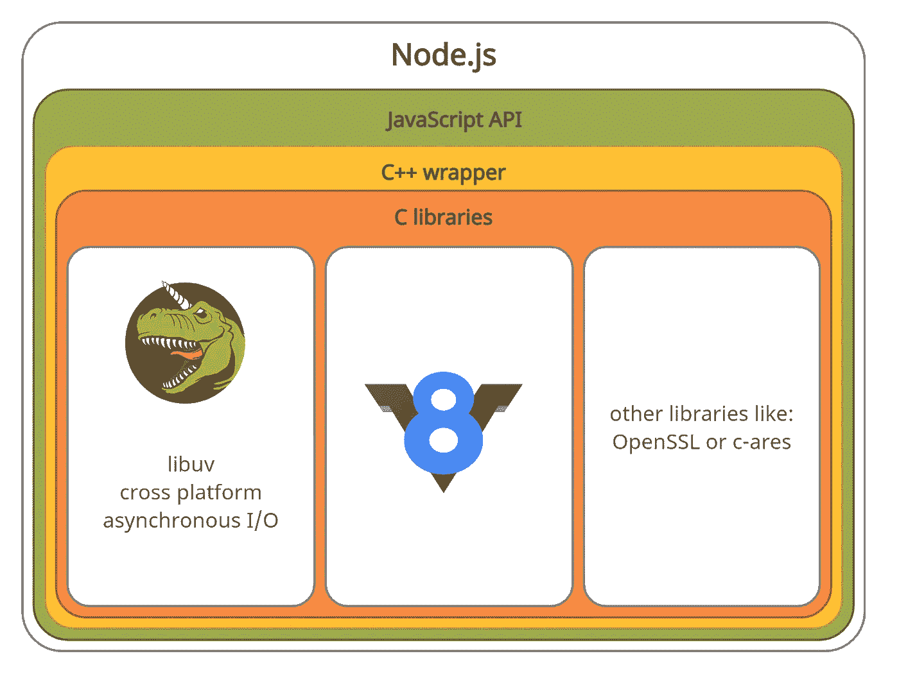
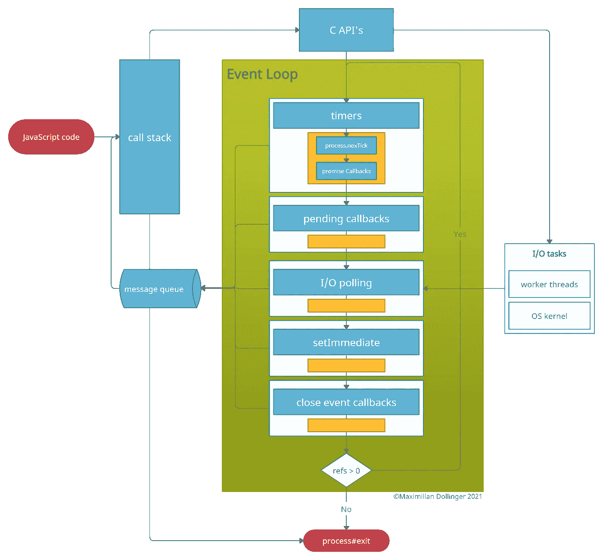

# 了解 Node.js 事件循环

> 原文：<https://medium.com/geekculture/understand-the-node-js-event-loop-22f74906b77f?source=collection_archive---------9----------------------->

在本文中，我们将探索“异步”、“事件驱动”和“非阻塞 I/O”这些术语背后的秘密。到最后，你不仅会对事件循环有很好的理解，还会知道为什么 Node.js 不是单线程的。一个好的副作用是最终理解了 proccess.nextTick()和 setImmediate()。

为了理解事件循环，我们首先需要对 Node.js 有一个基本的了解。基本上 Node 所做的是为我们提供一个易于使用的一致的 JavaScript API，用于所有复杂的东西，如网络、文件操作、流等。Node 通过包装层将我们的 JavaScript 代码连接到 C 库来实现这一点。两个最重要的部分是运行 JavaScript 代码的 v8 JavaScript 引擎和提供大部分处理 I/O 功能的 libuv。现在我们已经基本了解了*和*提供的所有功能，让我们看看*如何实现*这种神秘的异步非阻塞行为。

layers of Node.js

对此，我们主要要感谢 libuv 及其事件驱动的异步 I/O 模型。为此，它使用了事件循环。那么什么是事件循环。这是一个监听事件的循环！爆炸事件-循环解释。但是不行，让我们看看下面的图表，一步一步地来。

Node.js event-loop diagram

这一切都从您的 JavaScript 代码开始。每个被调用的函数都被推到调用堆栈上。调用栈是 v8 引擎的一部分，代码在那里执行。那是单线程部分，一次只能处理一个东西。但是如果调用栈顶的函数是异步的，C++包装器就会施展魔法，调用底层的 C 代码。异步函数从调用堆栈中移除，并在事件循环中注册(引用)。取决于你调用的函数是在一个工作线程中执行(默认有 4 个)还是由操作系统处理。libuv 将根据操作系统使用现有的最佳机制。现在有了被引用的东西，事件循环开始运行。它使用一种模式来检查某件事情是否已经到期或发生，然后将回调添加到消息队列中。检查完当前任务后，所有用 process.nextTick()注册的回调都被添加到消息队列中，然后对所有实现的承诺也是如此。添加到消息队列中的所有回调在循环中都不会被引用。如果调用堆栈为空，则回调从消息队列被推送到调用堆栈。在那里他们最终被处决。这种模式在循环的每次迭代中都要重复几次。让我们看看不同的“检查点”是什么。

*   检查定时器是否到期:setTimeout()和 setIntervall()。如果是，将回调添加到消息队列中。
*   接下来是待定的回调。大多数 I/O 回调在 I/O 轮询后立即执行，但是如果一个回调被安排在下一次迭代中执行，它将从这里被添加到消息队列中。
*   然后是 I/O 轮询。在这个阶段，libuv 检查注册的 I/O 操作是否发生了什么。例如，是否有新的连接或者是否有来自文件读取或写入的新数据。如果有“新”的东西，同样的事情也会发生。回调 get 被添加到消息队列中。
*   现在，用 setImmediate()注册的所有回调都将被添加到消息队列中。
*   最后，处理所有“关闭”事件回调

请记住，process.nextTick()的回调和履行的承诺会在每个“检查点”之后添加到消息队列中。现在，一次迭代结束了。在这里，事件循环检查是否还有一些回调被引用(ref > 0 ),如果有，下一轮开始，如果没有，循环停止，如果调用栈也是空的，你的程序将通过“exit”事件退出。

关于这一切，你需要记住什么？

*   **节点是非阻塞的，因为主线程不处理耗时的 I/O 操作**
*   **节点是异步的，因为有些代码(回调)不是直接执行，而是只在“事件”发生时才执行。实现这一点的机制是事件循环**
*   事件循环有不同的“检查点”,回调的执行是有顺序的
*   **不是所有的异步都是由工作线程处理的，libuv 比它更聪明**

我知道你应该对事件循环是如何工作的以及为什么 Node.js 不是真正的单线程有一个基本的了解。当然，这比本文中解释的要复杂一些，而且总是有更多的东西需要学习和发现。好的资源是:

*   [libuv 文档](http://docs.libuv.org/en/v1.x/)
*   [关于 Node.js 事件循环你需要知道的一切— Bert Belder](https://youtu.be/PNa9OMajw9w)
*   [由内向外的节点事件循环—萨姆·罗伯茨](https://youtu.be/P9csgxBgaZ8)

请注意，文章中使用的术语可能不总是正确的，但我尽量保持简单。