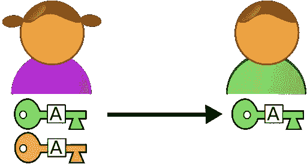

# 4 分钟了解 RSA 密码系统

> 原文：<https://medium.com/geekculture/understand-the-rsa-cryptosystem-in-4-minutes-834b1b649e82?source=collection_archive---------6----------------------->

加密和解密消息。

Picture by Tomasz “odder” Kozlowski on [Wikimedia](https://commons.wikimedia.org/wiki/File:Asymmetric_cryptography_-_step_1.svg?uselang=fr)

1978 年，罗恩·里维斯特、阿迪·萨莫尔和伦纳德·阿德曼创造了 RSA 加密算法来取代 NBS 算法。今天，RSA 经常被用来保护网络。

现代计算机采用 RSA (Rivest-Shamir-Adleman)方法对通信进行加密和解码。这种加密算法是不对称的。不对称意味着…