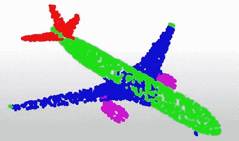

# PointNet:第一个直接处理 3D 点云的神经网络

> 原文：<https://medium.com/geekculture/understanding-3d-deep-learning-with-pointnet-fe5e95db4d2d?source=collection_archive---------1----------------------->

## 借助 PointNet 快速了解 3D 深度学习

3D Point Cloud of an Airplane — Image by author

PointNet 是斯坦福大学研究人员在 2016 年提出的深度学习网络架构，是第一个直接处理 3D 点云的神经网络。

在本文中，我解释了在用…重新实现 PointNet 之后，它是如何工作的