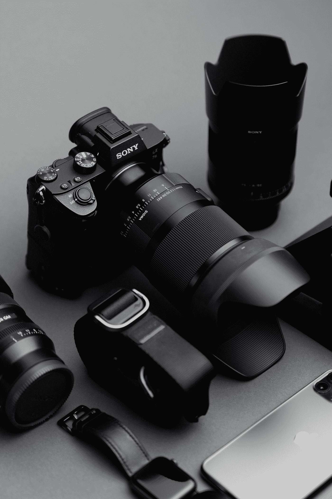
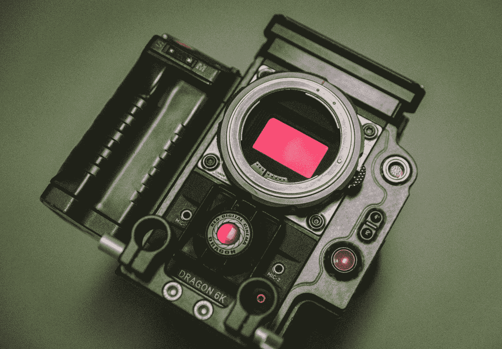
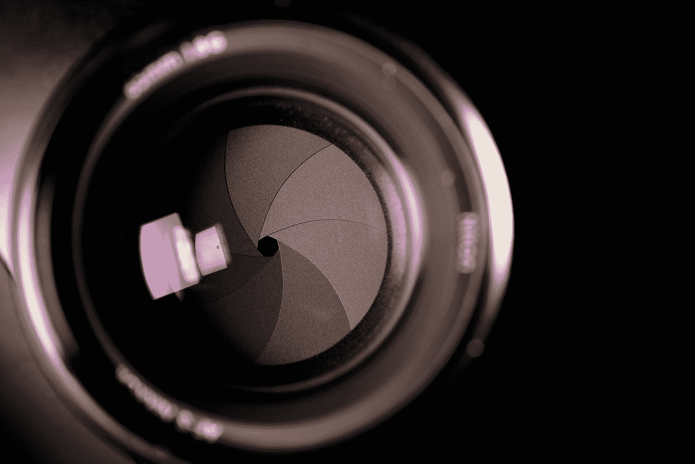
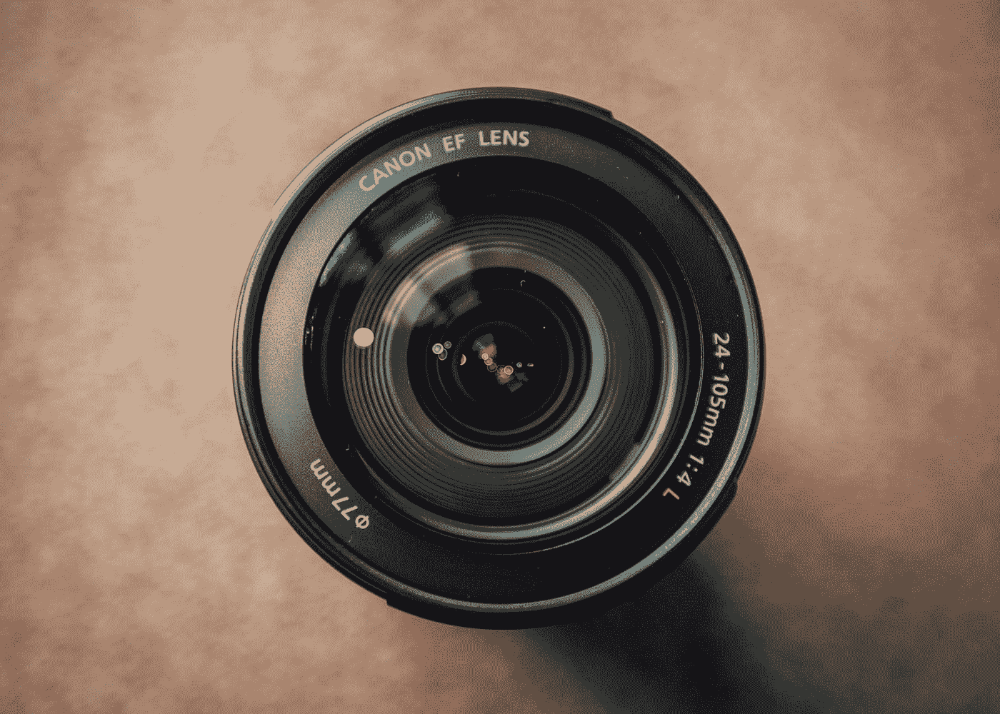
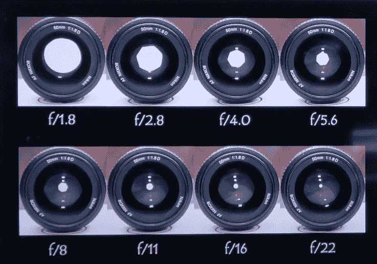
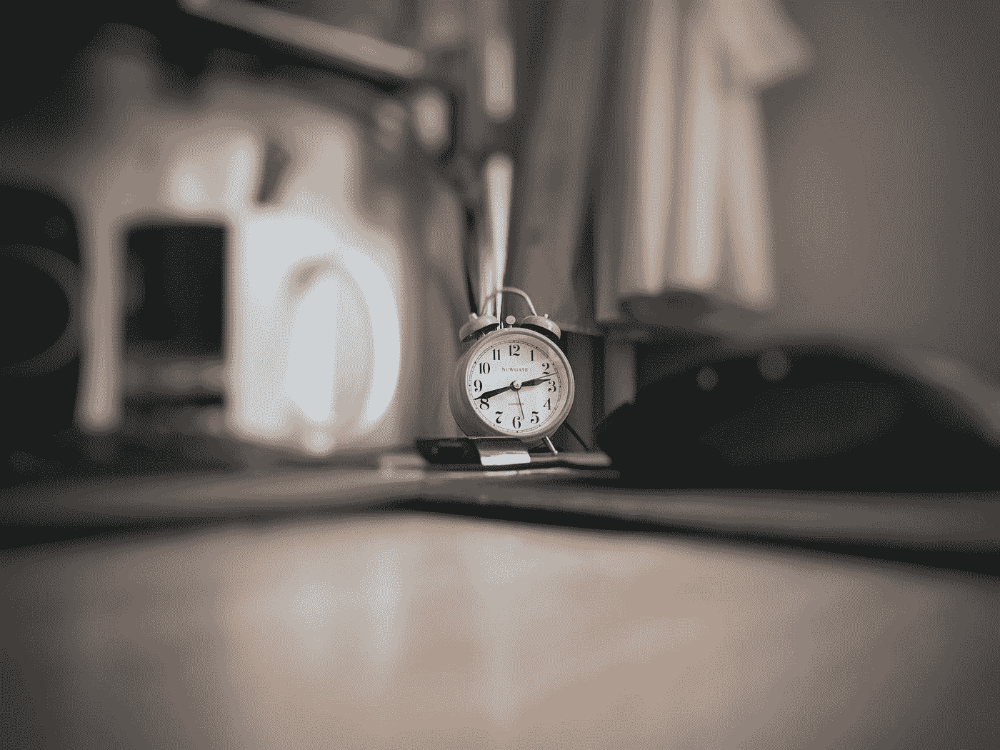
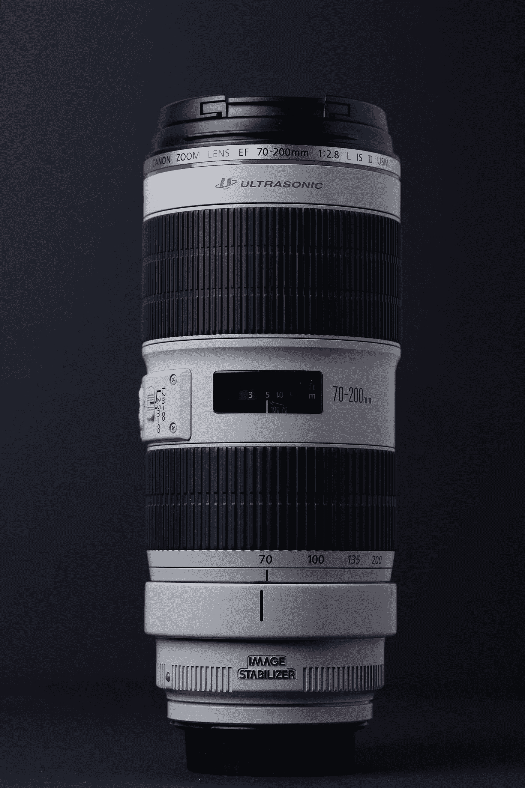

# 了解现代数码相机

> 原文：<https://medium.com/geekculture/understanding-a-modern-digital-camera-89ca2ee3e2da?source=collection_archive---------13----------------------->

计算机视觉工程师的视角

Photo by [Damir Babacic](https://unsplash.com/@onemorephoto?utm_source=medium&utm_medium=referral) on [Unsplash](https://unsplash.com?utm_source=medium&utm_medium=referral)

相机捕捉图像，ez。pz。故事结束了，对吗？对吗？不要！相机测量光线，捕捉构成图像的光子的数量和方向，这是成为一名更好的计算机视觉工程师必须学习的很多东西。

该相机还将 3D 场景转换为 2D 图像，因此它减少了实际的维度(深度丢失！)

为了深入了解相机的工作原理，了解相机的不同元件和组件非常重要。

# 数码相机的要素

数码相机由各种部件组成，如图 1 所示

Figure 1: Overview of a digital camera (Figure by Author)

# 传感器

Photo by [Jakob Owens](https://unsplash.com/@jakobowens1?utm_source=medium&utm_medium=referral) on [Unsplash](https://unsplash.com?utm_source=medium&utm_medium=referral)

相机传感器是一个光敏单元阵列，它将入射光转换为强度值。
更大的传感器可以在每个时间间隔收集更多的光，从而提供更高质量的图像。

因此，传感器测量入射光并将其转换为强度值，但颜色呢？
要获得颜色，有两种常用的方法

1.  **三芯片设计**
    使用单独的滤光器过滤掉红色、绿色和蓝色的光，这些光依次由 3 个不同的芯片测量。这可以产生非常高质量的图像，但会使相机更大、更贵
2.  **单芯片设计**
    这会导致图像质量下降，但有助于减小相机的尺寸和成本

# 快门

Photo by [Fidel Fernando](https://unsplash.com/@fifernando?utm_source=medium&utm_medium=referral) on [Unsplash](https://unsplash.com?utm_source=medium&utm_medium=referral)

快门基本上是相机传感器上的窗帘。
它控制相机传感器曝光的持续时间。

更长的曝光时间意味着传感器可以捕捉更多的光线，从而产生更亮的图像。
更长的曝光时间也意味着运动物体会导致运动模糊。

有不同类型的快门及其操作方式，最常见的是滚动快门和全局快门。

1.  **滚动快门** 快门在可曝光传感器区域滚动(移动)。
    这导致同一行的像素同时曝光。
    在快速移动物体或相机的情况下，滚动快门会产生失真，因为当传感器的最顶行与最底行相比被快门曝光时，物体的位置可能已经改变。
2.  **全局快门** 

# 孔

Photo by [Ryan Warburton](https://unsplash.com/@rwarburton?utm_source=medium&utm_medium=referral) on [Unsplash](https://unsplash.com?utm_source=medium&utm_medium=referral)

> 为了完全理解镜头和光圈的用途，必须知道图像是如何在相机中形成的。
> 你可以通过[这个博客](https://vipin-sharma.medium.com/camera-image-formation-3d5929afa4e7)了解相机成像。

孔径是“针孔大小”。换句话说，孔径定义了屏障(在传感器前面)中的开口的大小，其控制了传递到传感器的光量。

Figure 2: Different camera apertures ([Source](https://www.ipb.uni-bonn.de/html/teaching/photo12-2021/2021-pho1-02-camera.pptx.pdf))

光圈决定了透镜暴露在光线下的部分。
如果镜头的很大一部分暴露在光线下，那么由于镜头误差，图像的某些部分可能会变得模糊。
如果光圈很小，只有一小部分镜头暴露在光线下，从而减少镜头误差，拍摄出更清晰的图像。

景深是指看起来清晰可接受的距离范围，直接由光圈决定。(例如，在下图中，光圈较大，导致图像中间部分清晰，其余部分模糊)

Photo by [Stanisław Gregor](https://unsplash.com/@staszek998?utm_source=medium&utm_medium=referral) on [Unsplash](https://unsplash.com?utm_source=medium&utm_medium=referral)

# 镜头

Photo by [Ahmad Mohammed](https://unsplash.com/@amed10?utm_source=medium&utm_medium=referral) on [Unsplash](https://unsplash.com?utm_source=medium&utm_medium=referral)

镜头的目标是获得

1.  不失真
2.  锋利的
3.  对比强烈

现代照相机有各种类型的镜头。镜头的选择取决于

1.  视野
2.  到物体的距离
3.  可用光量
4.  价格

# 总结和结论

现在我们知道了相机的各种部件以及它们在成像中的作用。

作为这篇文章的后续，我建议浏览[这篇文章](https://vipin-sharma.medium.com/camera-image-formation-3d5929afa4e7)来了解相机是如何捕捉图像的。

# 参考

1.  Cyrill Stachniss 的摄影测量学课程讲座
2.  [摄影测量学课程讲义](https://www.ipb.uni-bonn.de/html/teaching/photo12-2021/2021-pho1-02-camera.pptx.pdf)