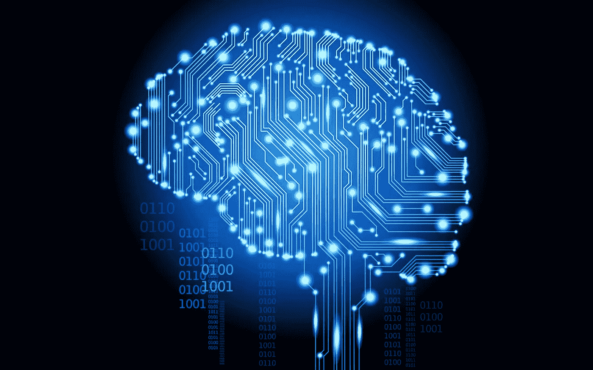
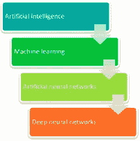
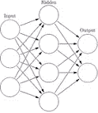
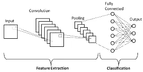
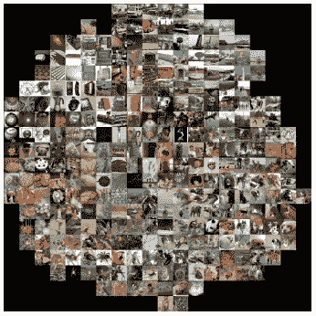
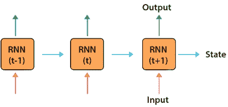
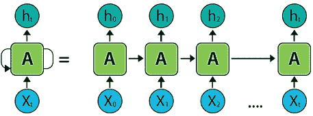

# 理解和分析深度神经网络

> 原文：<https://medium.com/geekculture/understanding-and-analyzing-deep-neural-networks-a2a7ef737511?source=collection_archive---------11----------------------->

Source: WallpaperCave

深度神经网络(DNNs)由于其解决复杂工程问题和提供关键决策的能力，近年来获得了极大的重要性。作为高级机器学习技术的一部分，DNNs 最近已经成为解决各种计算机视觉问题的标准工具。DNNs 中的“深度”是指层数可能非常多(Tzen S. Toh 等人，2019 年)。深度神经网络(DNNs)在图像识别和自然语言处理等广泛应用中的分类任务中取得了巨大的性能(Junghoon Chae *et al，* 2017)。最简单地说，具有某种复杂程度的神经网络，通常至少有两层，可以称为深度神经网络(DNN)，或简称为深度网络。深度网络通过采用复杂的数学建模以复杂的方式处理数据( [Jonathan Johnson](https://www.bmc.com/blogs/author/jonathan-johnson/) ，2020)。毫无疑问，深度神经网络作为一种技术，已经彻底改变了机器学习的学科。深网允许模型的性能增加准确性。它们允许模型接受一组输入并给出一个输出。深度神经网络允许模型自己进行归纳，然后将这些归纳存储在一个隐藏层，即黑盒中。黑匣子很难调查。即使黑盒中的值是已知的，它们也不存在于理解的框架内(John Emmons et al，2019)。

深度学习几乎只是一个非常大的神经网络，恰当地称为深度神经网络。它被称为深度学习，因为深度神经网络有许多隐藏层，比普通神经网络大得多，可以存储和处理更多信息。深度学习和深度神经网络是机器学习的一个子集，它依赖于人工神经网络，而机器学习仅依赖于算法([https://www . wgu . edu/blog/neural-networks-deep-learning-explained 2003 . html](https://www.wgu.edu/blog/neural-networks-deep-learning-explained2003.html))(2020)。

然而，为了真正理解深度神经网络，最好将其视为一种进化。在深网出现之前，必须建造一些物品**(图 1)** 。

**Figure 1 The evolution to Deep Neural Networks (DNN)**

首先，机器学习必须得到发展。ML 是一个自动化(通过算法)统计模型的框架，如线性回归模型，以更好地进行预测。模型是对某些事情做出预测的单一模型。这些预测相当准确。一个学习的模型——机器学习——获取所有坏的预测，并调整模型内部的权重，以创建一个犯更少错误的模型。

创建模型的学习部分催生了人工神经网络的发展。人工神经网络利用隐藏层**(图 2)** 作为存储和评估输入之一对输出的重要性的地方。隐藏层存储关于输入的重要性的信息，并且它还在输入组合的重要性之间建立关联。

**Figure 2 One hidden layer is considered an Artificial Neural Network (ANN)**

深度神经网络，然后，利用人工神经网络组件。如果这在改进模型方面如此有效——因为隐藏层中的每个节点都对输入的重要性进行关联和评级，以确定输出——那么为什么不将越来越多的关联和评级相互叠加，并从隐藏层中获得更多好处呢？

所以，深网有多个隐藏层**(图 3)** 。“深”是指模型的层有多层深。

**Figure 3 Two or more hidden layers comprise a Deep Neural Network**

***提高准确度:黑盒问题***

深网允许模型的性能增加准确性。它们允许模型接受一组输入并给出一个输出。深网的使用就像每一层复制粘贴一行代码那么简单。你用哪个 ML 平台不重要；指导模型在每层中使用两个或 2000 个节点就像键入字符 2 或 2000 一样简单。

但是使用这些深度网络产生了一个问题:这些模型如何做出决策？当使用这些简单的工具时，模型的可解释性会大大降低。

深层网络允许模型自己进行归纳，然后将这些归纳存储在一个隐藏层，即黑盒中。黑匣子很难调查。即使黑盒中的值是已知的，它们也不存在于理解的框架内。

***了解卷积神经网络(CNN):***

CNN 是一类深度神经网络，可以从图像中识别和分类特定特征，并广泛用于分析视觉图像。它们的应用范围包括图像和视频识别、图像分类、医学图像分析、计算机视觉和自然语言处理。

**基础架构:**

CNN 架构有两个主要部分**(图 4)**

*   一个**卷积工具**，用于分离和识别图像的各种特征，以便在称为特征提取的过程中进行分析。
*   一个**全连接层**，它利用卷积过程的输出，并根据先前阶段提取的特征预测图像的类别( [MK Gurucharan](https://www.upgrad.com/blog/author/gurucharan/) ，2020)。

**Figure 4 Layers of CNNs**

# 卷积层

有三种类型的层组成 CNN，它们是卷积层、池层和全连接(FC)层。这些层叠加起来，就形成了 CNN 的架构。除了这三层之外，还有两个更重要的参数，即漏失层和激活函数，其定义如下。

# 1.卷积层

这一层是用于从输入图像中提取各种特征的第一层。在这一层中，在输入图像和特定大小 MxM 的滤波器之间执行卷积的数学运算。通过在输入图像上滑动过滤器，相对于过滤器的尺寸(MxM ),在过滤器和输入图像的部分之间获得点积。

输出被称为特征图，它给我们提供了关于图像的信息，例如角和边缘。稍后，该特征图被馈送到其他层，以学习输入图像的几个其他特征。

# 2.汇集层

在大多数情况下，卷积层之后是池层。该层的主要目的是减小卷积特征图的大小，以降低计算成本。这是通过减少图层之间的连接来执行的，并且在每个要素图上独立操作。根据使用的方法，有几种类型的池操作。

在最大池中，最大的元素取自特征映射。平均池计算预定义大小的图像部分中元素的平均值。预定义区段中元素的总和在总和池中计算。池层通常充当卷积层和 FC 层之间的桥梁。

# 3.全连接层

全连接(FC)层由权重和偏差以及神经元组成，用于连接两个不同层之间的神经元。这些层通常位于输出层之前，构成 CNN 架构的最后几层。

在这种情况下，来自先前层的输入图像被展平并馈送到 FC 层。然后，展平后的矢量会经历更多的 FC 层，在这里通常会进行数学函数运算。在这个阶段，分类过程开始发生。

可视化 FC 层的方法之一是通过降维。这里的目标是尽可能保持低维空间中高维数据的结构完整。主成分分析是降维技术之一。它将特征向量的维数降低到二维或三维。当高维数据过于接近使用线性投影的低维数据时，将数据点可视化变得更加困难。为了使主成分分析有效，非线性方法在高维数据的情况下效果最好。为了解决这个问题，另一种称为 t 分布随机邻居嵌入(t-SNE)的降维技术用于可视化高维数据。它的工作原理是通过小的成对距离模拟相似的数据点，反之亦然。因此，它在跟踪全局结构的同时捕获局部数据结构。

**Figure 5 t-SNE visualization of the FC layer features of a pre-trained ImageNet classifier.**

在将 t-SNE 应用于从训练好的网络的最后一层获得的图像的特征向量之后，高维特征向量被压缩成二维的，即数据集中的每个图像被显示在其相应的位置**(图 5)。**

***理解递归神经网络(* RNNs):**

rnn 被认为是一种非常成功的神经网络模型，尤其是在文本、视频和语音等序列数据的应用中(Atefeh Shahroudnejad，2021)。它们是一类有助于对序列数据建模的神经网络。源自前馈网络的 rnn 表现出与人类大脑功能相似的行为。简单来说，递归神经网络在序列数据中产生其他算法无法产生的预测结果。常见的 RNN 体系结构包括范尼拉恩、长短期记忆(LSTM)和门控循环单元(GRU)。

***递归神经网络的工作方式*RNNs:**

人工递归神经网络(RNNs)广泛用于解决涉及时间数据的任务，例如语音和手写识别、音频分类或时间序列预测。rnn 的特点是在隐藏层中存在反馈连接，这允许生成状态空间表示，使网络具有短期记忆能力。rnn 是动态系统的通用近似器，这意味着，给定隐藏层中足够多的神经元，就有可能微调权重以实现任何期望的精度水平。然而，由于消失/爆炸梯度问题，通过时间反向传播进行训练是困难的(Zachary C. Lipton 等人，2015)。这导致了用于训练 rnn 的新的和更快的技术的发展，包括称为储层计算的不同范例。回声状态网络(ESN)构成了储层计算的一个重要示例，其中循环层(称为储层)由大量神经元组成，这些神经元具有随机初始化的连接，这些连接没有通过基于梯度的优化机制进行微调。ESNs 背后的主要思想是利用具有输出层的储层产生的丰富动态，输出层是为解决特定任务而优化的读数(Dishashree Gupta，2017)。

**为什么是 RNNs？**

传统的神经网络缺乏根据过去的输入来处理未来输入的能力。例如，传统的神经网络不能根据前面的序列预测序列中的下一个单词。然而，递归神经网络(RNN)绝对可以。递归神经网络，顾名思义就是递归。因此，它们在循环中执行，允许信息持续存在。

在上图中，神经网络接受输入“Xt”并给出输出“ht”。因此，信息从一个步骤传递到下一个步骤。当展开时，这个递归神经网络可以被认为是将信息传递到下一个状态的同一网络的副本。

**DNS 行为分析:**

DNN 解释的主要目的是分析它的行为，理解它的整体和内部行为。功能分析试图通过检查输入和输出之间的关系来解释整体行为，而决策分析通过探测内部组件来提供内部行为的信息。

**功能分析**将整个神经网络解释为一个不开放的黑盒，并试图找到与输入图像的特定决策最相关的像素。换句话说，通过发现输入和它们相应的输出之间的关系来解释网络的操作。一种方法是应用敏感性分析，我们检查每个特征对模型预测的影响。为了计算特征敏感度，我们改变输入图像并观察结果的相应变化。另一种方法，名为局部可解释模型不可知解释(LIME ),顾名思义，基于所有模型都是局部线性的假设。即，它用局部的、可解释的模型来近似任何黑盒 ML 模型，以解释每一个单独的预测。最近提出的功能分析方法之一是对比解释法(CEM)。它的工作原理是在输入中找到足以产生相同预测的最小特征，同时找到输入中应该不存在的最小特征，以防止最终预测发生变化。

**决策分析**分析神经网络的内部组件，以扩展学习决策的透明度，克服功能方法的缺点，例如无法显示哪些神经元在决策中发挥更重要的作用。

**结论:** DNNs 是基于人脑的强大算法。神经网络中的每个节点(神经元)只能执行简单的计算，但 DNNs 的工作方式是将节点连接起来，形成若干层，其中每一层都根据前一层的输出执行一次计算。通过这种方式，DNN 可以执行比单个节点复杂得多的任务。在某些情况下，DNNs 优于其他 ML 算法，因为它们能够在大量非结构化数据中发现模式。由于节点和层数意味着需要学习大量参数，dnn 通常需要大量数据来实现最佳性能。一种称为深度递归神经网络(RNN)的 DNN 由输入层、对应于输入数据的每个特征的多个隐藏层和输出层组成。rnn 对于数据序列的建模(例如，设计化学化合物)特别有用，因为反馈回路允许网络有效地保留它之前看到的输入的记忆。受视觉皮层的启发，卷积神经网络(CNN)允许更有效地处理给定输入(例如，原始图像)的复杂性；这是通过将它们转换成更简单的形式来实现的，而不会丢失预测的重要特征。

**参考文献:**

Junghoon Chae，Shang Gao，Arvind Ramanthan，Chad Steed，Georgia D. Tourassi，“深度神经网络中分类的可视化”， ***，美国能源部橡树岭国家实验室*** (2017)。

Grégoire Montavon，Wojciech Samek，Klaus-Robert Müller，《解释和理解深度神经网络的方法》， ***，*** 第 73 卷，2 月，第 1–15 页(2018)。

Jonathan Johnson，7 月 27 日，机器学习与大数据博客，*(2020)。*

*神经网络与深度学习讲解，[*https://www . wgu . edu/blog/neural-networks-deep-learning-explained 2003 . html*](https://www.wgu.edu/blog/neural-networks-deep-learning-explained2003.html)*(2003)。**

**MK Gurucharan，《CNN 基本架构:解释 5 层卷积神经网络》，[【https://www.upgrad.com/blog/basic-cnn-architecture/】](https://www.upgrad.com/blog/basic-cnn-architecture/)*2020 年 12 月 7 日。***

***Atefeh Shahroudnejad，[***arXiv:2102.01792 v1***](https://arxiv.org/pdf/2102.01792.pdf)***【cs。LG]*** 2 Feb，“关于深度神经网络的理解、可视化和解释的调查(2021)。***

**Dishashree Gupta，《深度学习基础——递归神经网络导论》，[*https://www . analyticsvidhya . com/blog/2017/12/Introduction-to-Recurrent-Neural-Networks/*](https://www.analyticsvidhya.com/blog/2017/12/introduction-to-recurrent-neural-networks/)，2017 年 12 月 7 日。**

**Zachary C. Lipton，John Berkowitz，Charles Elkan“用于序列学习的递归神经网络的评论”，[***arXiv:1506.00019 v4[cs .LG】***](https://arxiv.org/pdf/1506.00019.pdf)【2015 年 10 月 17 日。**

**John Emmons、Sadjad Fouladi、Ganesh Ananthanarayanan、Shivaram Venkataraman、Silvio Savarese 和 Keith Winstein“破解 DNN 黑盒:dnn 跨越摄像机-云边界的视频分析”***2019 年 10 月 21 日，墨西哥洛斯卡沃斯*** (2019)。**

**Tzen S. Toh a，Frank Dondelinger b，Dennis Wang c，“超越宣传:转化医学中的应用人工智能和机器学习”，*，第 47 卷，9 月，第 607-615 页(2019)。***