# 阿帕奇卡夫卡的魔力

> 原文：<https://medium.com/geekculture/understanding-apache-kafka-with-spring-boot-32b78b12e606?source=collection_archive---------16----------------------->

## 让我们了解什么是阿帕奇卡夫卡和它如何与 Spring Boot 合作

Photo by [Juan Encalada](https://unsplash.com/@juanencalada) on [Unsplash](https://unsplash.com/)

通过这篇文章，我想讨论一下被称为 Apache Kafka 的消息流平台。我不会用关于卡夫卡及其益处的平凡细节来烦你。因为这些信息在阿帕奇卡夫卡官网上很容易找到和阅读:【https://kafka.apache.org/documentation/[。在这里，我想分享我的发现和我开始了解卡夫卡时遇到的几个要点。这可能会帮助那些想更多了解卡夫卡的人。此外，我想分享如何与阿帕奇卡夫卡生产者和消费者使用 Spring Boot 应用程序。那么，让我们现在了解卡夫卡到底做了什么，以及我们如何用它来解决我们的问题。](https://kafka.apache.org/documentation/)

简单来说， **Apache Kafka** 是一个开源的分布式发布-订阅消息平台，专门用于处理实时流数据。kafka 集群由主题组成。事件被组织并持久存储在**主题**中。换句话说，主题类似于文件系统中的一个文件夹，事件就是该文件夹中的文件。主题中的事件在使用后不会被删除，可以根据每个主题的配置设置进行保留。然后相应地丢弃较旧的事件。

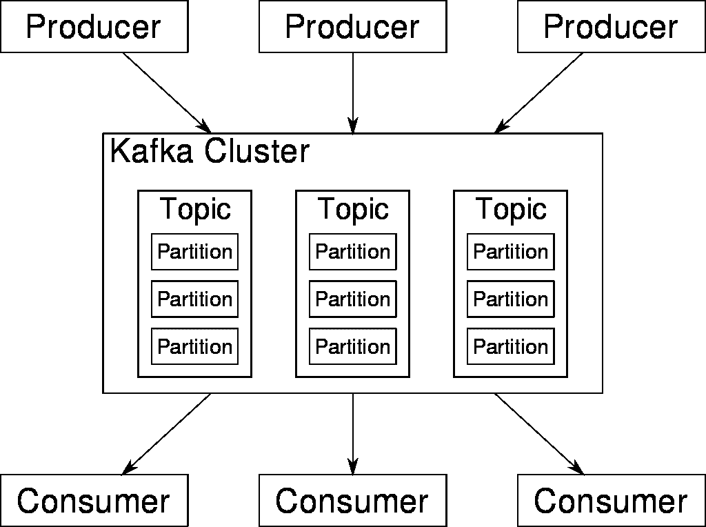

Overview of Kafka in [Wikipedia](https://en.wikipedia.org/wiki/Apache_Kafka)

## 配置 Apache Kafka 服务器

现在让我们配置 Apache Kafka 服务器。我们需要从 https://kafka.apache.org/downloads[下载阿帕奇卡夫卡 2.8.0 版。下载 zip 文件并提取其内容。重命名文件夹，并将其复制到驱动器，如下所示:](https://kafka.apache.org/downloads)

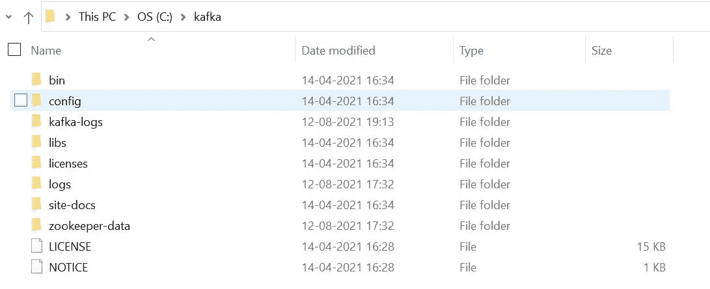

Kafka storage location in system

现在，我们需要创建 kafka-logs 和 zookeeper-data 文件夹，然后编辑 zookeeper.properties 和 server.properties 中的目录路径，如下所示。这样做是为了存储日志文件，否则它们将存储在默认的 tmp 文件夹中。

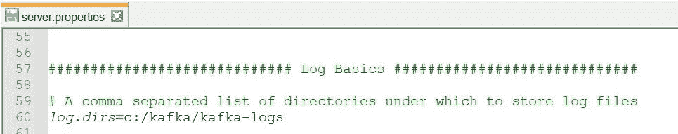

server.properties

zookeeper.properties

此外，您需要添加**listeners = PLAINTEXT://localhost:9092**否则将无法建立连接并显示警告。

> 无法建立到节点 0 的警告连接。经纪人可能不在。(org . Apache . Kafka . clients . network client)

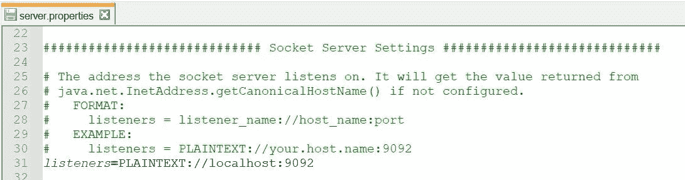

server.properties

在这篇文章中，我们使用。bat 文件在 windows 平台上运行服务器。你可以用。sh 文件，如果您在 linux/unix 平台上运行服务器。

## Spring Boot 与阿帕奇卡夫卡制片人

现在，我们将学习如何使用 Spring Boot 应用程序发布关于卡夫卡主题的消息。打开[https://start.spring.io/](https://start.spring.io/)并添加如下图所示的配置。这里，我们为 Apache Kafka 和 Spring Web 添加了两个依赖项 Spring。生成 jar 以下载 zip 文件夹。

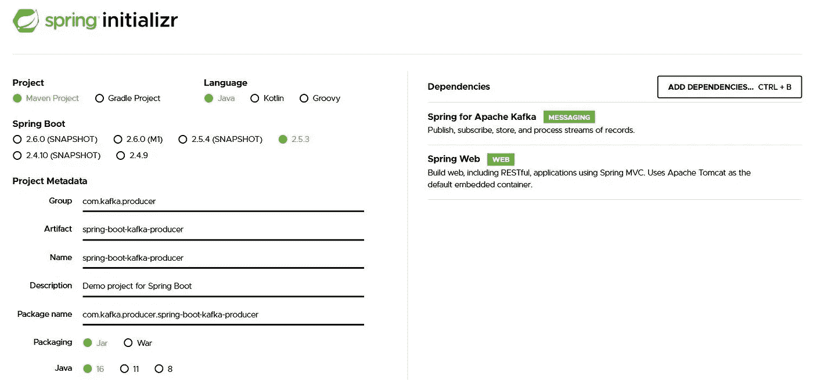

Configuration file in Spring Initializr

解压缩 zip 文件夹，并在 Eclipse IDE 或 IntelliJ IDEA 中导入 maven 项目。我们在这里使用 Eclipse IDE。在 pom.xml 文件中，您可以验证依赖关系。

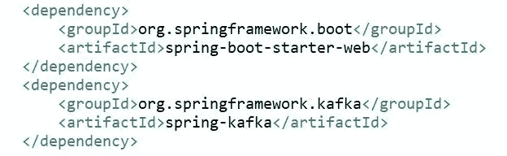

pom.xml

在中，application.properties 设置 server.port=8080

现在，创建一个用户资源来为 kafka 消费者发布消息。在这里，我们已经创建了一个名为 Name、Department 和 ID 的用户。也可以使用简单的字符串消息。

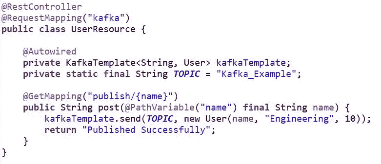

UserResource.java

我们需要在触发我们的 Spring Boot 应用程序之前启动 Apache Kafka 服务器。阿帕奇卡夫卡包含动物园管理员。它充当 Kafka 经纪人和消费者之间的协调接口。Zookeeper 跟踪 Kafka 集群节点的状态，它还跟踪 Kafka 主题、分区等。在生产中，您可能需要单独设置 zookeeper。但是在这里，我们使用的是 Apache Kafka 自带的动物园管理员。

运行*C:\卡夫卡>。\ bin \ windows \ zookeeper-server-start . bat。\ config \ zookeeper . properties*

运行*C:\卡夫卡>。\ bin \ windows \ zookeeper-server-start . bat。命令提示符下的\ config \ zookeeper . properties*。这将在端口 2181 上启动 zookeeper 服务。

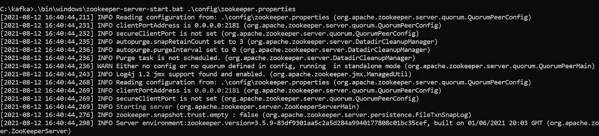

Command Prompt to run Zookeeper

打开新的命令提示终端，运行 *C:\kafka >。\ bin \ windows \ Kafka-server-start . bat。\config\server.properties* 来启动 Apache Kafka 服务器。

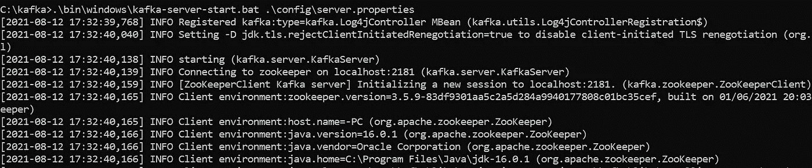

Command Prompt to run Kafka server

现在，打开另一个终端来接收 kafka 消费者控制台中的消息。

以下命令创建一个名为 Kafka_Example 的主题，该主题只有一个主题和一个副本:

*C:\卡夫卡>。\ bin \ windows \ Kafka-topics . bat-create-zookeeper localhost:2181-replication-factor 1-partitions 1-topic Kafka _ Example*

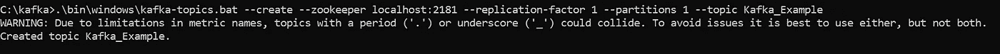

Command Prompt to create Kafka topic and run Kafka Consumer via console

Kafka 还提供了用于消息消费的命令行消费者客户端。以下命令用于启动基于控制台的消费者:

*C:\卡夫卡>。\ bin \ windows \ Kafka-console-consumer . bat-bootstrap-server localhost:9092-topic Kafka _ Example-from-beginning*

现在在 localhost 上发布用户名，然后您可以看到 Kafka 消费者控制台显示这些用户的详细信息。

[http://localhost:8080/Kafka/publish/Maria](http://localhost:8080/kafka/publish/Maria)

[http://localhost:8080/Kafka/publish/John](http://localhost:8080/kafka/publish/John)

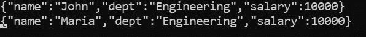

Kafka Consumer displays the details of those user

*GitHub 链接:*

 [## spring-boot/spring-boot-Kafka/spring-boot-Kafka-main ela 4490/spring-boot 的制作人

### 这个资料库探索了 Spring Boot 的各种特色。弹簧靴/弹簧靴-卡夫卡/弹簧靴-卡夫卡-制片人在…

github.com](https://github.com/ela4490/spring-boot/tree/main/spring-boot-kafka/spring-boot-kafka-producer) 

## Spring Boot 与阿帕奇卡夫卡消费者

现在，我们将看到如何使用 Spring Boot 应用程序来消费来自 Kafka 主题的消息。我们需要为消费者创造另一个项目。就像我们为制片人创造的一样。

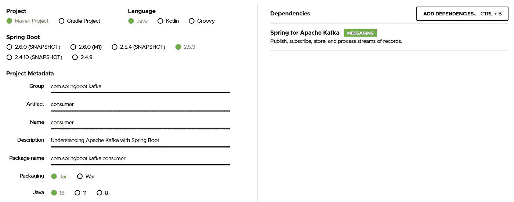

Configuration file in Spring Initializr

在 Eclipse 中创建和设置了项目之后。在这里，我创建了一个样例 Kafka 配置文件，它以字符串形式发送消息。

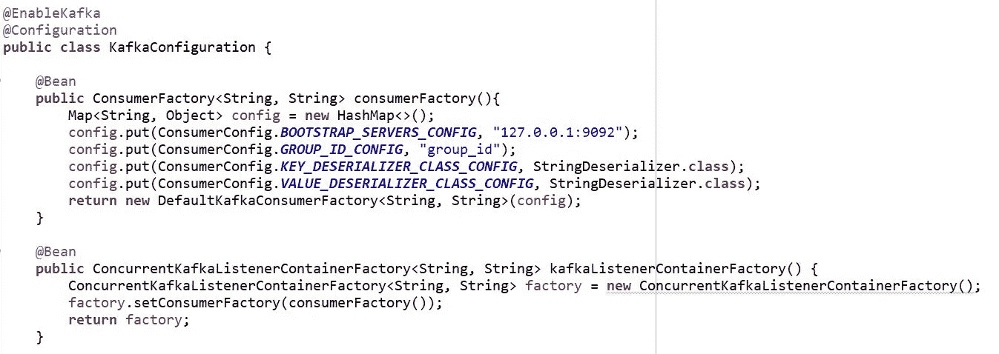

KafkaConfiguration.java

KafkaConsumer 用于从 Kafka 服务器读取数据。

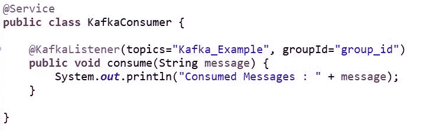

KafkaConsumer.java

现在，启动您的 spring boot 应用程序，然后在单独的命令提示符下启动 zookeeper 和 Kafka 服务器。因为我们已经创建了一个卡夫卡主题 Kafka_Example。我们不需要再创造这个话题了。但是，如果你使用一个新的卡夫卡主题，那么就必须创建一个新的主题。

Kafka 为用户提供了一个命令行生成器客户端，它接受来自命令行的输入，并将它们作为消息发布到 Kafka 集群。默认情况下，输入的每一个新行都被视为一条新消息。以下命令用于启动基于控制台的生成器来发送消息:

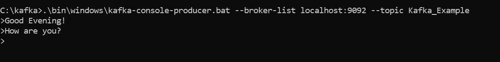

Kafka Producer sends messages

现在，在单独的命令提示符下运行 Kafka console producer 后，可以发布消息了。然后，这些消息在我们的 spring boot 应用程序中使用。

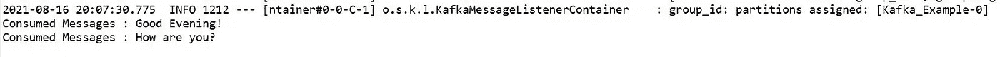

Spring Boot application displays the messages which are published by Kafka Producer

这就是 Spring Boot 应用程序从 Apache Kafka 读取数据的方式。

*GitHub 链接:*

 [## spring-boot/spring-boot-Kafka/spring-boot-Kafka-main ela 4490 的消费者/spring-boot

### 这个资料库探索了 Spring Boot 的各种特色。-弹簧靴/弹簧靴-卡夫卡/弹簧靴-卡夫卡-消费者在…

github.com](https://github.com/ela4490/spring-boot/tree/main/spring-boot-kafka/spring-boot-kafka-consumer) 

这是一个非常简单的例子来理解 Spring Boot 应用程序中 Apache Kafka 消费者和生产者的概念。希望这能帮助任何想了解阿帕奇卡夫卡的人。我只是想分享我的经历，并为我在学习卡夫卡的过程中观察到的问题提供解决方案。请随时检查或纠正本文中提到的细节，这将有助于我为其他开发者创造更有价值的内容。快乐学习！:)