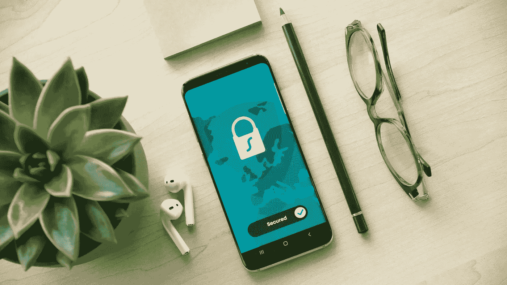

# 了解应用隐私报告

> 原文：<https://medium.com/geekculture/understanding-app-privacy-report-ad3423082b90?source=collection_archive---------21----------------------->

## WWDC21

iOS 15:了解应用行为

Photo by @danny144 on [Unsplash](https://unsplash.com/s/photos/cake?utm_source=unsplash&utm_medium=referral&utm_content=creditCopyText)

WWDC 21 公布了应用隐私报告，这将使用户能够了解他们的日常应用程序在引擎盖下发生了什么。

> 该报告将揭示应用程序访问用户数据和传感器(如照片、位置、联系人等)的情况。)并列出您的应用程序联系的所有域。