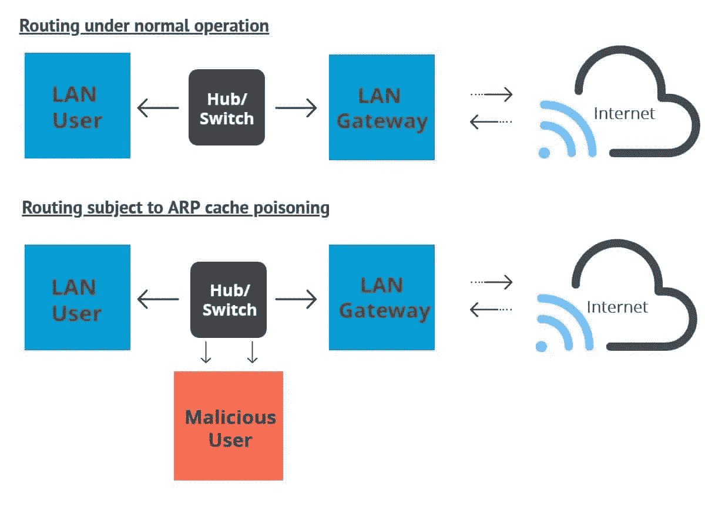
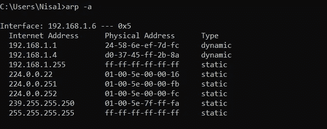
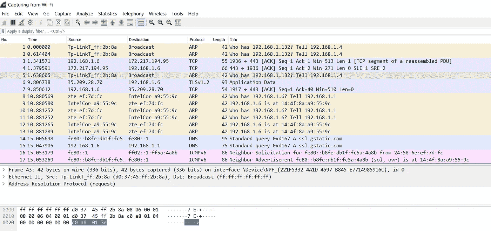

# 了解 ARP 中毒和 MITM 攻击

> 原文：<https://medium.com/geekculture/understanding-arp-poisoning-mitm-attack-7b12a3b061bd?source=collection_archive---------7----------------------->


Image by: https://www.paubox.com/

ARP 中毒和中间人攻击(MITM)是网络攻击的类型，这使得黑客能够窥探双方之间的通信。从技术上讲，ARP 中毒是一种中间人攻击。因此，在这篇文章中，我将解释 ARP 中毒和中间人攻击。但是在进入 ARP 中毒之前，我们应该对 ARP 有适当的了解。

# 什么是 ARP？

ARP 首字母缩写代表**地址解析协议**，顾名思义，它是一种支持设备间网络通信的协议。ARP 用于将互联网协议(IP)地址转换为局域网中的**【固定物理机地址】**，也称为**媒体访问控制(MAC)** 地址。通常，ARP 在设备内部用于与路由器通信，使这些设备能够连接到互联网。

主机维护着 ARP 缓存，并使用它连接到网站和网络上的其他目的地。然而，如果主机没有正在寻找的 IP 地址的 MAC 地址，它将通过发送 ARP 请求包向网络上的其它机器请求匹配的 MAC 地址。

因此，IP 和 MAC 地址之间的映射过程非常重要，因为 IP 和 MAC 地址的长度互不相同。因此，需要翻译来识别系统中的彼此。如你所知，有一个新版本的互联网协议被命名为 **IPv6** ，但使用最多的仍然是 IPv4。因此，IPv4 地址是 32 位长，而 MAC 地址是 48 位长。因此，ARP 需要将 32 位地址转换为 48 位地址，反之亦然。

此外，ARP 协议在安全性方面也不好。这就是为什么 IPv6 采用了名为**邻居发现协议(NDP)的新协议。**邻居发现协议在安全方面非常强大，使用密钥来验证主机身份。

# 什么是 ARP 中毒(ARP 欺骗)？

ARP 中毒是一种中间人(MitM)攻击，它允许黑客通过局域网(LAN)窥探双方的通信。正如我上面提到的，ARP 协议主要是为了效率而不是安全而设计的。因为协议的设计者从未包括验证 ARP 消息的认证系统。因此，同一网络中的任何设备都可以应答 ARP 请求，即使原始消息不是为它请求的。



Image: ARP Poisoning (https://laptrinhx.com/)

我们来看看黑客在攻击时遵循的步骤。

1.  首先，他们必须能够访问网络，这样他们才能扫描网络，找出连接设备的 IP 地址。
2.  下一步通常是选择一个目标，例如网络上的特定端点或路由器之类的网络设备。
3.  然后，攻击者将使用欺骗工具来执行 ARP 中毒攻击。他们可以使用的工具种类繁多，比如 **Arpspoof** 或者 **Driftnet** 。因此，在配置了适用的设置后，他将开始攻击。
4.  攻击的结果是，属于路由器和设备的两个 IP 地址都会认为攻击者的 MAC 地址是正确的。
5.  现在，这两台设备将更新它们的 ARP 缓存条目。从那时起，两个设备都与攻击者通信，而不是直接相互通信。但问题是攻击者假装是网络通信信道的双方。正因为如此，那两个人不知道他们在和外面的人交流。
6.  现在攻击者可以在他们不知情的情况下秘密地执行任何操作。

# 如何识别 ARP 缓存中毒攻击？

如果特定设备的 ARP 缓存中毒，最简单的识别方法是使用命令行。

打开机器的终端，输入以下命令显示 ARP 表。该命令适用于 Windows 和 Linux 操作系统。

```
**arp -a**
```

输出结果将如下所示，



Image: ARP table

然而，如果你的表格显示两个不同的 IP 地址有**相同的 MAC 地址**，这意味着你受到 ARP 中毒的攻击。

此外，如果您想发现大型网络中的 ARP 中毒，并获得有关攻击者正在进行的通信类型的更多信息，您可以使用名为 **Wireshark protocol** 的开源软件。



Image: Network Traffic using WireShark

# 如何预防 ARP 中毒？

有几种方法可以用来防止网络上的 ARP 中毒。

*   **使用虚拟专用网络(VPN)⁠:** 使用虚拟专用网络是防止 ARP 中毒最简单、最有效的方法。它允许您的设备通过加密的隧道连接互联网，这使得 ARP 欺骗攻击者不可能。
*   **使用静态 ARP:**ARP 协议允许你为一个 IP 地址创建一个静态 ARP 条目。因此，它将阻止设备侦听该地址的 ARP 响应。
*   **运行欺骗攻击:**您可以自己运行欺骗攻击来检查现有的防御措施是否正常工作，如果不正常，您可以检测系统中的弱点并修复它们。

# 中间人(MITM)攻击

正如我上面提到的，ARP 中毒是一种 MITM 攻击。中间人攻击是最常见同时也是最危险的攻击之一。MITM 攻击是一种窃听攻击，攻击者截取双方之间的通信。进入通信后，攻击者假装双方都是合法的参与者。通过这种方式，最初的双方都不知道存在攻击者，并且他们进行通信时认为他们彼此直接相连。但实际情况是，双方都是在攻击者不知情的情况下与攻击者交流，而不是直接与对方交流。

例如，假设有一个名叫 John 的人，攻击者针对给定的 IP 地址(通常是特定子网的默认网关)发送伪造的 ARP 响应。因此，这将导致 John 的设备使用攻击者机器的 MAC 地址而不是路由器的 MAC 地址来填充其 ARP 缓存。然后，约翰的机器会错误地将网络流量转发给攻击者。然而，对约翰来说，一切可能看起来很正常，直到为时已晚。

因此，攻击者可以轻松地执行这些 MITM 攻击，以窃取登录凭据或机密信息，监视受害者，或者中断通信或破坏数据。

此外，还有几种类型的中间人攻击，如 **DNS 中毒、HTTPS 欺骗、Wi-Fi 窃听、**和**会话劫持。因此，在我的下一篇文章中，我将解释 DNS 中毒(DNS 欺骗)。**

所以，这是文章的结尾，我希望你喜欢它。快乐编码👨‍💻。

## 参考

[](https://www.varonis.com/blog/arp-poisoning/) [## ARP 中毒:它是什么&如何防止 ARP 欺骗攻击

### ARP 中毒是一种网络攻击，它滥用广泛使用的地址解析协议(ARP)中的弱点来…

www.varonis.com](https://www.varonis.com/blog/arp-poisoning/) [](https://www.csoonline.com/article/3340117/what-is-a-man-in-the-middle-attack-how-mitm-attacks-work-and-how-to-prevent-them.html) [## 什么是中间人攻击？MitM 攻击的工作原理以及如何防范它们

### 中间人(MitM)攻击是指攻击者截获双方之间的通信，以秘密地…

www.csoonline.com](https://www.csoonline.com/article/3340117/what-is-a-man-in-the-middle-attack-how-mitm-attacks-work-and-how-to-prevent-them.html) [](https://www.pcwdld.com/find-device-or-ip-address-using-mac-address) [## 用 MAC 地址查找设备或 IP 地址-命令行和工具！

### 如果没有 IP 地址，您将如何与设备通信？你可能处于这样一种情况，你没有…

www.pcwdld.com](https://www.pcwdld.com/find-device-or-ip-address-using-mac-address)