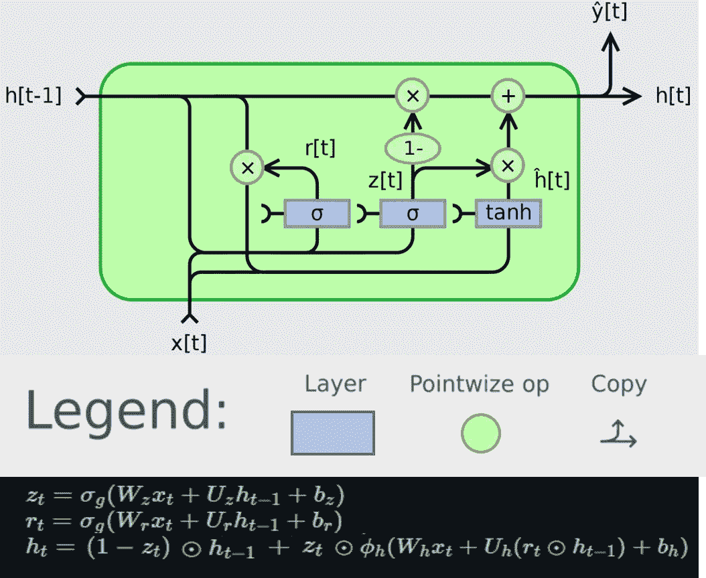
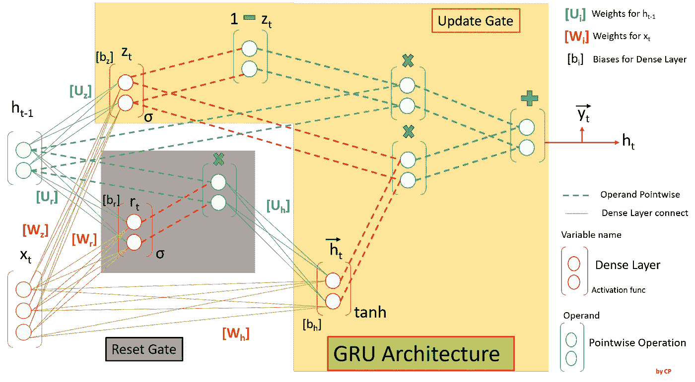
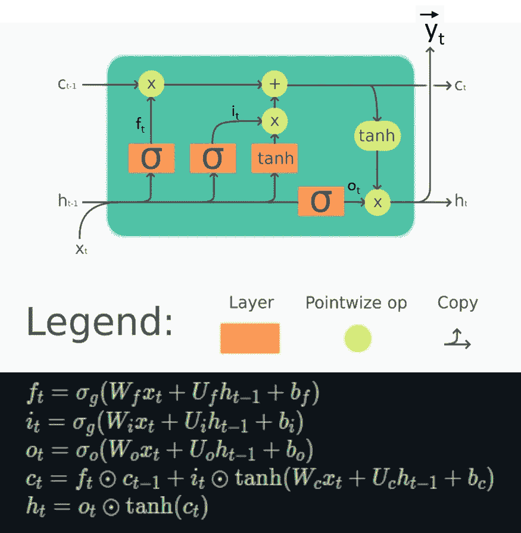
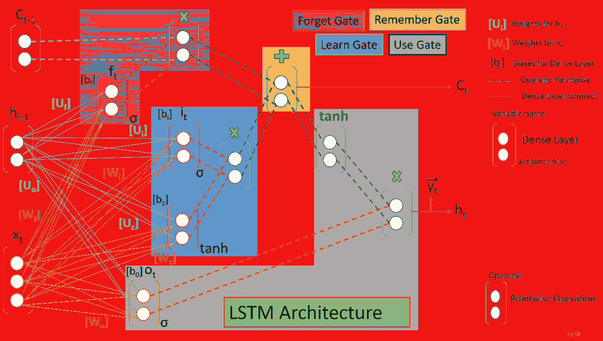

# 图解式理解 GRU LSTM 的基本建筑

> 原文：<https://medium.com/geekculture/understanding-basic-architecture-of-lstm-gru-diagrammatically-6365befc64d?source=collection_archive---------14----------------------->

## NLP: LSTM 和 GRU

## 初学者的 LSTM 和 GRU

Photo by [Anita Jankovic](https://unsplash.com/@dslr_newb?utm_source=medium&utm_medium=referral) on [Unsplash](https://unsplash.com?utm_source=medium&utm_medium=referral)

深度学习有不同的模块实现不同的功能。深度学习的专业知识包括设计架构来完成特定的任务。它将复杂的功能简化为功能模块图(可能是动态的)，这些模块的功能是通过学习最终确定的。递归神经网络(RNN)是一种我们可以用来处理数据序列的架构。我们了解到，信号可以是 1D 信号、2D 信号或 3D 信号，具体取决于信号的域。该域由映射源和映射目标来定义。除了数据处理之外，从这种数据序列中提取上下文信息对于实现所需功能至关重要。这种类型的 RNN 的希望是，他们可能能够将以前的信息与当前的任务联系起来。但不幸的是，随着序列的增长，RNN 变得无法学会连接信息，这被称为 RNN 的“长期依赖”问题。

**“长短期记忆网络”(LSTM)** 是一种特殊的 RNN，能够学习长期依赖关系。它是由[hoch Reiter&schmid Huber(1997)](http://www.bioinf.jku.at/publications/older/2604.pdf)提出的，它对各种各样的问题都非常有效。长时间记住信息实际上是它的默认行为。LSTMs 也具有类似 rnn 的链式结构，但是中继模块具有改进的架构。不是只有一层，而是有四层以一种非常特殊的方式相互作用。 [Junyoung Chung、卡格拉尔·古尔切雷、KyungHyun Cho、Yoshua Bengio (2014)](https://arxiv.org/pdf/1412.3555.pdf) 提出了更简单方法的类似功能，即**“门控循环单元”(GRU)** 。

对这种特殊建筑的研究总是涉及到对向量及其形状的数学运算的深入理解。对于初学者来说，有时会令人望而生畏，难以理解。在这篇文章中，作者试图展示这两个架构，并敦促所有读者使用作为现成的参考。

# 先决条件:

以下基本定义是 LSTM 和 GRU 的先决条件，

1.  **密集层** —涉及向量与相关“权重”和“偏差”线性组合。这在数学上用矩阵乘法来表示，并且输入和输出的维数是兼容的。
2.  **激活功能** —将非线性引入输出，并相应地激活学习过程。
3.  **点态操作** —涉及元素态操作；因此，所有操作数必须具有完全相同的形状，因此输出也包含相同的维度。
4.  **电池状态** —单个电池/单元的输出称为电池状态；有时它只有一个输出(GRU)，有时有两个输出(LSTM 有长期和短期记忆)。通常表示为 c[t]或 h[t]。
5.  **输入向量** —将要馈入一个单元/小区的序列数据。通常表示为 x[t]。
6.  **门模块** —不同密集层的输出通过一些逐点操作进行组合，以完成某些任务(如记住长期信息、更新短期信息等)。).LSTM 或 GRU 的单个细胞/单位包括很少的这种特定的门块。

# 演示的注意事项:

该演示将基于以下考虑因素:

a)为简单起见，我们考虑形状为 **3X1** 的输入向量

b)细胞状态维度，即细胞/单位中神经元的数量，通常是超参数。对于这里的演示，它被认为是 **2。**

Photo by [Dan Meyers](https://unsplash.com/@dmey503?utm_source=medium&utm_medium=referral) on [Unsplash](https://unsplash.com?utm_source=medium&utm_medium=referral)

# 门控循环单元(GRU):

GRU 细胞/单位的典型结构连同数学方程如下所示，

Source: [atcold](https://atcold.github.io/pytorch-Deep-Learning/images/week06/06-2/GRU.png)

**复位门** r[t]用于决定忘记多少过去的信息，z[t]是**更新门向量**,它决定应该将多少过去的信息传递给未来。

上述表达式的**示意图**如下:

Source : Author

**逐点操作**(点划线)涉及元素到元素的操作。因此，单元输出 h[t]的矢量形状与前一单元 h[t-1]的矢量形状**相同**。但是在**密集层**(连续细线)的情况下，h[t-1]和输入 x[t]的线性组合通过**六(6)** 权重矩阵**(x[t]的[Wi]和 h[t-1]的[Ui]各 3 个)**和**每单位/单元三(3)** 偏置矩阵来表征。

Photo by [Matt Moloney](https://unsplash.com/@mattmoloney?utm_source=medium&utm_medium=referral) on [Unsplash](https://unsplash.com?utm_source=medium&utm_medium=referral)

# 长期短期记忆网络(LSTM):

LSTM 细胞/单位的典型结构连同数学方程如下所示，

Source: [atcold](https://atcold.github.io/pytorch-Deep-Learning/images/week06/06-2/LSTM.png)

lstm 处理长期记忆(LTM / c[t-1])和短期记忆(STM / h[t-1])，为了使计算简单有效，它使用了门的概念。

1.  **遗忘之门:** LTM 去了遗忘之门，它忘记了无用的信息。
2.  **Learn Gate:**Event(sequence input/x[t])和 STM 组合在一起，以便我们最近从 STM 学到的必要信息可以应用到当前输入。
3.  **记忆之门:**我们没有忘记的 LTM 信息和 STM、Event 结合在一起，成为更新的 LTM。
4.  **使用 Gate:** 这个 Gate 也使用 LTM、STM 和 Event 来预测当前事件的输出，作为更新的 STM。

上述表达式的**图示**如下:

Source : Author

就长期依赖性而言，与 GRU 或简单的 RNN 相比，这些架构被认为是最高效的网络。这些通过每个单元/小区的**八(8)** 权重矩阵**(x[t]的【Wi】和 h[t-1]的【Ui】各 4 个)**和**四(4)** 偏置矩阵来表征。

# 主要途径:

图形表示简化了用于架构的数学符号和方程。可供参考主要途径有，

1.  任何细胞/单位的神经元数目(n)( **此处为 2** )都是一个超参数。
2.  向量 c[t]，h[t-1]和 h[t]的形状等于神经元数目(n)。
3.  输入向量维数(i) ( **这里是 3** )独立于 c[t]或 h[t-1]的维数。
4.  每个单位/单元的可学习参数矩阵在上面的相应章节中定义。
5.  每个**【权重】**矩阵包含{输入向量形状(i) X 神经元数量(n)}个可学习参数。
6.  每个**“偏差”**矩阵包含{Number of neuron (n)}个可学习参数。
7.  **点态操作**不涉及任何可学习的参数。

*如果你觉得这篇文章有用，请点赞并分享，也欢迎发表评论。也可以在*[*LinkedIn*](http://www.linkedin.com/in/pathakchiranjit)*上找我。有兴趣了解工程领域的数据分析、数据科学和机器学习应用的更多信息吗？通过访问我的* [*中简介*](/@pathakc) *来探索我以前的文章。感谢阅读。*

*- Chiranjit*