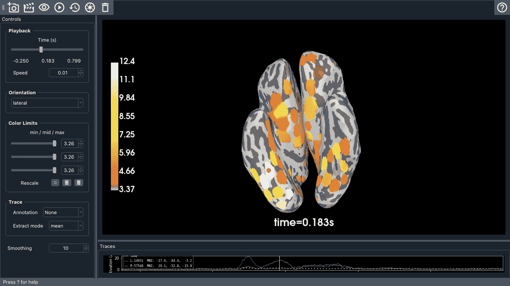

# 用 Python 理解脑机接口

> 原文：<https://medium.com/geekculture/understanding-brain-computer-interfaces-with-python-209f32e10db8?source=collection_archive---------21----------------------->

理解脑机接口的技术方法

Image by the author of source estimation using sample data.

大脑的某些东西几乎会引起任何人的好奇；它既错综复杂，又具体行动。此外，在研究大脑时，大脑的复杂性要求一定程度的独创性和创造力。