# 用不那么混乱的方式理解混乱矩阵！！

> 原文：<https://medium.com/geekculture/understanding-confusion-matrix-in-less-confusing-way-8e731bb8fd91?source=collection_archive---------11----------------------->

## 不平衡数据集/二元分类/混淆矩阵

## 用于二进制分类的 2 * 2 混淆矩阵。

Confused by Confusion matrix ? Source : Photo by [Matt Walsh](https://unsplash.com/@two_tees?utm_source=unsplash&utm_medium=referral&utm_content=creditCopyText) on [Unsplash](https://unsplash.com/?utm_source=unsplash&utm_medium=referral&utm_content=creditCopyText)

你好。！在本文中，我们将对分类算法中使用的**混淆矩阵/误差矩阵**进行全面的理解。最后，您将清楚混淆矩阵表、各种性能指标以及优先顺序，让我们开始吧！！

混淆矩阵给出了分类算法性能的最佳解释，并且还显示了它所产生的错误类型。二进制分类问题的 2*2 混淆矩阵如下。列表示实际值，而行表示预测值，其他值如下所述。

**真阳性(TP) :** 模型预测阳性，实际也是阳性。耶！正确的预测。

**假阳性(FP) :** 模型预测为阳性，实际为阴性(预测不正确)。哎呀！类型 1 错误。

**假阴性(FN) :** 模型预测为阴性，但实际为阳性(不正确的预测)。现在输入 2 号错误！！

**真阴性(TN) :** 模型预测阴性，实际也是阴性。耶！正确的预测。

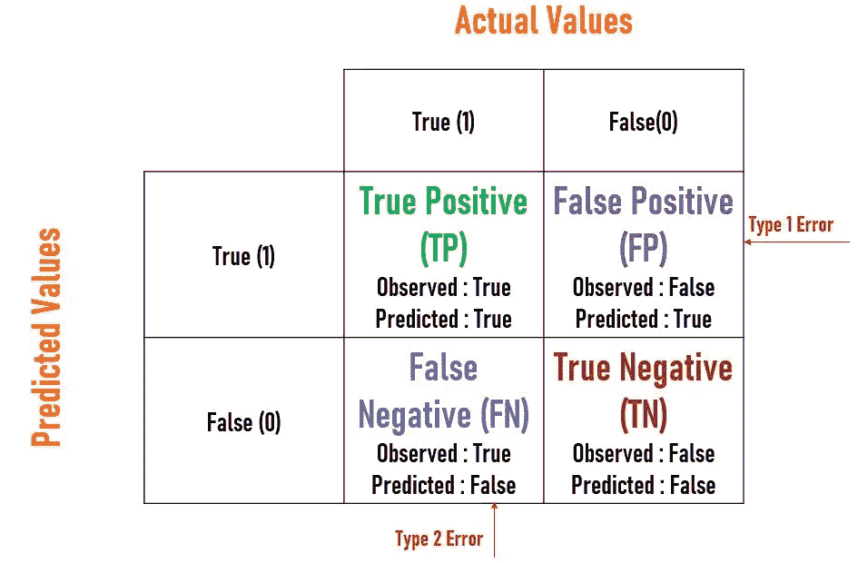

Fig.1: Confusion matrix by : [DEEKSHA SINGH](https://medium.com/u/a02fa3662993?source=post_page-----8e731bb8fd91--------------------------------)

在这个矩阵中有如此多的信息，所以让我们一个一个地详细了解。

让我们考虑一个包含 800 个数据的数据集，该数据集有两个类标签“是”或“否”,在提供的数据集中，400–500 个数据被标记为第一类，其余 400–300 个数据被标记为第二类。因此，给定的数据集是平衡的，模型将在训练数据集上进行训练，不会出现偏差。这些类型的模型的性能评估将由模型的准确性给出。

*   **准确度**:正确预测的分类器性能，即模型预测实际值的接近程度，由总正确预测(TP + TN)与总预测(TP+FP+FN+TN)的比值给出。

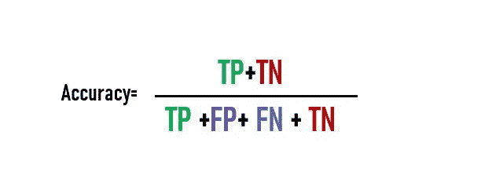

但是等等！！如果在提供的 800 个数据的数据集中，700 个数据属于一个类(多数类)说是，100 个(少数)属于其他(否)。显然，该模型将偏向于多数类，并在测试数据集上预测多数是。对于这些类型的条件，精度会更高，不适合不平衡的数据集，因此仅基于精度的模型部署会造成灾难。于是，召回率、精确度、掉出率等性能评价标准的作用就来了。

*   ***【TPR】***:表示所有真***正*** 观测值中，有多少被模型正确预测( ***正*** )，由**真正预测值(TP)/总正观测值(P)的比值给出，其中 P= TP + FN。**

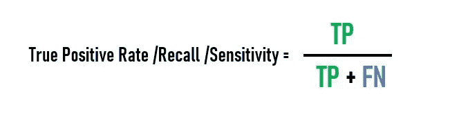

*   **漏检率/假阴性率(FNR) :** 表示所有真*观测值中，有多少被模型错误预测( ***假阴性*** )，由**假阴性预测值(FN)/总阳性观测值(P)的比值给出，其中 P= TP + FN。***

*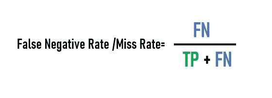*

*   ***脱落/假阳性率(FPR):** 表示在所有 ***阴性*** 观察值中，有多少被模型错误预测( ***阳性*** )。它由**假阳性预测值(FP)/总阴性观察值(N)的比值给出，其中 N= FP+TN。***

*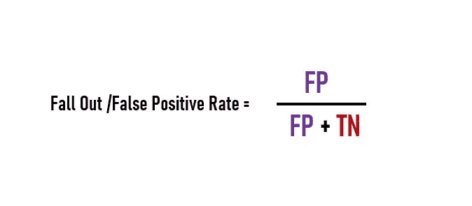*

*By @deev150*

*   ***选择性或真阴性率(TNR) :** 表示在所有*阴性的观察值中，有多少是模型实际预测正确的( ***阴性*** )。它由**真阴性预测值(TN)/总阴性观察值(N)的比值给出，其中 N= FP+TN。****

**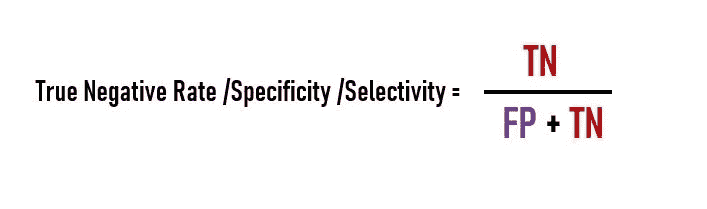**

*   ****精度/阳性预测值(PPV) :** 实际阳性观测值(TP)与总阳性预测值之比。**

**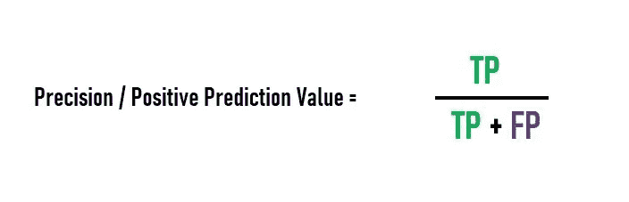**

*   ****负面预测值(NPV) :** 是实际负面观察值(TN)与总负面预测值之比。**

**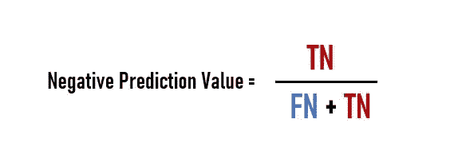**

**在开发模型的过程中，我们应该总是试图增加总磷和总氮，同时降低总磷和总磷的值。**

*   ****查全率与查准率:**选择评估标准有时会令人困惑，也就是说，在寻找性能最佳的模型时要考虑哪一个。**

**让我们以垃圾邮件和火腿邮件为例，如图所示。在这里，我们的目标是减少 **FP** ，因为一个人可能会错过一封重要的邮件，如果它被预测为垃圾邮件，所以这里我们需要一个**高精度**模型，因为它将**最小化 FP 错误。****

**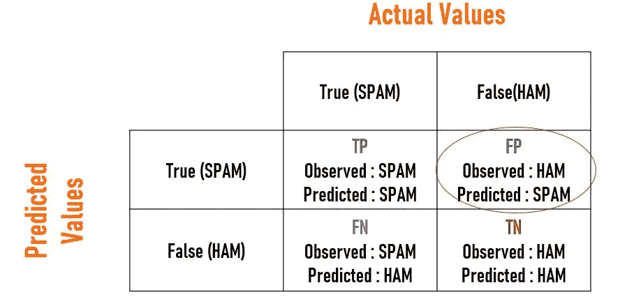**

**SPAM vs HAM Emails by [DEEKSHA SINGH](https://medium.com/u/a02fa3662993?source=post_page-----8e731bb8fd91--------------------------------)**

**在预测患者是否为癌症阳性的情况下，我们应该尽量减少 **FN** ，因为癌症阳性的患者被预测为癌症阴性将是不幸的。因此，这里我们需要一个**高召回**模型，因为它将**最小化 FN 错误**。**

**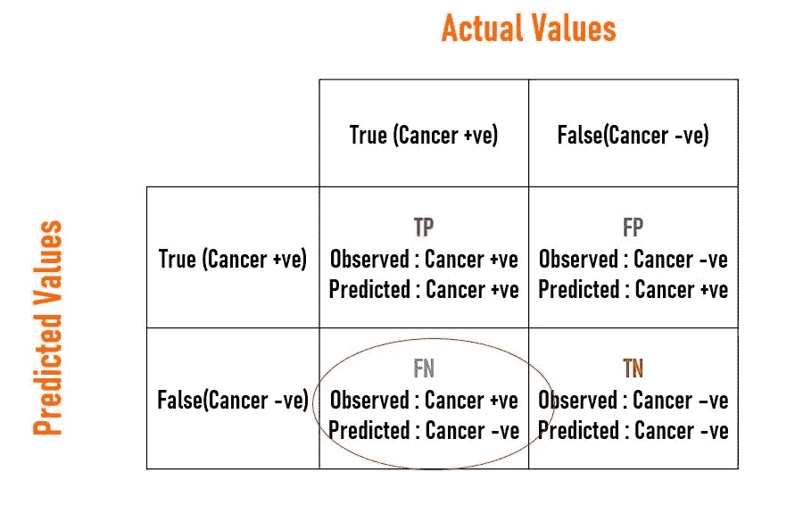**

**Cancer Prediction by [DEEKSHA SINGH](https://medium.com/u/a02fa3662993?source=post_page-----8e731bb8fd91--------------------------------)**

*   **有时，对于不平衡数据集，精确度和召回率都很重要，在这种情况下，我们采用 F-beta 度量。它通过利用精确度和召回率来提供单一分数。**
*   ****F-β度量由下式给出:****

**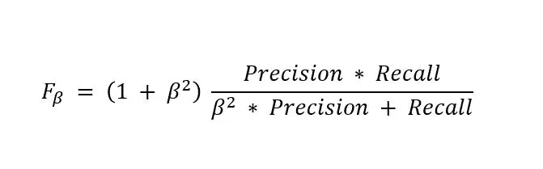**

**F-Beta Score**

**对于β= 1，F-1 分数是精确度和召回率调和平均值，并且给予精确度和召回率相同的权重，由下式给出:**

**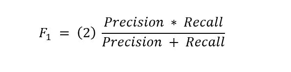**

**F-1 Score**

**0 < Beta <1 : When Precision is important than recall generally taken as 0.5 to give F-0.5 Score.**

**Beta > 1:给回忆比精确更多的权重。**

**本文到此为止。我乐于接受问题和建议！！**

**快乐学习！！**

**下面连线:[www.linkedin.com/in/deev1507](http://www.linkedin.com/in/deev1507)**

*****引用:*****

** [## 3.3.度量和评分:量化预测质量- scikit-learn 0.24.2…

### 使用 model_selection 等工具进行模型选择和评估。GridSearchCV 和 model _ selection . cross _ val _ score…

scikit-learn.org](https://scikit-learn.org/stable/modules/model_evaluation.html#classification-metrics)  [## 什么是机器学习中的混淆矩阵-机器学习掌握

### 让混乱矩阵不那么混乱。混淆矩阵是一种总结性能的技术…

machinelearningmastery.com](https://machinelearningmastery.com/confusion-matrix-machine-learning/)  [## 机器学习的 Fbeta-Measure-机器学习掌握度简介

### Fbeta-measure 是一个可配置的单分数度量，用于评估基于…

machinelearningmastery.com](https://machinelearningmastery.com/fbeta-measure-for-machine-learning/)  [## 困惑矩阵-维基百科

### 条件正(P)数据中的实际正例数条件负(N)实际负例数…

en.wikipedia.org](https://en.wikipedia.org/wiki/Confusion_matrix)**