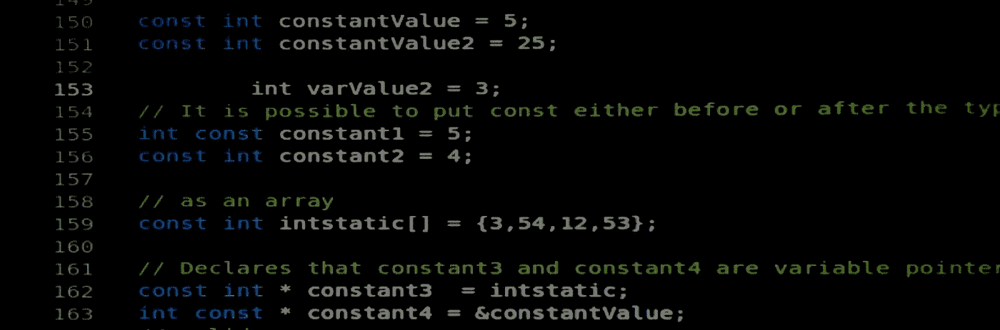

# 正确理解 C++ (I)中杂乱的关键字“const”

> 原文：<https://medium.com/geekculture/understanding-correctly-that-messy-keyword-const-in-c-i-62f210291247?source=collection_archive---------19----------------------->



# 第一部分:常量类型。

## 在 C++中，限定符“const”指定了一个编译时约束，即对象或变量不能被修改。编译器验证对象或变量永远不会改变，并在您试图修改或重新分配它时阻止您。然而，编写“const”正确的代码比仅仅在一些行中使用关键字，然后让编译器找出什么有意义要有挑战性得多。在这个由三部分组成的指南中，你会得到一些如何正确使用它的提示。

在我作为 C++程序员的早期，我并没有太关注关键字' *const* '。当我沉浸在 PASCAL 和 Delphi 编程中时，我甚至没有太注意常量，可能是因为我仍然依赖于我基础时代的一些习惯。所以对我来说，C++ ' *const* '是一些深奥的限定词，并不代表太多的兴趣或价值。如果我定义了一个只在函数体内部使用的变量(我确信没有什么能改变它)，为什么要费心把它变成常量呢？此外，C++有非常笨拙和看起来很难的用法' *const* '，不值得我在最初的学习曲线中发现它们的含义。这里有一个有趣的例子:

```
//The Most Constant Method
const int *const TMCMethod (const int *const& value) const
```

如果你感到困惑，不要担心！我保证我们会一步一步解决。尽管这有点困难，但它并不像那句名言那样让大多数 C/C++程序员头脑发热。

```
// declare f as array of pointer to function returning pointer 
// to function returning void
void (*(*f[])())()
```

那么…你准备好了吗？让我们从基础开始。首先要知道的是，当你声明任何变量或对象时，限定词'*const【T7]'可以写在类型的前面或后面。*

```
int const anIntegerConstant = 5;
```

所以上面的代码行对编译器来说与下面的代码行完全一样:

```
const int anIntegerConstant = 5;
```

好的。这并不难，对吧？上面的规则适用于任何你想保持不变的东西，包括数组。所以，下面几行对编译器来说意义完全相同:

```
// This style could be confusing
int const anIntegerConstantArray[] = {3,5,4,1,2}; // The style I prefer to use
const int anIntegerConstantArray[] = {3,5,4,1,2};
```

但是，为了清楚起见，我总是把关键字' *const* '放在前面。这就是我从现在开始要保持的代码风格。

让我们进入下一个阶段。您可以声明指向常量类型的变量指针:

```
int varValue = 5;
const int *aConstant = &varValue;
```

当然，参考值是否为常数并不重要:

```
const int constantValue = 5;
const int *aConstant = &constantValue;
```

您甚至可以拥有一个指向常量类型的常量数组，并递增指针:

```
const int anIntegerConstantArray[] = {3,5,4,1,2}; 
const int *aConstant = anIntegerConstantArray;// Prints 3 and then increments the pointer
std::cout << aConstant++ << std::endl;// Prints 5
std::cout << aConstant << std::endl;
```

但是，如果指向一个常量类型，即使指针是可变的，也不可能使用解引用操作符来改变它所指向的值。您将得到一个编译器错误，因为您试图在只读位置进行赋值:

```
const int constantValue = 5;
const int *aConstant = &constantValue;// This line will not compile
*aConstant = 8;
```

也可以声明一个指向变量类型的常量指针。存储在指针中的地址本身是不变的，所以指针在声明时必须被初始化。即使以后可以更改它所指向的值，也不可能更改地址本身:

```
int varValue = 5;
int anotherValue = 6;
int *const aConstantPointer = &varValue;// This line will compile
*aConstantPointer = 8;// This line will not compileaConstantPointer = &anotherValue;// Also invalid
aConstantPointer++;
```

最后，您可以声明一个指向常量类型的常量指针。由于存储的地址是常数，指针需要在声明中初始化。以后，就不可能更改它所指向的值，也不可能更改地址:

```
int varValue = 5;
int anotherValue = 6;
const int *const aConstantPointerToConstant = &constantValue;// This line will not compile
*aConstantPointerToConstant = 8;

// This line will also not compile
aConstantPointerToConstant = &anotherValue;// Also invalid
aConstantPointerToConstant++;
```

好了，到目前为止，我们已经解决了文章开头那个古怪例子的前半部分。在我们结束之前，还有最后一件事要考虑。使用常量转换可以抛弃常量。它们的工作方式与 C++中的常规类型转换非常相似，只是它们不能在类型之间进行转换，也不能向下转换类的层次结构。

```
const char *x = "abcdefg";char *x2 = const_cast<char *>(x) ;
```

然而，有一个更好的改变常量变量的方法，我将在第二部分向你展示，在那里我们将探索如何在一个类的方法中使用常量。暂时就这样吧！直到下一个，编码快乐！