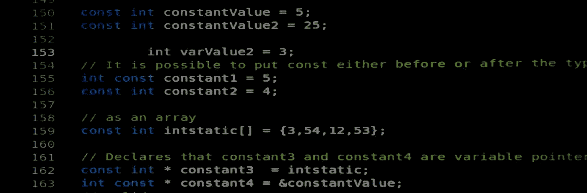

# 正确理解 C++ (II)中杂乱的关键字“const”

> 原文：<https://medium.com/geekculture/understanding-correctly-that-messy-keyword-const-in-c-ii-b0923a97b60a?source=collection_archive---------16----------------------->



# 第二部分:常数方法。

## 在 C++中，限定符“const”指定了一个编译时约束，即对象或变量不能被修改。编译器验证对象或变量永远不会改变，并在您试图修改或重新分配它时阻止您。然而，编写“const”正确的代码比仅仅在一些行中使用关键字，然后让编译器找出什么有意义要有挑战性得多。在这个由三部分组成的指南中，你会得到一些如何正确使用它的提示。

[在上一篇文章](https://correa-pablo.medium.com/understanding-correctly-that-messy-keyword-const-in-c-i-62f210291247)中，我们看到了关键字' *const* 应用于类型的不同用法。我们还观察了这个标识符与指针的交互，并且有一些例子说明编译器允许哪些操作，哪些不允许。

在第二部分中，我们将分析关键字' *const* '是如何在一个类的方法中使用的。这次我们将定义一个类，然后我们将在需要的地方应用' *const* '正确性。

这是我们相对简单的类。不要担心，我们将一步一步地剖析它:

```
typedef int myInt;class AnObject
{ 
    public: AnObject(){}; void printId () { std::cout<<id_<<std::endl;}
        std::string getName () { return name_; }
        int getNumber ()
        {
            if (number_ < 0)
            resetNumber();
            return number_;    
        }

        void resetNumber () { number_ = 0; }
        void helperResetNumber () { resetNumber(); }

        void setNumber (int &number) { number_= number; }
        void setName (std::string &name ) { name_= name; }
        void setId (const myInt id) { id_ = id;}
        //The Most Constant Method
        const int *const TMCMethod (const int *const& value) const private:

        std::string name_{""};
        myInt id_;
        int number_;
};
```

我们要分析的前两行如下:

```
void printId () { std::cout<<id_<<std::endl;}
std::string getName () { return name_; }
```

正如你所看到的，这些成员函数没有改变对象的内部状态，因此它们应该是常量。这是通过在括号后添加标识符' *const* '来实现的:

```
void printId () const { std::cout<<id_<<std::endl;}
std::string getName () const { return name_; }
```

一般来说，所有只检索和/或显示信息的函数(例如“getters”)最好定义为常量，以使它们的目的更加清晰易读。

下一个要检查的方法不仅仅是返回值:

```
int getNumber ()
{
   if (number_ < 0)
      resetNumber();
   return number_;    
}
```

这个方法总是返回信息，即使有时需要改变对象的内部状态。这是将它设为' *const* '的充分理由。如果这种方法不改变物体的可观察状态，那就加强了它应该是常数的理由。然而，为了修改成员变量 *number_，*的内部状态，我们应该使用一个 *const_cast* ( [参见本文的第 1 部分](https://correa-pablo.medium.com/understanding-correctly-that-messy-keyword-const-in-c-i-62f210291247))或者更好，将它的声明改为 mutable:

```
int getNumber () const
{
   if (number_ < 0)
      resetNumber();
   return number_;      
}...private:... mutable int number_;
```

但是我们上面所做的更改迫使我们将方法 *resetNumber()* 改为只读，否则，我们将得到一个编译器错误。这是尽早开始使用“const”的另一个原因。我甚至最近听说，所有的东西都要定义为' *const'* ，然后你会把需要的' *constness'* 去掉。只要记住:任何成员函数在被另一个' *const* '成员函数调用时都应该是' *const'* 。

```
void resetNumber () const  { number_ = 0; }
```

现在我们知道*非常数*函数只能被其他*非常数*对象调用。这也意味着' *const'* 函数总是可以被调用，不管调用者是否是只读的。因此，即使 *resetNumber()* 现在是' *const'* ，下面一行仍然有效:

```
void helperResetNumber () { resetNumber(); }
```

但是出于风格的原因(它调用了一个' *const* '函数),我们可能也应该把它设置为常量:

```
void helperResetNumber () const { resetNumber(); }
```

接下来的几行包含两个方法，它们的参数是通过引用传递的，因此不会复制底层对象，这是一个非常有效的操作，对于大型和复合的用户定义变量类型尤其有用:

```
void setNumber (int &number) { number_= number; }
void setName (std::string &name) { name_= name; }
```

通过使参数'*为 const* '将导致它们在不复制的情况下被传递，但将防止它们被修改(除非您使用强制方法):

```
void setNumber (const int &number) { number_= number; }
void setName (const std::string &name) { name_= name; }
```

出于同样的原因，将' myInt id '声明为' *const* '几乎没有好处，因为它是通过值传递的:

```
void setId (const myInt id) { id_ = id;}
```

当然，一种选择是不使用' *const* ':

```
void setId (myInt id) { id_ = id;}
```

但是遵循同样的风格，将它保持为' *const* '更有意义，但是将值作为引用传递:

```
void setId (const &myInt id) { id_ = id;}
```

所以，我们几乎准备好了我们的小课堂。是时候履行我在文章第一部分中的承诺了，通过解释带有 5 ' *const* '限定符的方法的含义:

```
//The Most Constant Method
const int *const TMCMethod (const int *const& value) const
```

基本上，你有一个常量方法，它的参数是一个指向常量类型的常量指针，通过引用传递，返回一个指向常量类型的常量指针。但是这意味着什么呢？

这意味着由返回指针指向的变量和返回指针本身不能被改变，并且该方法不修改由给定指针指向的变量、给定指针本身以及它是其方法的对象。谜团解开了！

我们已经接近尾声，在这一点上，我们已经涵盖了使用' *const* '的两个主要原因:

*   以防止无意中写入变量。
*   使代码更加自我记录和自我解释。

这两种用法让程序员和编译器更容易发现错误。但是，有几件事情需要考虑:

*   使用它可以让编译器执行更多的优化，使代码更紧凑和更有效，因为它确切地知道变量或函数在任何时候的状态。不过，围绕这一点有一些争论，认为' *const* '在某个点之后对编译器优化没有任何帮助，因为优化器不能确定某个地方没有'*非常数*别名或' *const cast'* 。
*   对于嵌入式系统，这意味着变量可以存储在 ROM 中，节省宝贵的 RAM 空间。我经常听到沮丧的嵌入式开发人员抱怨在不同的库和 API 中缺少'*const-correction*'。

使用' *const* '符合 Demeter 定律，即如果一个值不需要改变，那么它就不应该被允许改变。此外，' *const* '增加了编译时类型检查的级别，有助于错误的早期检测。我们将在本文的最后一部分讨论这个问题。我将向您展示' *const* '如何与替代(比如说'老派')方法进行比较，以生成只读变量和函数。在那之前，编码快乐！