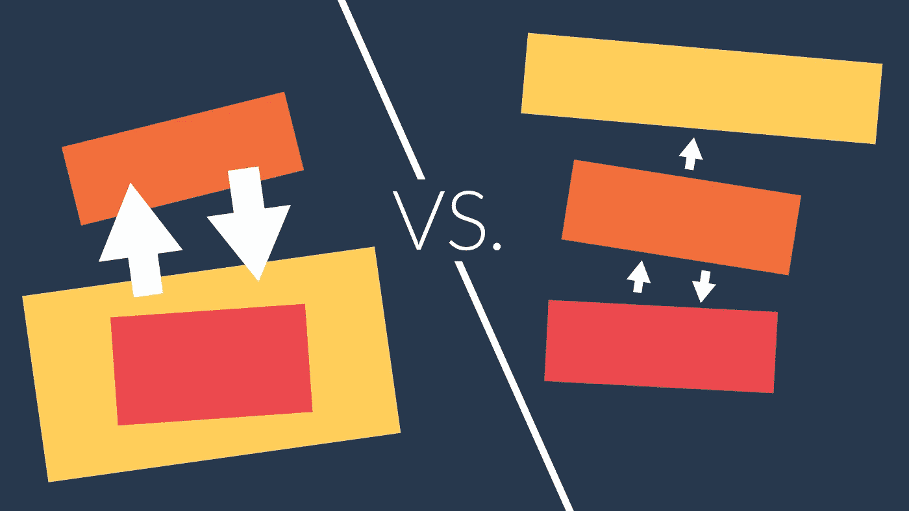

# 了解数据层(不使用数据库)

> 原文：<https://medium.com/geekculture/understanding-data-layers-without-using-databases-eaa1148ccd8b?source=collection_archive---------4----------------------->

## 用三层架构编写更好的 JavaScript

编程中一个真正伟大的概念是逻辑、数据和表示层的使用。然而，由于**数据层**与数据库的联系如此紧密，层往往直到编程之旅的后期才被讨论。如果你早点了解它，它真的会…