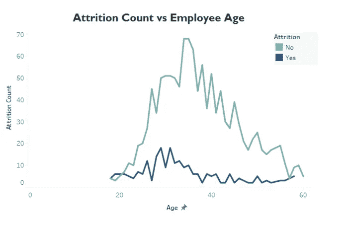
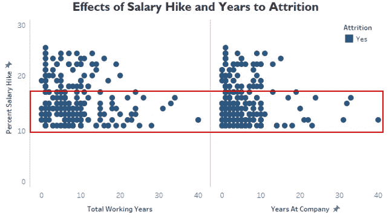
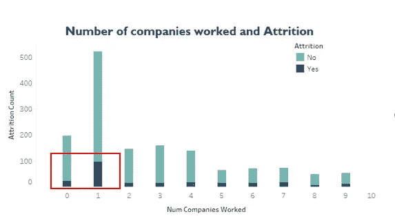
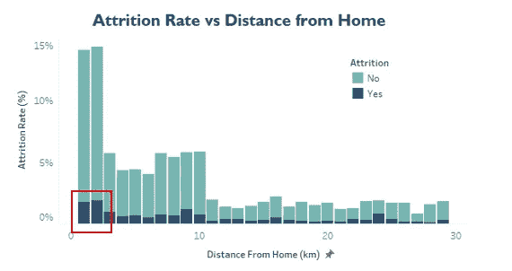
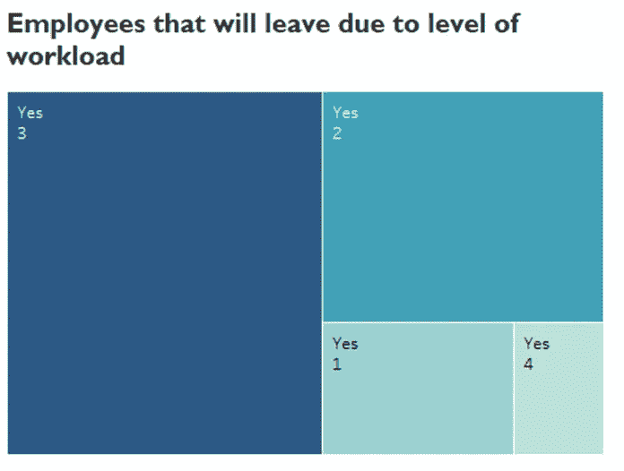
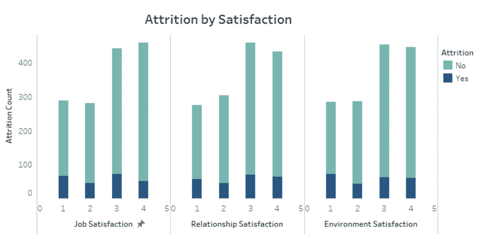
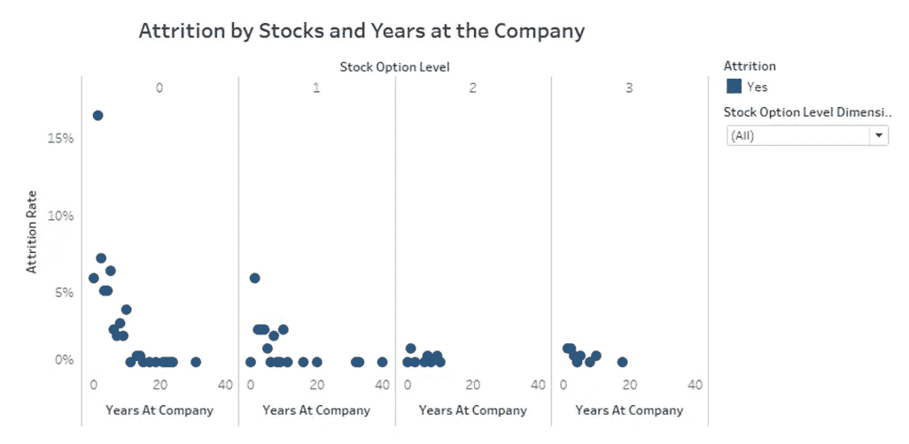
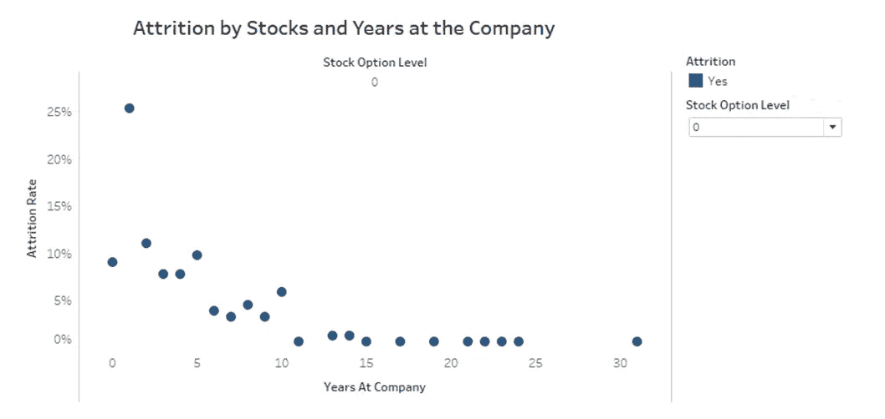
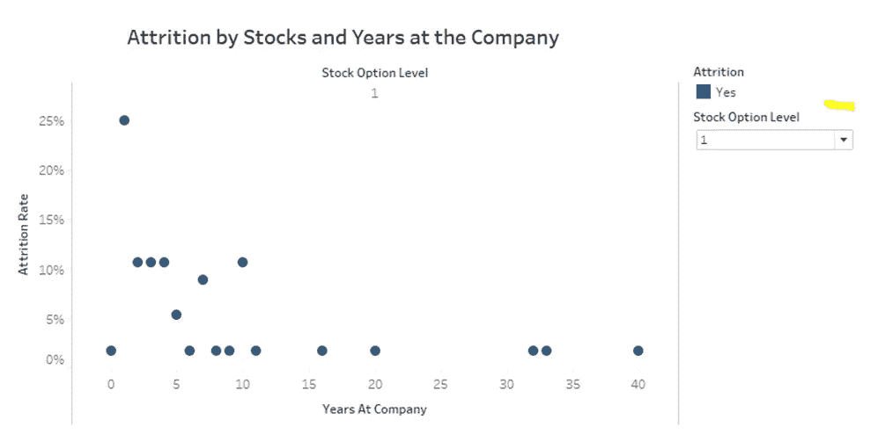

# 了解员工流失

> 原文：<https://medium.com/geekculture/understanding-employee-attrition-c8af90a29aba?source=collection_archive---------16----------------------->

## 他们为什么要离开？

当员工离开他们的公司或组织时，就会发生员工流失。当员工离开时，组织将面临一些冲击和影响，如招聘和入职投资、难以替换和寻找合格的员工、同事留下的团队成员加班的风险以及生产力的损失。

问题是，他们为什么要离开？通过使用来自 Kaggle 的[人力资源数据集](https://www.kaggle.com/pavansubhasht/ibm-hr-analytics-attrition-dataset)，让我们一起来看看员工离职的原因。

1.  员工年龄对自然减员有影响吗？

Age vs Attrition

根据折线图，我们可以看到，在 20 至 35 岁的年龄范围内，流失率较高。处于这个年龄段的员工倾向于离开他们的公司，因为他们仍在建立或寻找合适和稳定的职业生涯。

2.加薪和年限对减员有影响吗？

Salary Hikes vs Attrition

当加薪的百分比很低时，员工倾向于离开他们的公司，即使他们在公司工作了多长时间。

Years vs Attrition

但是，如果我们主要关注年数，即使加薪的百分比是多少，工作经验少于 7 年的员工或在公司工作的员工的流失率也很高。

3.工作的公司数量对人员流失有影响吗？

Number of companies vs Attrition

大多数处于职业生涯早期的员工都倾向于离开公司。与年龄相似，他们离开公司是因为他们仍在探索和建立自己的职业生涯。

4.离家远近对减员有影响吗？

Distance from Home vs Attrition

令人惊讶的是，离家到工作场所的距离越短，流失率就越高。我期待着相反的结果，但我意识到这与我的情况相似，由于机遇，我从家乡搬到了城市。

5.工作量对减员有影响吗？

Workload vs Attrition

员工的工作量越大，他/她离开公司的可能性就越大。

6.满意度对流失有影响吗？

Satisfaction vs Attrition

对工作满意的员工，无论是在工作任务、与同事的关系，还是工作场所的环境方面，都不会离开公司。简而言之，当工作场所有毒时，自然减员率很高。

7.股票对减员有影响吗？

Stocks vs Attrition

Stock Option Level 0

Stock Option Level 1

当一个组织不向员工提供股票时，流失率就很高。但是当引入股票时(比较 0 级和 1 级股票期权)，流失率有所降低。

这是员工离开公司的几个原因。所以对我们亲爱的 HR 和招聘人员…

Image retrieved from risepeople.com

Image retrieved from succedict.com