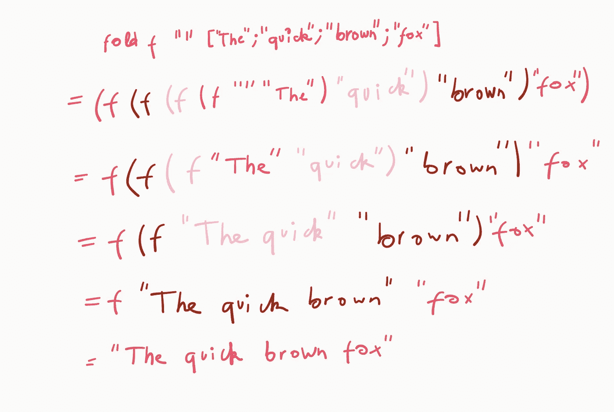
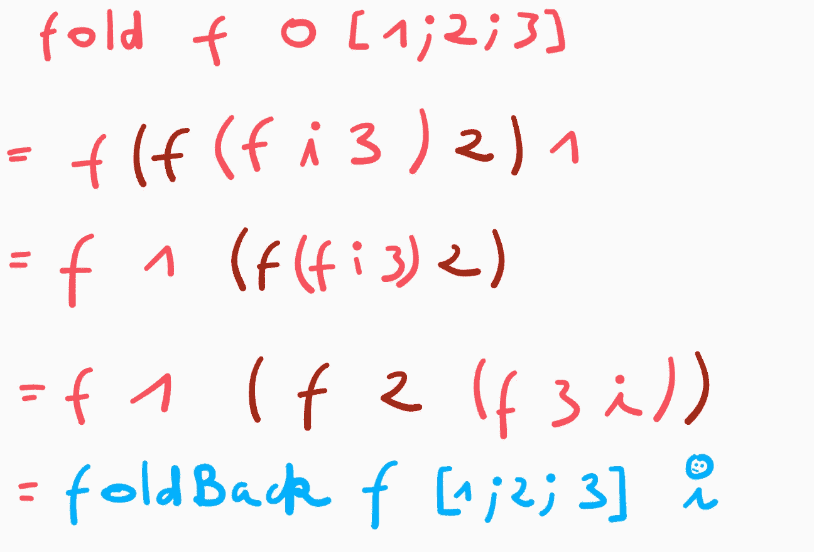
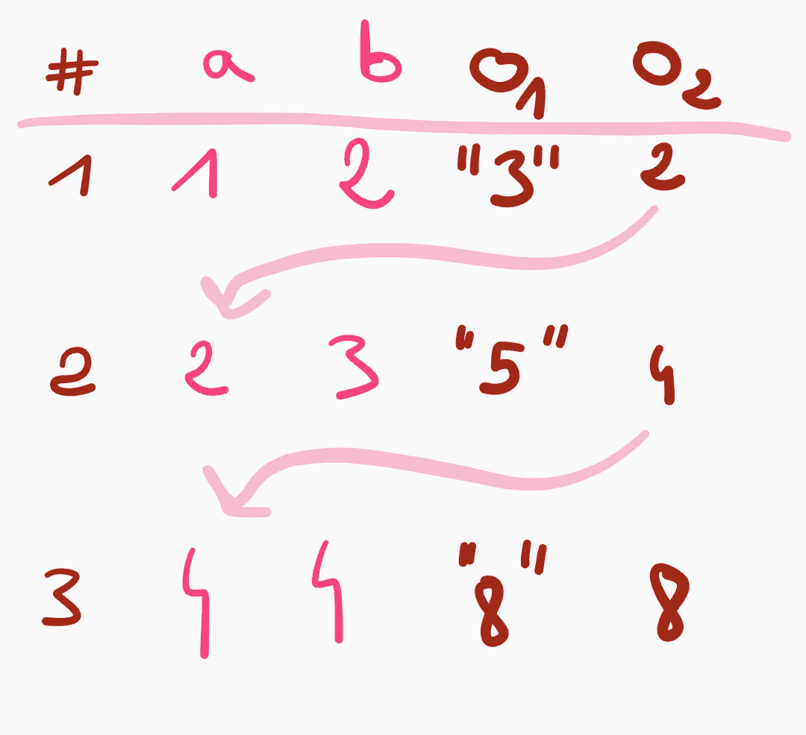
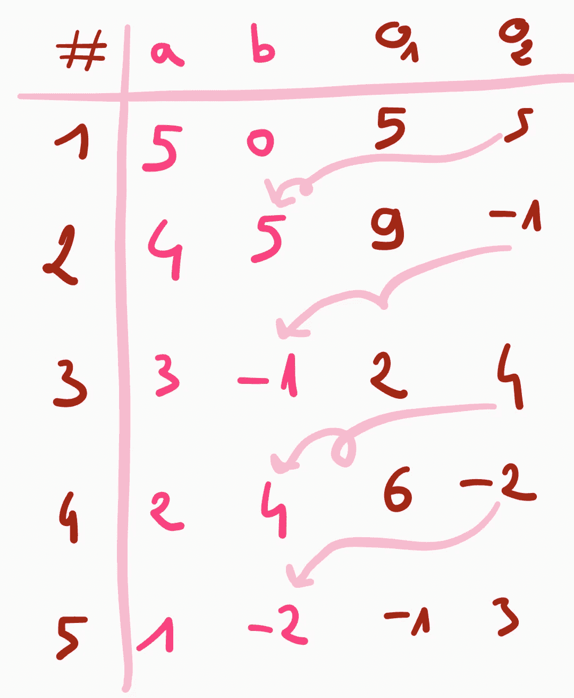

# 理解 F#中的函数 fold 和 foldBack

> 原文：<https://medium.com/geekculture/understanding-functions-fold-and-foldback-in-f-327af633a1db?source=collection_archive---------17----------------------->

`fold`和`foldBack`是 F#中对几种数据结构进行操作的两个非常有用的函数。在许多情况下，它们会阻止您编写递归函数。然而，第一次理解它们可能有点棘手。本文将解释它们是如何工作的，并给出它们帮助您做什么的大量例子。我们将关注列表，但是它们的行为与数组、集合和其他线性结构非常相似。

本文假设您对 F#有基本的了解，包括列表和数组的操作。

# 内容

1.  折叠；
2.  返送；
3.  fold2 和 foldBack2
4.  mapFold，mapFoldBack 和应用于范围查询。

# *折*

`List.fold`有签名`(’a -> 'b -> 'a) -> 'a -> 'b list -> 'a`。它需要一个函数`acc: 'a -> 'b -> 'c`，我们称之为*累加器函数*，一个`'a`类型的*初始值*和一个`'b`类型的元素列表。下面是`fold`的非编程归纳定义:

*空单上:* `fold f initialValue [] = initialValue`。

*非空列表上:* `fold f initialValue x::xs = fold f (f initialValue x) xs` *。*

乍一看，这个定义似乎有点令人生畏，所以我们现在将看到长度为 3 的列表的一个特例。我鼓励你仔细阅读归纳定义，找出`fold f init [1; 2; 3]`的表达式。

以下是您应该得到的结果:

`**fold f init [1; 2; 3] = (f (f (f init 1) 2) 3)**` **。**

请确保您理解函数的签名，以及为什么每个参数都应该具有给定的类型。

我们可以如下实现`List.fold`:

现在，让我们看一些例子，围绕这个函数做些什么来建立一些直觉。

最简单的一个是`sum`函数的实现，它接受一个整数列表并返回所有元素的总和。如果我们将`(+)`作为累加器函数传递，将 0 作为初始值，我们得到:

`fold (+) 0 [1; 2; 3] = ((+) ((+) ((+) 0 1) 2) 3)`。

堵住`(+) 0 1 = 0 + 1 = 1`，我们得到`((+) ((+) (1) 2) 3)`。

代入`(+) (1) 2 = 3`，我们得到`((+) (3) 3)`，等于 6。

我们可以使用`fold`实现的另一个有用的函数是`rev`，它接受一个列表`[x1; ...; xn]`,*反转*它，返回`[xn; ...; x1]`。在你继续阅读之前，我让你试着自己实现它。

我们将把空列表`[]`作为初始值，累加器函数`f xs x = x::xs`并传递我们想要反转的列表(我们称之为`li`)。确保你理解为什么这些参数匹配`List.fold`的签名。然后`fold`会调用`f [] li.Head`，导致`[li.Head]`；然后`f [li.Head] li.[1]`产生`[li.[1]; li.Head]`，依此类推，直到遍历完整个列表，将每个元素从第一个到最后一个添加到结果中。

最后一个有用的例子是函数`join`，它将一个字符串列表和一个分隔符映射到一个字符串。比如我们要有`join " " ["To"; "be"; "or"; "not"; "to"; "be"] = "To be or not to be"`。

我再次鼓励你在进一步阅读之前，尝试自己编写这个函数。

这里有一个建议的解决方案:

下面是上述函数中 fold 调用所采取的步骤。

# 监听

`foldBack`与`fold`相似，但签名略有不同:`foldBack: (‘a -> ‘b -> ‘b) -> ‘a list -> ‘b -> ‘b`。下面是一个可能的实现:

这不是最有效的实现，来自标准库的实现当然要快得多。我给出这个是因为它更自然，更接近数学定义。我们仍然可以注意到`fold`和`foldBack`都具有线性复杂度。

如果我们考虑三个元素的列表，我们有`**List.foldBack f [1; 2; 3] init = f 1 (f 2 (f 3 init))**`。

注意，如果`'a = 'b`和`f`是可交换的(即`f a b = f b a`对于任何`a, b`)，那么`fold`和`foldBack`执行相同的操作。下面是一个长度为 3 的列表的例子，但这确实不失一般性。

`List.foldBack`可以看作是*反折*。如果我们做一些类似于我们对`fold`所做的事情来实现`rev`功能，也就是说，

然后我们得到一个`[1 .. 10]`的副本，不影响顺序。这个想法允许我们实现几个操作列表的函数。

我们可以使用与上面的 *copy* 函数相同的原理来创建一个函数，它接受一个列表和一个值，并在删除所有出现的值后返回列表。为此，我们使用与之前相同的累加器函数，除了我们只在它不同于我们想要移除的值时才添加`x`。下面是我们实现它的方法:

函数`deleteAll`是采用谓词`p`并从列表中删除所有值`x`使得`p(x)`为真的函数的特殊情况。

现在让我们考虑函数`List.unzip`。它需要一个对列表， *[(x1，y1)；…;(xn，yn)]* 并返回一对列表，*([x1；…;xn]，[y1；…;yn])* 。

我们希望传递一个 pairs 列表(类型为`'c * 'd`)并获得一对类型为`('c * 'd) list`的列表。因此，如果我们保持和以前一样的符号，我们有类型`'a = 'c * 'd`和`'b = 'c list * 'd list`。我们的累加器函数必须将新对的两个元素添加到每个结果列表中。这给出了下面的实现。

另一个可以使用`foldBack`实现的`List`功能的例子是`map`。`map`取一个函数 *f* 和一个列表*【x1；…;xn]* ，并返回*【f x1；…;f xn]* 。如果 *f* 是`'c -> 'd`类型，那么我们有`'a =’c`和`'b = 'd list`。考虑到这一点，我们可以如下实现`map`:

# fold2 和 foldBack2

`List.fold2`和`list.foldBack2`执行与`fold`和`foldBack`相同的操作，除了它们对两个列表进行操作。

`List.fold2`的签名是`('a -> 'b -> 'c -> 'a) -> 'a -> 'b list -> 'c list -> 'a`。请注意，这两个列表不需要具有相同的类型。

一个简单的应用`fold2`的例子是我们前面看到的扩展:两个列表的和。

如果您使用非关联操作尝试此函数，它将在具有相同索引的每对元素上执行。

让我们来看一个稍微高级一点的例子。假设您有一个表示姓名的字符串列表和一个表示年龄的整数列表。您想要构建一个包含类型为`Person`的元素的列表，这是一个如下定义的记录:

这可以通过以下方式完成:

注意，顺序没有保留:返回列表的第一个元素是年龄为 547 的 John，第二个元素是年龄为 5 的 Mary，最后一个元素是年龄为 12 的 Peter。

解决这个问题的方法恰恰是`foldBack2`。它的招牌是`('a -> 'b -> 'c -> 'c) -> 'a list -> 'b list -> 'c -> 'c`。类似于我们对一个列表所做的，我们可以使用`foldBack2`来解决需要保持元素在原始列表中出现的顺序的问题。例如，我们可以创建一个映射两个列表的列表*[a1；…;an]* 和*【B1；…;bn]* 到一个列表*【C1；…;cn]* 与 *ck* = min( *ak* ， *bk* )对于所有指标 *k* :

# mapFold 和 mapFoldBack

我们将要提到的最后一个函数可能是最难掌握的:`mapFold`和`mapFoldBack`。`mapFold`有签名`('a -> 'b -> 'c * 'a) -> 'a list -> 'b -> 'c list * 'a`。它将累加器函数应用于列表中的每个元素(像`map`一样),并以与`fold`相同的方式累加它们。

累加器有两个参数， *a* 和 *b* 。 *b* 精确地获取列表元素的值。 *a* 取的第一个值是初始值，它取的第( *i* +1)个值是第 *i* 次调用累加器返回的第二个值。累加器每次调用返回的第一个值被添加到最终列表 *L* 中。`mapFold`然后返回 pair ( *L* ， *o* )，其中 *o* 是对累加器最后一次调用的第二次输出。

*Parbleu* ！

让我们来看看一个简单的程序，它没有什么真正有趣的东西，但希望它能帮助我们更好地理解`mapFold`做了什么:

事情是这样的:

列 *o1* 和 *o2* 是累加器每次调用时返回的第一个和第二个值。该函数的输出包括列 *o1* 中所有值的列表和列 *o2* 中的最后一个元素。

考虑到这一点，我们可以提出以下简单的实现。这里的目标不是考虑如何编写一个有效的版本，而是理解它实际上是如何工作的。有兴趣的话可以在那里找到官方实现:[https://github . com/dot net/fs harp//tree/master/src/fs harp/fs harp。Core/list.fs#L84-84](https://github.com/dotnet/fsharp//tree/master/src/fsharp/FSharp.Core/list.fs#L84-84)

`List.mapFoldBack`工作原理完全一样。它的签名是`('a -> 'b -> 'c * 'b) -> 'a list -> 'b -> 'c list * 'b`。

试着猜测下面这段代码的输出是什么。

准备好了吗？

下表显示了累加器函数的参数和返回值的演变:

最后的结果是`([-1; 6; 2; 9, 5], 3)`。整体结构与`mapFold`相同，除了两个主要区别。列表是向后求值的，即累加器函数第一个参数的第一个值是列表的最后一个值；并且每次调用累加器函数时，其输出的第一个值被添加到最终列表中，而不是被追加。这使得能够简单地重新实现`map`功能。这可以通过忽略累加器函数的第二个参数来实现:

不同之处在于，与`map`函数不同，新列表的值现在可以依赖于列表的其他元素。一个有用的应用程序是一个函数，它计算列表中一个元素和之前所有元素的总和，以及列表的总和。这一次，我们将使用数组而不是列表(稍后我会解释原因):

比如`partialSums [|1 .. 5|]`就是`([|1; 3; 6; 10; 15|], 15)`。这就是众所周知的前缀和数组。用`mapFoldBack`而不是`mapFold`实现的相同功能将给出`[|1 .. 5|]`的后缀和数组，即`([|15; 14; 12; 9; 5|], 15)`。

## 范围查询的应用

这对于执行*范围查询*很有用，也就是说，对初始输入的子集执行一些操作。这包括找到一个子数组的总和。

我们上面实现的`partialSum`函数相对于列表`li`的长度花费线性时间。当然，计算一个子数组的和不会降低效率，但是如果我们要重复操作几次，那么使用前缀和数组会使事情变得更快。给定部分和数组，我们可以计算常数时间内两个指数之间的任何和:

上面代码的输出是`[15; 11; 5]`。

这相对于查询的数量和列表中元素的数量以线性时间运行(计算部分和并评估 *q* 查询具有复杂度θ(*n*+*q*)，其中 *n* 是列表的长度)。这个运行时间是可以实现的，因为我们将前缀总和存储在一个数组中，该数组具有常数时间索引。

同样，我们可以用`Array.mapFold`来构建一个数组*【x1；…;xn]* ，也就是数组*【D1；…;dn]* 使得 *d1* = *x1* 和*dk*=*xk*-*x*{*k*-1 }对于所有索引 *k* ≥ 2(假设基于 1 的索引)。这有助于在常数时间内将某个常数加到某个范围内的所有值上，并在θ(*I*)时间内访问索引 *i* 处的值。

可以使用`mapFold`在线性时间内计算差数组，如下所示:

我们现在可以通过应用以下函数将 *n* 加到索引 *i* 和 *j* 之间的所有值上:

然后，我们可以在原始数组中检索索引 *i* 处的值，方法是将差分数组中索引 I 处的所有值相加。

# 结论

现在你应该对*折叠*系列的功能有了很好的理解。我建议记住他们的签名，这有助于记住每个参数的作用及其演变。

# 支持我！

感谢阅读！如果您觉得这篇文章很有帮助，请考虑关注我，帮助我达到继续加入中型合作伙伴计划所需的 100 名关注者的门槛。这是免费的，真的很有帮助。

也可以使用我的推荐链接订阅 Medium: [成为会员](/plans?subscribeToUserId=b705ec524bd3&source=entity_driven_subscription-b705ec524bd3------------------------------------)。你可以访问 Medium 上所有会员专用的文章，你的会员费将直接支持我。

🐉

# 参考

F#文档:[https://fs harp . github . io/fs harp-core-docs/reference/fs harp-collections-list module . html # fold2](https://fsharp.github.io/fsharp-core-docs/reference/fsharp-collections-listmodule.html#fold2)。

*Hans Rischel 和 Michael R. Hansen 使用 F#* 进行函数式编程。

*竞争程序员手册*作者安提·拉克索宁。