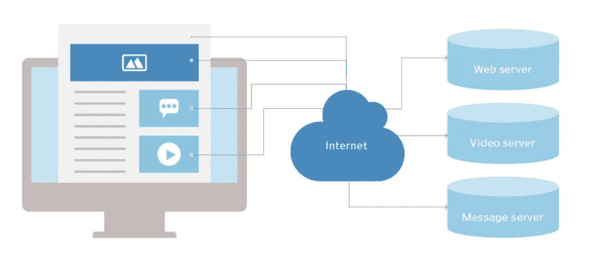
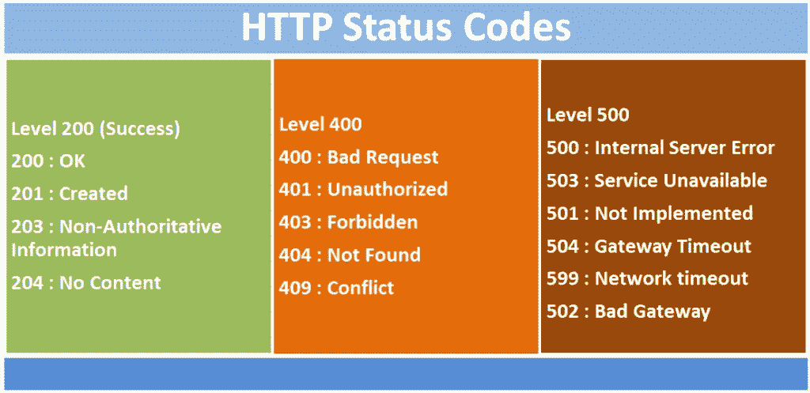
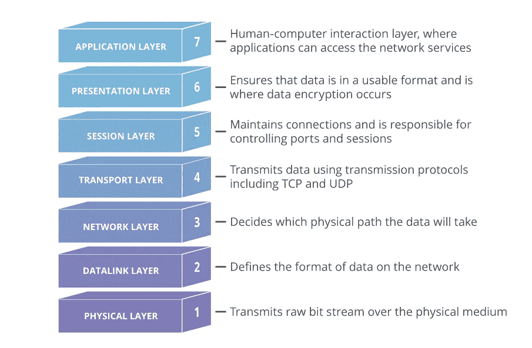

# 了解 HTTP 协议和 OSI 模型

> 原文：<https://medium.com/geekculture/understanding-http-protocol-osi-model-ba57cd5bda14?source=collection_archive---------3----------------------->

Photo by [Leon Seibert](https://unsplash.com/@yapics?utm_source=medium&utm_medium=referral) on [Unsplash](https://unsplash.com?utm_source=medium&utm_medium=referral)

如果你曾经问我当你浏览一个网页时，在基本层面上发生了什么，我的回答将是这样的；因此，每当你访问网页时，你的浏览器都会向服务器发出 HTTP 请求。然后，该服务器响应一个资源，如图像、视频或 HTML 网页，您的浏览器将为您显示。这是回答这个问题最简单的方法。然而，我们都知道在底线上有更多的事情发生。但是在本文中，我们将学习这个过程的主要组成部分之一，HTTP 协议。

# 什么是 HTTP？

HTTP 的首字母缩写代表**超文本传输协议**。HTTP 是一组标准，允许万维网(WWW)的用户交换在网页上找到的信息。当访问任何网页时，在地址前输入“**http://”**告知网络浏览器通过 HTTP 进行通信。例如，谷歌的网址是 https://www.google.com。但是如果你注意到，今天的浏览器不再需要在 URL 前面加 HTTP，因为它是默认的通信方法。然而，它被保存在浏览器中，因为需要分离诸如文件传输协议(FTP)之类的协议。

> **其他值得注意的协议有:**
> 
> **文件传输协议(FTP):** 是用于通过网络在客户端和服务器之间传输文件的标准协议。
> 
> **简单邮件传输协议(SMTP):** 是电子邮件传输的标准。

HTTP 被定义为无状态的“客户端-服务器”协议或“请求-响应”协议。无状态意味着所有的请求都是相互独立的。因此，来自浏览器的每个请求本身必须包含足够的信息，以便服务器满足请求。这意味着每个请求在执行时都不知道在它之前或之后执行了哪些请求。

客户端-服务器协议描述了两台计算机之间的通信。客户端(浏览器或其他应用程序)请求数据，服务器提供响应。所以，这就是我们如何去一个网站，并在该网站上看到信息。使用 HTTP 协议，客户端请求总是首先发生，然后是服务器的响应。

Image: How HTTP Works ([https://whatis.techtarget.com/](https://whatis.techtarget.com/))

# HTTP 对 HTTPS

HTTPS 的 S 代表“安全”HTTPS 使用 **TLS** 或 **SSL** 来加密 HTTP 请求和响应。所以基本上，这两个协议之间唯一的区别是 HTTPS 使用 TLS (SSL)来加密普通的 HTTP 请求和响应。因此，HTTPS 比 HTTP 安全得多。因为 HTTPS 可以防止窃听和中间人(MitM)攻击。使用 HTTP 的网站在 URL 中有**“HTTP://”**，而使用 HTTPS 的网站有**“https://”**

# HTTP 请求

当你想使用网络浏览器访问一个网站时，你只需输入网址并按回车键。因此，当客户端设备(网络浏览器)向服务器请求加载网站所需的信息时。该请求为服务器提供了调整其对客户端设备的响应所需的信息。有几种 HTTP 请求方法被称为 **Get、Post、Delete、Put 和 Head** 。然而，在这种情况下，它使用了 Get 请求，因为这是我们获取网站内容的方式。

*   **GET:**GET 方法用于使用给定的 URI 从给定的服务器检索信息。使用 GET 的请求应该只检索数据，不应该对数据有其他影响。
*   **HEAD:** 与 GET 相同，但只传输状态行和标题部分。
*   **POST:**POST 请求用于向服务器发送数据，例如客户信息、文件上传等。使用 HTML 表单。
*   **PUT:** 用上传的内容替换目标资源的所有当前表示。
*   **删除:**删除由 URI 给出的目标资源的所有当前表示。
*   **连接:**建立到由给定 URI 标识的服务器的隧道。
*   **选项:**描述目标资源的通信选项。

# HTTP 响应

HTTP 响应消息是基于客户端设备发出的 HTTP 请求，由 web 服务器发送到客户端设备的数据。嗯，每次有请求，HTTP 总是会响应它。HTTP 响应中包含的信息被修改为服务器从请求中接收的上下文。

因此，每当服务器响应 HTTP 请求时，通常它会发出**响应代码**，表明请求正在被处理，请求中有错误或者请求正在被重定向。

Image: HTTP Status Code ([https://softcrony.com/](https://softcrony.com/))

# OSI 模型

那么，这是什么 OSI 模型或**开放系统互连模型**。该模型用于描述计算机系统通过网络进行通信的七个层次。它是网络通信的第一个标准模型，在早期被所有主要的计算机和电信公司采用。但问题是现代互联网不是基于 OSI，而是基于更简单的 TCP/IP 模型。

然而，OSI 7 层模型仍然被广泛使用，因为它在各种用例中非常有用，例如，它有助于可视化和交流网络如何运行，并有助于隔离和排除网络问题。

Image: 7 layers of OSI Model ([https://www.cloudflare.com/](https://www.cloudflare.com/))

现在我将从上到下解释 OSI 模型的每一层。

## 应用层

这是唯一直接与用户数据交互的层。web 浏览器和电子邮件客户端等软件应用程序依赖于应用层来发起通信。为了让事情更清楚，客户端软件应用程序不是应用层的一部分。然而，应用层负责协议和数据操作，软件依靠它们向用户提供信息。应用层协议包括 **HTTP，文件传输协议(FTP)，邮局协议(POP)，**和**简单邮件传输协议(SMTP)。**

## 表示层

这一层主要负责准备数据，以供应用层使用。因此，它定义了两台设备应该如何编码、加密和压缩数据，以便在另一端正确接收。表示层接收应用层传输的任何数据，并为会话层上的传输做准备。

如果存在通过加密连接进行通信的设备，表示层负责在发送端添加加密，并在接收端解码加密。因此，它可以向应用层提供未加密的可读数据。

## 会话层

这一层负责创建设备之间的通信通道，称为会话。此外，会话层还负责打开会话，确保它们在数据传输时保持打开和正常工作，并在通信结束时关闭它们。

此外，它可以在数据传输期间设置检查点，如果会话中断，设备可以从最后一个检查点恢复数据传输。

## 传输层

这一层负责两台设备之间的端到端通信。它接收会话层传输的数据，并在发送端将其分成**【段】**。传输层负责在接收端重组数据段，将其转换回可供会话层使用的数据。传输层还负责流量控制和错误控制。

## 网路层

这一层负责促进两个不同网络之间的数据传输。如果有两台设备在同一个网络上通信，则网络层是不必要的。网络层将来自传输层的数据段分解成更小的单元，称为“**数据包**”因此，在发送方设备上，这些数据包在接收方设备上重新组装。网络层还为数据找到到达目的地的最佳物理路径；这就是所谓的**路由。**

## 数据链路层

这一层与网络层非常相似，只是数据链路层有助于同一网络中两台设备之间的数据传输。数据链路层从网络层获取数据包，并将它们分成更小的片段，称为“**帧”**数据链路层还负责**网内通信**中的流量控制和差错控制。

## 物理层

这一层负责网络节点之间的物理电缆或无线连接。这也是数据被转换成一个**比特流**的层，该比特流是一串 1 和 0。两台设备的物理层还必须在信号约定上达成一致，以便能够区分两台设备上的 1 和 0。

所以，这是文章的结尾，我希望你喜欢它。快乐编码👨‍💻。

# 参考

阿德贝辛，b，2021。*HTTP 介绍*。[在线] DEV 社区。可在:<https://dev.to/mobolanleadebesin/introduction-to-http-4lc0>【2021 年 5 月 15 日获取】。

阿维亚尼，g，2019。*HTTP 简介:你需要知道的一切*。[在线]freeCodeCamp.org。可查阅:<https://www . freecodecamp . org/news/http-and-everything-you-need-to-know-on-it/>【2021 年 5 月 16 日获取】。

学习中心。n.d. *什么是 OSI 模型| 7 层解释| Imperva* 。[在线]见:<https://www . imper va . com/learn/application-security/OSI-model/>[2021 年 5 月 16 日查阅]。