# 理解不变信息聚类

> 原文：<https://medium.com/geekculture/understanding-invariant-information-clustering-71756ed9f885?source=collection_archive---------10----------------------->

## 使用互信息和自动生成的数据的无监督图像分割

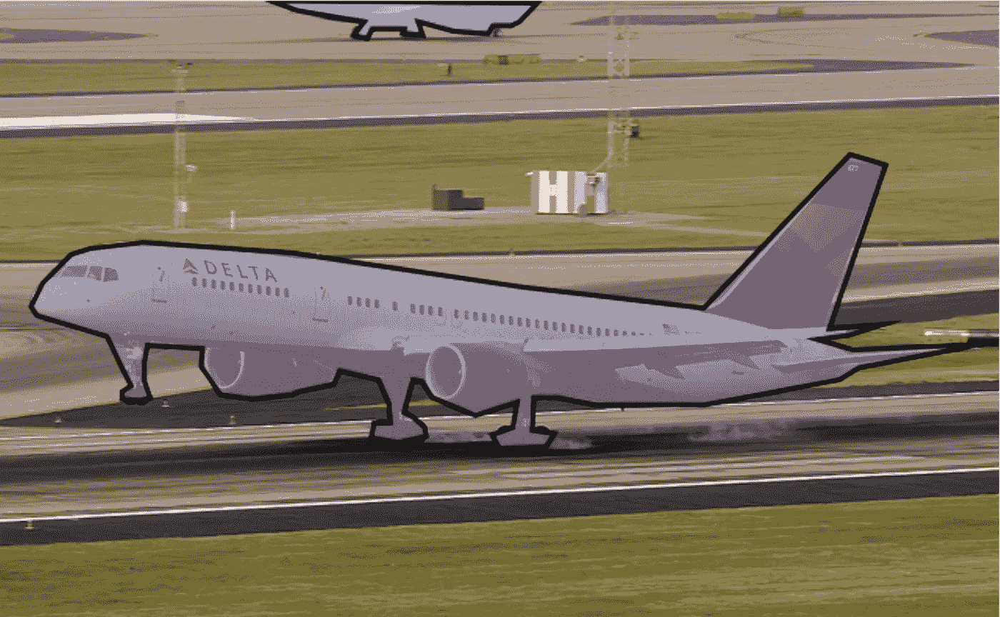

计算机视觉一直是热门话题，从猫狗预测到自动驾驶汽车。每个产品中都有一点人工智能，通过深度学习模型实现。他们的工作变得越来越好，但由于数据量发展速度非常快，让他们工作的培训时间和资源大幅增长。

标题可能有点混乱；我们将在本文后面对其进行分解。主线是:我们如何在没有人类太多输入的情况下从语义上分割图像并学会这样做？

## TL；速度三角形定位法(dead reckoning)

从数据注释的角度来看，图像分割不一定很昂贵。您总是可以通过获取一系列图像并定义一组可逆变换来生成受控数据集。最终，本文的目标是消除必须手动分割图像进行训练的麻烦。相反，他们使用一个简单的网络架构和以下假设:有一个图像和一个简单的变换，比方说 90°旋转，在恢复旋转后，网络的输出应该是相同的。下面的例子更清楚地说明了这一点。

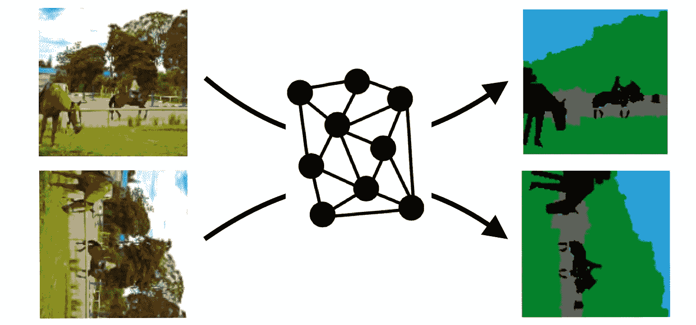

## 我们是谁？

这篇文章是由代尔夫特大学数据科学硕士学生 [Anuj](http://www.linkedin.com/in/anuj-singh23) 和 [Mihai](https://antonmihai.com/) 创作的，旨在以更随意的方式介绍用于无监督图像分类和分割的不变信息聚类，并越来越深入地研究背后的数学和方法。然后，我们还介绍了我们的工作和复制的结果。

## 这篇论文是关于什么的？

不变信息聚类用于无监督的图像分类和分割，名字相当长，所以我们从现在开始将它称为 IIC。IIC 由来自牛津的 3 名研究人员在 2019 年计算机视觉国际会议上发表，提供了新颖的图像聚类和分割方法，旨在减少注释每张图像的劳动，这相当耗时。这被称为互信息最大化，它学习对象的共同点，不管它们的位置、方向或颜色方案。

# 概观

让我们陈述一些显而易见的事实来稍微熟悉一下这个问题的范围。在建立了一些领域知识之后，我们将更深入地研究为什么、做什么和如何做这篇论文，最后解释结果。

## 图象分割法

图像是多个像素的集合，每个像素包含一个介于 0-255 之间的数值，表示需要多亮和/或需要什么颜色，这取决于图像表示空间的选择(灰度\rgb\rgba)。分割处理的任务是将完整的图像分割成独立的组或段，这些组或段基于这些段所代表的内容。

分类处理标记图像以将数据集分成不同的类别，而对象检测通过在对象周围创建边界框来识别对象的位置，从而处理图像定位，而分割则通过增加其实现的粒度来更进一步。分割模型通过用属于每个类别的概率值标记每个像素来提供图像内对象的精确轮廓。

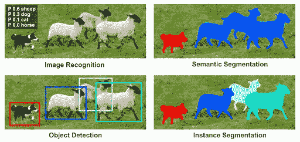

这篇博文只讲语义分割，属于某个特定类的所有像素都用相同的颜色表示，即使它们表示不同的对象但属于同一个类。

## 分割方法

现有的图像分割方法可以大致分为两个分支:基于图像处理的方法和基于计算机视觉的方法。基于图像处理的方法处理原始过程，其中固定的方法用于所有种类的图像，例如基于区域和基于边缘的分割方法。在基于区域的分割中，根据像素值对于属于不同语义类别的对象会显著变化的直觉，使用阈值将像素值分成类别。基于边缘的分割方法使用检测图像内的垂直和水平边缘的核，因为不同的对象具有将它们分开的边缘。虽然这些方法建立在关于图像的合适的推理和假设上，但是这些方法不能很好地执行，并且不能在一组复杂和复杂的图像上进行推广，在这些图像中没有显著的灰度差异或灰度像素值的重叠，或者在图像中有几个边缘。

基于计算机视觉的方法在方法上相当复杂，并且在大型数据集上也很通用。这些包括监督和非监督学习任务，以分配概率值给每个像素，指示它们所属的类别。某些监督图像分割算法包括基于掩模 R-CNN 和自动编码器的 U-Net 模型。这些将图像作为输入，并针对表示为遮罩的每个像素的真实目标类别进行训练。然后，经过训练的模型可以基于类别的总数来预测图像的遮罩。

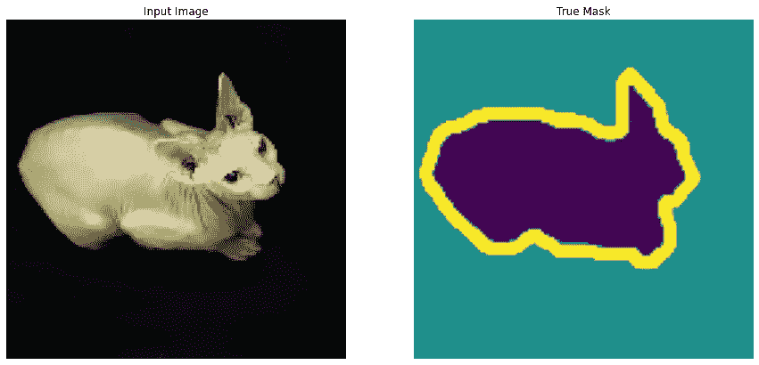

# 为什么？

## 真实用例

由于分割实现了图像中每个对象的精确轮廓，这种理解对象边界的高粒度在需要检测对象的形状和细节的任务中起着极其重要的作用。

图像分割的一些真实世界使用案例如下——自动驾驶汽车中的交通控制系统，从卫星图像中检测陆地物体，以及检测癌细胞，其中形状在确定细胞的恶性程度方面起着至关重要的作用。

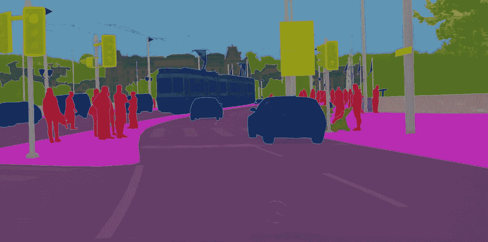

Object Localization and Segmentation to help self-driving cars make decisions by understanding the environment around them

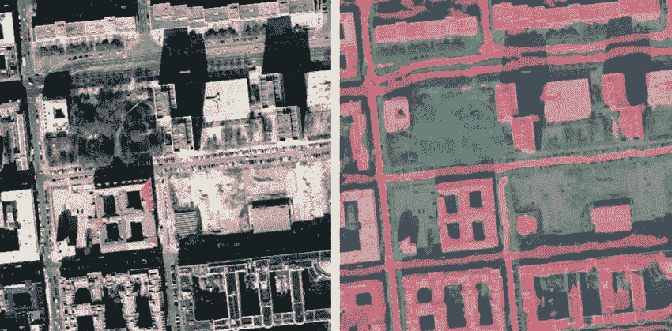

Semantic Segmentation of roads and residential areas using Satellite Imagery

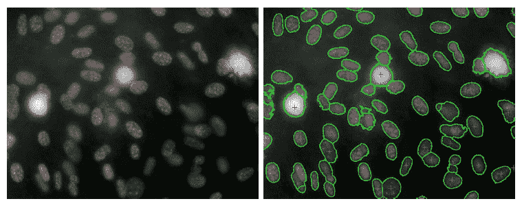

Cell Segmentation for cancer detection

## 为什么要无监督分割？

当考虑这种无监督方法的必要性时，一个常见的问题浮现在脑海中，那就是——为什么还要费心尝试以无监督的方式分割图像呢？仅仅为了解决简单的分割任务而优化互信息的信息理论概念，难道不是不必要的复杂化吗？

确实有十几个非常强大的监督算法，它们只需要图像及其目标屏蔽输出来训练自己在新图像上完成这项任务，但需要注意的是，这类算法需要每个图像的目标注释。监督学习算法基于监督的概念起作用，其中模型必须被提供有期望输出的实例，以准确地学习一个函数，该函数可以在没有监督的情况下在未来复制这种行为。

不幸的是，在我们的图像分割的例子中，为每个图像以蒙版的形式获得注释的成本是过高的。监督学习算法需要大的标记数据集来学习可概括的函数以获得最佳测试性能，并且手动标记图像片段的昂贵费用极大地限制了它们在许多场景中的适用性。

这使得开发在没有目标标记的情况下也能很好工作的无监督方法的需要势在必行。

# 什么？

想象一下，给你一个任务，根据图像的内容将它们聚集在一起。请记住，我们没有得到任何与这些图像相关的标签来描述它们的内容。用人类的直觉来完成这项任务的一种自然而有效的方法是首先识别每幅图像的内容并理解它们的含义(我们的大脑会立即这样做)，然后基于这种上下文理解来分离它们。

作者使用互信息的概念将该任务转化为机器可理解的数学计算问题。互信息是两个随机变量之间相互依赖程度的度量。它通过观察一个随机变量来量化获得的关于另一个随机变量的信息量。在直观的层面上，两个图像之间的互信息指示这两个图像之间的共享信息量。但是为了得到一种算法来挑选，然后学习关于相似图像的东西和抽象，使它们的互信息度量最大化，训练了卷积神经网络。针对最大化两个相似图像之间的互信息的功能损失来训练 CNN。馈入互信息函数的信息是 CNN 输出的每个图像的概率值的 2 个向量。概率值是属于预定义聚类的每个类别的图像的概率。这里需要注意的是，用于计算概率的细胞神经网络。图像对的向量共享它们的权重。

俗话说，天下没有免费的午餐。这里，困难从获取图像的标签转移到获取与每个图像相似的其他图像。但是由于一些午餐比其他的便宜，通过数据增强技术获得彼此非常相似的图像比获得每个图像的真实标签更容易。通过使用任何这种保持图像内容完整的扰动来随机扰动原始图像，从而创建图像对。为了扩展这种方法的应用，它可以在图像内部的像素尺度上实现。在对相邻像素应用若干卷积运算之后，相邻像素之间的互信息可以最大化。这些卷积块的权重将通过在整个函数上反向传播损失梯度来调整，以在多个类别上以概率值向量的形式更好地表示每个图像像素。

为了扩展这种方法的应用，它可以在图像内部的像素尺度上实现。在对相邻像素应用若干卷积运算之后，相邻像素之间的互信息可以最大化。这些卷积块的权重将通过在整个函数上反向传播损失梯度来调整，以在多个类别上以概率值向量的形式更好地表示每个图像像素。

一旦该模型学习了多个数据样本和几个时期的训练，它就使用最大化图像之间的互信息的概念，根据块之间内容的相似性为每个像素分配概率值。

# 怎么会？

作者引入了一种新的目标/损失函数进行优化，以无监督的方式从头学习神经网络分类器。

不变信息聚类(IIC)算法旨在学习图像的参数化表示，该表示保留图像对之间的公共信息，并丢弃不相关的特定于实例的信息。

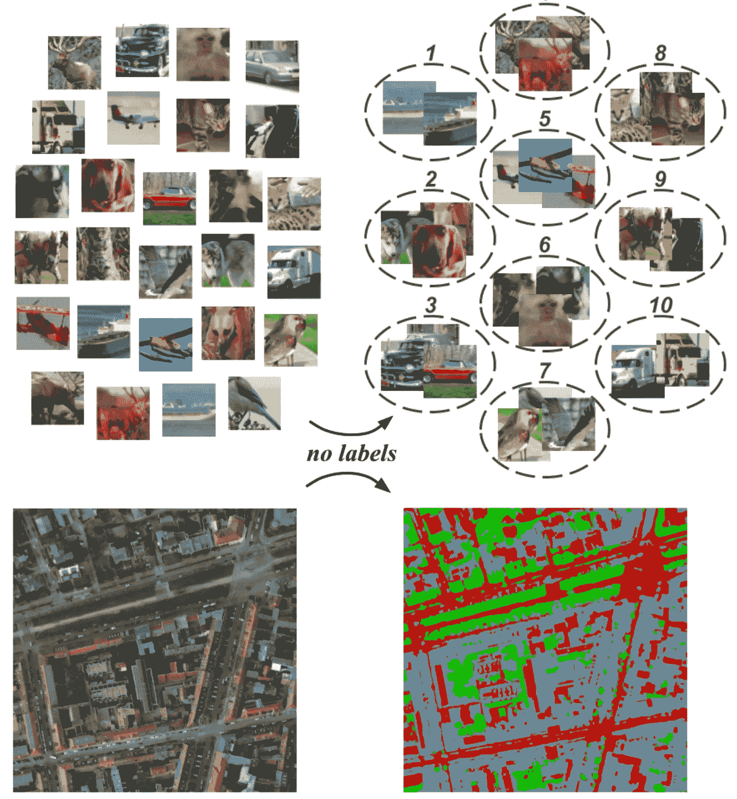

Clustering and Segmenting Images using unsupervised learning by maximizing invariant mutual information

因此，想法是最大化原始图像和图像的随机扰动版本之间共享的互信息:max I(φ(x)，φ(x’)，其中φ:x→y

图像φ的参数化表示只是一个卷积神经网络，它在输出层使用 softmax 函数将图像转换为概率值的向量。向量的每个元素代表属于目标类的概率。

x’是图像的随机扰动版本，其中扰动 x’= g(x)在几何和光度上是不变的，例如:缩放、倾斜、旋转、翻转、对比度/饱和度变化等。

用简单的英语来说，这意味着扰动必须只改变图像的几何或光度特性，而不干扰图像所描绘的内容。

然后，IIC 被迫恢复对输入到神经网络的图像对不变的信息。神经网络充当信息流到目标函数的瓶颈，因此通过训练模型以最大化图像对的输出向量之间的互信息，模型学习检测和输出图像的最合适的输出类别向量。

为了将这一概念应用于图像中的每个像素以进行有效的分割，目标函数被应用于作为每个输出像素的 CNN 感受域的图像块。并且不是计算图像对，而是通过计算它们的随机扰动为图像中的每个小块生成图像对。此外，与完整的图像不同，我们可以访问小块之间的空间关系，因此可以使用局部空间不变性。这意味着我们可以使用图像中的相邻补片来形成补片对。

因此，对于 RGB 图像:

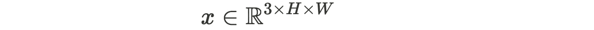

可以形成路径对:

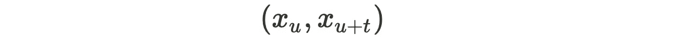

其中 ***u*** 和 ***u+t*** 是图像中的像素位置，其中 ***t*** 是任何方向上的小位移。CNN 输出所有补丁 ***xᵤ*** 的概率向量。

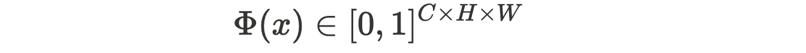

其中 ***C*** 是班级总数。最后，最大化互信息的目标对每个面片对而不是每个图像对的这些输出概率向量进行操作。我们将在随后的章节中更详细地讨论互信息的概念和 IIC 模型架构背后的直觉。

## 正式定义

我们先从流程的直观解释开始。设 ***T*** 为可逆变换函数， ***I*** 为图像，这样***I’= t(I)******t⁻(I’)= I***。设 ***S*** 为分割函数，在我们的情况下为神经网络，其为图像的每一类输出概率图。假设图像被分割成*背景*、*地面*和天空，并且其大小为 ***宽×高*** ，对于前面提到的每一类，网络的输出将是大小为***×宽×高*** 的 ***3*** 矩阵。像素概率最高的类是为其选择的类。因此，我们将图像分成 3 类。

传统上，如前所述，人们会花大量的时间标注一个巨大的训练集，为每个像素设置类，这应该是一致和正确的。你可以想象注释一张图片要花多少时间。将此乘以 ***40.000*** 。这是本文处理的最小数据集(即 CocoStuff3)的图像数量。

作为一个读者，你可能想知道怎么会有人只用这三个类来拍照。很有可能，任何图像都会包含一些其他类别，无论是人、汽车还是建筑物。在注释工作的顶部，标注者还必须定义一个覆盖所有非填充类的掩码。这一定是大量的工作。

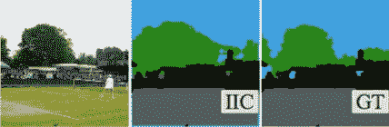

Real image — result of the network — segmentation by a human.

回到我们的 ***T*** ， ***S*** 和 ***I*** ，论文作者提出的方法是取图像 ***I*** ，构建一个几何变换后的图像***I’= T(I)***。有了这些，预测每一个的每像素概率， ***P = S(I)*** 和 ***P' = S(I')*** ，然后期望，通过恢复后者的所有几何变换得到类似的结果: ***P ≈ T⁻ (P')*** 。

这使我们进入下一部分，即相互信息。

## 互信息和配对数据

正如前面简要介绍的，您可能已经感觉到我们处理的是成对数据。虽然这个学习框架应该在任何通用的成对数据集上学习(这将在后面涉及)，但它给出了使用成对图像的特定情况。这个想法是让网络学习语义相似的图像之间的共同点以及不同图像之间的不同点。这叫做相互信息:

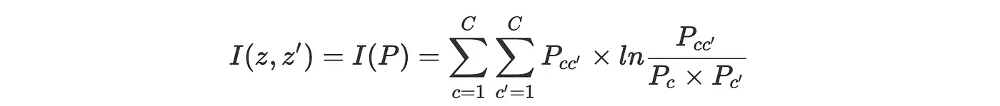

很困惑，对吧？我们来分解一下。对于更简单的聚类用例，对于每个类别*，每个图像有一个预测。如果我们取一对图像并组合它们的预测，我们得到 ***P ∈ C×C*** ，一个包含所有概率组合的矩阵。实际上， ***Pcc' = P(z=c，z'=c')*** 和 ***Pc*** 就是那个具体列的和， ***∑ Pcc'*** 。如果我们拍摄两个猫图像，我们会期望它们共享相同的互信息，从而具有高 ***P 猫 cat'*** ，最大化互信息 I .但是我们说我们不手动注释或配对图像，这是真的。*

*图像对是通过获取原始图像及其不破坏内容的扰动版本而自动生成的。我们可以使用颜色过滤器，模糊和不可逆的几何变换。其思想是，如果我们有一个猫图像，并且同样的猫图像在 ***90*** 旋转，我们期望如果将后者旋转回来，它们的输出是相同的。*

## *集群是如何工作的？*

*采用前面章节的图像对+互信息函数，我们最终得到或多或少的分类算法。如果我们使用自动生成的对，设法让模型学习汽车和猫的共同点，我们就有了一个非常坚实的基础来概括我们想要多少个类。*

*还有一个转折。一些数据可能进入两个桶:简单和干净或充满干扰类。我们可以在第一个上训练我们的模型，但也引入一个辅助的过聚类头，它将学习分类，也许精度较低，有噪声的数据。这样，我们的简单分类器将受益于用另一双眼睛看更杂乱的图像。这就像一个学生为了一个超级难的问题而学习，只是为了在一个难的问题上做得更好。*

## *分段是如何工作的？*

*更概括地说，如果我们将逐图像聚类转换为逐块聚类，我们最终会收敛到逐像素聚类，这确实是图像分割。我们给每个像素分配一个类，这样我们就把实体分开了。为了使这种预测足够通用，而不仅仅是随机的每像素预测，他们对相邻的小块进行了这样的预测，因此它们也包括了空间关系。您可以将所有这些操作或多或少地想象成一个卷积，它接受一个补丁并返回一个值(在我们的例子中，每个预测的类 c 有一个概率值。*

*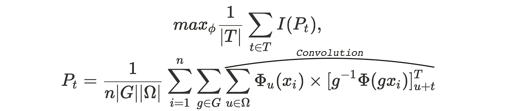*

*首先，我们来分解一下这块巨石。卷积部分计算互信息，乘积的第一项是对原始图像的预测，第二项是对变换后的原始图像的未变换预测。前面的求和项涉及批次和图像补片，而 P_t 与批次大小和补片总数成比例。现在应该清楚一点了。*

## *互信息作为损失函数*

*我们已经定义了数据模型，这个函数告诉我们模型执行得有多好，但是我们如何让它学习。我们必须将互信息分数转换成损失函数。因为它已经预测了每像素的“损失”值，所以它直接是性能的良好度量。*

*互信息扩展为 ***I(z，z’)= H(z)—H(z | z’)***。因此，最大化该数量在最小化条件聚类分配熵***H(z | z’)***和最大化个体聚类分配熵 ***H(z)*** 之间进行权衡。***H(z | z’)***的最小值是 0，当集群分配彼此完全可预测时获得。 ***H(z)*** 的最大值是 ***lnC*** ，是在所有聚类都被同等可能地选取时得到的。当数据在簇之间平均分配，使它们的质量相等时，就会发生这种情况。因此，如果所有样本都被分配到单个聚类(即，所有样本的输出类都相同)，则损失不会最小化。因此，由于最大化互信息自然地平衡了增强预测和质量均衡，它避免了退化解的趋势(仅预测一个类别)。*

## *学习流程*

*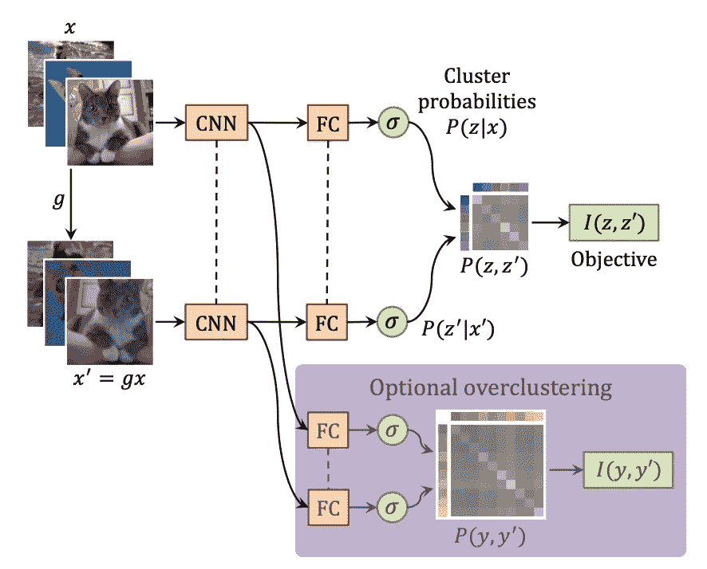*

*正如您可能猜到的那样，该流程从大量未标记的图像开始，旨在创建一种无需太多注释工作的分割机制。在按顺序加载成批数据后，选择一些随机转换并保存以备将来撤消。然后，学习流程或多或少地遵循传统路径，数据序列向前流动，当它向后通过网络时，互信息损失调整权重。在很高的层面上，这是整个学习流程，再次表明从自动生成的数据对中学习是多么容易，验证了他们的数学假设，即互信息确实有效。*

*值得注意的一件有趣的事情是，由于它们没有其片段的真实标签，它们在它们的补丁和测试集中的补丁之间执行匹配，从而建立在检查模型性能时表现最佳的排列。*

# *结果*

## *击败所有的索塔*

*从一个特定的角度来看，这项研究很重要:它在许多领域和挑战上都超过了以前的最先进水平。新的体系结构在各种数据集上表现出更好的成绩，STL、CIFAR、MNIST、COCO-Stuff 和 Potsdam 都在其中。此外，它以显著的优势击败了他们。*

## *72.3%*

*你通常会说 *72.3%* 是一个相当糟糕的准确性。三思而后行。作为人类，我们对深度有很好的感知，但经常发现很难区分远处的物体和天空，或者背景中的草地和灌木丛。鉴于一个计算机视觉模型，在没有监督的情况下训练取得了这种性能，这是朝着更好的自动驾驶汽车，更精确的机器人和更安全的人工智能系统迈出的一大步。*

*虽然他们取得了这个非常好的成绩，但有一个转折。*

*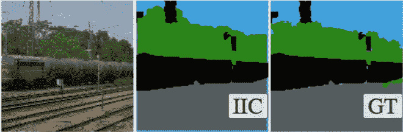*

*看这张图片，你看到了多少个分段的类？4，对吧？不应该是这种情况，因为模型只知道识别地面、天空和背景。事情来了，他们使用一个预定义的掩码，删除所有非素材内容。他们在蒙版不超过图像大小 *25%* 的图像上训练模型。虽然从研究的角度来看，这是一个非常好的输出，并证实了数学假设，但这种方法可能无法直接用于实际生产环境。在一辆自动驾驶汽车中，除了天空、背景和地面之外，没有任何东西上的遮罩，因此模型可能会发现很难判断一个人是人，还是只是远处的一个物体。如果我们知道现实生活中的模型接收的图像只有这 3 类，完美，*保证 72.3%* 的准确性，否则，可能会有一些与预测屏蔽像素相关的问题。*

## *复制纸张*

*我们重写了部分代码，使其更加模块化。这使我们能够更容易地进行实验，并从头开始在云中训练模型。在仅仅 12 个小时内，我们得到了 68% T1 的准确率，非常接近他们 72.3% T3 的 T2，我们相信再多几个小时就可以训练出 70% T5 以上的 T4。*

*我们想到了一个小实验，我们采用相同的测试集，但完全排除了面具，只是为了了解模型在现实世界中的表现。由于蒙版最多是图像的 *25%* ，这是给分类器的加分，我们期望现实生活中的准确率∈*【47.3%，72.3%】*。由于度量不能以确定的方式计算(我们必须选择一些主观规则来预测掩码)，我们决定不继续走这条路，因为在前一个间隔中数字可以是随机的。该模型被学习来完全忽略掩模像素，所以我们觉得从任意试探法检索的准确度中没有多少价值。*

# *结论*

*本文介绍了一种方法，这种方法可能是进一步研究这一主题的基础，在这种方法中，*最先进的*结果可以在没有人工标记的情况下获得。我们认为未来的研究将同样的技术应用于语义分割句子甚至视频序列。*

*在 CocoStuff3 上的 *72.3%* 准确度，用于无监督图像分类和分割的不变信息聚类论文证明了*最先进的*结果可以通过简单的模型实现，但是具有深刻的数学直觉。*

*这篇文章基于姬旭、若昂·亨利克斯和安德里亚·维瓦尔迪在 [IIC 论文](https://arxiv.org/abs/1807.06653)中的工作，而你可以在这里找到我们修改后的代码[。](https://github.com/MihaiAnton/tudelft-iic-reproduction)*