# 了解 JavaScript 映射和集合

> 原文：<https://medium.com/geekculture/understanding-javascript-maps-and-sets-ca31a9bf40da?source=collection_archive---------19----------------------->

在 JavaScript 中，开发人员经常花费大量时间来决定使用正确的数据结构。这是因为选择正确的数据结构可以使以后操作该数据更容易，从而节省时间。

作为开发人员，我们通常使用对象或数组来存储数据。有了 ES6，还有两种保存数据的方式——地图和集合

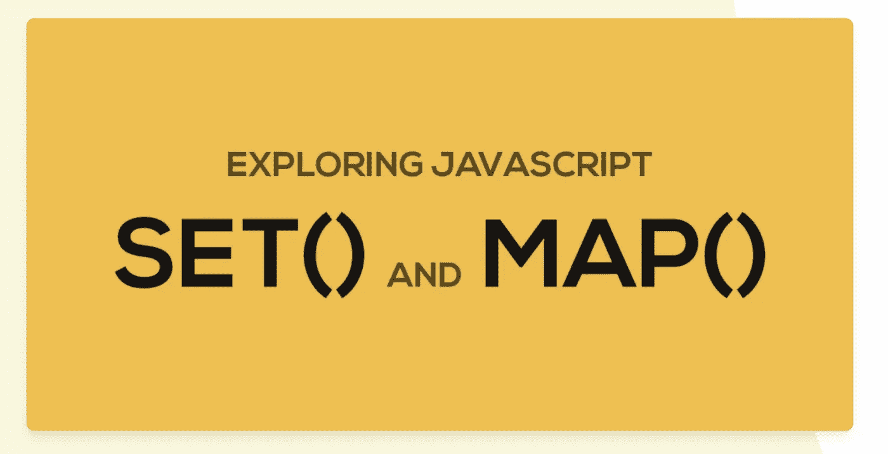

# 1.地图

映射是 ES6 中引入的键值集合。它填补了数组(没有键值对)和对象(键值对，但比简单的集合复杂得多)之间的空白。

1.  `Map` 对象保存键值对，并记住键的原始插入顺序。
2.  地图更接近物体

一、用于创建地图

```
const map = new Map()
```

二。用于在地图中添加值

```
map.set('firstName', 'Luke')
map.set('lastName', 'Skywalker')
map.set('occupation', 'Jedi Knight')
```

三。对于基于键的获取(这些就像 setters 和 getters):

```
map.get('occupation')
```

四。用于删除或清除地图中的数据

```
map.delete('occupation');    // deletes one specific key in map
map.clear();                 // deletes all keys in map
```

动词 （verb 的缩写）用于检查尺寸。这是在地图中可用的数组的一种行为。

```
map.size       // tells total size of an array
```

不及物动词另外两种创建地图的方法

```
**// Method 1: Create and initialize Map at the same time**const map = new Map([
  ['firstName', 'Luke'],
  ['lastName', 'Skywalker'],
  ['occupation', 'Jedi Knight'],
]);**// Method 2: This is ready made to convert Object into Map**const luke = {
  firstName: 'Luke',
  lastName: 'Skywalker',
  occupation: 'Jedi Knight',
}

const map = new Map(Object.entries(luke))
```

七。或者，我们也可以将地图转换回对象或数组

```
const obj = Object.fromEntries(map);   // Converts map to Object
const arr = Array.from(map)            // Converts map to Array
```

八。使用 has()检查映射中是否存在该键

```
// Check if a key exists in a Map
map.has('age')   // false
map.has('lastName') // true
```

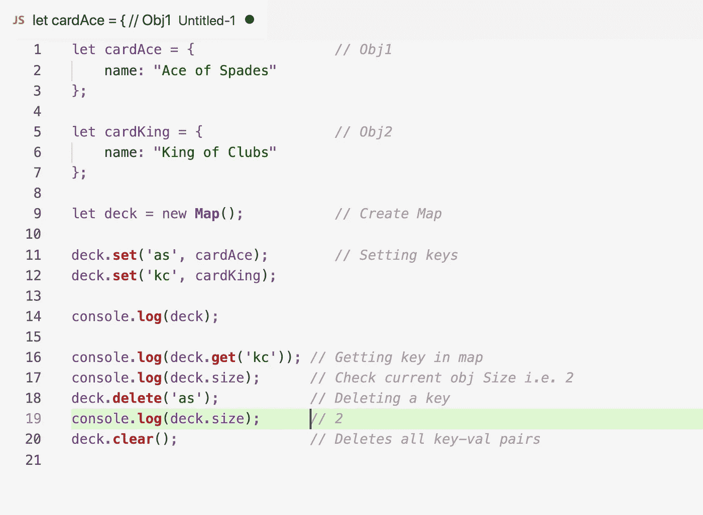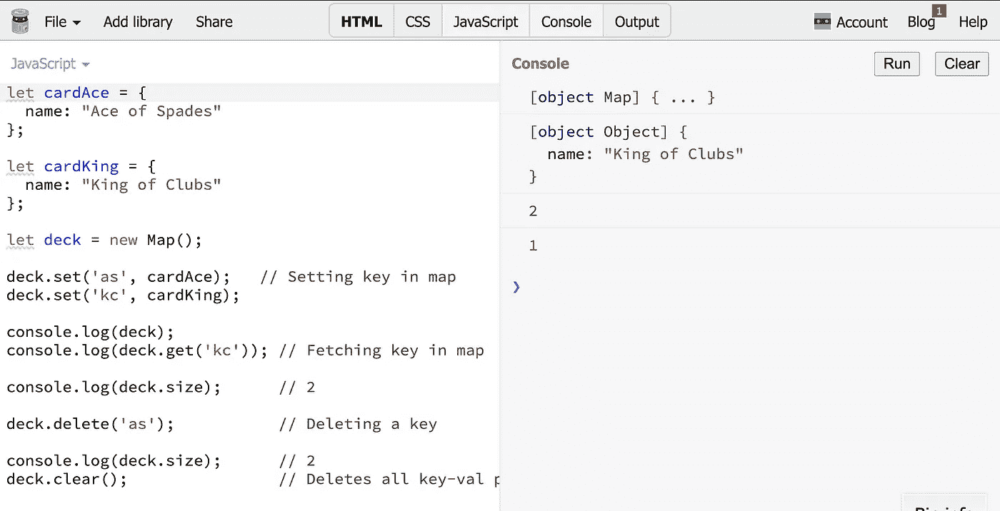

With Output

**3。遍历地图:**有很多方法可以让你**遍历地图**。这可以借助以下三个功能中的任何一个来完成:

a.keys() →这给出了地图中的按键列表

b.values() →这给出了地图中的值列表

c.map.entries()或简单地映射→键值对列表

所以如果你尝试控制台，deck.keys() →这会显示，iterable。因此，我们循环访问它们并获取值

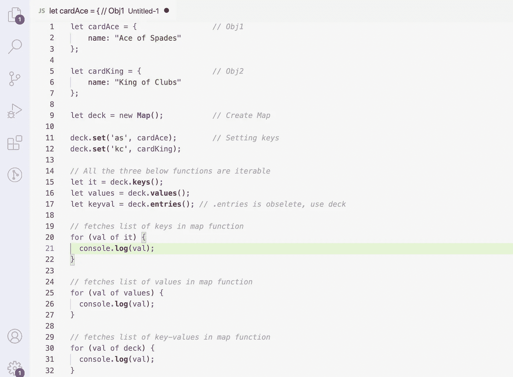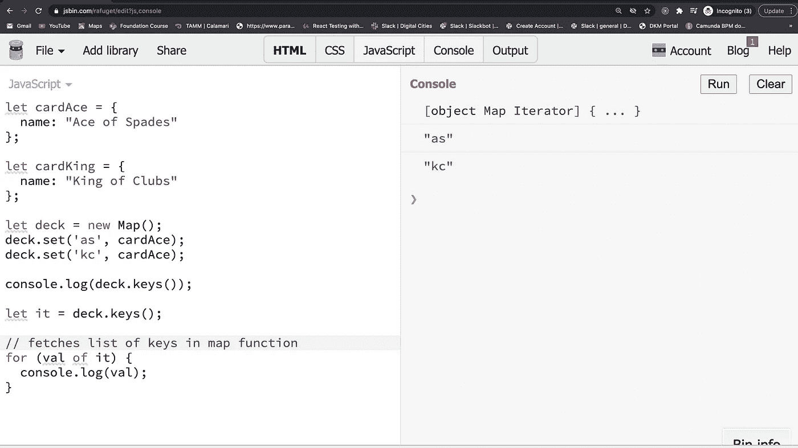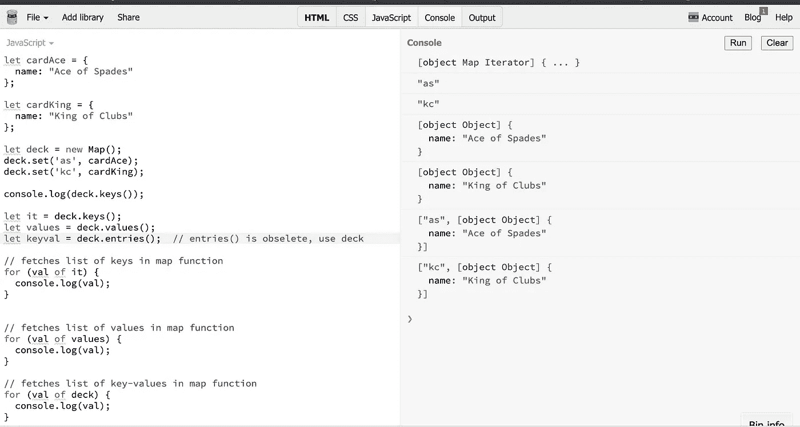

# 地图属性和方法

下表显示了用于快速参考的地图属性和方法列表:

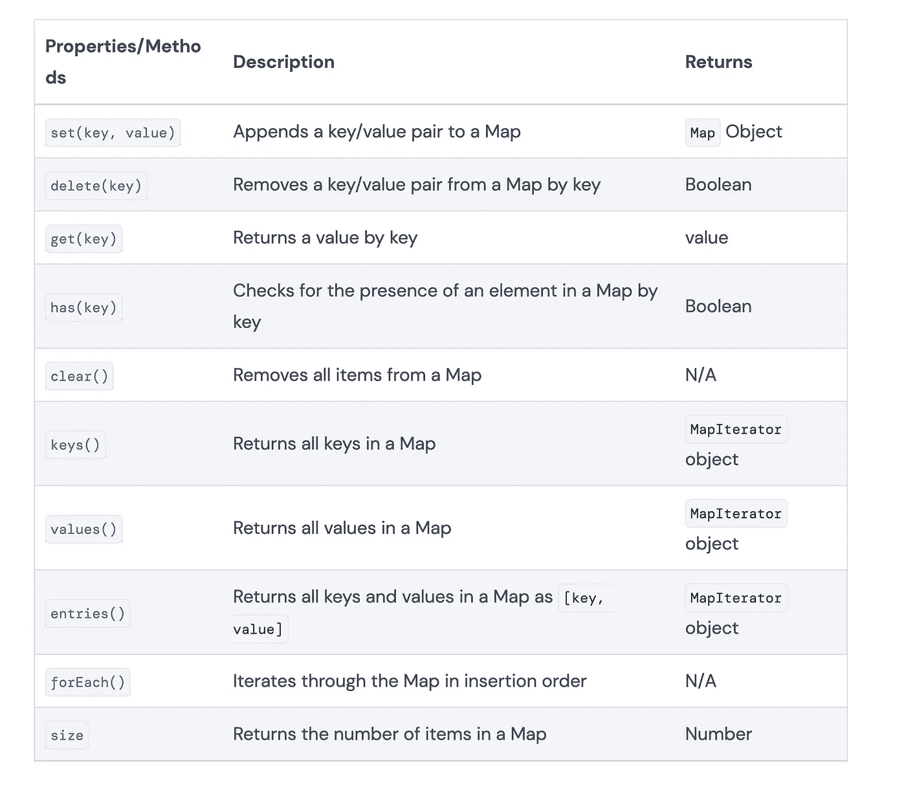

# B.弱映射

1.  弱映射类似于映射，但有一些不同。
2.  它只使用对象作为键。它不能在键中使用字符串。
3.  之所以称之为弱键，是因为对象与垃圾收集器的耦合很弱。
4.  如果没有使用该键，JS 中的浏览器将通过删除未使用的对象来重构它。
5.  这个用起来有点危险。开发人员在选择映射或弱映射时必须小心谨慎。
6.  **循环弱图:**这是不可能的，也是不可数的，即不能循环
7.  但是，可以根据键(属于对象类型)提取数据
8.  一张 **WeakMap** 基本上也是一张**地图，但是它缺少一些特性**。它是不可枚举的(你不能通过它循环),并且它没有大小属性。如果可以使用“真实”地图，为什么还要使用 WeakMap？顾名思义，WeakMaps 持有对存储值的弱引用。这意味着，如果一些值不再使用，它们将被垃圾收集并从地图中释放。这也是 WeakMap 没有大小属性的原因。

要创建弱贴图:

```
let map = new **WeakMap**();   *// Creating Weak Map*
```

例如。

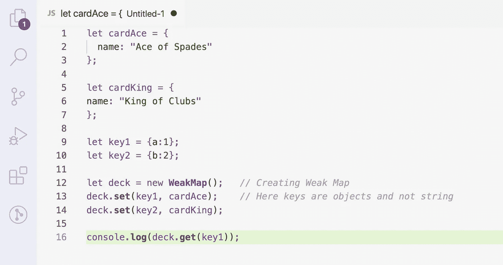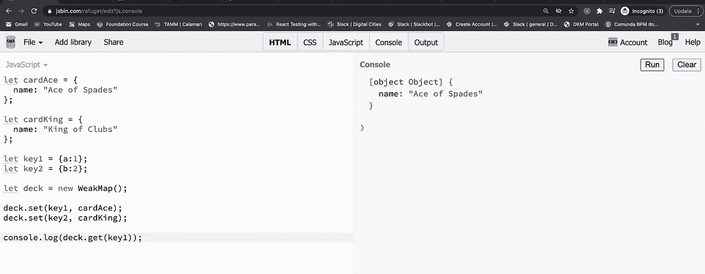

# 何时使用地图

综上所述，映射与对象的相似之处在于它们拥有键/值对，但是与对象相比，映射有几个优点:

*   **大小** —贴图有一个`size`属性，而对象没有一个内置的方法来检索它们的大小。
*   **迭代** —贴图是可直接迭代的，而对象不是。
*   **灵活性** —映射可以将任何数据类型(原语或对象)作为值的键，而对象只能有字符串。
*   **有序** —贴图保持其插入顺序，而对象没有保证的顺序。

由于这些因素，地图是一个需要考虑的强大的数据结构。然而，对象也有一些重要的优点:

*   **JSON**——对象与`JSON.parse()`和`JSON.stringify()`完美配合，这是使用 [JSON](https://www.digitalocean.com/community/tutorials/how-to-work-with-json-in-javascript) 的两个基本函数，这是许多 REST APIs 处理的一种常见数据格式。
*   **处理单个元素** —处理对象中的一个已知值，你可以用键直接访问它，而不需要使用方法，比如 Map 的`get()`。

该列表将帮助您决定地图或对象是否是适合您的用例的数据结构。

# C.一组

1.  集合是元素的集合。这更接近于一个数组，但不是数组
2.  数组可以包含[1，1，1]并基于位置进行标识，而集合不包含重复值。如果试图添加重复值，它将被忽略

I .要初始化器械包:

```
const set = new Set()
```

二。要在器械包中添加物品

```
// Add items to a Set
set.add('Beethoven')
set.add('Mozart')
set.add('Chopin')
```

因为集合只能包含唯一的值，所以任何添加已经存在的值的尝试都将被忽略。

```
set.add('Chopin') // Set will still contain 3 unique values
```

三。初始化集合的另一种方法。如果数组中有**重复的**值，它们**将从集合**中移除。

```
// Initialize a Set from an Array
const set = new Set(['Beethoven', 'Mozart', 'Chopin', 'Chopin'])
```

四。Set 有很多和 Map 一样的方法和属性，包括`delete()`、`has()`、`clear()`和`size`。

```
// Delete an item
set.delete('Beethoven') // true

// Check for the existence of an item
set.has('Beethoven') // false

// Delete all keys from sets
set.clear()

// Check the size of a Set
set.size // 0
```

动词 （verb 的缩写）**注意**集合**没有**通过键或索引访问**值的方法，像`Map.get(key)`或`arr[index]`。不同于地图**

例如。

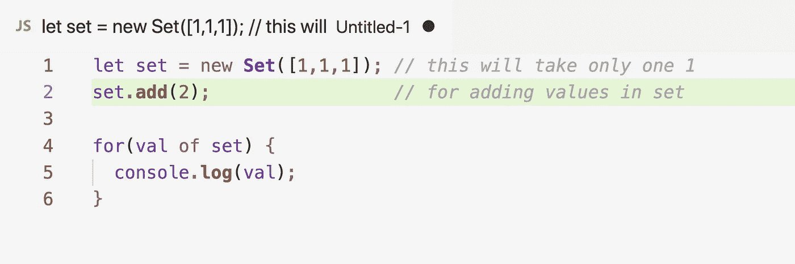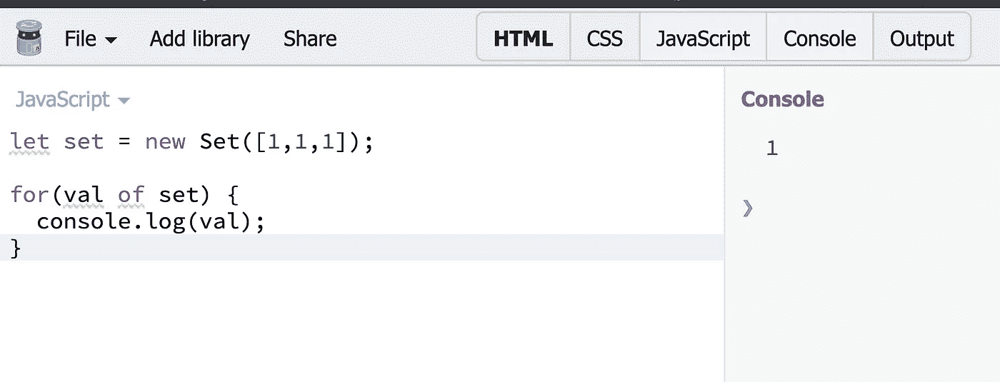

Eg2

没有**get 方法** inset(如第 v 点所述)。但是，我们有**有方法**

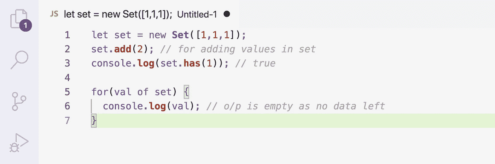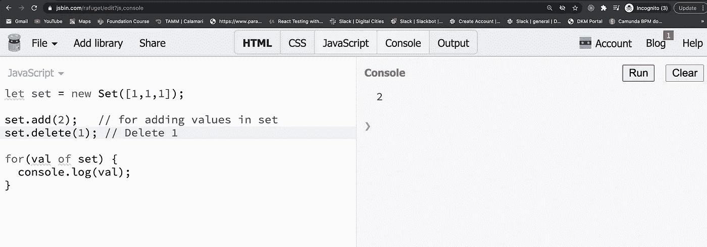

**3。循环播放器械包:**

集合没有键，它的键总是与值相同

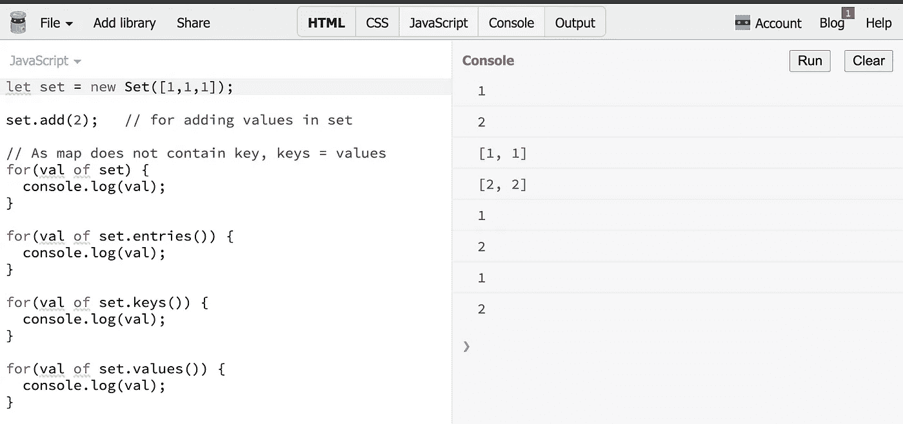

# 设置属性和方法

下表显示了用于快速参考的集合属性和方法列表:

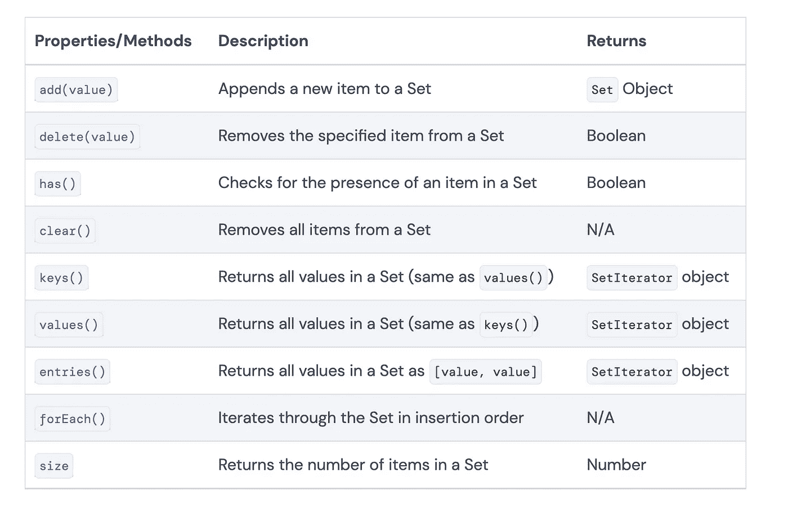

# 何时使用 Set

Set 是对您的 JavaScript 工具包的一个有用的补充，特别是对于在数据中处理重复值的**。**

在一行代码中，我们可以从一个有重复值的数组中**创建一个没有重复值的新数组**。

```
const uniqueArray = [...new Set([1, 1, 2, 2, 2, 3])] // (3) [1, 2, 3]
```

# D.弱集

1.  这种行为有点类似于 WeakMap
2.  键是对象而不是字符串。
3.  循环是不可能的
4.  Browser/JS 会自动清除未使用的键

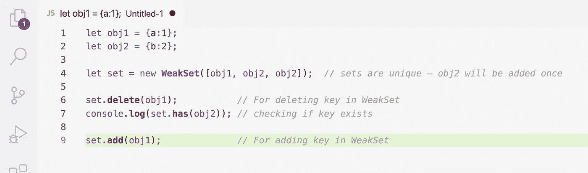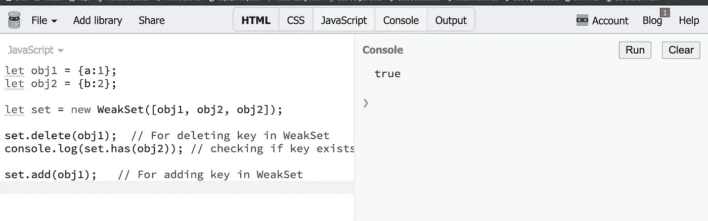

**弱集优势:**性能，去掉不必要的按键

**弱集的缺点:**善用以至于数据被删除

我希望这篇文章能让地图变得清晰，并设定何时在项目中使用它们。

谢谢你