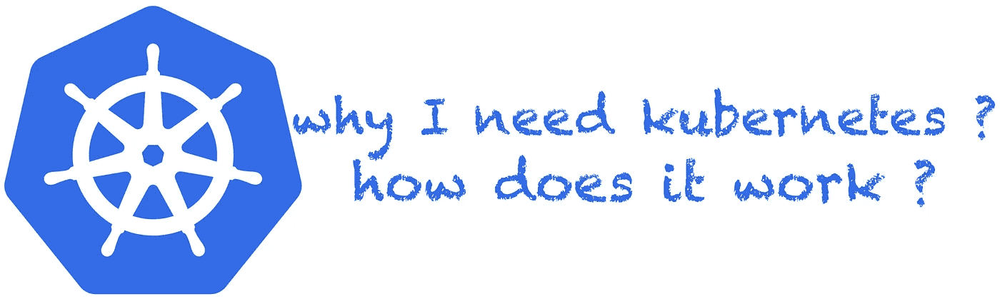

# 了解 Kubernetes : 2

> 原文：<https://medium.com/geekculture/understanding-kubernetes-2-efe439efb9ce?source=collection_archive---------5----------------------->

## 高级、低级容器运行时和运行时接口

在之前的帖子 [kubernetes -1](/@github.gkarthiks/understanding-kubernetes-1-e36eb9256f50) 中，我们看到了容器的含义以及与容器和 Linux 操作系统相关的细节和术语。让我们稍微改变一下思路，进一步了解集装箱化技术和工具。