# 通过从零开始实现线性回归来理解机器学习基础

> 原文：<https://medium.com/geekculture/understanding-linear-regression-by-implementing-from-scratch-761e2a48fce4?source=collection_archive---------14----------------------->

## 学习训练大多数机器学习模型的关键概念

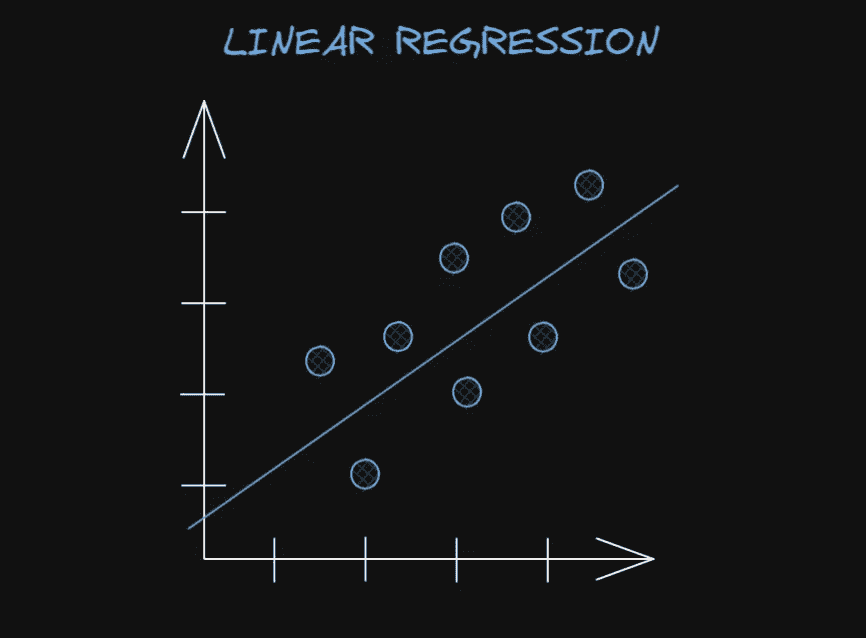

Drawn in excalidraw.com.

线性回归可能是最简单的机器学习模型，但在进入更复杂的模型之前，充分理解它的基本原理至关重要。通过学习线性回归的关键概念，您将能够构建理解一般机器学习所需的基础知识。在我看来，有一个坚实的基础会让你在学习的大部分事情上变得容易得多，我相信这也适用于其他人。

在本文中，将涵盖以下关于线性回归模型的信息:

*   什么是线性回归模型？
*   为什么使用线性回归模型？
*   训练线性回归模型或一般大多数机器学习模型的关键概念
*   从头开始实施，并解释衍生工具
*   用 tf 实现。GradientTape(为我们执行导数的计算)

# 那么到底什么是线性回归模型呢？

线性回归是为**回归任务**建立的**监督机器学习模型**，这些任务涉及预测连续(或实值)变量，而不是离散(分类)变量。监督学习意味着它需要输入数据和正确的输出，以便被训练来做出正确的预测。

基本上有**两种类型的线性回归模型**:一元线性回归和多元(或多元)线性回归。单变量只是一个“花哨”的词，表示模型只使用一个特征(或变量)来进行预测，而多元线性回归使用多个特征。多元线性回归可能听起来很复杂，但实际上，它只是简单线性回归模型的一个非常简单的“升级”，由于矩阵乘法的强大功能，它的实现也非常简单，基本相同。这将在后面的实现中显示。

线性回归模型采用了定义机器学习模型的最基本方面。包括线性回归在内的大多数机器学习模型都利用了以下**关键原则**:

1.  定义用于预测的**方程式**
2.  定义**参数**以学习进行预测
3.  定义训练模型所需的**成本函数**(或损失函数)
4.  **使用**梯度下降**训练**模型，以最小化成本函数
5.  使用训练好的参数进行**预测**

# 定义用于训练线性回归模型的关键概念

这些概念对于从零开始构建实现模型所需的知识非常重要，虽然有点长，但是花时间去理解它是非常值得的，所以请耐心等待。

在线性回归模型的情况下，要定义的内容是:

## **方程式**

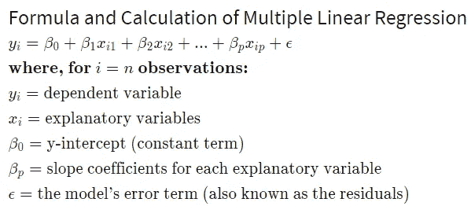

Image from Investopedia. ([Source](https://www.investopedia.com/terms/m/mlr.asp))

由于矩阵乘法的强大功能，对于任意数量的样本和任意数量的特征，上面的长等式实际上可以简化为下面的等式，以实现更有效的训练过程:

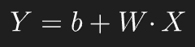

其中:
**Y** =矩阵形式**中的因变量(目标变量)**，其中`(number_of_samples, 1)`的**形状**—用(行数，列数)
**b** = y 截距(类似于神经网络中的偏差，因此有`b`的表示法)
**W** =矩阵形式**中的斜率系数**(类似于权重在
**X** =矩阵形式的自变量(特征)，具有`(number_of_samples, number_of_features)`的**形状**。

在 **W** 和 **X** 之间的`dot`代表它们的点积。这个点积将输出与上面所示的长等式中 y 轴截距(***【β₀***)的后的*项完全相同的结果。这将在下一节中得到证明，其中将解释矩阵乘法(与点积相同)。*

**注**:用**大写字母**表示**矩阵形式**。这里使用的符号是主观的，这里使用的符号是基于我的个人喜好。

## 矩阵乘法(点积)

下图显示了在只有 **1 个样本**和 **3 个特征**的情况下矩阵乘法的示例，它将输出一个形状为`(n_samples, 1)`的矩阵，输出与之前显示的图像中的等式完全相同。

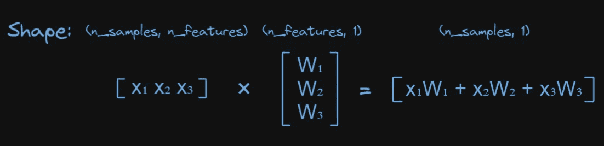

我一直喜欢使用的一个很好的技巧是通过**记住矩阵乘法过程中形状是如何变化的**。例如，在上图中，第一个矩阵的形状为`(1, 3)`，第二个矩阵为`(3, 1)`，第三个矩阵为`(1, 1)`。形状的变化如下图所示，其中中间部分必须具有相同的形状(本例中为 3)，它们将被切掉，最后只留下侧边:

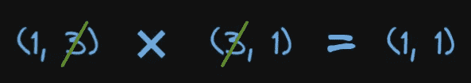

为了进一步实验矩阵乘法以了解它是如何工作的，我推荐这个有趣的网站，它可以让你尝试任何形状的矩阵乘法。

## **参数**

这些参数将被随机初始化，并且它们将在训练过程中保持更新(通过使用梯度下降)，以便更好地进行精确预测。这些参数如下:

1.  `W`:每个解释变量的斜率系数(与“特征”含义相同)，其中每个特征都有自己的斜率系数。
2.  `b`:y 轴截距。

## **成本函数**

通常，均方误差(MSE)用于回归任务。简单来说，MSE 就是**残差**(预测值-真值)的平方的平均值，如下式所示。

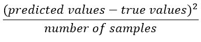

下图显示了如何计算每个点的**残差(虚线)**。紫色线由线性回归模型生成。所以，`y_pred`(预测值)是紫线上的点，而`y`(真实值)是蓝点。**注**:该图仅基于单个特征绘制，因此是二维的，如果有多个特征，则需要更高的维度来绘制。

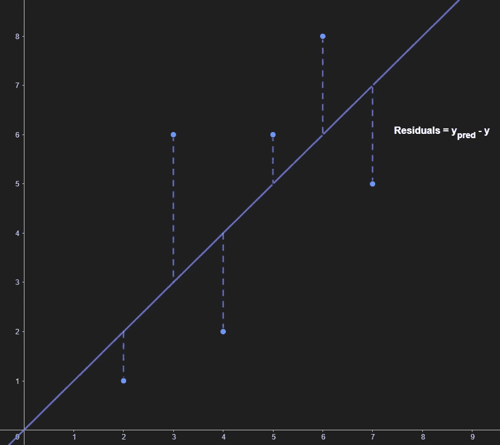

## 梯度下降

这里只涉及梯度下降的基础知识，更深入的解释，你可以参考这个令人惊叹的 [YouTube 视频](https://youtu.be/IHZwWFHWa-w)。现在，我们只知道梯度下降有如下图所示的公式。

设 ***p*** =任意可训练参数， ***lr*** =学习率和***DP*/*dx****= p*相对于**代价函数的参数** ***x*** :**

**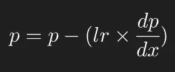**

**General gradient descent formula.**

**梯度下降与机器学习模型的成本函数密切相关。因此，理解在解释梯度下降时使用的成本函数非常重要。对于这种情况下的 MSE 的成本函数，用于训练单个参数的**的图形将类似于下图中的**紫色曲线**:****

**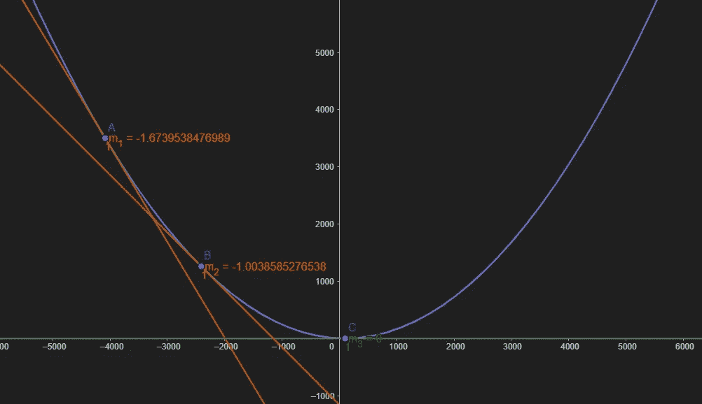**

**Example of MSE loss function = (x - 100)² / 5000, where true value = 100, n_samples = 5000.**

****x 轴**代表预测值，而 **y 轴**代表 MSE 值。橙色和绿色线条表示曲线在相应点的切线，以便计算斜率。最初，由于高损耗(不良预测)，预测值将开始于点 A 附近的某个较高位置，斜率(或梯度)为-1.674，如图所示，由`m`表示。然后，在梯度下降的每个*迭代*之后，理想地，预测值和斜率将逐渐沿着曲线下降，直到它最终收敛到*全局最小值*——图中的点 C，斜率为零，这基本上与零损失相同，即已经拟合了最佳线性回归线，使得最精确的预测成为可能。**

**用简单的话来解释梯度下降:在每次迭代中，计算的梯度用于最小化成本函数，以减少残差。当梯度达到零时，即残差平方和的平均值达到零时，模型将已经找到当前数据集的最佳拟合线。**

**如果**学习率**设置得太低，将需要多次迭代才能收敛到全局最小值。相反，如果**学习率**设置得太高，将导致梯度爆炸，并且永远无法收敛到全局最小值。**

**在这种情况下，MSE 损失函数的**导数**(基本上是斜率的数学符号)如下:**

****成本函数:****

**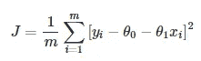**

****衍生产品:****

**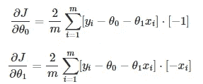**

**from StackOverflow ([source](https://math.stackexchange.com/questions/3152235/partial-derivative-of-mse-cost-function-in-linear-regression?newreg=d8f2602266cc42de80d9c1a37974a781))**

**对我来说，通过直接将数学符号“翻译”成代码，它总是更具可读性和可理解性，所以下面是推导导数的“翻译”代码:**

**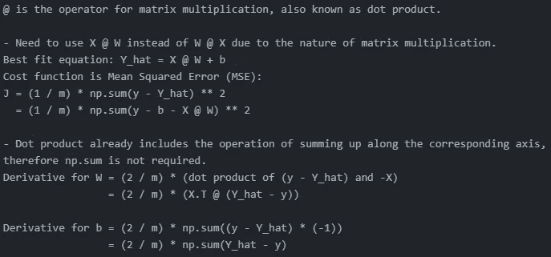**

# **履行**

**这些步骤可以细分如下:**

1.  **随机初始化参数**
2.  **使用当前状态的模型进行预测**
3.  **计算成本函数的导数**
4.  **使用梯度下降来更新参数**
5.  **根据给定的迭代次数，循环重复步骤 2-4**

**在开始实施之前，我想先谈一谈一个重要的技巧。在机器学习的情况下，导致调试灾难的一个常见错误是当变量具有用于计算的**不正确形状**时。导致我浪费大量时间的是形状为`(nrows,)`的变量，因此，我总是会对这样的变量计算一个`reshape(-1, 1)`来将它们变成`(nrows, 1)`的形状，如后面的实现所示。**

**好了，废话少说，让我们从创建一个虚拟数据集开始。**

**可以看到，在**线 4** 处，y 的形状是`(500,)`。正如我之前提到的，我立即重塑成`(500, 1)`以避免以后的灾难。**

****第 9 行**:分成 20%大小的训练组和测试组。**

**数据的散点图`plt.scatter(X, y)`如下:**

**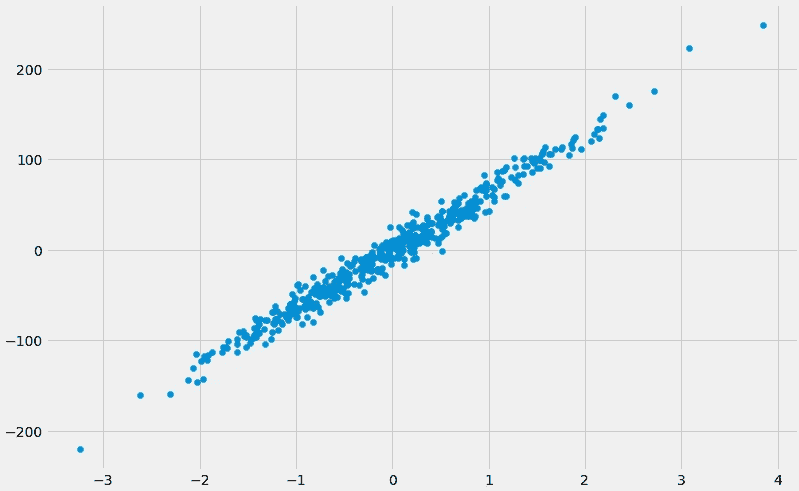**

**然后，用正态分布产生的随机数初始化参数(因为机器学习模型一般都爱正态分布的东西)。**

**然后进行预测，计算导数，执行梯度下降。**

**然后将其与 Scikit-learn `sklearn`实现中的黄金标准进行比较，注意我总是跟踪形状，因为它们对于调试非常重要:**

**万岁！该实现与`sklearn`实现具有完全相同的 R2 分数。**

**但是让我们将它们重构为一个`class`对象，因为 Python 应该总是利用其强大的 Python 面向对象编程(OOP)能力。**

**让我们运行一个训练循环来确认它的工作。**

**很好，它对只有一个特征变量的数据集有效。现在让我们尝试运行一个包含**多个特征**的数据集。**

**好的，一切都很好。但每次手动推导导数可能不是最实用的方法，这就是为什么更复杂模型(如神经网络)的梯度通常会使用 TensorFlow 或 PyTorch 提供的函数来计算导数和损失。接下来将展示一个使用 Tensorflow 的`tf.GradientTape`为我们计算导数的例子。**

## **使用 tf。梯度胶带**

**正如您在**第 29–38 行**中看到的，损失是在`tf.GradientTape`上下文管理器中计算的，然后**第 41 行**，`tape.gradient`将计算导数，供我们用于执行梯度下降。**

**但是实际上有一个更短的方法，如上面脚本中的`fit2`方法所示，它使用一个`optimizer`来`minimize()`直接为我们使用`optimizer`的参数，跳过手动编码`GradientTape`和更新参数的整个步骤，代价是训练时间略有增加。考虑到 ***随机梯度下降优化器*** 与正常梯度下降几乎相同，数据集相对简单，这种情况下最终结果完全相同。**

# **可视化最佳拟合线，并制作动画！**

**让我们尝试将单变量线性回归模型的结果可视化:**

```
**if X.shape == y.shape:
    plt.scatter(X, y, color='orange')
    plt.plot(X, my_linear_reg.predict(X.reshape(-1, 1)), linewidth=3);**
```

**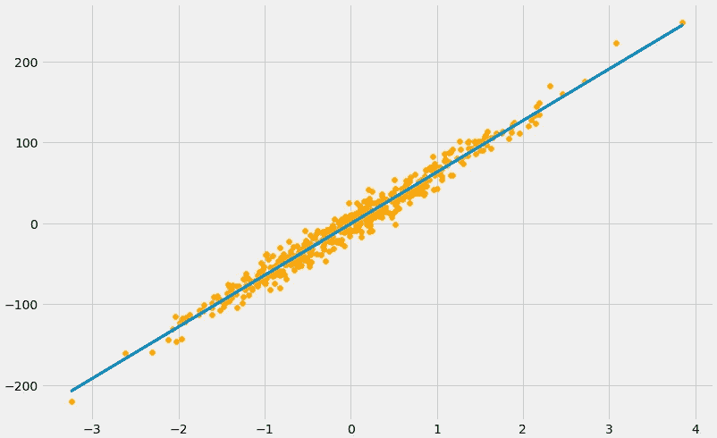**

# **结论**

**总之，我们已经讨论了一般情况下训练机器学习模型的关键概念，并特别关注在 Python 中实现线性回归模型。这些是非常重要的概念，可以应用于更复杂的模型。**

**实现也适用于多元线性回归，对导数进行硬编码的步骤也可以转化为 TensorFlow 的`tf.GradientTape`来为我们简化过程。**

****尾注**:希望你从这篇文章中学到了一些有用的东西。这是我在 Medium 上发表的第一篇文章，如果我的文字或视觉效果有一些瑕疵，请原谅我。我非常欢迎任何形式的反馈。非常感谢你读到这里！**