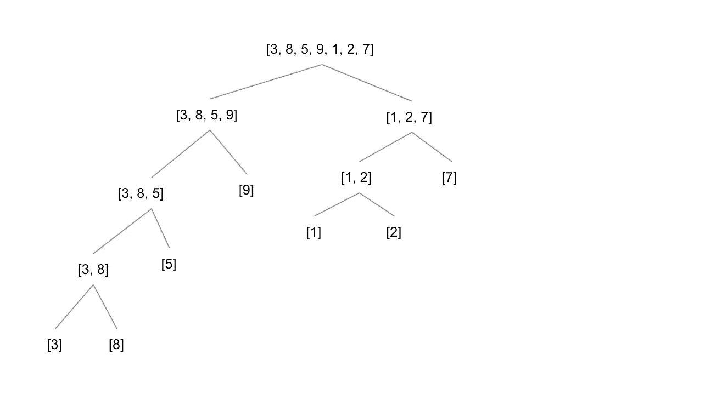
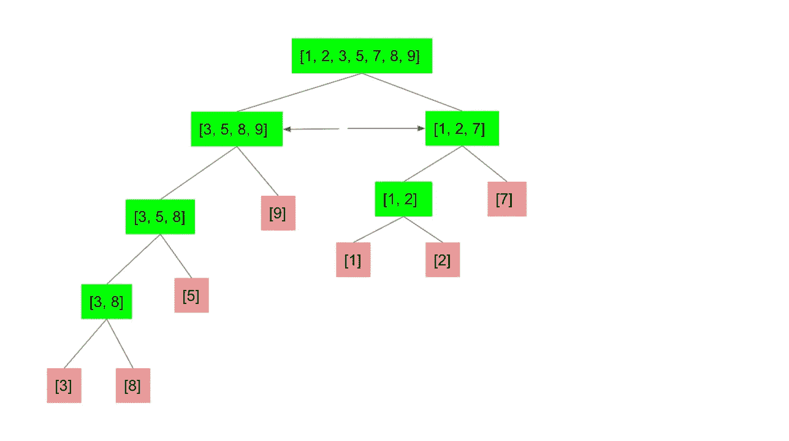
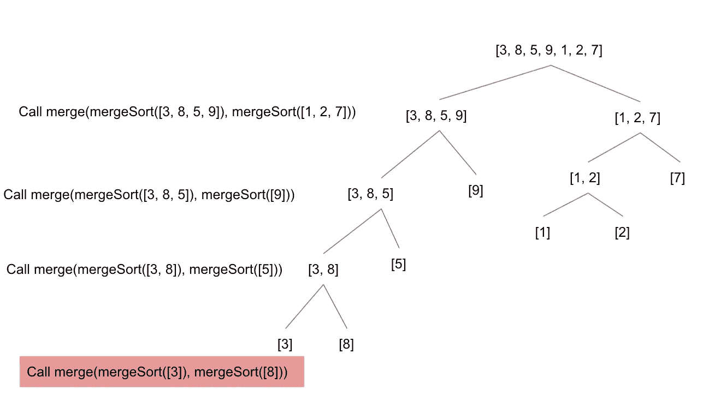

# 了解合并排序

> 原文：<https://medium.com/geekculture/understanding-merge-sort-78d93c433ad6?source=collection_archive---------28----------------------->

Photo by [Denys Nevozhai](https://unsplash.com/@dnevozhai?utm_source=medium&utm_medium=referral) on [Unsplash](https://unsplash.com?utm_source=medium&utm_medium=referral)

说到排序算法，大多数实现的运行时间复杂度都是 O(N)。我们必须遍历每个元素，然后对于每个循环，我们必须执行另一个内部循环，根据我们选择实现的算法进行某种重新排列。正是这个循环中的循环给了我们二次运行时复杂度。有一些排序实现试图做得比这更好。通常讨论的三种是基数排序、快速排序和合并排序。合并排序将是本文的主题，我认为也是这三者中最容易掌握的。这些算法试图比 O(N)做得更好。

# 为什么这很重要？

对于小列表，O(N)中的排序并不是什么大问题。但是想象一下，你有 1000 万个项目需要排序。在 O(N)运行时复杂性下，我们将在强大的机器上面临一些严重的滞后，在一些机器上，可能无法完成计算。一旦我们完成了实现，我们将能够看到相对于二次运行时复杂度的轻微改进，将其降低到 O(NlogN)运行时复杂度。让我们开始吧！

# 从哪里开始？

首先，在我们写任何代码之前，我们需要确切地理解我们要做什么。我们将从一些未排序的数组开始。我们想不断地把这个数组分成两半。我们将这样做，直到数组长度减少到 1 项。一旦完成，我们就可以通过编程将这两部分简单地组合在一起，但在进行过程中保持排序的顺序。一旦最后一个函数调用返回，我们将得到一个排序后的数组。让我们看看分解数组的第一步在图中是什么样子的。

A Diagram Showing How We Can Recursively Split An Array, Screenshot By Author

这个图表向我们展示了第一步，即通过一遍又一遍地拆分中间的索引来分解数组，直到数组中只有一个元素。然后我们开始把这些重新融合在一起。

Diagram Showing How Base Cases Are Merged Together In Sorted Manner From Bottom Up, Screenshot By Author.

你可以看到用红色表示的基本情况在函数分支树中向上合并，每次我们合并两个数组时，如果我们小心地保持它们的排序，最终结果将是排序后的数组，在图表的顶部。

# 将我们的图表转化为代码

让我们通过简单地编写初始函数来开始我们的代码。这个函数将把我们的数组分解成子数组，直到所有子数组的长度都为 1。

我们找出中间的元素索引，然后使用数组。切片得到我们现在分裂的数组的左侧和右侧。然后我们需要在左边和右边递归，进一步分解它们。但是，我们不要走得太远，因为我们还需要将它们融合在一起。这就是合并排序变得有点棘手的地方，所以让我们把它放在那里，然后我们再讨论。

现在，我们添加了一个助手函数来帮助我们将数组合并在一起，并保持它们的排序。本质上，它接受两个数组，然后当它们都有长度时，它会从每个数组的前面选择最小值，然后将其填充到一个新的数组中，一旦完成，该数组将与左侧或右侧数组中的任何落后者一起返回(如果一个长度与另一个不同，我们将有剩余的元素)。我认为合并实现本身是有意义的。理解我们在哪里调用它有点困难。请注意，在我们之前有注释的地方，我们调用了 merge 函数将左右数组合并在一起。这里需要注意的是，我们还向递归 mergeSort 调用传递和调用了左右数组。停下来喘口气。如果您从未见过这种实现，一开始会有很多东西需要理解，但是使用我们的图表，我们可以了解将会发生什么。

Demonstrating Function Calls Until First Base Case, Screenshot By Author.

我们将一步一步来，这将是有意义的。在我们的第一个函数调用中，我们将原始数组分成两半，并在两半上调用 merge，除了在我们这样做之前，我们必须处理其他 mergeSort 调用。首先，我们调用左边的 mergeSort。这导致左半部分(3，8，5，9)被分成两半。我们知道我们将在这两半上调用 merge，但是我们必须在左半部分继续调用 mergeSort，直到我们满足我们的基本情况。这将最终把我们带到红色突出显示的第一个基本案例。我们调用 merge，它对两个长度只有一个元素的数组调用 mergeSort。我们最终在 mergeSort 中遇到了基本情况，这些数组被返回，我们的 merge 被调用来合并 3 和 8。然后，我们将上一个调用提升一个级别，我们现在已经计算出 left 和 right 是数组中只有 5 个成员的基本情况。我们把它们合并在一起。这在树中继续向上，你可以看到所有右边的数组都是基本情况，直到我们到达根之前的层次，突然我们回到了第一次调用 merge，最后左边的 mergeSort 返回了。在我们合并这个返回最终答案的第二层之前，我们必须处理右边。

Diagram Shows Hitting The Base Case On The Right Side Of The Tree, Screenshot By Author.

现在，我们通过在数组的原始右侧调用 mergeSort 来开始这部分递归。从图中可以看出，在我们遇到第一个右侧基本情况之前，这导致了另一个调用。一和二合并在一起，然后我们上升一级，我们准备在[1，2]和 7 上完成合并。此时，我们已经完成了对左边的 mergeSort 和右边的 mergeSort 的原始调用，最后，我们准备完成执行堆栈上的最后一个调用，该调用合并了最后两个数组，并留给我们排序后的结果[1，2，3，5，7，8，9]。

# 结论

合并排序是一个很难掌握的算法。这是一个非常棒的工具，因为它是 O(NlogN)运行时复杂度的快速排序算法之一。请注意，该算法确实增加了一些额外的空间复杂度，因为我们在 merge 函数中使用了几次新数组。此外，由于同样的原因，我们不是就地操作，而是创建一个新的排序数组。这可能实际上是你的理想情况，但在面试的情况下，这是重要的知识。另一种具有相同改进的运行时复杂性的就地操作的排序算法是快速排序。这是另一篇文章的主题，但这些可能是面试官想要窥探的细节，以决定你是否理解其中的区别。虽然不是 100%直观，但仔细浏览图表后，您可以看到该算法是如何工作的。