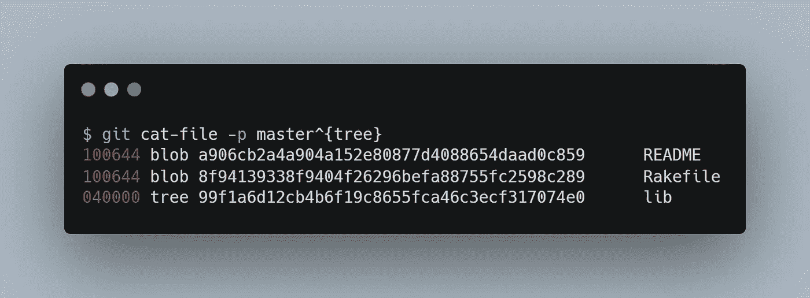
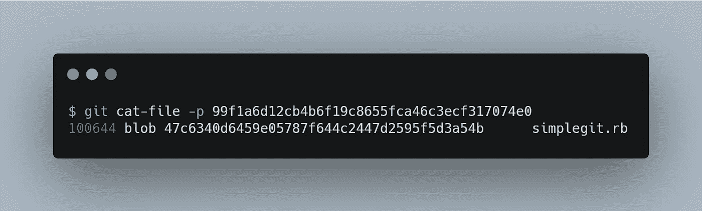
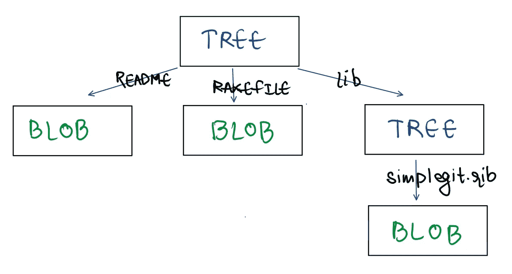
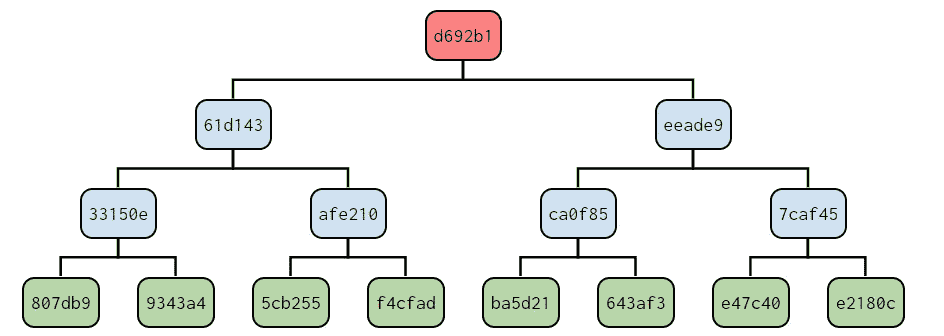
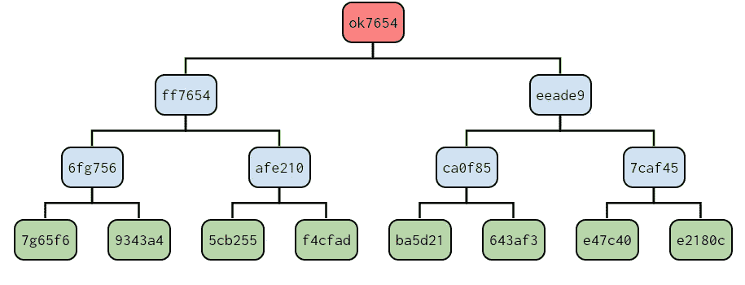
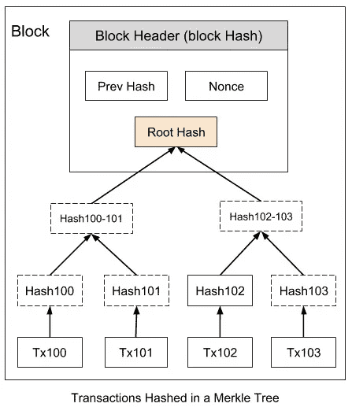

# 理解 Merkle 树

> 原文：<https://medium.com/geekculture/understanding-merkle-trees-f48732772199?source=collection_archive---------2----------------------->

[Image Credits](https://unsplash.com/photos/Du41jIaI5Ww?utm_source=unsplash&utm_medium=referral&utm_content=creditShareLink)

## Git、比特币和 DynamoDB 的精髓

**哈希树**或 **Merkle 树**是这样一种树，其中每个[叶节点](https://en.wikipedia.org/wiki/Leaf_node)用数据块的[密码哈希](https://en.wikipedia.org/wiki/Cryptographic_hash_function)标记，每个非叶节点用其子节点标签的密码哈希标记。由于这一特性，Merkle 树用于验证两方或多方拥有相同的数据，而无需交换整个数据集合。

以下是 Merkle 树的一些主要优点:

*   它们提供了一种证明数据完整性和有效性的方法。即使很小的数据篡改也会导致完全不同的散列。
*   他们的证明只需要通过网络传输极少量的信息。它们将数据验证与数据本身分开。

让我们来看看 Merkle 树的一些有趣的用例:

# 饭桶

在理解 Git 如何利用 Merkle 树之前，让我们先看看 Git 如何存储我们的源代码。

Git 以类似于 UNIX 文件系统的方式存储内容，但是稍微简化了一些。所有内容都存储为树和 blob 对象，树对应于 UNIX 目录条目，blob 或多或少对应于*索引节点*或文件内容。单个树对象包含一个或多个条目，每个条目都是一个 blob 或子树的 SHA-1 散列及其关联的模式、类型和文件名。例如，项目中最近的树可能如下所示:

`master^{tree}`语法指定了在`master`分支上最后一次提交所指向的树对象。注意，`lib`子目录不是一个 blob，而是一个指向另一棵树的指针:

从概念上讲，Git 存储的数据如下所示:

假设我们有 8 个文件(包括树、blobs 和元数据)。Merkle 树如下所示:

INITIAL COMMIT

现在，如果我们改变第一个文件的内容，相应的散列也会改变，并且这种改变会一直延续到树的根。

FILE 1 CHANGED

这有助于 Git 有效地维护一个存储库的两个版本，这就是它如何存储跨越数百万行代码的数千个本地提交的整个历史。

当您从远程获取或推送您的更改时，git 将检查根的哈希是否相同。如果不同，它将检查左侧和右侧的子节点，并重复此操作，直到找到发生变化的叶节点，然后仅通过网络传输该*增量*。

> **注意**:元数据包括诸如指向父提交的指针以及作者信息和作为提交对象的提交消息的信息。

# 比特币

中本聪的独创性发明比特币依靠 Merkle 树保持规模增长。在比特币中，一个块由前一个块的散列(块的链接)、一个 Nonce 和 Merkle 树中散列的交易组成(如图所示)。这有助于两件事:

*   首先，通过从树上修剪事务分支来压缩周期性的旧块。没有事务的块标题大约是 80 字节。如果我们假设每 10 分钟生成一个块，每年 80 字节* 6 * 24 * 365 = 4.2MB。随着平均 RAM 大小逐年增加，存储应该不是问题，即使块头必须保存在内存中。
*   第二，它使得在不运行完整网络节点的情况下验证支付成为可能(**简化支付验证**)。SPV 节点不下载整个区块链，它们只下载*块头*，这使它们能够验证特定的事务是否包含在一个块中。

# DynamoDB

除了对加密货币的大肆宣传，*像 DynamoDB 和 Cassandra* 这样的 NoSQL 数据库依靠 Merkle 树来更快地检测副本之间的不一致，并最小化传输的数据量。

Dynamo 使用 Merkle 树进行反熵，如下所示:每个节点为其托管的每个键范围(虚拟节点覆盖的键集)维护一个单独的 Merkle 树。这允许节点比较一个键范围内的键是否是最新的。在这个方案中，两个节点交换对应于它们共同拥有的键范围的 Merkle 树的根。随后，使用本文 *Git* 部分描述的树遍历方案，节点确定它们是否有任何差异，并执行适当的同步操作。这种方案的缺点是，当节点加入或离开系统时，许多关键字范围会改变，从而需要重新计算树。然而，这个问题通过本文的[第 6.2 节中描述的细化分区方案得到了解决。](https://www.allthingsdistributed.com/2007/10/amazons_dynamo.html)

# 结论

如本文开头所述，Merkle 树将数据验证与数据本身分开，这开启了一系列优化和用例。除了上面的用例，加密审计和完整性检查经常依赖于 Merkle 树。*证书透明性*是一种安全技术，依靠 Merkle 树来检查 TLS/SSL 证书的有效性。这些只是少数用例，我相信会有许多有趣的想法和实现，利用这种被称为 Merkle trees 的令人敬畏的数据结构。

# 参考

*   [Merkle Trees](https://hackernoon.com/merkle-trees-181cb4bc30b4)
*   [Git 内部——Git 对象](https://git-scm.com/book/en/v2/Git-Internals-Git-Objects)
*   [所有东西都是分布式的——亚马逊的发电机](https://www.allthingsdistributed.com/2007/10/amazons_dynamo.html)
*   [比特币:一种点对点的电子现金系统](https://bitcoin.org/bitcoin.pdf)