# 理解 Golang 中的模块

> 原文：<https://medium.com/geekculture/understanding-modules-in-golang-a7fccba548a?source=collection_archive---------8----------------------->

你好朋友们。👋在我之前的文章[了解包](https://oluwadamilareo.medium.com/understanding-packages-in-golang-9a5825ac869f)中，我们谈到了什么是包，包的潜在结构，将包拆分成多个文件，导出方法和函数等。

今天，我们将更进一步，讨论模块以及它们如何将包绑定在一起。

我们可以把模块看作是包的集合，这意味着模块本质上只是一个文件夹，其中有一个或多个包。一个模块可以由一个单独的包组成，在这种情况下，模块和包的名称将是相同的。说够了😂让我们看一些例子👇🏽

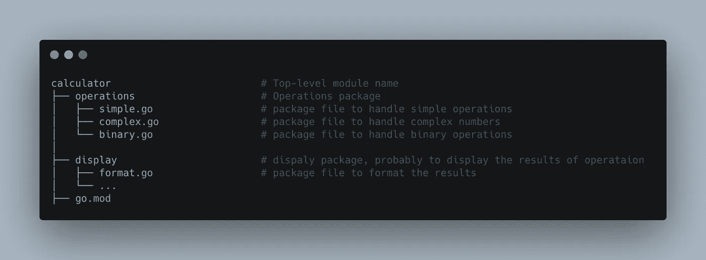

这里我们有一个计算器模块，它包含一些不同的包来处理一些特定的操作并显示这些操作的结果。我们还有一个奇怪的文件叫做`go.mod`，如果你来自 javascript 背景，你可以把它比作你的项目中的`package.json`文件或者你的 ruby 项目中的`Gemfile`,它本质上保存了描述模块的内容——在这个例子中，是计算器模块，并且列出了该模块中所有包的依赖关系，它看起来像这样👇🏽

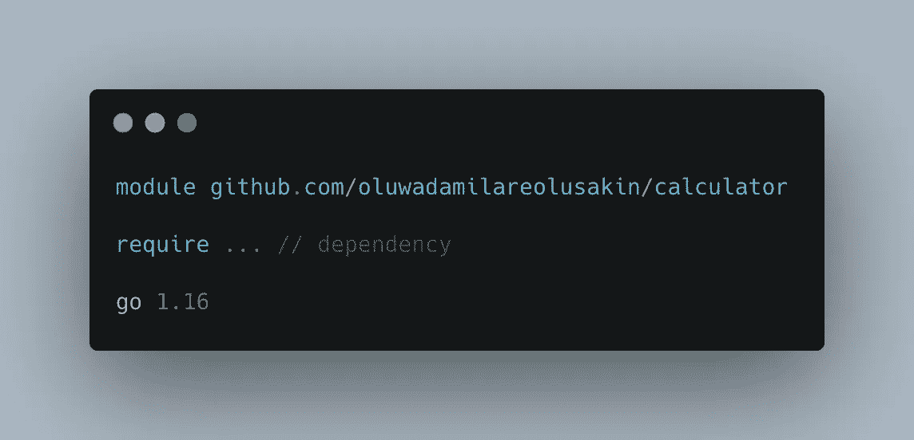

## 我们是怎么到这里的？

我们来写一个小模块，我们就叫它`calculator`，在另一个围棋程序中使用。如果你还没有在你的机器上安装 Go，请点击这里的[并遵循那些精心编写的说明😉](https://golang.org/doc/install)

接下来，创建一个新的目录来存放你的代码，我的目录是`Desktop/Playground/go`

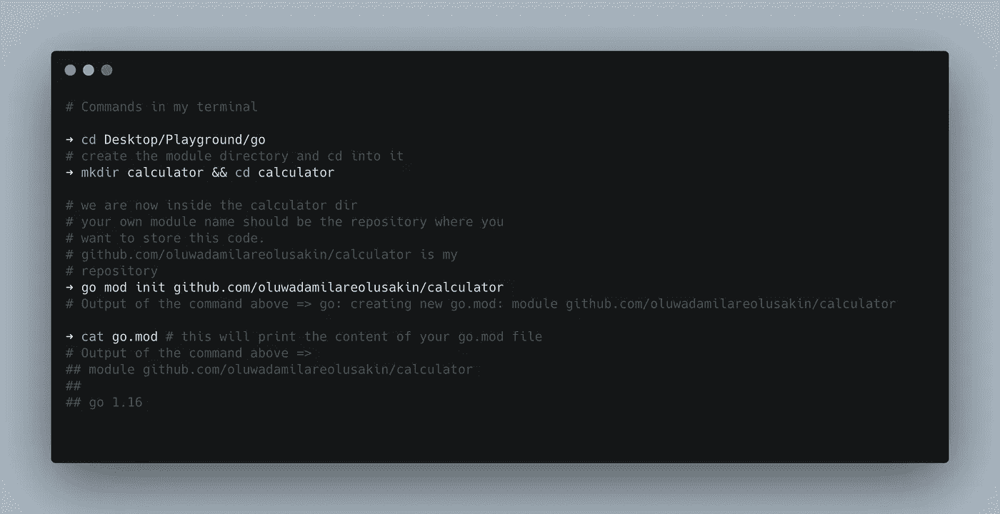

你可能对`go.mod`有点疑惑。如果您使用 javascript，生成一个`go.mod`文件类似于运行`yarn init`或`npm init`，您只需这样做👇🏽在你的终端里

理想情况下，模块名应该是网络上的一个地方，你的源代码将被存储在那里，原因是你的包可以被其他开发者重用，你需要告诉 Go 工具在哪里可以找到并下载它(我们马上会看到更多关于这个的内容)👌 ).

接下来，在您的计算器模块中创建一些包👇🏽

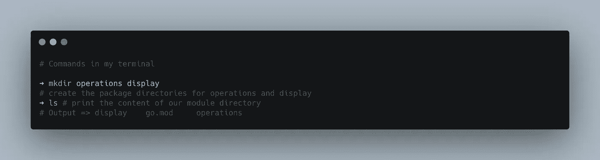

让我们添加一些操作，我们将在操作目录中创建`simple.go`👇🏽

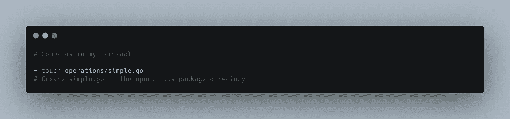

在`simple.go`中放入下面的代码👇🏽

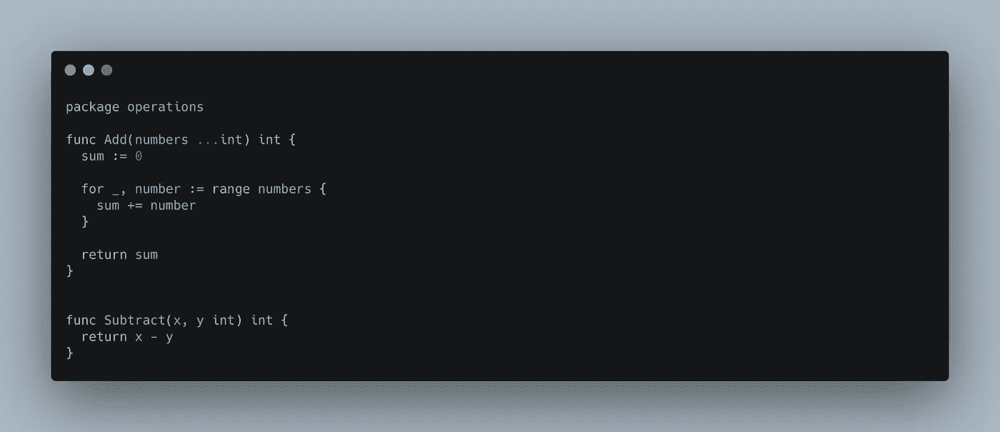

请注意，我们的包名称空间对应于该文件所在的目录，并且所有函数都以大写字母开头，如果您不确定原因，请查看本文。

让我们写一些代码来显示结果，从您的计算器目录，运行👇🏽

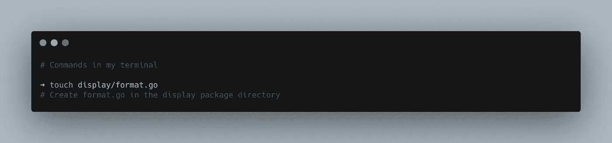

让我们在`format.go`中添加以下代码

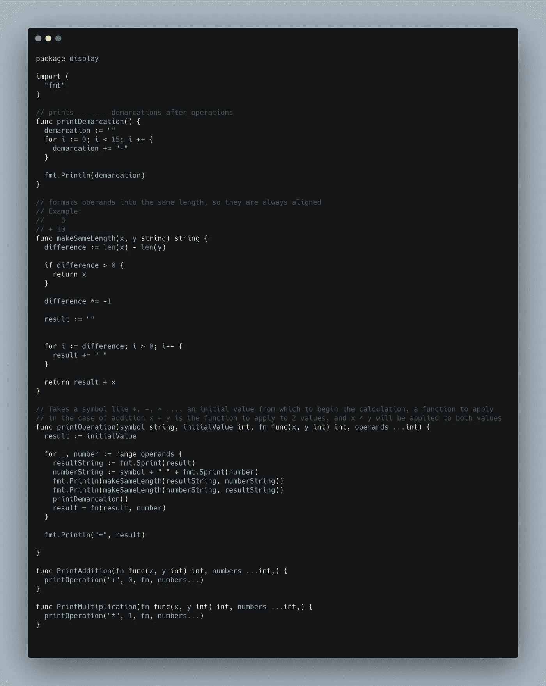

我们需要对`simple.go`做一些修改，让我们导入我们的格式包，并用它给`simple.go`添加两个新函数👇🏽

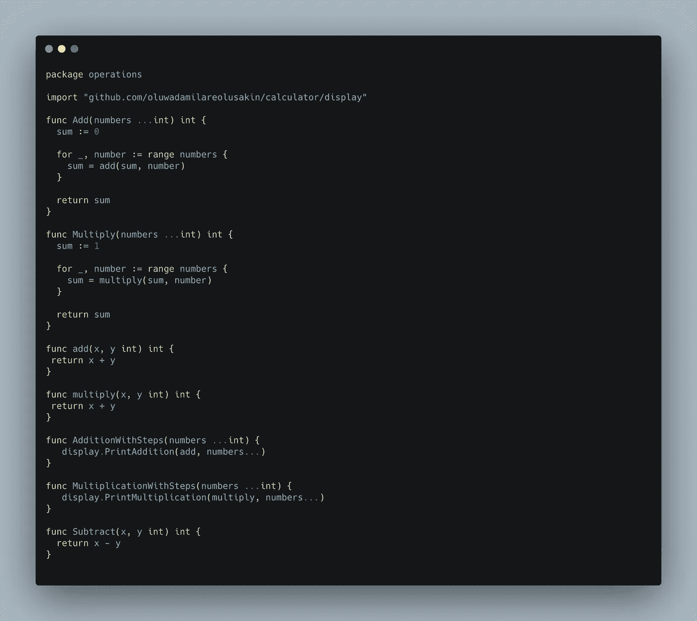

在这里，我们添加了两个新函数来打印操作中使用的步骤——`AdditionWithSteps`和`MultiplicationWithSteps`,我们还做了一点重构。

现在让我们把这个包应用到其他的围棋程序中。将它推送到您为项目创建的存储库中。我使用 GitHub 来存储我的项目，我的库名是 calculator

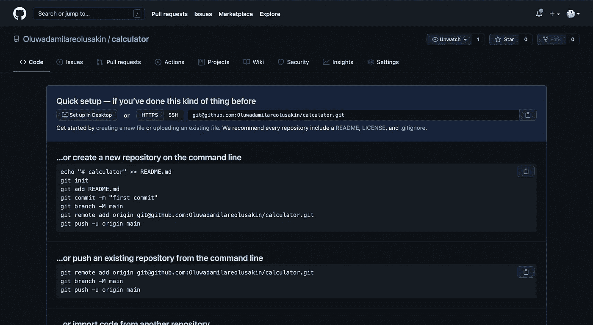

My repository for this project

现在，我将提交我的代码并将其推送到 Github👇🏽

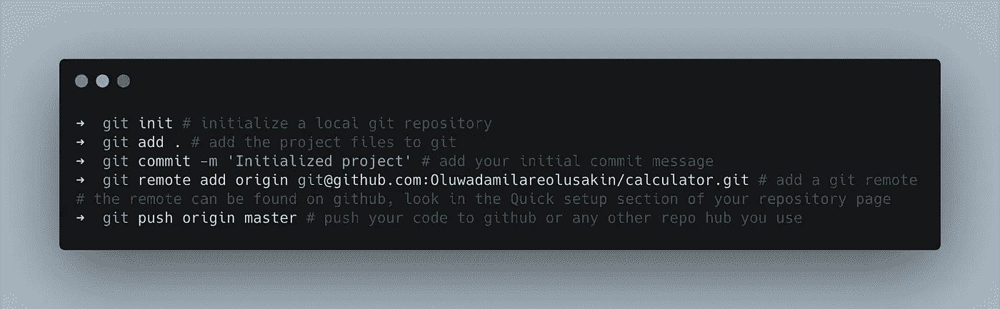

如果一切顺利，当您刷新浏览器时，您的存储库页面应该看起来像这样👇🏽

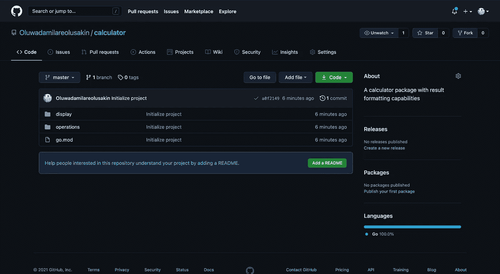

现在您的软件包可供任何想使用它的人使用！这里没有什么，如果你想让人们使用你的包，确保你的库不是私有的，否则，导入它可能会失败。在命名模块和存储库时，尽量避免使用连字符和其他特殊字符。每个存储库应该只包含一个模块，否则当您开始导入要使用的模块时会遇到问题。

让我们写一些 go 代码来使用我们的模块和包！🚀在你的项目目录的根目录下，创建一个新的模块，你想叫它什么都行，我会叫我的`simplego`👇🏽在这个`main.go`里面是我们的代码

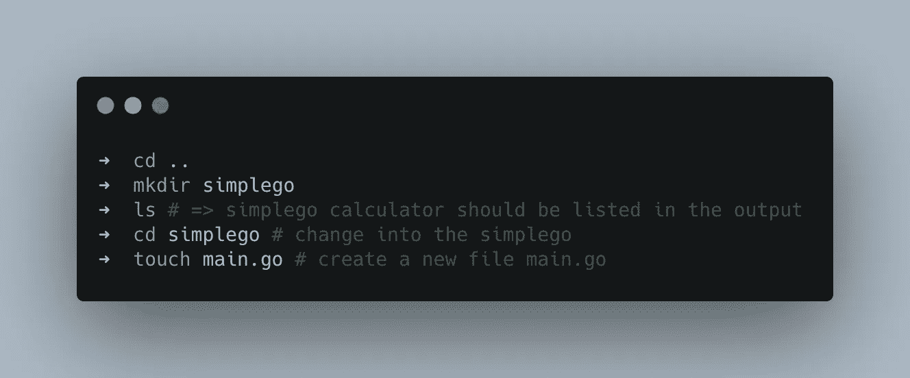

在`main.go`内部，我们可以放入以下代码👇🏽我们正在导入之前在计算器模块中创建的操作包。

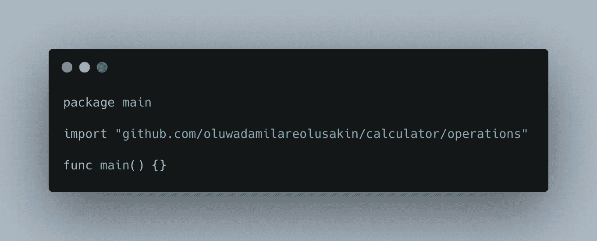

如果一切顺利，您应该会看到一些错误，如下所示。这是因为从技术上来说，我们没有在本地安装这个包来使用。我们需要告诉 go 去得到它，我的意思是，字面上告诉 go 去得到它😉

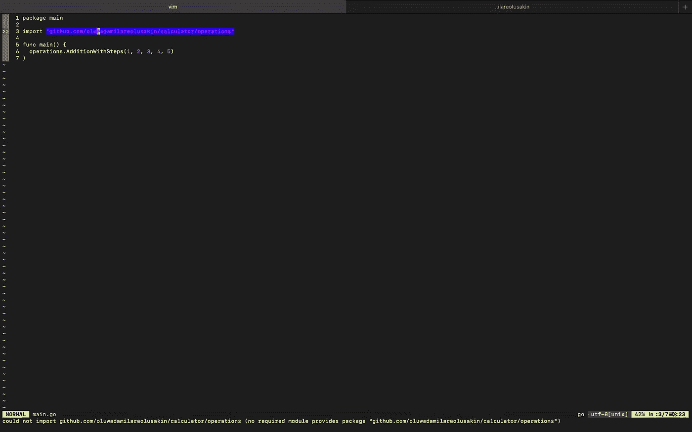

Error at the bottom of the screen showing that the package is not available to us locally

在您的终端中，初始化一个新的 go 模块文件，并告诉 go 整理您的依赖项👇🏽在你的`simplego`模块的根目录下运行这个，你应该在注释中得到输出。

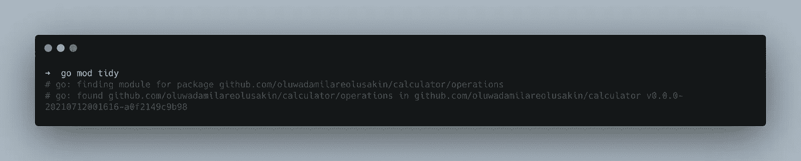

刚刚发生了什么事？😱好吧，一些漂亮的 go 魔术，每当我们运行`go mod tidy`，go 查看我们所有的导入语句并下载所有丢失的包/依赖项。我们的`go.mod`文件现在应该看起来像这样👇🏽

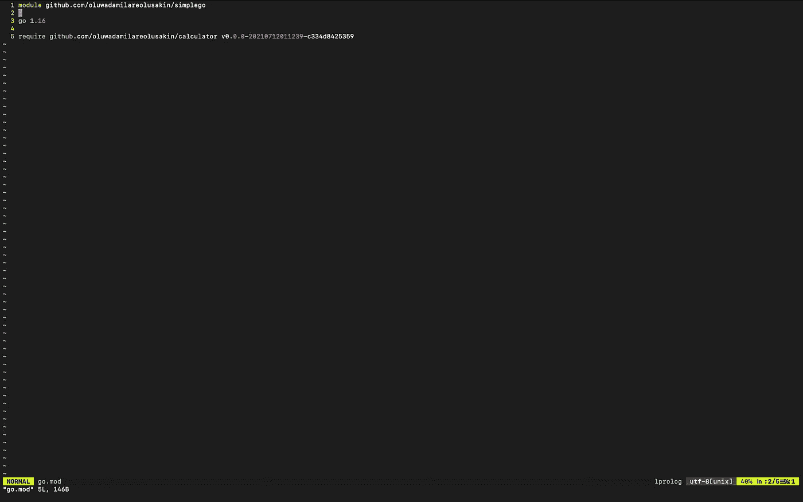

现在我们可以在程序中使用`operations`了，让我们给`main.go`添加一些代码👇🏽

让我们运行我们的程序，在你的终端中运行下面的命令，你应该在终端窗口✌️中看到打印出来的操作步骤`1+2+3+4+5`

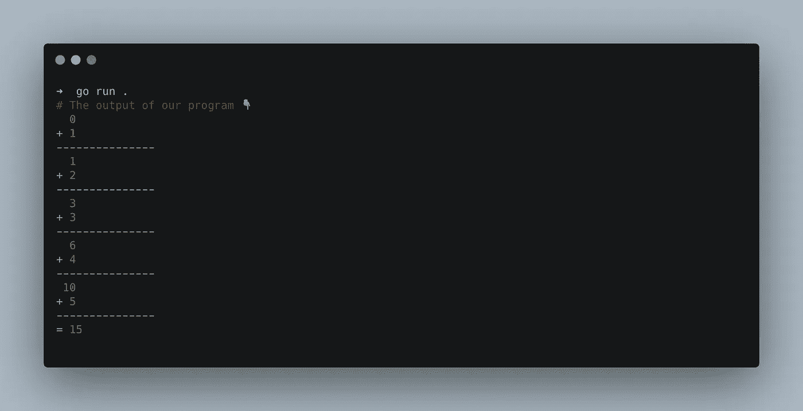

它活着！👻

## 摘要

到目前为止，我们已经:

*   写了一个小的围棋模块，可以执行一些运算并打印出结果
*   我们发布了一个包
*   将我们发布的包导入到另一个简单的程序中并使用它

最后，有一些东西我没有在这篇文章中介绍，例如，推荐的 go 模块和包的版本和发布工作流，但是，有相当好的资源，只是为了那个，这里的[这里的](https://golang.org/doc/modules/version-numbers)和这里的[这里的](https://golang.org/doc/modules/developing)。

[在这里](https://github.com/Oluwadamilareolusakin/simplego)，你会找到`simple.go`的代码，我们的计算器模块的代码可以在这里找到[。](https://github.com/Oluwadamilareolusakin/calculator)

感谢您的关注，如果您有任何问题或反馈，请告诉我😉。