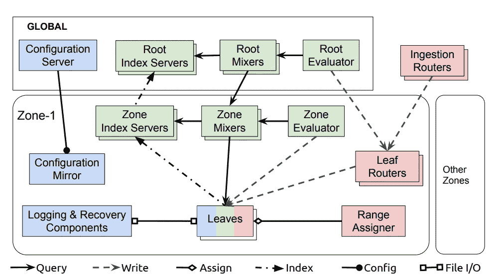
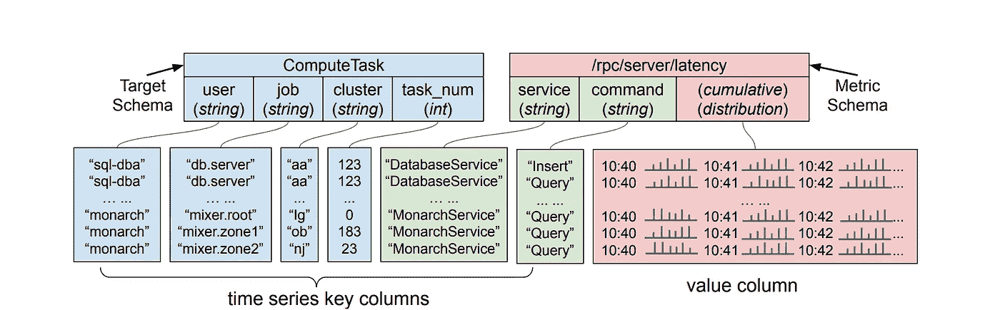
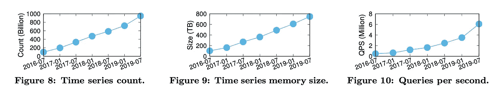

# 了解 Monarch，谷歌的全球监测系统

> 原文：<https://medium.com/geekculture/understanding-monarch-googles-planet-scale-monitoring-system-60e59b63ac0c?source=collection_archive---------7----------------------->

Monarch 是 Google 开发的一个星球级内存时间序列数据库。它主要是作为一个可靠的监控系统被谷歌的内部系统使用，如 Spanner，BigTable，Colossus，BlobStore。

就像任何谷歌服务一样，它必须被设计成大规模、高可用性、支持区域性。另一个对 Monarch 很重要的用例是尽可能少地依赖其他 Google 服务，因为其他服务都在使用 Monarch 进行自己的监控，任何一个服务中断都会影响到另一个服务。

Monarch 是一种必须高度可用和分区的服务，因此它通过在整合一致性延迟的情况下向客户端服务提供所需的提示来损害一致性。

君主尝试

## **数据存储:**

数据以两种格式存储:

*   **叶**是实际监控数据存储在内存中的组件
*   **日志**是持久性存储，可用于在组件故障的情况下重放事件

## 数据摄取

数据接收管道尝试遵循以下准则:

*   将客户端服务的数据存储在尽可能靠近服务操作区域的地方，以使网络延迟最小
*   将客户服务的数据存储在同一个叶中，因为数据查询很有可能集中在该叶上以获得更快的查询响应

Fig: Monarch components layout (from [https://www.vldb.org/pvldb/vol13/p3181-adams.pdf](https://www.vldb.org/pvldb/vol13/p3181-adams.pdf))

数据遍历将以下列方式进行:

*   **接收路由器**将数据路由到叶路由器
*   **叶子路由器**将数据路由到叶子
*   **范围分配器**决定存储数据的叶子

摄取路由器根据位置字段将时间序列数据区域化到区域中，而叶路由器根据范围分配器在叶之间分发数据

Fig: Data Format layout(from [https://www.vldb.org/pvldb/vol13/p3181-adams.pdf](https://www.vldb.org/pvldb/vol13/p3181-adams.pdf))

收到的数据有以下几类:

**目标**用于标识数据已经生成的节点/服务/组件表单。基于上图，一个目标字符串***ComputeTask::SQL-DBA::db . server::aa::0876***代表一个数据库服务器的 Borg 任务。目标字符串的格式在叶之间的数据放置中很重要，因为目标范围用于字典式分片和叶之间的负载平衡。

**指标**包含键-值对格式的指标信息，其中键是目标的指标类型，值是基于时间序列的数据点。支持的度量类型有布尔值、int64、double、字符串、分布或其他类型的元组。度量值可以是累积的或标准的。使用累积点的优点是间歇性的数据丢失不会对分布产生太大影响。

数据可以在**增量时间序列**中发送，其中仅发送时间序列数据中的增量，而不是整个度量。这减少了数据的连续输入，并且只需要处理数据范围的变化。

**分桶**有助于在将数据点发送到摄取管道之前，在一定时间内聚合数据点。这减少了网络处理，并且可以执行批量插入。

**准入窗口**用于拒绝在特定持续时间之后接收的查询，从而可以避免处理在特定持续时间之后接收的数据的压力。

## 数据查询

Monarch 提供了一个全局联合查询引擎。所有查询都可以在全局级别触发，Monarch 负责将查询路由到存储相关数据的树叶，并合并树叶的响应。

在上图中可以看到的用于数据查询的组件如下:

*   **混合器**将查询分解成子查询，并合并来自子查询的响应。根混合器接收查询并将它们扇出到区域混合器，区域混合器进一步将其扇出到叶子，从而形成**查询树**。混合器还检查索引服务器，将查询限制在数据所在的区域或叶
*   **索引服务器**索引每个区域和叶的数据，这些数据可用于了解查询针对哪些叶
*   **评估器**从持续查询中生成响应，并将数据写回树叶

Monarch 的**查询语言**支持以下关键字:

*   取得
*   过滤器
*   加入
*   排列
*   分组依据

**特殊查询**是来自系统外用户的查询。

**常备查询**是类似于其他数据库系统中视图的查询。长期查询会定期计算并存储回 Monarch，以获得更快的查询响应。

由于可以根据查询的广度在区域或根级别进行评估，所以固定查询的性能也更高。这将查询空间最小化到特定于区域的树叶。

**对查询进行级别分析**，基于不同的身份验证级别和更好的查询局部性来分解查询。可以基于上面提到的查询树来定义级别。

**副本解析**用于找出回答查询的最佳副本，因为在查询负载、系统配置等方面可能存在差异，这使得某个副本更适合于响应。

**用户隔离**限制任何用户在系统中可以使用的内存量，这样其他遵守规则的用户就不会受到影响。

## 表演

*   Monarch 在五大洲的 38 个地区经营。它有大约 40 万个任务
*   截至 2019 年 7 月，Monarch 存储了近 9500 亿个时间序列，使用了约 750TB 的内存和高度优化的数据结构
*   2019 年 7 月，Monarch 的内部部署每秒钟吸收了约 4.4 万亿字节的数据
*   Monarch 持续指数增长，截至 2019 年 7 月，每秒钟服务超过 600 万次查询。

Fig: Performance(from [https://www.vldb.org/pvldb/vol13/p3181-adams.pdf](https://www.vldb.org/pvldb/vol13/p3181-adams.pdf))

我希望你喜欢这篇文章。如果你对这篇文章有任何疑问，请告诉我。快乐阅读！！

参考资料:

*   【https://www.vldb.org/pvldb/vol13/p3181-adams.pdf 