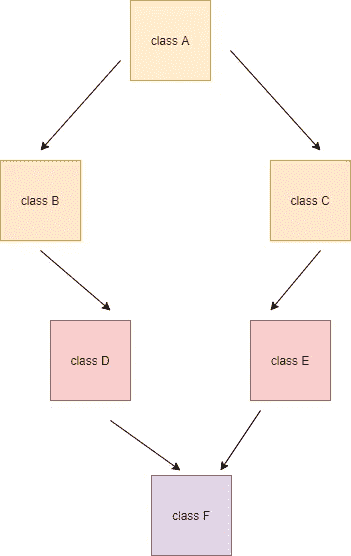

# 理解 python 中新旧样式类的 MRO(方法解析顺序)

> 原文：<https://medium.com/geekculture/understanding-mro-method-resolution-order-for-old-and-new-style-classes-in-python-f541747c48c7?source=collection_archive---------27----------------------->

## python 中的 C3 线性算法和 mro 讲解


Understanding mro in python old and new style classes

# 介绍

与 Java 不同，Python 支持多重继承。因此，理解方法解析顺序至关重要，尤其是对于 python，因为它对于新的和旧的样式类有不同的 MRO。

如果你是 python 的新手，尽管我们现在还没有对 python 2 的官方支持，但了解这些概念的起源是有好处的。python 3 中的所有类都只采用新样式的类，如果您想尝试旧样式的类，请使用 python 2.2 或更低版本。

到本文结束时，您应该对新旧样式类的方法解析顺序有了清晰的认识。

# 动机:

python 2.2 中的方法解析不是单调的，即不一致。因此，有人提议采用 C3 法决议顺序。

> *单调性:*
> 
> *当下列条件成立时，MRO 是单调的:*如果 C1 在 C 的线性化(类优先列表)中先于 C2，那么 C1 在 C 的任何子类的线性化中先于 C2*。*

```
class C(C1, C2):
    pass

class ChildC(C,C1,C2):
    pass
```

## 什么是 C3？

[C3](https://doc.sagemath.org/html/en/reference/misc/sage/misc/c3.html) 是 Python 用来为涉及多重继承的新样式类构造方法解析顺序的算法。目的是确保超类别列表与类别的父类或元素类的方法解析顺序相匹配。

我将在接下来的几节中用适当的例子来解释 C3。

经典类(python 2)保持旧的方法解析顺序。因此，C3 算法仅适用于新的样式类。

# 什么是 MRO？

*方法解析顺序* (MRO)是构建类优先级列表的一组规则，即一个类的祖先列表。在 Python 文献中，习语“C 的 MRO”也被用作 C 类的类优先列表的同义词。这里 C 类只是一个任意的类。

## 新型类:

让我们考虑一个多重继承的经典例子。

```
class A(object):

    def display(self):
        print(f" From class A")

class B(A):

    def display(self):
        print(f" From class B")

class C(A):

    def display(self):
        print(f" From class C")

class D(C, B):

    def display(self):
        print(f" From class D")

class E(C, B):

    def display(self):
        print(f" From class E")

D().display()
E().display()

Output:
 From class D
 From class E
```

上面是 python 3 中多重继承的一个非常清晰的实现。现在，任何从`class D`和`class E`继承的类都是有效的。如果你想检查方法解析顺序，你可以使用代码`print(D.__mro__)`。

```
print(D.__mro__)

Output:
(<class '__main__.D'>, <class '__main__.C'>, <class '__main__.B'>, <class '__main__.A'>, <class 'object'>)
```


method resolution in new style classes for class D

以上输出显示了`class D`的 mro。顺序是`D->C->B->A->Object`。C3 顺序是从左到右，如果一个方法在左类和右类中都没有实现，那么它会更深入到父类。

如果你想测试这一点，你可以试着从`class D`和`class C`中注释掉`display()`方法，继续深入查看从哪里调用该方法。

现在一切似乎都很好…

让我们稍微混合一下。我们将在`class E`中互换继承顺序。让我们定义`class E(B,C)`而不是`class E(C,B)`，其中后者用`class D`匹配继承顺序。

```
class A(object):

    def display(self):
        print(f" From class A")

class B(A):

    def display(self):
        print(f" From class B")

class C(A):

    def display(self):
        print(f" From class C")

class D(C, B):

    def display(self):
        print(f" From class D")

class E(B, C):

    def display(self):
        print(f" From class E")
```

现在我们已经交换了`class E`中的继承顺序，我们将尝试创建一个从 D 和 e 继承的新类`class F(D,E)`。

```
class F(D,E):

    def display(self):
        print(f" From class F")

F().display()Output:
Traceback (most recent call last):
  File "/home/dineshkumarkb/MyGitHub/MyPractice/Python/mro.py", line 31, in <module>
    class F(D,E):
TypeError: Cannot create a consistent method resolution
order (MRO) for bases C, B
```



A typical multiple inheritance in python

这就对了。有了新的样式类，python 不允许创建不一致的方法解析，因为线性化是从左到右，然后是深度。因此，如果继承顺序改变，用户将无法从这些类中创建子类。这是由 C3 指定的线性算法是怎么回事。重申 mro 定义，*如果 C1 在 C 的线性化中先于 C2，那么 C1 在 C 的任何子类的线性化中先于 C2*。

# 旧样式类别:

现在我们对新样式类中的 mro 有了清晰的概念，让我们理解在 python 2.3 之前事情是如何工作的。记住，在 python 2.3 之前，mro 是深度优先，然后从左到右，不像新的样式类。

*注意:确保你有 python 2.3 以下的解释器来运行这段代码。任何高于 2.2 的 python 版本都提供了新的样式类实现。*还要确保 A 类不会从`object`类继承。

```
class A:

    def display(self):
        print("From class A")

class B(A):

    def display(self):
        print("From class B")

class C(A):

    def display(self):
        print("From C")

class D(C, B):

    def display(self):
        print("From D")

class E(B, C):

    def display(self):
        print("From E")

class F(D,E):

    def display(self):
        print("From class F")

F().display()
```

在 Python 2.2 中，解释器允许你从这样的父类继承类。

```
Output: From class F
```

这里没有错误，解决的顺序是模糊的。现在，让我们试着在从`class F`开始的每个类中注释掉`display()`方法，看看解释器如何解析继承。

```
class A:

    def display(self):
        print("From class A")

class B(A):

    def display(self):
        print("From class B")

class C(A):
    pass

    # def display(self):
    #     print("From C")

class D(C, B):
    pass

    # def display(self):
    #     print("From D")

class E(B, C):

    def display(self):
        print("From E")

class F(D, E):
    pass

    # def display(self):
    #     print("From class F")

F().display()
```

从`class F`中移除显示方法后，它会转到一个父类`class D`。在移除`class D`中的`display()`方法时，理想情况下应查看`class E`。然而，它深入一层并取入`class C`，它是`class D`的父节点。


mro in old style classes

```
Output From class A
```

您可以尝试通过注释不同类的方法来理解解决顺序。我希望这篇文章能够清晰地描述 python 的旧风格和新风格类以及 C3 算法的方法解析顺序。

# 总结:

*   Python 的新样式类遵循 C3 算法来确定新样式类的方法解析顺序。
*   python 2.3 支持新的样式类
*   旧的样式类使用深度优先然后从左到右的方法确定 mro。
*   新的样式类首先从左到右确定 mro，然后向更深的方向移动。

# 参考资料:

*   [https://www.python.org/download/releases/2.3/mro/](https://www.python.org/download/releases/2.3/mro/)
*   [https://doc . sagemath . org/html/en/reference/misc/sage/misc/C3 . html](https://doc.sagemath.org/html/en/reference/misc/sage/misc/c3.html)

对于远程 python 工作，请尝试 https://remotepython.io/的

*原载于 2021 年 8 月 1 日 https://dineshkumarkb.com**[*。*](https://dineshkumarkb.com/tech/understanding-mro-method-resolution-order-for-old-and-new-style-classes-in-python/)*