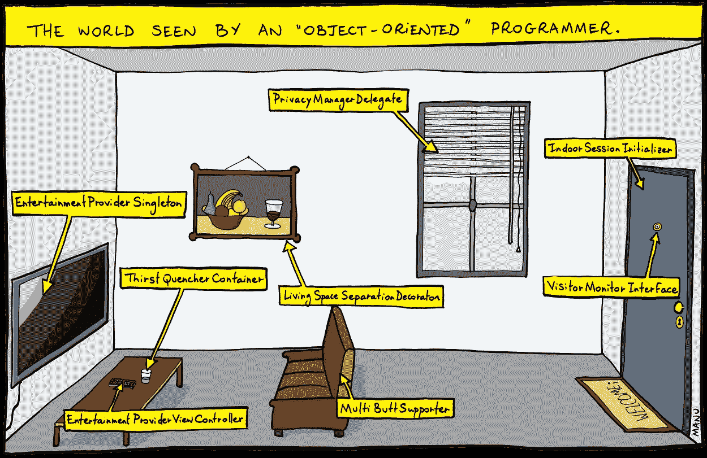
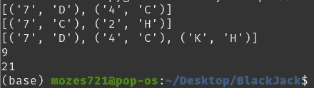
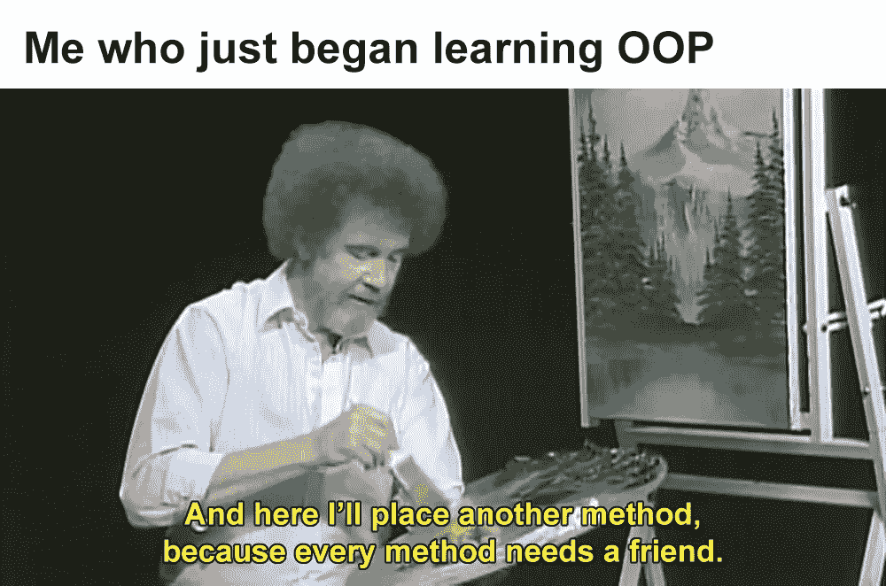

# 用卡片叠♠︎️理解 OOP Python

> 原文：<https://medium.com/geekculture/understanding-oop-python-with-a-deck-of-cards-%EF%B8%8E%EF%B8%8F-99c31ea5acaa?source=collection_archive---------3----------------------->



首先，你会问为什么要使用 OOP 面向对象编程？

> 因为**它使得代码更加可重用，并且更容易处理更大的程序**。OOP 程序防止你重复代码，因为一个类可以被定义一次并被多次重用。

# 定义类别

在谈论 OOP 时，类就像是创建对象概念的蓝图。

> 对象只是数据(变量)和作用于这些数据的方法(函数)的集合。

如前所述，我们将使用 OOP 来帮助定义一个真实世界的概念，以一种计算机能够识别的方式。这就是为什么我的例子来自纸牌游戏**21 点**并且将开始创建一副牌。我将使用我自己项目中的例子。

> **完整项目封装 *Pygame* GitHub 链接是** [**这里**](https://github.com/Mozes721/BlackJack) **另外会为它做一个相关的博客。**

## 甲板

一个套牌对象真的只需要两个属性:花色和等级。

```
SUITS = ['C', 'S', 'H', 'D']RANKS = ['A', '2', '3', '4', '5', '6', '7', '8', '9', '10', 'J', 'Q', 'K']
```

首先，我们随机导入，由于在 Pygame 中缩放我的项目，我为套装、等级等创建了常量文件，但是你可以把它写在同一个文件中。

因此我们创建了一个 Deck 类，在每种情况下我们都使用`self`作为第一个参数。并且我们将在`__init__`中有一个“cards”数组属性和“build()”调用方法。如图所示的构建将遍历等级和花色，并将其添加到 self.cards 数组中。

当然，我们会洗牌并使用 **pop** 方法从这副牌中发牌。

## 手

F 或**手**类我们通过将**牌组**类实例作为**父类**类来开始，这样我们就可以得到洗牌，另外调用**发牌**方法。在**手** `__init__`法中，用户卡被设置为与自身值相同

> **重要提示:**如果你只是遵循面向对象程序设计的道路，对游戏如何在 **Pygame** 中实现不感兴趣，请考虑
> 
> PYGAME 中需要的**和**在其结束的地方结束**。谢谢大家！**

**向用户添加卡的添加卡方法。 **calc_hand** 方法是以**二十一点**游戏为例。**

**在这个方法的请求下，我们创建了几个[列表理解](https://www.w3schools.com/python/python_lists_comprehension.asp)来处理检查牌是否是 a。然后为非 ace 创建一个 for 循环，如果它的“JQK”赋值为 10，否则为卡片的数字，如 6、7 等。**

**对于 Ace，如果值等于或大于 10，则将值指定为 11，否则，如果**自身值**大于 11，则将 Ace 值指定为 1。**

**显示卡将从自己的卡中获取卡，并加入卡的第一个和第二个索引，如'♠︎️'和 j。如果它还没有在用户**卡 _img** 中列出，那么添加它**

## **创建卡牌和玩家实例**

**我们不会在这里做整个 21 点项目，我会在博客的 Pygame 版本中介绍。我们只是**

```
deck = Deck()
deck.shuffle()player = Hand()
dealer = Hand()for i in range(2):
    player.add_card(deck.deal())
    dealer.add_card(deck.deal())print(player.cards)
print(dealer.cards)player.calc_hand()
dealer.calc_hand()print(dealer.value)
print(player.value)
```

****

**The print result of player, dealers hand and value of hand**

**创建类初始化 **Deck** 时，首先将它赋给 Deck 变量。并使用我们在其中创建的 **shuffle()** 方法。**

**然后玩家和庄家得到他们自己的 **Hand()** 实例，因为 Hand 类已经在参数中的**牌组**中传递，所以使 **Hand** 成为子实例，而**牌组**成为父实例。因此玩家和庄家都从同一副牌中得到牌。**

**正如我们所记得的， **Hand()** 类有 **add_card()** 方法和 **calc_hand()** 方法，通过它们我们可以添加玩家的手牌，也可以计算手牌！**

****

# ****结论****

**我希望你喜欢这篇文章。OOP 是我花了时间去理解的东西，也是我很长一段时间想要避免的东西。但是后来我发现，如果没有基于项目需求创建类和进行多重继承的 OOP 方法，我就不能恰当地扩展项目。**

**如前所述，我将在不久的将来跟进 21 点 pygame 博客，它将加倍强调 OOP 方法的重要性。GitHub 链接如下如有兴趣。**

**[](https://github.com/Mozes721/BlackJack) [## GitHub-mozes 721/21 点

### 在 GitHub 上创建帐户，为 Mozes721/BlackJack 开发做出贡献。

github.com](https://github.com/Mozes721/BlackJack) 

# 相关故事

[](https://python.plainenglish.io/dynamic-e-mail-automation-from-excel-file-103d35bd9225) [## 从 Excel 文件实现动态电子邮件自动化

### 使用 Python 向整个 Excel 列表发送电子邮件，或者单独发送带有翻译文本选项的电子邮件！

python .平原英语. io](https://python.plainenglish.io/dynamic-e-mail-automation-from-excel-file-103d35bd9225) [](https://python.plainenglish.io/data-visualization-for-beginners-with-matploptib-3fde2c635c1d) [## 用 Matplotlib 实现初学者的数据可视化

### 关于如何使用 Python 显示不同类型的绘图的指南。

python .平原英语. io](https://python.plainenglish.io/data-visualization-for-beginners-with-matploptib-3fde2c635c1d) [](/codex/instagram-choose-img-from-gdrive-or-local-storage-629fa836dd4f) [## Instagram:从 GDrive 或本地存储中选择图像

### 这个项目分为三个部分:谷歌 API，目录搜索，Instabot/Tkinter

medium.com](/codex/instagram-choose-img-from-gdrive-or-local-storage-629fa836dd4f)**