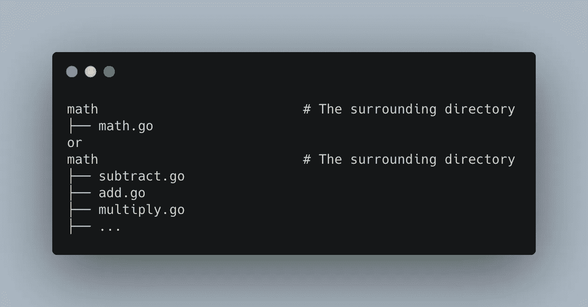
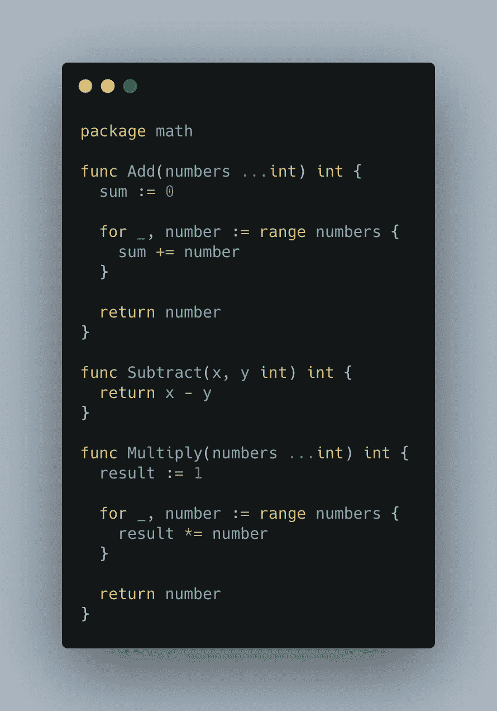
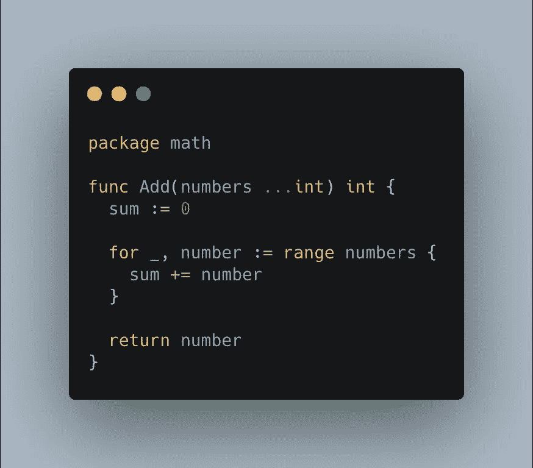
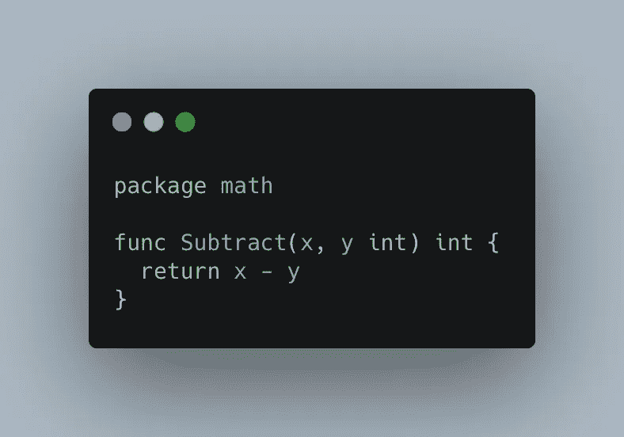
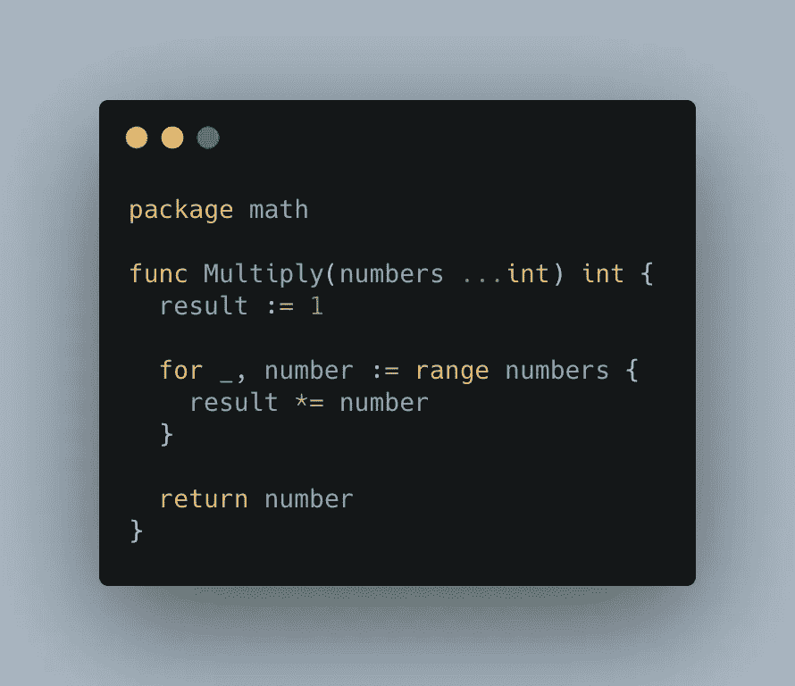
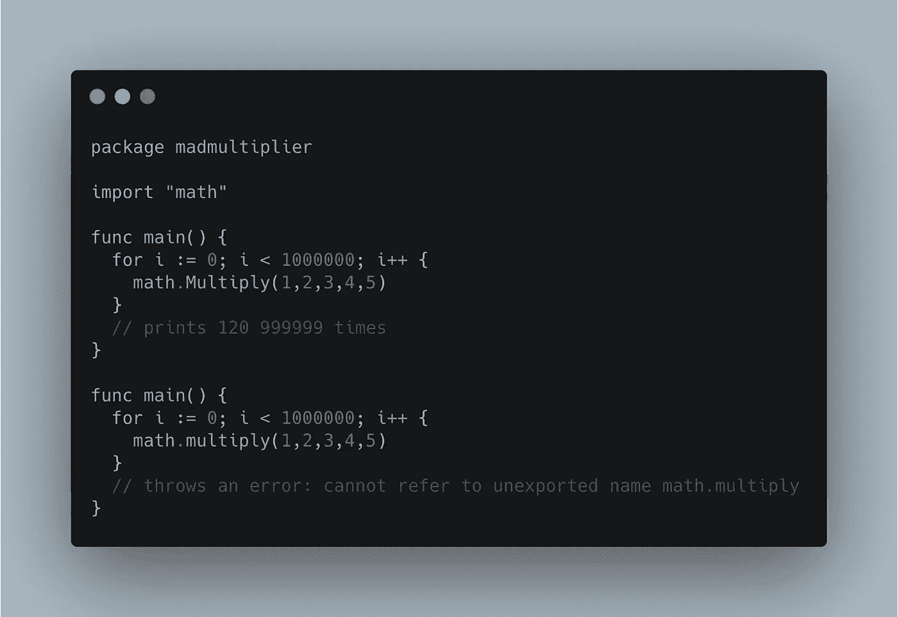
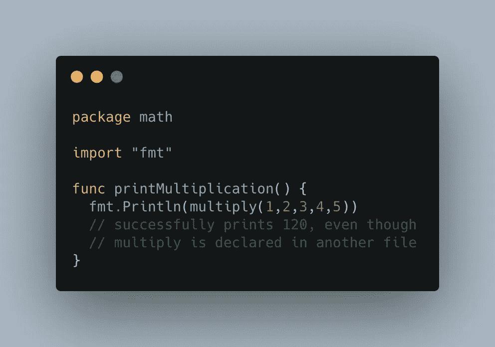

# 了解 Golang 中的包

> 原文：<https://medium.com/geekculture/understanding-packages-in-golang-9a5825ac869f?source=collection_archive---------6----------------------->

基本面

无论你是一个经验丰富的 Golang 开发者还是 Golang 初学者，你可能已经听过很多次`package`和`module`这两个词，或者你至少在一些阅读材料中遇到过。

最初，我纠结于这两个概念，不是关于它们的定义是什么，而是当你在 Golang 中构建/编写程序时，它们对你所在的生态系统意味着什么。

在这一部分中，我们将简单介绍一下什么是包以及关于包的一些重要概念。

# 包装

包是一个文件或一组具有名称空间和一些代码或相关代码的文件。这意味着一个包可以存在于一个文件中，比如`math.go`，也可以存在于多个文件中，比如`add.go`、`subctract.go`、`multiply.go`，例如，许多文件或单个文件的命名空间为`package math`。

一个包将有一个类似这样的环绕目录:

The math package with both styles we spoke about above

`math.go`的内容可能类似于:

Having all the code for our math package in one file

如果我们决定将这个数学包分割成多个文件，我们可以制作三个文件`add.go`、`subctract.go`、`multiply.go`，内容如下

add.go from the math package

subtract.go from the math package

multiply.go from the math package

查看所有三个结果文件，您可能已经注意到了共同点——它们都共享相同的包名称空间`math`。当然，你可能永远不会发现有人这样做，除非他们把非常大的文件分割成多个文件。对于我们接下来将要讨论的内容，理解共享名称空间的概念是非常重要的👌

## 导出的和本地的函数/方法

用 Golang 编写包背后的想法是创建模块化的代码片段，这些代码片段可以在您的项目之间共享，或者与其他开发人员共享，以便在他们自己的项目中使用，Golang，加油！我喜欢你慷慨的天性💌。

现在，为了实现这一点，并且为了安全地实现这一点，我们可能希望将我们代码的某些部分作为外部 API 公开，以供进一步使用，同时将包的某些方面隐藏得更深，不那么容易访问。一些语言提供了像`public`、`private`、`protected`这样的结构来帮助解决这个问题，但是在 Golang 中，`public`和`private`API 的概念隐含在我们命名函数、方法和属性的方式中。让我们看一个例子👇🏽

Illustrating exported and local functions

看上面的插图，我们有两个同名的函数，有一点不同，一个是小写的`multiply`，另一个是以大写字母`Multiply`开头的，这个细微的差别就是 Golang 中本地函数和导出函数之间的区别。你可以猜猜哪个是哪个😂从它们的结构来看，你可能是对的，但是尽管如此，在 Golang 中，当你用小写字母命名时，它是本地化的，不能在这个包之外访问(还记得什么是包吗？再看一眼？😉 ).另一方面，任何以大写字母开头的东西都可以从定义/声明它的包的内部和外部访问。

因此，如果我们今天发布我们的包(我们很快就会看到发布包👌)，我们可以导入这个`math`包并访问`Multiply`，但是试图访问`multiply`肯定会抛出错误！👇🏽

Trying to access an exported and an unexported Function from the math package

然而，我们可以在同一个名称空间下访问`multiply`，甚至在另一个文件中！👇🏽

这些概念可能是一些漂亮的和创造性结构的 Go 代码和一些混乱的程序之间的区别。这里需要注意的一点是这里的`math`是作为一个说明性的包名使用的，不要在任何真实的或游戏应用中使用它，因为 Golang 已经有了一个内置的数学包，这肯定会导致一些意想不到的行为(如果你好奇，可以尝试一下😉).

## 概括起来

*   一个包可以被认为是一个包含一些相关代码的命名空间(在顶部)的文件
*   它也可以是一堆具有相同名称空间的文件，包含相关的代码
*   除非非常必要，否则不要过早地将包分成多个文件，例如，文件变得不可管理，或者您有一些在运行时动态生成的代码(我们将很快讨论代码生成😉)，等等。此外，即使您将包拆分成不同的文件，它们也必须位于相同的目录中，否则您将会搞乱您的导入。
*   在 Golang 中，私有和公共函数、方法和类型的概念是基于如何命名构造而隐含的。如果你以大写字母开始，当前包之外的包可以访问它们，如果你小写，它们变成 *"private"* 并且从当前包之外不可访问/不可触及。

就是这样！走，走，走🏃‍♂️，你今天学了一点高尔夫🎉，非常感谢您的参与！在我的下一篇文章中，我们将讨论模块以及它们如何与包的概念联系起来，再见👋