# 对于想从事数据分析师工作的人来说，这是一个完美的实习机会——分析 Quantium Analytics 数据以发现芯片品牌

> 原文：<https://medium.com/geekculture/understanding-quantium-analytics-data-to-discover-trends-of-chips-category-b3db7a0418bb?source=collection_archive---------9----------------------->

【想看更多数据科学面试准备？查看[我的 GitHub 档案](https://github.com/naiborhujosua)


Photo by [Jeff Siepman](https://unsplash.com/@jeffsiepman?utm_source=medium&utm_medium=referral) on [Unsplash](https://unsplash.com?utm_source=medium&utm_medium=referral)

```
· [The Data](#ead2)
· [Data Exploration](#3a8f)
· [Customer Segments Analysis](#2a31)
· [Store Layout Analysis](#b80a)
· [Recommendation](#6544)
· [Thank you for reading!](#6c12)
```

M 营销是公司业务的一部分，公司不能忽视它来介绍公司产品。这是公司旅程中极其重要的一部分。在做故事营销之前，有几个流程是我们作为公司的一部分要做的，以便分享。在这篇文章中，我想分享我参加一家名为 Quantium Analytics 的人工智能公司的虚拟实习的经历。分析芯片类别中 Quantium analytics 类别问题之一的过程。我们将通过收集支持我们将要解决的问题的数据、进行数据清理、特征工程和通过图形或图表进行探索性数据分析来开始解决问题。在本节中，我们通过分析交易和客户数据，与一家大型超市合作，与 Quantium analytics 的一个芯片类客户一起面临问题。超市的问题是改变商店布局、产品选择、价格和促销，以满足顾客的需求和偏好。超市希望了解 Quantium analytics 基于这些参数可以提供哪些建议。

# 数据

我们将通过收集客户提供的 CSV 和 xlsx 格式的 2 个数据来开始分析数据。我们将实现一些库，如 pandas、seaborn、NumPy 和 matplotlib，以便从这两个数据中导入和提取信息。我将给出来自 [Jupyter 笔记本](https://github.com/naiborhujosua/QuantiumANalytics-VirtualInternship/blob/main/Retail%20Analytics_1.ipynb)的代码快照，以捕捉部分代码。您可以看到，我们将分析超过 260，000 行的交易和客户数据。

# 数据探索

我们要做的第二个过程是提取和清理由缺失值、重复数据、特征/列的不适当数据类型甚至可能影响我们分析的异常值组成的数据。您可以查看代码以了解更多信息。

清理完数据后，我们下一步要做的是查看一些可以相互组合的功能，甚至通过组合一个或多个功能来创建新功能，从而创建可以改进我们推荐的新功能。领域专家在特征工程中起着重要的作用。您对数据了解得越多，创建的特征就越好。您可以查看代码以了解更多信息。

执行这些过程将是使我们的数据准备好被提取并获得一些见解的良好步骤。我们将根据一些业务指标来分析数据，以便通过查看总销售额、销售驱动因素以及最高销售额来自哪里来提供一些见解。

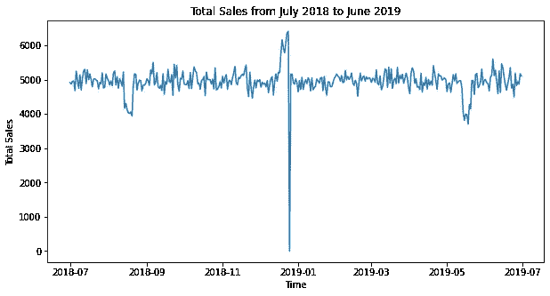

Total Sales from July 2018 to June 2019

我们可以看到，2018 年至 2019 年期间的销量增长，除非在 2018 年 12 月 25 日这一公共假期/圣诞节出现大幅下降。下图显示了 12 月的某一天，12 月 25 日的销售额为零。

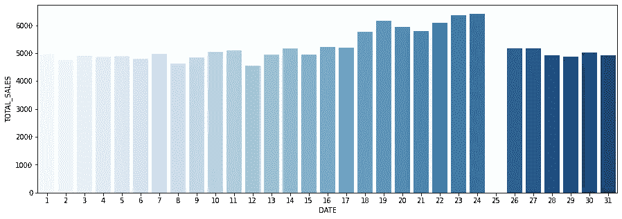

Total Sales of December 2018

# 客户细分分析

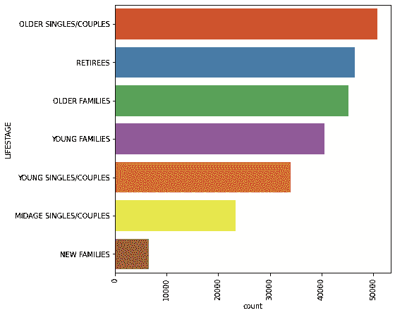

LIFE STAGE Analysis

首先，我们发现大多数顾客来自老年单身/夫妇，其次是退休人员和老年家庭，如图所示。我们将通过我们之前确定的业务指标来看看基于生命阶段的客户数量是否会影响每月的总销售额。


*你可以看到，老年家庭预算、年轻单身/夫妇主流以及退休人员主流的总销售额都很可观。这些细分市场的客户数量极大地影响了这些细分市场购买芯片的消费方式。但是，与其他客户群相比，新家庭在每种会员类型上的花费更少。*

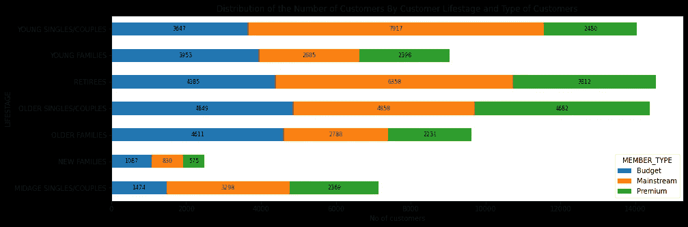

在客户数量方面，有更多的年轻单身/夫妇主流，退休者-主流，和中年单身/夫妇主流购买图中的筹码。

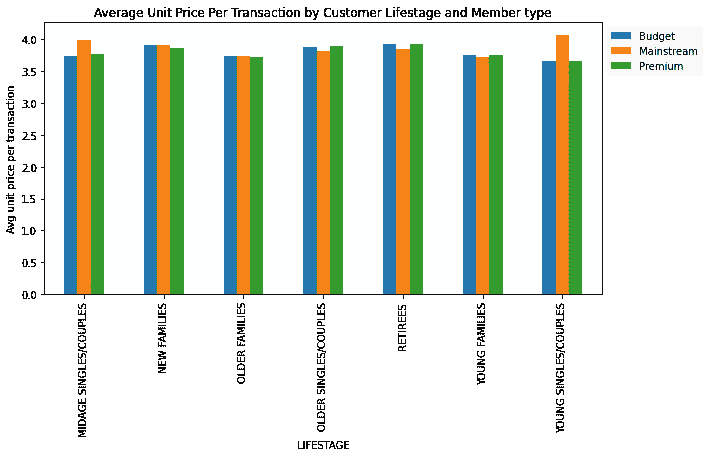

我们还按客户生命阶段和会员类型调查了每笔交易的平均单价，发现与其他类型的客户(如预算客户和高级客户)相比，年轻的单身/夫妇和中年单身/夫妇更愿意购买更多的筹码。很可能薯条不是他们选择的零食。我们可以使用 t 检验来检查中年单身/夫妇和年轻单身/夫妇之间的差异，以检查该差异在统计上是否显著。我们可以使用 scipy 库通过比较这两个因素的平均值来检查它们是否不同。同样，你可以在 jupyter 笔记本上查看该变量以获得更多信息。我们分成 2 组，通过检查 p 值来检查差值，以验证差异的显著性，我们得到**6.967354233018139 e-306T7，其显著性足以检查主流年轻单身/情侣的单价相比于中龄成员类型的非主流类型在统计上显著。**

我们还可以检查我们从清洁数据过程中提取的芯片的品牌名称，年轻的单身/夫妇倾向于购买 Kettle、Doritos 和 Pringles 品牌作为首选品牌。水壶是第一品牌，占 19.7%，其次是多力多滋，占 12.2%，品客薯片占 11.8%，如下图所示。

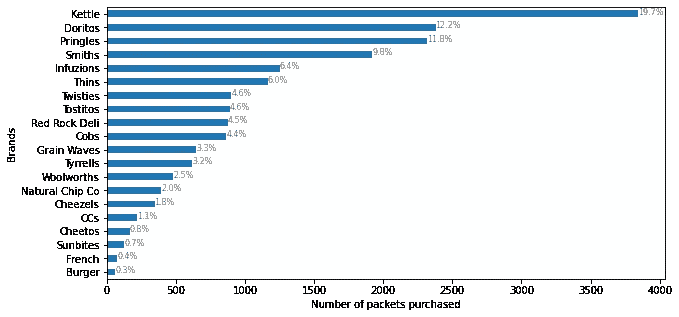

Mainstream Young Singles/Couples

另一方面，中年单身/夫妇将水壶作为首选品牌，比例为 **19.3%** ，其次是史密斯和多力多滋，分别为 **11.5%** 和 **10.9%** 。

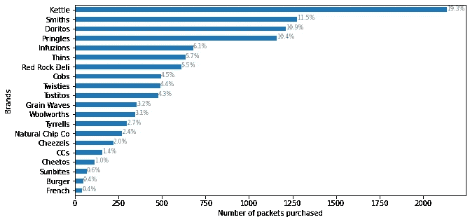

Midage Singles/Couples

我们分析的包装尺寸类别显示，150 克的包装尺寸是消费者的第二大选择，仅次于 175 克的水壶和品客薯片，是最受欢迎的薯片品牌。

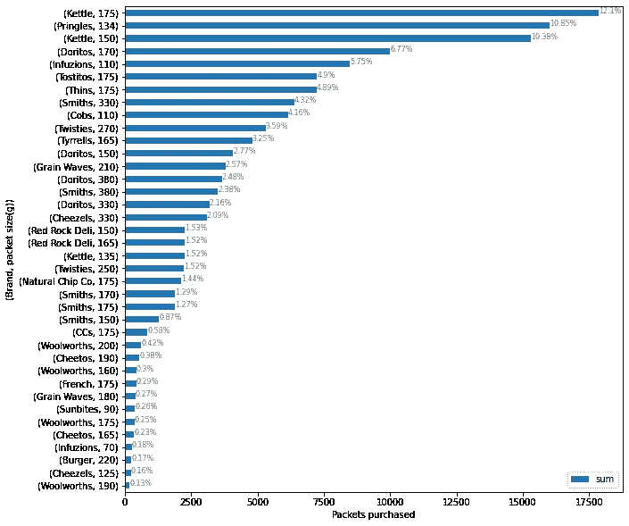

Brand Chips and Pack SIze

# **店铺布局分析**

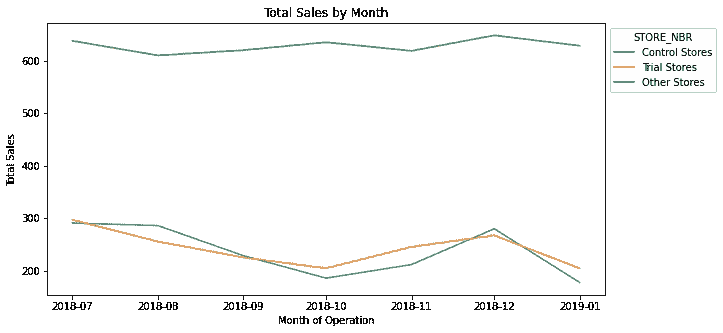

Total Sales of Trial Store over time

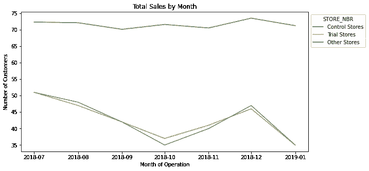

Number of Customers of Trial Store over time

我们可以从总销售额和顾客数量这两项业务指标中看出，试验店与对照店的关系显著，而不是与其他商店的平均值相关。这表明改变布局的决定将对总销售额和客户数量的增加产生影响。我们还可以通过验证 5%和 95%置信区间的值来检查这些指标的重要性，以检查这两个业务指标是否是验证的好主意。

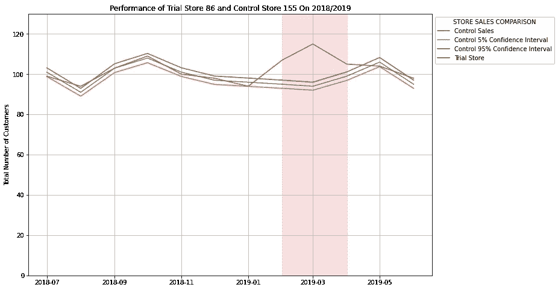

Total Sales of Store Sales Comparison

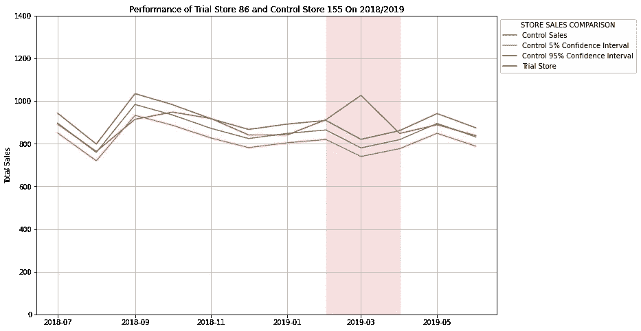

Number of Customers of Store Sales Comparison

您可以看到，在 2019 年 2 月至 4 月的试验期间，客户总数和总销售额超出了 5%和 95%的置信区间，这意味着试验商店的表现优于该期间存储的控制商店。在实施这个试用商店时，它带来了显著的变化，如图表所示，包括客户数量和总销售额指标。

# **推荐**

当通过提取数据获得洞察力后会有一些实际行动时，分析才会有影响力。在这个芯片类别问题上，我们可以看到主流年轻单身/夫妇和主流退休人员的总销售额显著增加，这是因为这些细分市场的许多客户。这个指标可以成为超市对这些细分市场进行更多促销的优势，以增加这些细分市场的总销售额和顾客数量。我们还可以看到，将会有一个好主意，即合作 1 或 2 个影响总销售额的品牌芯片，如主流年轻单身/情侣选择的 Doritos 和 Kettle，来做一些品牌推广。我们还可以看到，试用商店对商店的影响超过了控制商店，根据我们通过验证业务指标分析的参数，实施试用商店是一个好主意。您可以通过访问这个存储库获得详细的代码和文档来检查这个项目的存储库。

[](https://github.com/naiborhujosua/QuantiumAnalytics-VirtualInternship) [## GitHub-naiborhujosua/quanti um analytics-virtual internship:这个项目是 Quantium Data 的一部分…

### 该项目是由饲料计划提供的 Quantium 数据分析虚拟实习的一部分，以提供日常实践…

github.com](https://github.com/naiborhujosua/QuantiumAnalytics-VirtualInternship) 

# 感谢您的阅读！

我真的很感激！🤗*如果你喜欢这个帖子并想看更多，可以考虑* [***关注我***](https://naiborhujosua.medium.com/) *。我发布与机器学习和深度学习相关的主题。我尽量让我的帖子简单而精确，总是提供可视化和模拟。*