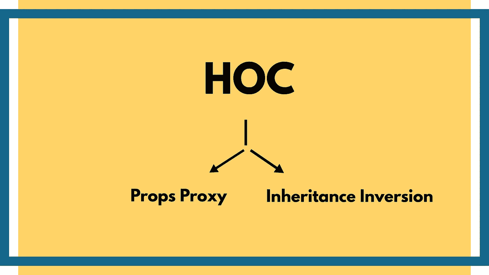

# 了解反应高阶组件(HOC)

> 原文：<https://medium.com/geekculture/understanding-react-higher-order-component-hoc-8e7a96820205?source=collection_archive---------2----------------------->

几乎所有关于使用 SPA 库的事情都会影响您抽象业务逻辑和编写高质量的代码。React 在过去的几年里一直在使用各种各样的[惊人的设计模式](https://reactjs.org/docs/design-principles.html)来实施这样的质量控制，我们对此并不陌生！

在本文中，我们将讨论 React 使用更高阶组件的质量控制机制的一个附加部分。到本文结束时，您应该有信心并准备好在必要时通过使用这一原则来处理/改进代码库。

# 什么是高阶分量？

高阶组件是一个很好的模式，已经被证明对几个 React 库非常有价值。根据[官方文件](https://reactjs.org/docs/higher-order-components.html)的反应——

> 高阶组件(HOC)是 React 中重用组件逻辑的一种高级技术。本质上，hoc 不是 React API 的一部分。它们是从 React 的组合性质中出现的一种模式。

JavaScript 是一种非常适合函数式编程的语言，因为它可以接受高阶函数。高阶函数是可以将**另一个函数**作为**参数**和/或**返回函数**作为结果的函数。

高阶函数允许我们抽象动作，而不仅仅是值。使用 HOCs，我们可以包装我们的子组件，或者在其上添加业务逻辑，或者扩展子组件本身的功能。

# HOCs 能做什么？

在高级 HOC 中，您可以:

*   重用代码、重用逻辑和引导抽象
*   渲染劫持
*   状态抽象和操作
*   道具操作

第三方 React 库，如 Redux 或 React 路由器，经常使用 hoc。我敢肯定，你已经使用了其中一些，甚至没有意识到这一点。

在 React 中，高阶组件的主要目的是在组件之间共享公共功能，而不必重复代码。

# hoc 的类型

React 中实现 hoc 的两种主要方式是:

*   **道具代理(PP)**
*   **遗传反转(二)**

两者都支持不同方式操作*包装组件*。两者都只是一个函数，它将一个组件作为参数，并生成一个包含 *WrappedComponent* 的新组件。

## 道具代理

Props 代理，顾名思义，传递从高阶组件接收的属性。

这里的关键元素是 HOC 的 render 方法返回 WrappedComponent 类型的 React 元素。特设接收我们通过道具传递的东西，因此命名为道具代理。HOC 返回一个 React 元素，描述 React 应该在其协调过程中呈现什么。

您还可以用其他 JSX 元素包装包装的组件，根据您的应用程序需求更改其 UI。

Props 代理 hoc 在以下情况下很有用:

1.  操纵道具
2.  通过引用访问实例
3.  抽象状态
4.  用其他元素包装/组合包装组件

## **继承反转**

此特设可以访问 WrappedComponents 实例。这为我们提供了对状态、道具、组件生命周期挂钩和呈现方法的访问。

如您所见，返回的 HOC 类(Enhancer)扩展了 WrappedComponent。它被称为继承反转，因为不是 WrappedComponent 扩展某个增强器类，而是增强器被动地扩展它。这样，他们的关系就显得颠倒了。

反转继承 hoc 适用于以下情况:

1.  渲染劫持
2.  操纵状态

# 让我们深入一些例子

为了牢固掌握我们所学的基础知识，让我们举一个应用程序的例子，这个应用程序只有一个输入，它接受一个名称并更改名称。

假设我们有一个场景，其中我们的业务应用程序需要大量的表单验证，并且不同的用例有不同的输入验证，在这种情况下，我们不需要重复代码并使用基于用例的组件制作多个输入表单，而是可以将它抽象成一个特设组件，它接受一个输入字段或更多的子组件，操纵状态以及操作(验证等)，并用每个用例所需的业务逻辑包装子组件。

考虑下面的例子-

在这里，我们将`Form`作为子组件，它被包装在`withHandlers` HOC 的周围。它给了子组件自己的自由，不会用开销逻辑使基础组件过于复杂，并证明了关注点分离的合理性。

现在，开发人员可以控制添加/删除验证和任何认为合适的额外操作。

# 结论

这是一个相对简单的例子，让您了解这些想法在实践中是如何工作的。习惯和适应这种类型的抽象需要一些时间，所以不要因为 HOCs 而失去动力或注意力。

此外，一旦你觉得舒服并想要更深入和复杂的解释，我建议查看[这篇详细的博客](/@franleplant/react-higher-order-components-in-depth-cf9032ee6c3e)并探索其中的概念。

如果我错过了任何一点，或者你想讨论什么，请在下面留下评论，我会尽快加入。🌟

最后，感谢您能深入到本文中，并对 React 表现出兴趣。你很了不起，每天都在做出积极的改变。再见。✌🏼