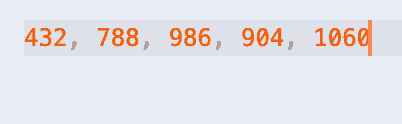
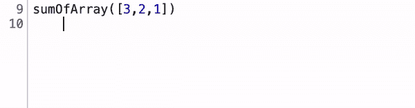
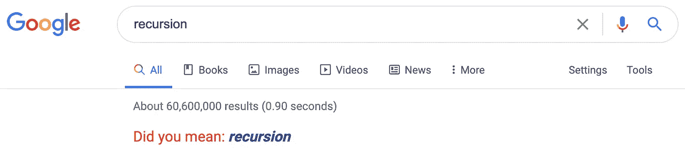

# 理解递归——提示:它没有你想象的复杂。

> 原文：<https://medium.com/geekculture/understanding-recursion-hint-its-less-complicated-than-you-think-e871a8693d50?source=collection_archive---------8----------------------->


[https://drydenart.weebly.com/fugleblog/nesting-dolls-drawing-animation](https://drydenart.weebly.com/fugleblog/nesting-dolls-drawing-animation)

我在偶然的讨论中遇到过递归，在文章中也提到过。这看起来就像是编程中的一只大灰狼。一个调用自己的函数？扑朔迷离！我知道我最终会着手理解它，这一天终于在本周到来了。

我目前正在学习柯尔特·斯蒂尔的 Udemy [课程](https://www.udemy.com/course/js-algorithms-and-data-structures-masterclass/)，内容是数据结构和算法(不能再推荐了)，递归是第一个主题之一。他把它分解成一种方式，清除了混乱的蜘蛛网，使它非常易于理解。

为了使这个概念有意义，你需要掌握递归的几个关键部分，我将在这里一一介绍。

# 高层次概述

斯蒂尔讲述了一个多年前在计算机科学课上讲给他听的故事。给了一个男孩一个数字列表，他必须找出这个列表中是否有奇数。出于某种原因，唯一知道偶数和奇数的生物是这种乖戾的龙(是的，这是一种奇怪的故事，就这样吧)。然而，当男孩出现要求龙评估他的列表时，龙拒绝检查整个列表，并说他只会告诉他第一个数字是偶数还是奇数。

男孩很快发现，在龙告诉他第一个数字后，男孩可以从列表中删除第一个数字，并带着“新列表”返回给龙，这实际上只是原始列表的修改版本。他不断带着这个修改过的列表返回给龙，直到最后没有剩下更多的数字，并且龙已经检查了所有的数字。那是递归！



It’s a “new” list each time to trick the dragon, but really it’s the same list shortened on each visit

# 拼图的碎片

递归函数有三个主要组成部分。

第一个是“基础案例”在这一点上，函数应该停止调用自己，这样就不会出现无限循环。在上面的 dragon 示例中，基本情况是“当列表中没有更多数字时”，或者用稍微更专业的术语来说，可能是类似于`list.length === 0`或`!list.length`的东西。

第二个是传递给递归函数调用的不断变化的输入。如果列表从不改变，那么列表上的第一个数字每次都是一样的，男孩永远也不会知道其余的数字是奇数还是偶数。

第三是应该发生的实际行动。在这个例子中，龙检查数字是奇数还是偶数。

所以每次见到龙，男孩都从列表中删除第一个数字，做一个“新列表”龙每次都在做同样的事情——检查第一个数字是奇数还是偶数。但是每次访问的列表(输入)都是不同的。

它看起来真的很像一个常规的 while 循环，不是吗？

```
while (some case is true)
     do something
     change the case (perhaps by incrementing or decrementing)
```

# 把所有的放在一起

让我们用实际代码做一个例子。给定一个数字数组，返回数组中所有数字的和。当然，我们可以用简单的 for 循环或。reduce，但目标是使用递归。

我们首先要考虑的是基本情况。我们希望我们的代码在什么时候停止运行？在这个例子中，一旦我们到达数组的末尾并添加了每个元素，我们的函数应该停止执行。这部分看起来像这样:

once the array is empty, return and stop executing

我们希望有一个 return 语句，因为这将结束我们的函数执行，并触发一种级联效应，我们将在稍后看到它的作用。

然后我们要考虑变化的输入和实际的动作。我们想要的动作是简单的加法。记住男孩和龙，如果我们只使用数组的第一个元素，然后切掉那个元素，然后添加新的、更小的数组的第一个元素，然后添加一个更小的数组的第一个元素，等等，直到我们到达末尾，会怎么样？

line 3 will grab the first element of the array and add it to the first element of a new, shorter array until the condition on line 2 is met

下面的 GIF 很快，所以你必须仔细观看，但让我们一步一步地看看发生了什么。当我们第一次调用`sumOfArray([3,2,1])`时，我们首先点击`if`语句。数组不是空的，所以我们绕过它，点击函数的第 3 行:`return array[0] + sumOfArray(array.slice(1))`。Slice 返回从指定索引开始的数组副本。我们有效地删除了第一个元素，因为我们已经将它包含在 sum 中，并移到一个更小的数组中。

现在我们的函数保持数字 3，并等待`sumOfArray([2,1])`的返回值(我们在 gif 的第 10 行)。数组不为空，所以我们再次跳到函数的第 3 行。数组的第一个元素现在是 2，我们必须等待`sumOfArray([1])`的返回值。

数组仍然不为空，所以我们跳到函数的第 3 行。数组的第一个元素现在是 1，我们等待`sumOfArray([])`的返回值。现在我们终于碰到了空数组的“基本情况”,并返回 0。

现在，0 被传递回函数的前一次迭代，并被加到正在等待的 1 上。1+0 是 1，所以 1 被传递回正在等待的 2。2+1 是 3，所以 3 被传递给从 gif 的第 10 行开始耐心等待的 3。最后，3+3 被解析为 6，这是最终的返回值。



On each iteration, the function grabs the first element of the shrinking array and waits for the return value before bubbling back up to the top when we finally get back 6.

我希望这能稍微澄清一下递归！至少，希望你现在能从递归笑话中得到乐趣(它们无处不在)。



**我们连线吧！在**[**LinkedIn**](https://www.linkedin.com/in/jzolotarev/)**[**Twitter**](https://twitter.com/JZolo)**和**[**Github**](https://github.com/jzolo22)**上找我。****

## **有用的资源:**

**[](https://developer.mozilla.org/en-US/docs/Web/JavaScript/Reference/Global_Objects/Array/slice) [## Array.prototype.slice()

### slice()方法将数组的一部分的浅拷贝返回到一个从头到尾选定的新数组对象中…

developer.mozilla.org](https://developer.mozilla.org/en-US/docs/Web/JavaScript/Reference/Global_Objects/Array/slice) [](https://www.w3schools.com/js/js_loop_while.asp) [## JavaScript while 循环

### 只要指定的条件为真，循环就可以执行代码块。while 循环遍历一个…

www.w3schools.com](https://www.w3schools.com/js/js_loop_while.asp) [](/swlh/javascript-call-stacks-an-introduction-f99da59e1e38) [## JavaScript 调用堆栈—简介

### 如果你在软件世界，你应该听说过栈。有人要 Stackoverflow 吗？如果你一直想知道那是什么…

medium.com](/swlh/javascript-call-stacks-an-introduction-f99da59e1e38)**