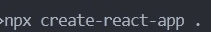
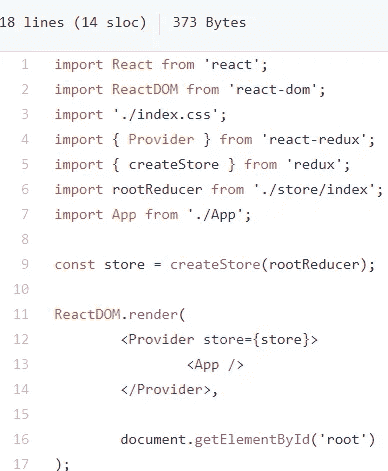
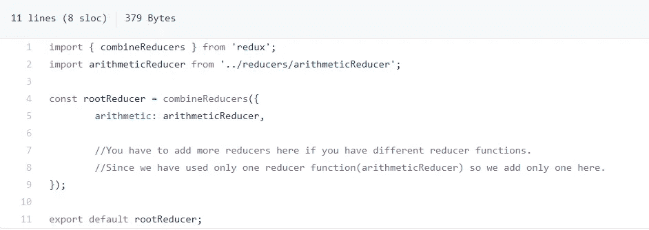
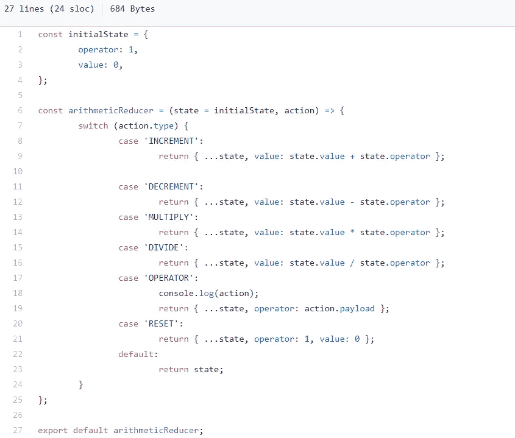
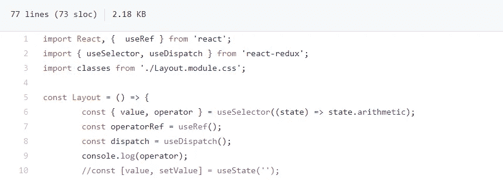
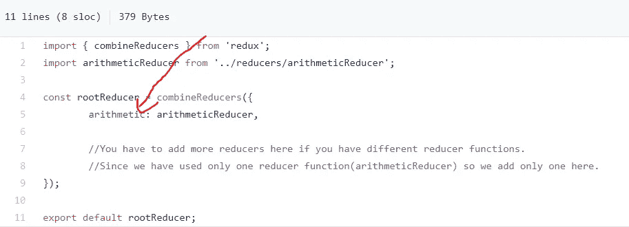
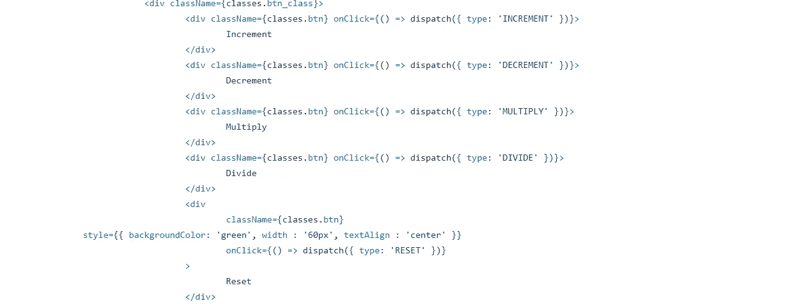

# 用有趣的项目了解 Redux

> 原文：<https://medium.com/geekculture/understanding-redux-with-fun-project-a58e5a7e017?source=collection_archive---------23----------------------->

一个有趣的项目，用 react 钩子解释 Redux。

首先，我们将使用创建一个 react 应用程序

然后，当 react 脚本和 dom 安装后，我们需要 2 个额外的 npm 包，它们是

安装完所有这些文件后，现在我们可以开始创建我们的应用程序了。

因此，redux 基本上用于 react 应用程序中的状态管理，在 redux 中创建了一个存储，在该存储中存储了我们应用程序的所有状态，并且该存储通过 redux 对我们应用程序的所有组件可用，因此我们可以在任何我们想要的组件中自由使用我们的状态，而无需经历在组件内传输属性的令人厌倦的属性钻取过程。

现在我们知道了为什么使用 redux，并且对它有了一个简要的概述，我们可以深入研究如何在我们的项目中使用 redux。在这个项目的帮助下，我将向您解释 redux 的功能和用法，到本文结束时，您将会很好地掌握 redux 的特性，并会获得使用它的信心。

我们现在将开始创建一个 redux 商店，这是通过从 Redux 包中导入“createStore”函数来实现的

现在我们必须将 rootReducer 作为一个参数传递给我们的 createStore，以便我们的存储具有我们想要在组件中访问的状态。(将在前面解释 rootReducer)。之后，我们将导入“Provider”函数，该函数将包装在我们的主应用程序组件周围，以便我们可以访问应用程序组件的每个子组件中的商店状态。

现在在 src 目录中创建一个 store 组件，然后在其中创建一个 index.js 文件。在 index.js 文件中，我们将导入所有的 Reducer，然后将它们组合成一个单独的 rootReducer 对象，在存储中使用。

设置好 rootReducer 后，我们将进一步了解 Reducer。(以上所说的都是样板文件，你需要在你制作的每个 redux 应用中重复使用)。

reducer 基本上是一个函数，其中我们接收两个参数，即状态和动作，状态是我们的应用程序的状态，动作是一个对象，可以导致此状态的变化。这个动作是由 useDispatch 钩子触发的，我们可以将它导入到任何组件中，然后在这个钩子的帮助下，可以在 redux 中改变状态。此外，要访问任何组件内部的存储状态，我们可以使用该组件内部的 useSelector 挂钩，然后我们可以访问该挂钩中的状态。

你可能很难理解这一切，但现在坚持住，你会慢慢开始掌握这些东西，直到本文结束。

所以，现在我们来看看缩减器的结构是什么样子的(缩减器的结构在所有的应用中都是一样的，这是一个标准的惯例，可以这样写)

**注意** — 1)在 reducer 函数中，状态永远不能为空，所以总是以初始状态或 state=[]或 state={}开始。

2)我们不能改变存储在内存中的预先存在的状态，这意味着我们不能做 state.value = something(不工作)，我们应该并且总是这样做 return {…state，value = something}，这样你就创建了一个新的状态对象，而没有改变之前的状态对象。

3)状态参数是我们接收的前一个状态，我们返回的将成为下一个状态(更新的状态)等等。

动作对象由想要改变状态的组件发送。

动作对象是这样的——{ type:' INCREMENT '，payload : something}，

因此，使用“类型”,我们将触发不同的更改，有效载荷将保存该更改所需的数据，但在增量的情况下，因为我们不需要任何数据，所以我们不需要在有效载荷中发送任何内容，只有类型将足以对状态进行更改。

**注意** —随着状态的每一个微小变化，使用该状态的组件将自动重新呈现，以显示该组件中正在使用的状态的任何变化。

现在，您对 redux 的工作有了一些了解，我将告诉您有关该应用程序的信息，因此在该应用程序中，我们将有一个搜索栏，我们将在其中输入一个数字，该数字将被用作运算符=1(默认)和值=0(默认)，将有 5 个操作-递增，递减，相乘，除，重置。所以，假设你设置操作符的值为 5，然后使用增量，我们得到的值为 5，通过减量，我们得到的值为-5，我希望你知道这个应用程序是如何工作的。

因此，我们将使用编码和 Javascript (ES6)技能来操纵 reducer 函数内部的状态，您可以在 arithmeticReducer 函数中看到，并了解它需要如何完成。

现在，我将告诉您如何从组件调度操作来更改商店状态，以及如何在我们应用程序的不同组件中访问商店状态。

为了访问状态，我们必须导入 useSelector，并从我们将导入的组件中调度操作。useSelector 接收状态作为参数，我们可以从状态中访问算法以访问算术 Reducer 函数的状态，这样做是为了确保我们可以获得所需的 reducer 函数的状态，因为我们的应用程序可以有许多不同的 reducer。

现在，我们知道 arithmeticReducer 函数状态具有值和运算符属性，我们可以使用对象析构来访问这些属性，如上所示。

谈到如何分派动作，我们将得到 dispatch = useDispatch，现在我们需要发送一个包含类型和有效负载(如果需要)的 actions 对象来访问

在分派动作后，新的状态对象将被返回，这将导致通过 useSelector 使用状态重新呈现组件，并且组件内的更改将立即生效。

在这篇文章中已经解释了这个应用程序中与 redux 相关的所有事情，剩下的是基本代码，包括样式和不依赖于 redux 的用户输入。我希望你做一些类似的事情来克服你自己使用 redux 的恐惧，这样这篇文章中讲述的所有事情都会牢牢记在你的记忆中。

如果你想玩这个应用程序(这是链接)——[https://fun-redux-project.netlify.app/](https://fun-redux-project.netlify.app/)

希望这篇文章能帮助你理解 redux，尽管我已经尽力用最好的方式解释了 redux。

感谢阅读:)