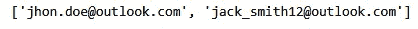
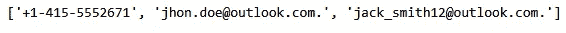

# 用 Python 理解正则表达式

> 原文：<https://medium.com/geekculture/understanding-regex-with-python-a27f176ecc36?source=collection_archive---------9----------------------->


当处理数据时，我们很少遇到干净和处理过的数据。在这些数据可以在任何地方使用之前，我们需要对其进行大量的处理，以使其发挥作用。其中一种技术是字符串中的模式匹配，只保留所需的模式，或者相反，删除不需要的模式。我们通过使用 ***正则表达式*** 或者简称为 ***正则表达式*** 在字符串中找到这些模式。Regex 是一组国际公认的规则，用于确定字符串的格式。

[](https://writersbyte.com/featured-post/regex-101-for-python-data-science/?swcfpc=1) [## Python 数据科学的 regex 101-WritersByte

### 当处理数据时，我们很少遇到干净和处理过的数据。在这些数据可以在任何地方使用之前，我们需要…

writersbyte.com](https://writersbyte.com/featured-post/regex-101-for-python-data-science/?swcfpc=1) 

在本文中，我们将探索这些表达式是什么，以及如何在 Python 中利用它们来清理数据。要了解其他数据处理技术[，请点击此处](https://writersbyte.com/datascience/5-data-processing-techniques-for-data-science-beginners-python-and-pandas/?swcfpc=1)。

# 理解正则表达式:Regex 101

正则表达式是为在字符串中查找模式而定义的一组规则。

正则表达式由一组字符定义。有普通人物，也有某些特殊人物。这些一起用来定义你的正则表达式。

## 普通字符

这些是我们每天使用的基本字母、数字或符号字符。这些通常用于精确匹配的场景。例如，如果我想找到一段文本中的所有感叹号，那么我的正则表达式应该是简单的**'！'**。这同样适用于匹配整个单词或句子。

## 特殊字符

我们上面讨论的是字符串匹配，但这并不是正则表达式的真正用途。创建这些表达式是为了匹配文本中的复杂模式，这就是我们使用特殊字符的地方。下表列出了一些最常用的特殊字符。

[](https://writersbyte.com/datascience/5-data-processing-techniques-for-data-science-beginners-python-and-pandas/?swcfpc=1) [## 面向数据科学初学者的 5 种数据处理技术| Python 和 Pandas - WritersByte

### 对于所有寻找数据科学工作或数据科学实习的年轻科学家来说，数据处理是一项技能…

writersbyte.com](https://writersbyte.com/datascience/5-data-processing-techniques-for-data-science-beginners-python-and-pandas/?swcfpc=1) 

字符解释

*   **。(点)**:匹配除换行符以外的任何字符
*   ***(星号)**:匹配前一个字符指定的 0 个或多个字符
*   **+(加号)**:匹配前面字符指定的术语的至少一次或多次出现
*   **^(脱字符号)**:匹配字符串的开头
*   **$(美元)**:匹配字符串的结尾
*   **？(问号)**:使产生的 RE 匹配前一个 RE 的 0 或 1 个重复。`'ab?'`将匹配“a”或“ab”。
*   **{m}** :精确匹配前面正则表达式的 m 个匹配项
*   **{m，n}** :匹配前面正则表达式的至少 m 次和几乎 n 次出现

让我们来看几个例子，我们将使用下面来自*哈利波特与魔法石*的文字。

> 然而哈利·波特还在那里，此刻正在睡觉，但不会太久。他的佩妮姨妈已经醒了，正是她尖锐的声音制造了这一天的第一个噪音。
> 
> “起来！起来！现在！”
> 
> 哈利被惊醒了。他的阿姨又敲门了。
> 
> -哈利·波特与魔法石。

如果你想匹配一个精确的字符串，那么你需要做的就是把这个精确的字符串作为*表达式*传入。例如，如果你想在上面的文本中找到哈利波特，那么你可以写“**哈利波特**”作为表达式。

您可以指定 regex 只查找一组特定的字符或数字。您也可以指定它只查找特定文本中的字母字符或数字。这是通过使用方括号“[]”来完成的。方括号括起了我们需要的字符集，例如，如果我们只需要字母字符，我们将把它写成:

```
[A-Za-z]
```

这指定了两个字符范围；从 A 到 Z 和从 A 到 Z(确保匹配不区分大小写)。我们也可以指定匹配文本中的所有字符。

假设我们想要匹配引号之间的**整个字符串。我们的表达式将如下所示:**

```
".*"
```

上面的表达式可以理解为:

*   **":寻找引号**
*   **。:查找之后的任何字符**
*   ***:指前面的字符。查找前一个字符指定的字符的任意次数的出现(在我们的例子中是点——所以它将查找任意字符的任意次数的出现)**
*   **":寻找另一个引号以结束搜索**

所以上面的正则表达式基本上会寻找一个引号，然后是 if 后面的任何字符，直到找到另一个引号。

所有这些似乎很难理解。正则表达式可能很难理解，理解它们的唯一真正方法是实践它们。因此，我们现在将看到它们在 Python 中的实际应用，而不仅仅是编写它们。如果您是 python 的新手，您可能想先开始阅读本文。

[](https://writersbyte.com/programming/python-for-absolute-beginners-in-3-easy-steps/?swcfpc=1) [## Python 适合初学者，只需 3 个简单的步骤

### 随着人工智能和数据获得越来越多的能力，Python 变得越来越…

writersbyte.com](https://writersbyte.com/programming/python-for-absolute-beginners-in-3-easy-steps/?swcfpc=1) 

# Python 中的正则表达式

阅读到最后获得额外的提示(你不会想错过这个的。)

您可以通过克隆以下存储库来试用本教程中使用的全部代码。[点击这里](https://github.com/Moosa-Ali/Regular-Expressions)。

如果你想学习在 git 目录下构建一个 Jupyter 笔记本，这里的[阅读](https://writersbyte.com/featured-post/how-to-use-jupyter-notebook-for-python-programming/?swcfpc=1)

首先，我们需要导入用于解析正则表达式的 Python 库。

```
import re
```

现在让我们在需要匹配的地方找到一些文本。

```
txt = '''We have contacted Mr. Jhon Doe and havbe confirmed that he will be joining us for the meeting this evening.
If you would like to contact him yourself you can call him on +1-415-5552671 or email him at jhon.doe@outlook.com.
We also have the contact details of his assistant, you can contact him in case Mr. Doe does not respond.
The assistants email id is jack_smith12@outlook.com.'''
```

上面的文字有很多信息。我们不需要全部。假设我们只想从中提取联系信息。

先从**邮件**说起吧。

```
email_regex = '\S+@{1}\S+(.com){1}'x = re.search(email_regex, txt) #regex to find an email addressprint(email_regex) #print out the result
```


Regex object

上面的对象显示了用正则表达式找到的匹配项以及找到匹配项的索引。

我们先来看看如何阅读这个正则表达式。

*   **\S** :查找非空白字符
*   **+** :指定查找一个或多个非空白出现
*   **@** :精确匹配指定查找“@”符号。
*   **{1}** :指定只查找 1 个“@”符号。
*   **\S** :再次指定查找非空白字符。
*   **+** :找到至少 1 个非空白字符。
*   **(。寻找与…完全匹配的。com**
*   **{1}** :准确查找'的一个匹配项。' com '

`*re.search()*`函数只返回第一次匹配的结果。这个函数的目的仅仅是知道匹配是否存在。`*'re*'`库有许多我们可以利用的其他有用的函数。

## 查找所有事件

为了返回所有匹配的正则表达式，我们使用了`***re.findall()***`函数。

```
emails = re.findall(r'\S+@{1}\S+(?:\.com)', txt) #finding all emailsprint(emails)
```



Emails found in the text

这里有一个细微的区别需要注意。在`re.findall()`函数中使用正则表达式时，我对它做了一点修改。原因是'【T4]'函数返回它在正则表达式中找到的任何组。当我们在最后指定了`(.com)`时，它将它视为一个组，并且只返回这个组，而不是整个匹配。当我们放置了'**？:**'在括号内，它将它指定为非捕获组(根据文档)，并且该函数返回整个匹配。

## 替代表达

我们可以使用正则表达式通过指定模式来删除字符串的某些部分。

这是使用`re.sub()`功能完成的。

```
substituted_string = re.sub(r'\S+@{1}\S+(.com){1}', '', txt) #remove emails from the given text.print(substituted_string)We have contacted Mr. Jhon Doe and havbe confirmed that he will be joining us for the meeting this evening. If you would like to contact him yourself you can call him on +1-415-5552671 or email him at . We also have the contact details of his assistant, you can contact him in case Mr. Doe does not respond. The assistants email id is .
```

正如您在上面的文本中看到的，电子邮件已被替换为空白字符串。这是从文本中删除不想要的实体的好方法。

另一个很好的用途是编辑文档。假设我们想将上述文本转发给某人，但想隐藏电子邮件。我们可以简单地这样做。

```
redacted = re.sub('\S+@{1}\S+(.com){1}', '<email>', txt) #place emails tags in textprint(redacted)We have contacted Mr. Jhon Doe and havbe confirmed that he will be joining us for the meeting this evening. If you would like to contact him yourself you can call him on +1-415-5552671 or email him at <email>. We also have the contact details of his assistant, you can contact him in case Mr. Doe does not respond. The assistants email id is <email>.
```

我们的接收者现在知道某个部分包含一个电子邮件地址，但是实际的地址对他们是隐藏的。

## 单行中的多个表达式。

我们指定 Python 通过使用相同的正则表达式来查找多个表达式。这是通过使用|(竖线)符号分隔两个表达式来实现的。完整的表达式将如下所示

```
(exp1)|(exp2)|(exp3)
```

我们可以指定任意多的表达式。该条被读取为 OR，Python 被告知查找表达式 1 或表达式 2 或表达式 3。

让我们试一试。我们可以看到我们的文本也有一个电话号码。让我们把短信里的所有联系信息都删掉。

```
re.findall('\S+@{1}\S+[.com]{1}|\+[0-9]{1}-[0-9]{3}-[0-9]{7}', txt)
```



Contact information from the text

似乎我们的多正则表达式字符串工作正常。

```
#tagging all contact information as confidential
redacted = re.sub('\S+@{1}\S+[.com]{1}|\+[0-9]{1}-[0-9]{3}-[0-9]{7}', '<confidential>', txt)print(redacted)We have contacted Mr. Jhon Doe and havbe confirmed that he will be joining us for the meeting this evening. If you would like to contact him yourself you can call him on <confidential> or email him at <confidential> We also have the contact details of his assistant, you can contact him in case Mr. Doe does not respond. The assistants email id is <confidential>
```

# 额外提示！！

如果你想练习正则表达式，想看看你的正则表达式做了什么，那么 r[egexr.com](https://regexr.com/)是一个非常有用的工具。

# 最后的想法

如果您经常处理数据，正则表达式非常有用。它们帮助您确保您的数据具有正确的形状和结构。除了数据科学之外，这些也广泛应用于开发中，尤其是当您希望确保前端用户输入的格式正确时。正则表达式一开始可能看起来有点难理解，但是通过练习它们会变得更加清晰。