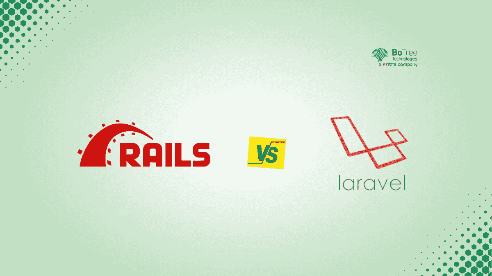
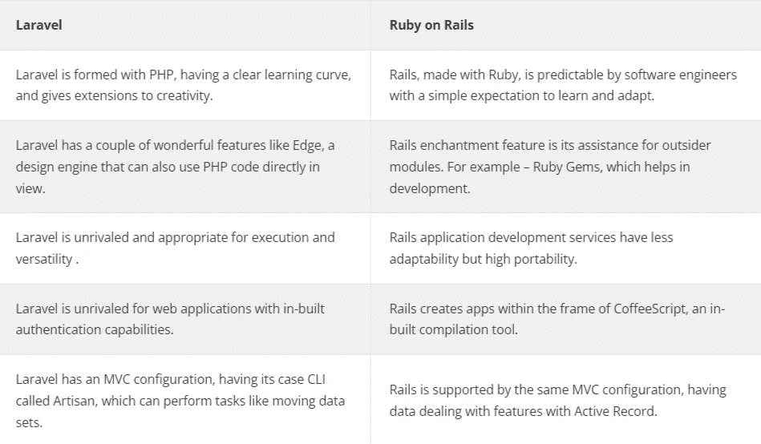

# 了解 Ruby on Rails 与 Laravel 在应用程序开发方面的差异

> 原文：<https://medium.com/geekculture/understanding-ruby-on-rails-vs-laravel-differences-for-app-development-7b231fd64e87?source=collection_archive---------15----------------------->

用正确的技术为应用程序的后端提供动力是最基本的，因为这是应用程序的组件，负责方便的内部操作、清晰的基本原理和安全性。后端框架的范围很大，比如 Ruby on Rails development services 或 Laravel development services，所以可以毫无问题地解决这个问题。

本文将关注这两个主要的应用程序开发后端框架:Laravel 和 Ruby on Rails。

# Ruby on Rails 和 Laravel

Laravel 和 Ruby on Rails 都是后端开发技术。同样，它们伴随着大量的覆盖特性，这使得最终的决定有点困难。这两个框架在技术社区中非常流行，被世界各地的企业所使用。根据栈溢出，Laravel 和 Ruby on Rails 在一家[软件开发公司](https://www.botreetechnologies.com/)中并不是最广泛使用的框架；尽管如此，当它们在需要其专业能力的公司中被恰当地使用时，这并不会降低它们的成功。

# 什么是 Laravel？

Laravel 是一个精炼的 web 应用程序框架，用于快速成功地创建 web 应用程序。毫无疑问，它可以在不增加开销的情况下调整 web 应用程序。这是一个基于 PHP 的开源框架，非常有名。

# 为什么要用 Laravel？

对于几乎每个 web 应用程序来说，重要的活动仍然非常正常，比如存储机制、会话管理、定向、验证等等。Laravel 提出了一种自然的尝试，通过简化大量的常见任务来消除开发周期中的困难。它的结构风格允许工程师们思考他们自己的框架，明确地为他们的应用而设计。

由于一家 [Laravel web 开发公司](https://www.botreetechnologies.com/laravel-development)同样有效地利用了 MVC 设计，应用程序的业务逻辑可以利用监管者或直接使用语句来执行。它为开发人员提供了某些荣誉的适应性，允许他们为较小的站点开发具有复杂业务逻辑的企业应用程序。

逻辑是通过使用 IoC 来保持的，例如，控制反转，一种监督类之间条件的思想。依赖性注入和 IoC 一起，在保持依赖性方面形成了一个宏伟的组合。这个 Laravel 突出显示可能是最著名和最常用的功能。

任何框架的组成部分都可以被隔离并再次整合，从而为 web 应用程序提供可度量的质量元素。业务逻辑可以分散在几个模块中，就像 Laravel 所实现的那样。这种隐蔽的帮助是 Laravel 隔离业务基本原理的关键部分。导演和存储是 Laravel 轻松坚持的不同亮点。

关于测试，Laravel 支持 PHPUnit，尽管它包含在容器之外。Blade 强大的布局马达给了 Laravel，它由模板继承和 sections 驱动，任何 Laravel 开发公司都可以用它来构建高质量的解决方案。

> **阅读更多:**[**Ruby on Rails 应用开发的 8 大好处**](https://www.botreetechnologies.com/blog/benefits-of-ruby-on-rails-application-development/)

# 什么是 Ruby on Rails？

Ruby on Rails 就是这样一个框架，它为开发人员提供了一系列预先开发的特性，允许工程师专注于业务逻辑，而不是系统的复杂性。它很可能是一个基于 Ruby 的服务器端开发框架。

# 为什么要使用 Ruby on Rails？

Ruby on Rails 应用程序开发由 web 原则支持，如 JSON 和 XML，它们被大量用于信息移动。一些基于 Rails 的 web 应用程序的理想模型是 web 开发过程中任何系统的标准，类似于展示设计，工程师不应该重复使用逻辑的枯燥规则。Rails 有效地推进和支持了这些标准。它依赖于 MVC，例如，模型-视图-调节器系统，它是站点页面和 web 管理开发的基准。

Ruby on Rails 软件开发带来的关键元素之一是元编程。Rails 的一些元素，包括元编程，减少了开发人员的时间，允许他们专注于业务逻辑。一点也不像一些不同的框架，企业可以[雇佣 Ruby on Rails 开发人员](https://www.botreetechnologies.com/hire-ruby-on-rails-developers)无需任何准备就能进行编码，元编程给了工程师完成重要任务的优势。传统的方法比设置更受欢迎，这可以方便开发人员的生活。

# Ruby on Rails vs. Laravel:何时选择哪个？

下面是一些企业应该决定何时选择开发框架的例子:

1.  **当你想要一个定制的网络应用**:

*   Ruby on Rails 框架开发对于定制 web 应用来说是一个不错的答案。如果您不希望有大量的客户端和巨大的流量，那么 Ruby on Rails 可能是您的理想选择！
*   无论有什么缺点，都有良好的应用技能。

**2。当您需要电子商务解决方案时**:

*   巨大的在线业务 goliath Shopify 是由 Ruby on Rails 推动的，所以这就明白了。我们不应该忽视 Spree Commerce，它是最著名的具有 Ruby on Rails 开发能力的电子商务平台之一。
*   在[的 Ruby on Rails 电子商务平台](https://www.botreetechnologies.com/blog/why-you-should-build-your-e-commerce-website-with-ruby-on-rails-in-2019/)中可以获得的 Gems 将帮助你实现你可能随时需要的每个基于网络的商业亮点。因为有了 RoR，你同样可以让你的商店运转异常迅速。Gems 将使您能够设置您的分期付款通道，展示消息传递工作、协助工作区等等。

**3。当您需要一个有大量请求的应用程序时**:

*   Laravel 每秒可以处理比 Rails 多得多的请求。此外，在很大程度上，它同时也更有效率。
*   问题是，你的任务会不会在某个时候变得过于繁重，以至于选择正确的系统会产生巨大的影响，你需要[聘请 Laravel 开发人员](https://www.botreetechnologies.com/hire-laravel-developers)来完成这个任务？

# Laravel 和 Ruby on Rails 的区别

> **阅读更多:**[2022 年寻找最佳 Ruby on Rails 开发者指南](https://www.newsplana.com/a-guide-to-finding-the-best-ruby-on-rails-developers-in-2022/)

## 结论

不管怎样，你可以从多方面考虑，在你的项目完成后，有人会过来说他们可能已经改进了，建造得更快了，或者降低了成本。如果企业正在寻找一个快速、灵活、动态的解决方案，最好的决定是从一家 [Ruby on Rails 开发公司](https://www.botreetechnologies.com/ruby-on-rails-development)雇佣 Ruby on Rails 开发人员。

话说回来，要尝试一种新的、特别令人鼓舞的技术，或者只是需要一个 API，你应该考虑 Laravel。

无论您做出何种选择，BoTree Technologies 都可以帮助您。作为一家领先的[企业软件开发公司](https://www.botreetechnologies.com/software-development-company)，我们在 Laravel 和 Ruby on Rails 方面都有专长。

[**联系我们**](https://www.botreetechnologies.com/contact) **今天免费咨询。**

*原载于 2022 年 6 月 8 日 https://www.botreetechnologies.com**的* [*。*](https://www.botreetechnologies.com/blog/difference-between-ruby-on-rails-vs-laravel/)