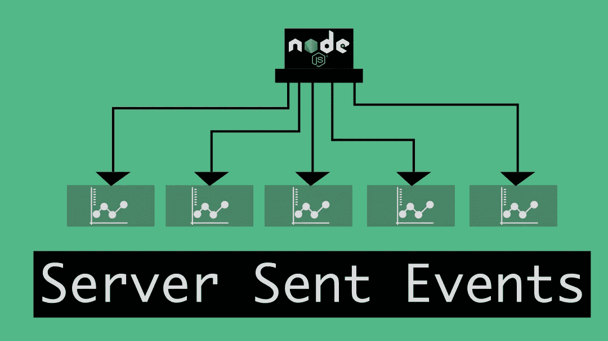

# 使用 Node.js 了解服务器发送的事件

> 原文：<https://medium.com/geekculture/understanding-server-sent-events-with-node-js-37cfc7aaa7b?source=collection_archive---------0----------------------->

Server sent events with node.js

在本文中，让我们用一种称为服务器发送事件(SSE)的技术构建一个简单的 node.js 数据流端点。我们将看到如何在没有任何外部库(甚至没有 Express.js)的情况下，只使用 Node.js 的核心模块来编写一个简单的 SSE 端点。

我们还将了解 SSE 实际上是什么，我们可以在什么场景中使用它，以及它与 WebSockets 有何不同…