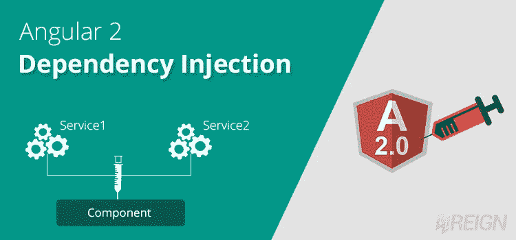
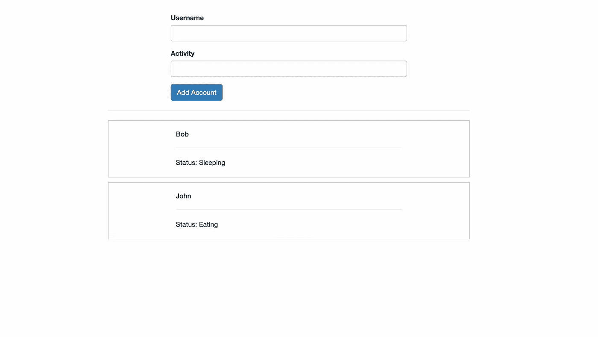
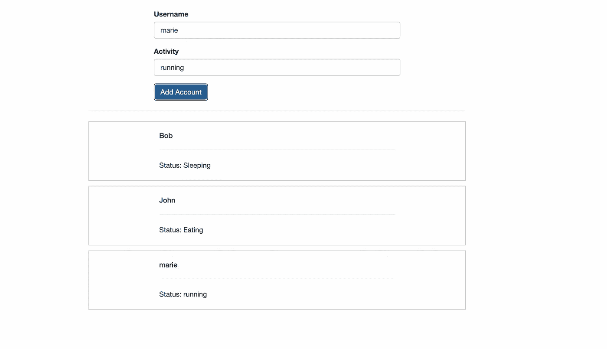
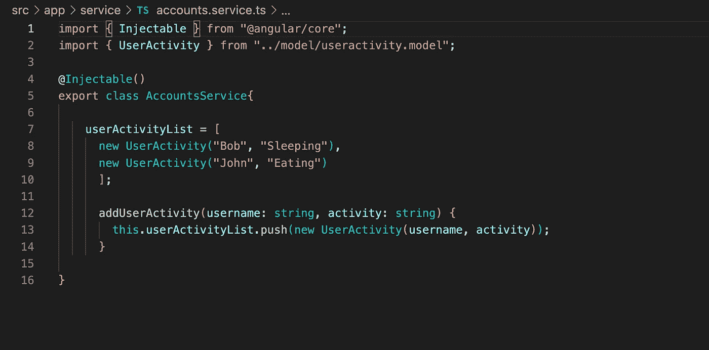
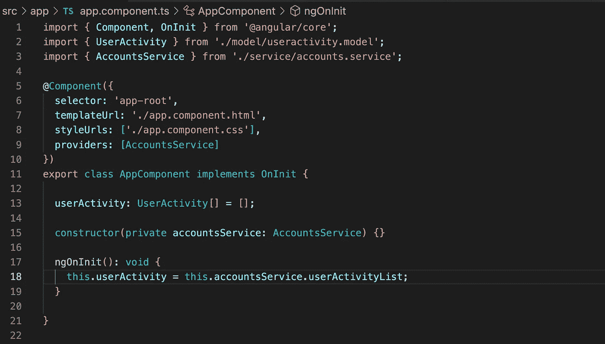
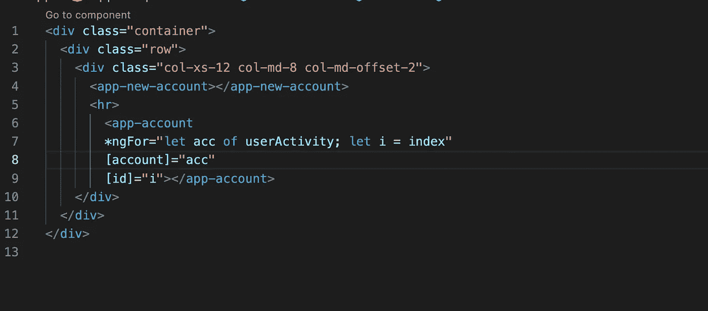

# 了解 Angular 中的服务和依赖注入

> 原文：<https://medium.com/geekculture/understanding-services-and-dependency-injection-in-angular-175a5c893dcc?source=collection_archive---------6----------------------->

## 服务和依赖注入是如何工作的？



**Services and Dependency Injection** in Angular (image taken from w3reign.com)

ngular 将组件与服务区分开来，以增加模块化和可重用性。通过将组件的视图相关功能与其他类型的处理分离开来，可以使组件类精简高效。

当组件之间的距离很大时，有时在组件之间共享数据变得非常复杂，因为有了*输入、输出和事件发射器*。因此，我们使用**服务以优雅的方式管理这种跨组件通信**。

Angular 基于`@Injectable`装饰器将类解释为服务。我们还必须在 Angular 的提供者中定义我们的服务，以便开始使用依赖注入或 DI 的概念。

我们可以在组件本身上提供服务，然后该组件将为该特定组件及其子组件提供该服务的*相同实例，直到在子组件中被再次定义和覆盖。*

```
@Component({
 selector: 'app-root',
 templateUrl: './app.component.html',
 styleUrls: ['./app.component.css'],
 **providers: [AccountsService]**
})
```

另一种方法是在 **app.module.ts** 中的提供者数组中定义它，以便该服务的**全局实例在整个应用程序**中可用，直到在组件中被再次定义和覆盖。

```
@NgModule({
...
imports: [...],
**providers: [AccountsService],**
...
})
```

在我们深入研究服务之前，让我们**理解依赖注入**(简称 DI)。

根据角度文件:

> 依赖项是类执行其功能所需的服务或对象。依赖注入，或称 DI，是一种设计模式，在这种模式中，类从外部源请求依赖，而不是创建它们。

Angular 的 DI 框架在实例化时提供了对类的依赖。使用 Angular DI 增加应用程序的灵活性和模块化。

服务可以向组件树中的任何注入器注册。您将服务作为提供者插入到`@Component`元数据字段:`providers: []`。该服务可用于组件及其子组件。

另一种方式是，`providers: []`元数据作为它自己的字段存在于`@NgModule`装饰器中。从模块到底层组件树，服务都是可实例化的。

让我们试着用一个例子来理解服务和 DI 的使用。

下面是我们的应用程序的屏幕截图，显示了一个添加用户活动帐户的表单，该帐户由用户名和活动组成。

UserActivity 类如下所示:

```
export class UserActivity{username: string;
activity: string;constructor(name, status) {
 this.username = name;
 this.activity = status;
}}
```

输入信息并触发“添加帐户”按钮的(单击)事件后，用户活动将被添加到下面的列表中(默认情况下，列表中保留 2 个用户活动)。



Screenshot of the Running application

应用程序的细分:1 个根应用程序组件，1 个用于插入新表单信息和按钮的新帐户组件，以及 1 个用于显示用户活动列表的帐户组件。

如果我们观察，在新帐户组件中输入信息时，我们需要将其传递给它的兄弟帐户组件。这一切都可以在不使用服务的情况下实现，但这将需要大量的处理和数据传输，就像我们需要存储新的用户信息，然后在单击按钮时通过事件发射器发出相同的信息。该事件将到达父应用程序组件，该组件被进一步订阅、存储并作为属性传递给它的另一个子 ie。帐户组件。account 组件将在其中存储并显示这些新数据。



Running the application with a new user activity added via service

如果我们创建一个服务(比如 AccountsService)并让它作为管理用户活动列表和将新用户活动推送到现有列表的逻辑的中心位置，那么所有这些数据传输、本地对象的创建、事件发射器和方法都可以减少。

在下面的代码中，我们所要做的就是创建一个类 AccountsService。可注射装饰师，定义与否由你自己决定。通常，当您将一个服务注入到另一个服务中时，会使用它，但是 Angular 按照惯例建议在所有服务上使用它。



Service logic with the userActivityList and pushing new user activity method

我已经在 app.module.ts 提供程序中声明了我的服务。现在，在任何组件的构造函数中，我可以按照 DI 的概念直接注入我的服务的实例，如上所述。

现在，我们可以通过调用服务 addUserActivity()来推送新的用户帐户，并通过单击按钮来传递数据，该按钮的(click)事件绑定到 onCreateAccount()。


Dependency Injection (DI) of service in a component to call its method

现在，在根 AppComponent 中，我们再次注入我们的服务，并将 userActivity 列表存储在一个本地属性中，该属性被传递给 account 组件，该组件进一步显示用户活动列表。



我们使用 ngFor 指令遍历本地 userActivity 列表，并将每个项目的信息进一步传递给 account 组件，如下所示:



此外，在 account 组件中，我们可以绑定 account 和 id，我们可以使用字符串插值将它们进一步绑定到 HTML。

```
import { Component, Input } from '@angular/core';
import { UserActivity } from '../model/useractivity.model';@Component({
 selector: 'app-account',
 templateUrl: './account.component.html',
 styleUrls: ['./account.component.css']
})
export class AccountComponent {@Input() account: UserActivity;
@Input() id: number;constructor() {}}
```