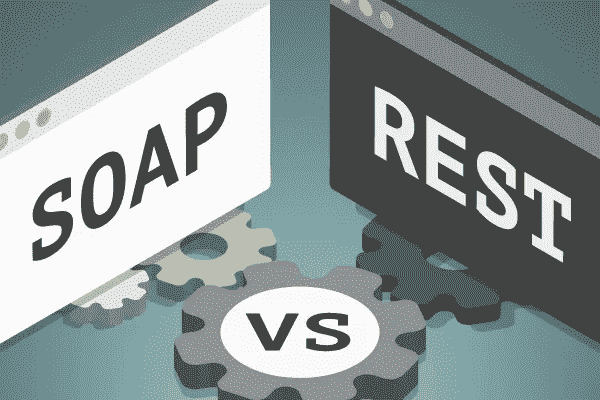
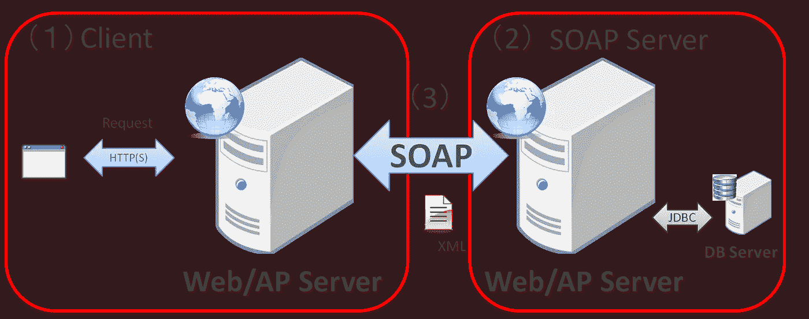

# 理解 SOAP 和 RESTful Web 服务

> 原文：<https://medium.com/geekculture/understanding-soap-and-restful-web-services-a27ddcd4c3df?source=collection_archive---------11----------------------->

Image: REST vs SOAP by: [https://www.akana.com/](https://www.akana.com/)

如果你是一名软件工程师，你可能已经使用过这些技术中的至少一种，除非你是 IT 行业的新手，只知道这些是流行的 web 服务。所以不管你是谁，这篇文章将帮助你理解这两种技术之间的基本概念。然而，在进入 SOAP 和 REST 之前，我们应该有关于 web 服务的基础知识。

# 网络服务

Web 服务是允许设备之间通过互联网进行通信的应用程序。这些完全独立于设备所基于的技术或语言，因为它们使用标准化的 XML 进行信息交换。客户端或用户可以通过发送 XML 消息来调用 web 服务，然后依次获得 XML 响应消息。

基本上，web 服务包括任何提供标准化 web 协议(HTTP 或 HTTPS)来进行互操作、通信和交换数据消息的软件、应用程序或云技术。

> 因此，web 服务的主要特点是应用程序可以用各种语言编写，并且它们仍然能够通过客户机和服务器之间的 web 服务相互交换数据来进行通信。

web 服务支持使用 SOAP、XML、WSDL 和 HTML 的各种应用程序之间的通信。例如，XML 应该标记数据，SOAP 传输消息，WSDL 描述服务的可访问性。

然而，有不同类型的 web 服务被称为 **XML-RPC、UDDI、SOAP 和 REST** 。最重要的是，SOAP 和 REST 是目前最流行的两种 web 服务。

# 肥皂和休息

如果您是一名多年经验丰富的软件工程师，您可能知道 IT 专业人员和 web 开发人员一直在争论哪种 web 服务更好。但是，在这种情况下，没有一个明显的赢家。因为它总是取决于情况和用例。

RESTful web 服务和 SOAP 提供了不同的变体。例如，当时间是一个因素时，REST web 服务通常是更好的选择，但是当使用多个非 CRUD 方法构建服务时，SOAP 会胜出。但是有些情况下，两种选择都被认为是正确的选择。在许多情况下，公司的特定需求决定了合作伙伴将实现哪种类型的 web 服务。

然而，SOAP 和 REST web 服务都依赖于公认的规则，为了交换信息，每个人都同意遵守这些规则。现在，是时候分解每个选项，同时探索它们相对于其他选项的优势了。

## SOAP Web 服务

SOAP 被定义为**简单对象访问协议**。微软最初开发 SOAP 是为了取代在互联网上不太好用的老技术，如分布式组件对象模型。

这个 web 服务协议使用 XML 交换结构化数据，通常使用 HTTP 和 SMTP 进行传输。SOAP 还使用 WSDL (Web 服务描述语言)文档来分发 Web 服务描述模型。这描述了 SOAP 请求(客户端)和响应(服务器端)必须如何出现。此外，SOAP web 服务有安全和寻址标准。

Image: SOAP Web Service ([https://terasolunaorg.github.io/](https://terasolunaorg.github.io/))

**为什么 SOAP 的难度取决于编程语言？**

如果您已经使用过 SOAP，您可能知道使用 XML 在 SOAP 中发出请求和接收响应会变得非常复杂。在一些编程语言中，您需要手动构建这些请求，这可能会有问题，因为 SOAP 不能容忍错误。然而，一些语言可以使用 SOAP 提供的快捷方式。它们可以帮助您减少创建请求和解析响应所需的工作量，比如。网络语言。因此，这意味着使用 SOAP 的难度主要取决于您使用的语言。

**SOAP 的内置错误处理**

这是 SOAP 最重要的特性之一。因此，如果您的请求有问题，响应会包含错误信息，您可以使用这些信息来解决问题。但是如果没有那样的特性，你可能不得不继续猜测为什么事情没有成功。错误报告甚至提供了标准化的代码，因此可以在代码中自动执行一些错误处理任务。

## RESTful Web 服务

缩写 REST，代表**的具象状态转移。REST 是一种架构风格，意味着每个唯一的 URL 都代表某种类型的独立对象。REST web 服务使用 HTTP 并支持几种 HTTP 方法: **GET、POST、PUT 或 DELETE** 。它还提供简单的面向 CRUD 的服务。**

因此，正如您所见，REST 依赖一个简单的 URL 来发出请求，而不是使用 XML。但是在某些情况下，您必须提供额外的信息，但是大多数使用 REST 的 web 服务完全依赖于使用 URL 方法。

Image: RESTful API ([https://dev.to/](https://dev.to/))

让我们看一个使用基本 HTTP 请求的例子。在这种情况下，我们将使用来自**Swagger . io**(*https://swagger.io/*)的 **Swagger 宠物店 API** 。

*   向/pet/{petId}发送一个 **GET 请求**将从数据库中检索具有指定 Id 的宠物。
*   向/pet/{petId}/uploadImage 发送一个 **POST** **请求**会添加宠物的新图像。
*   向/pet/{petId}发送一个 **PUT** **请求**将会更新一个现有宠物的属性，由一个指定的 Id 标识。
*   向/pet/{petId}发送一个**删除** **请求**会删除一个指定的宠物。

> 注:招摇宠物店 API 的网址-->[https://petstore.swagger.io/](https://petstore.swagger.io/)

# 那么，哪个更好呢？

在决定哪一个更好之前，让我们看看这两个 web 服务之间的一些差异。

## Soap 的优势

*   独立于语言、平台和传输(REST 需要使用 HTTP)
*   在分布式企业环境中工作良好
*   使标准化
*   以 WS 标准的形式提供了强大的预构建可扩展性
*   内置错误处理
*   与某些语言产品一起使用时的自动化

## 休息优势

*   REST 在很大程度上更容易使用，也更灵活
*   与 web 服务交互不需要昂贵的工具
*   较小的学习曲线
*   比 SOAP 更有效(SOAP 对所有消息使用 XML，REST 可以使用更小的消息格式)
*   快速(不需要大量处理)

正如我之前提到的，这要视情况而定。多年来，SOAP 一直是许多公司的首选。然而，显然是 REST 在未来会得到更广泛的接受。所以，这两个人都没有赢。

所以，这是文章的结尾，我希望你喜欢它。快乐编码👨‍💻。

## 参考

 [## 肥皂 vs 休息。什么

### 休息对肥皂。这已经成为一个问题有一段时间了。实际上，它们只是同一个问题的两个答案:如何…

smartbear.com](https://smartbear.com/blog/soap-vs-rest-whats-the-difference/#:~:text=SOAP%20%28Simple%20Object%20Access%20Protocol,around%20for%20a%20long%20time.&text=REST%20%28Representational%20State%20Transfer%29%20is,method%20of%20accessing%20web%20services)  [## SOAP 与 REST APIs:哪个更适合你？索普伊

### 古老的问题:SOAP 和 REST APIs 之间的区别是什么，哪一个适合我的项目？只是…

www.soapui.org](https://www.soapui.org/learn/api/soap-vs-rest-api/)